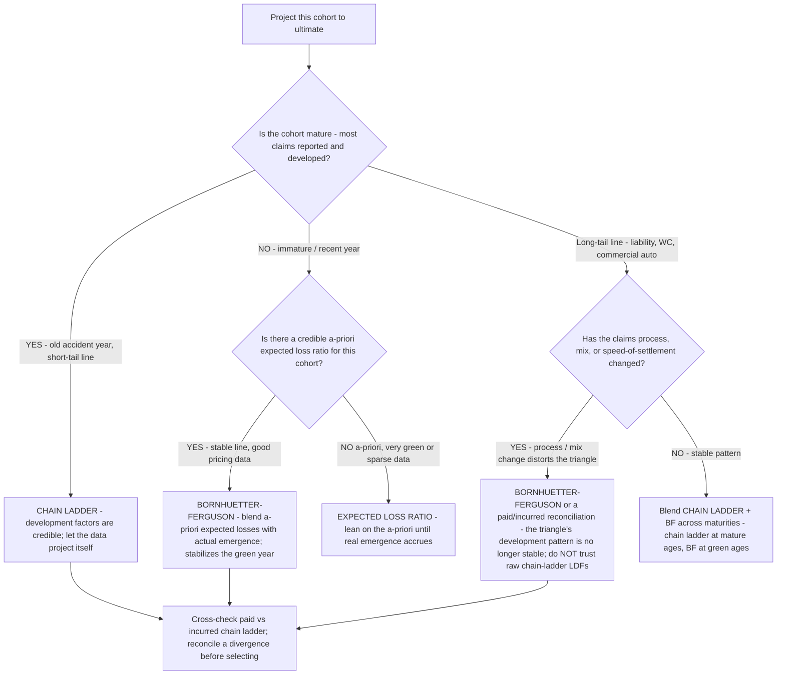

# P&C reserving decision tree — which loss-reserving method for which cohort

**Last reviewed:** 2026-06-05 · **Confidence:** medium (standard actuarial reserving practice + CAS reserving literature, web-verified this date). Method selection is judgment under uncertainty — the leaves are defaults, not rules. Every reserve estimate is decision-support for a credentialed actuary, never an opinion on reserve sufficiency (CLAUDE.md §2). Date and `[verify-at-use]`-mark any benchmark before it enters a deliverable (§3 #8).

> Canonical decision tree for the `actuarial-pricing-analyst` (the numbers) with a claims assist from `claims-specialist` (case-reserve facts). Traverse top-to-bottom before picking a reserving method. **This COMPLEMENTS [`pc-decision-trees.md`](pc-decision-trees.md)** — that file's "Which loss ratio is most relevant" tree picks the *metric* (ultimate vs accident-year vs calendar-year); this tree picks the *method* you use to project to ultimate. Reserve adequacy is the truth-teller (§3 #5): today's combined ratio is only as honest as the reserves behind it.

---

## When this applies

A reserve review needs an ultimate-loss estimate for an accident-year (or report-year) cohort and you must choose a projection method. Common triggers: a quarterly reserve review, a year-end opining exercise, a reserve study after a mix or claims-process change, or investigating prior-year development.

## The tree



## Rationale per leaf

- **Chain ladder (mature / short-tail)** — when most claims are reported and the development pattern is stable, the loss-development factors are credible and the method lets the data project itself. It is the workhorse, but it is **leverage-sensitive at green ages**: an immature year multiplied by a large LDF swings wildly on thin data.
- **Bornhuetter-Ferguson (immature, credible a-priori)** — BF blends an *a-priori* expected-loss estimate with actual emergence, so a green accident year isn't whipsawed by a single large (or absent) early claim. It is the standard antidote to chain-ladder's green-year instability. The a-priori is usually the pricing/plan loss ratio — only as good as that estimate.
- **Expected loss ratio (very green / sparse)** — for the freshest or sparsest cohorts, lean almost entirely on the a-priori until enough real emergence accrues to trust the triangle. Essentially BF with near-zero weight on actuals.
- **Long-tail with a process/mix change** — a changed claims process, case-reserving philosophy, mix, or speed-of-settlement **distorts the development triangle**, so raw chain-ladder LDFs (which assume a stable pattern) lie. Switch to BF (which leans on the a-priori, not the broken pattern) or reconcile paid vs incurred to find the distortion before selecting.
- **Cross-check paid vs incurred** — a divergence between the paid chain ladder and the incurred chain ladder is a signal (changed case-reserve adequacy, or a payment-speed change). Reconcile it before you commit to an ultimate — never report a single method's number without the cross-check.

## The components (what "reserves" are made of)

```
ultimate loss = paid to date + case reserves (set on claim facts) + IBNR (incurred but not reported)
net reserves  = case + IBNR − expected reinsurance recoverable
```

Case reserves are set on **claim facts**, not payment history (§3 #5); IBNR is the actuarial projection of what's coming. The reserving method above estimates the *ultimate*, from which IBNR backs out. The [`../scripts/pc_calc.py`](../scripts/pc_calc.py) `reserve-runoff` mode reads the one-year development (prior ultimate vs re-estimated ultimate) and flags adverse vs favorable.

## Gotchas

- **Chain ladder at green ages over-reacts.** A large early claim times a large LDF is a runaway estimate — that's exactly the year to use BF.
- **A changed claims process breaks the triangle.** If speed-of-settlement or case-reserve adequacy changed, the historical development pattern no longer applies; chain-ladder LDFs computed on it are wrong. (Cross-check the [`pc-decision-trees.md`](pc-decision-trees.md) large-loss tree if a process change is claims-driven.)
- **The a-priori is load-bearing in BF.** BF is only as good as the expected loss ratio you feed it — a stale or optimistic a-priori produces a confident-looking but wrong ultimate.
- **Don't read the calendar-year combined ratio as underwriting quality** when prior-year development is moving — show prior-year development separately (see [`pc-decision-trees.md`](pc-decision-trees.md) "Which loss ratio is most relevant").

## Escalation & guardrails

- A reserve opinion / certification → a credentialed actuary; this tree is decision-support for method selection, not a sign-off (CLAUDE.md §2).
- Adverse development surfaced here → flag reserve risk explicitly and feed it back to pricing (the prior-year result was flattered) (§3 #5).
- Every figure entering a deliverable carries a source URL + retrieval date or an `[unverified — training knowledge]` / `[ESTIMATE]` mark (§3 #8).

## Sources (retrieved 2026-06-05)

- CAS — *Statement of Principles Regarding Loss & LAE Reserves* (case / IBNR / method context): https://www.casact.org/sites/default/files/2021-04/statement_of_principles_Loss_Loss_Adjustment%20_Expense%20_Reserves_2021.pdf
- CAS — *Basic Ratemaking* (Werner & Modlin; development, trend, the loss-ratio method): https://www.casact.org/sites/default/files/2021-07/Werner_Modlin_Basic_Ratemaking.pdf
- Huggins Actuarial — reserving considerations for AO expenses (LAE reserve context): https://hugginsactuarial.com/reserving-considerations-for-adjusting-and-other-expenses/
