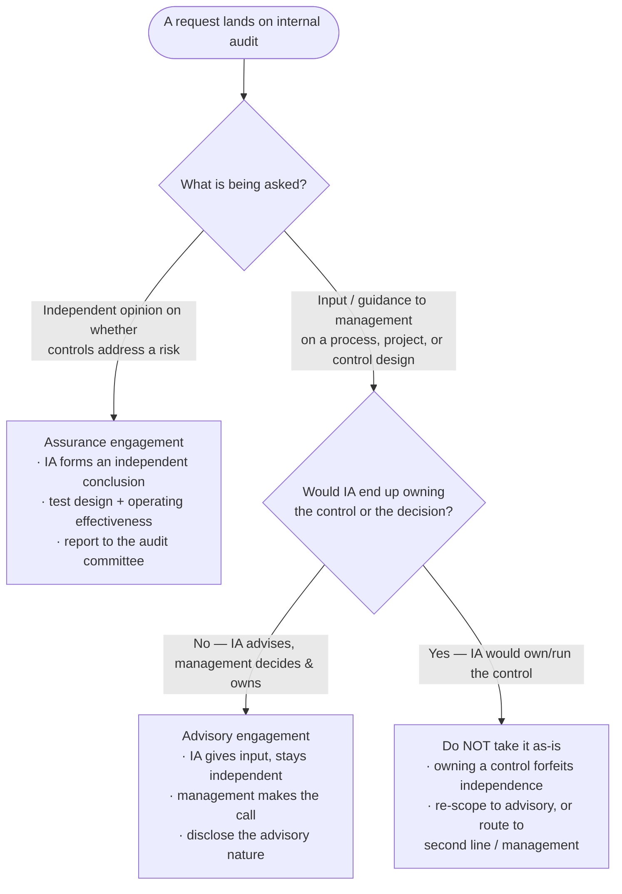
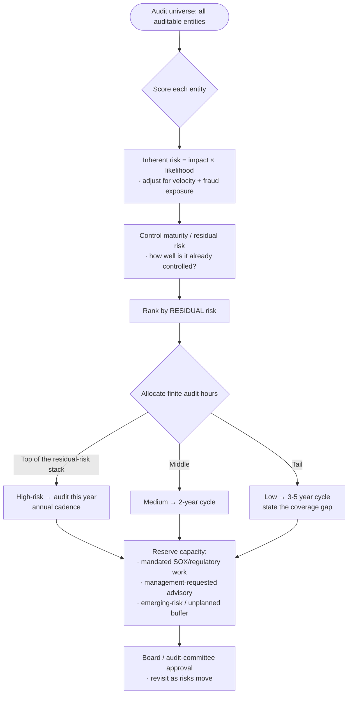
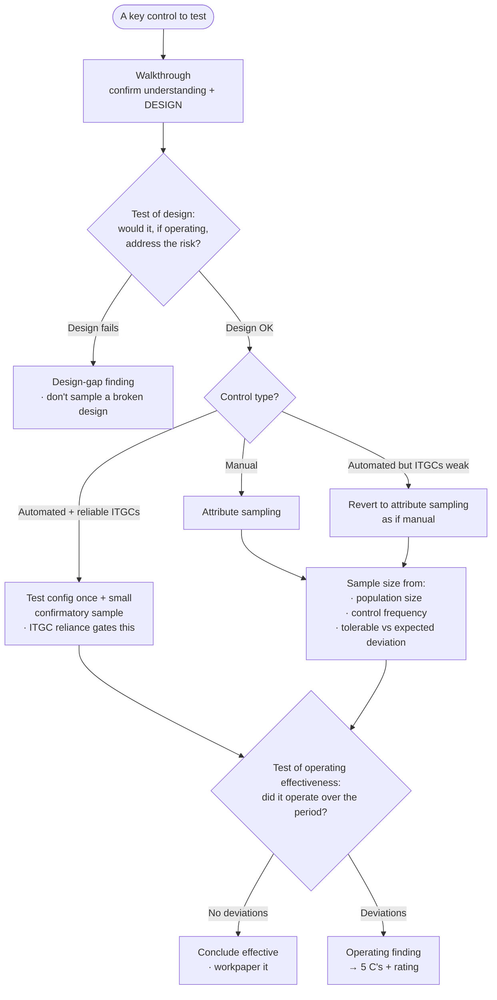
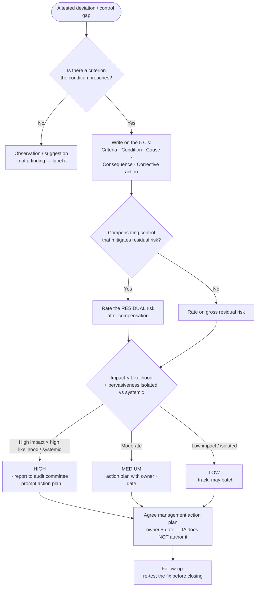

# Knowledge — Internal-audit decision tree

> **Last reviewed:** 2026-07-14 · **Confidence:** Medium-High (consensus on the risk-based-planning, assurance-vs-advisory, test-of-design-vs-operating-effectiveness, attribute-sampling, 5-C-finding, and impact×likelihood-rating framings, and on where the IIA Standards / COSO / Three Lines Model each anchor; **specific standard versions, effective dates, EQA cadence, and any prescriptive sample-size numbers are volatile — re-verify before a board/client commitment**).
> The most-asked internal-audit questions are "what do we audit and how much can we cover?", "is this assurance or advisory?", "how do we test this control and how big is the sample?", and "how bad is this issue?". This is the decision tree the agents traverse **before** committing a plan, a test approach, or a rating, plus the trade-off tables and the seams to adjacent plugins.

The function's discipline: **name the risk and the criterion first, name the audit activity second — and never let internal audit own the control it assures.** Security-control depth, AML/financial-regulatory obligations, and ESG assurance are **not** the general internal-audit function; they leave this layer for the specialist plugins.

---

## Decision Tree 1: assurance vs advisory (what kind of engagement is this?)

**The independence rule this tree enforces:** internal audit **assures and advises; it never owns a control, runs a process, or makes a management decision.** An advisory engagement that would end with IA owning the remediation is re-scoped or declined — because IA cannot later independently assure a control it built.

---

## Decision Tree 2: risk-ranking the audit universe → the annual plan

**Gate on residual risk, not on the org chart or last year's plan.** The plan is a **risk hypothesis** — board-approved, then revisited as risks move (a new regulation, a major system change, a fraud event, an M&A).

---

## Decision Tree 3: how do we test this control, and what's the sample?

**Sample size is a calculation, not a habit.** Population × control frequency × tolerable/expected deviation drives it — for a **key** control the tolerable deviation is often near zero. A reliable **automated** control with sound ITGCs lets one well-tested instance stand in for a large attribute sample; **weak ITGCs** force you back to sampling.

---

## Decision Tree 4: how bad is this issue? (the impact × likelihood rating)

**No criterion → not a finding.** Rate the **residual** risk (after compensating controls) consistently across the engagement so issues roll up to a meaningful audit-committee picture. Management owns the action plan; **IA facilitates and challenges it, never authors it** — and "closed" means **re-tested**, not "management said done."

---

## Trade-off table — assurance vs advisory

| Type | Sweet spot | Watch out for |
|---|---|---|
| **Assurance** | Independent opinion on whether controls address a material risk; the core IA product | Needs sufficient, tested evidence; can't opine on a control IA helped build |
| **Advisory / consulting** | Controls-by-design input on a new project, process, or system; adds value early | Must stay non-owning — the moment IA owns the control/decision, independence is lost |

## Trade-off table — sampling approach

| Approach | Sweet spot | Watch out for |
|---|---|---|
| **Attribute sampling** | Testing control operating effectiveness (pass/fail per item) | Size from population × frequency × tolerable deviation, not a reflex "25"; define a deviation precisely |
| **Monetary-unit / dollar-unit sampling** | A quantitative/monetary conclusion (over/understatement exposure) | Biases toward larger items; needs a monetary population |
| **Full-population (data analytics / CAATs)** | When the whole population is queryable — 100% testing beats any sample | Data reliability + ITGC reliance must be established first |
| **Automated-control single-instance** | A configured automated control with reliable ITGCs | Only as strong as the ITGCs — weak ITGCs void the reliance and force sampling |

## Trade-off table — control types (to classify in the RCM)

| Dimension | Options | Why it matters for testing |
|---|---|---|
| **Timing** | Preventive vs Detective | Preventive stops the error; detective catches it after — both may be needed |
| **Execution** | Manual vs Automated | Automated + reliable ITGCs → far smaller test; manual → attribute sample |
| **Significance** | Key vs Non-key | Key controls get the tightest tolerable-deviation posture |
| **Level** | Entity-level vs Process-level | Entity-level (tone, governance) frames the whole; process-level does the work |

---

## The frameworks these trees rest on (anchors — see the patterns doc for detail)

- **IIA Global Internal Audit Standards (2024, effective Jan 2025)** — 5 domains / 15 principles; the conformance frame and the source of the independence, objectivity, and QAIP requirements. _(Version/effective-date volatile — verify at use.)_
- **COSO Internal Control – Integrated Framework** — 5 components (control environment, risk assessment, control activities, information & communication, monitoring) — the "what is a control / is it effective" reference the RCM leans on.
- **COSO ERM** — enterprise-risk framing for the audit-universe risk assessment.
- **Three Lines Model (2020)** — management (first line) owns risk; risk/compliance (second line) oversees; **internal audit (third line) gives independent assurance** to the governing body. The independence guardrail throughout.

---

## Seams (internal audit is the independent-assurance layer, not every control discipline)

- **Security-control assurance** (ISO 27001, NIST 800-53/CSF, SOC 2, technical control testing) → `cybersecurity-grc`. IA may *rely on* or *audit* the security program, but the deep security-control work lives there.
- **AML / sanctions / financial-regulatory obligations** → `regulatory-compliance`. SOX ICFR overlaps external audit and finance — coordinate, don't duplicate.
- **ESG / sustainability assurance** → `esg-sustainability-reporting`.
- **Redesigning the audited process** (not just assuring it) → `process-improvement`.
- **RAID / status for a multi-week audit program or QAIP remediation** → `ravenclaude-core/project-manager`.
- **Verifying a volatile claim** (standard version, effective date, EQA cadence, sample-size table) → `ravenclaude-core/deep-researcher`.

---

## Provenance

- Durable framings (risk-based planning by residual risk, assurance vs advisory, walkthrough → test of design → test of operating effectiveness, attribute sampling driven by population/frequency/tolerable-deviation, the 5 C's, impact×likelihood issue rating, follow-up re-testing) are consensus internal-audit practice, reviewed 2026-07-14 — **High confidence**.
- Framework positioning (IIA Global Internal Audit Standards 2024 / 5 domains / 15 principles / Jan-2025 effective date, COSO Internal Control 5 components, COSO ERM, Three Lines Model 2020, the every-5-years external quality assessment) as of 2026-07; **standard versions, effective dates, EQA cadence, and any prescriptive sample-size numbers are volatile — re-verify before quoting in a board/client deliverable.** _(Retrieved 2026-07-14.)_
