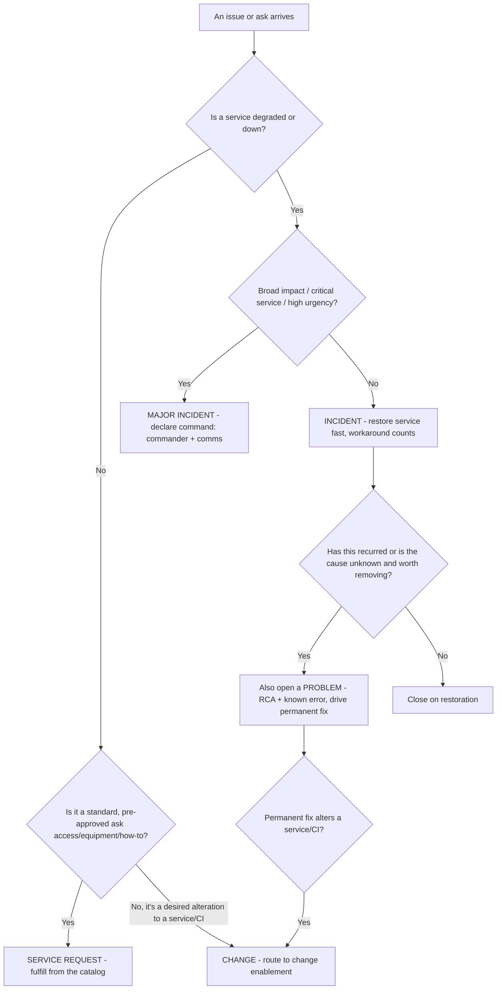
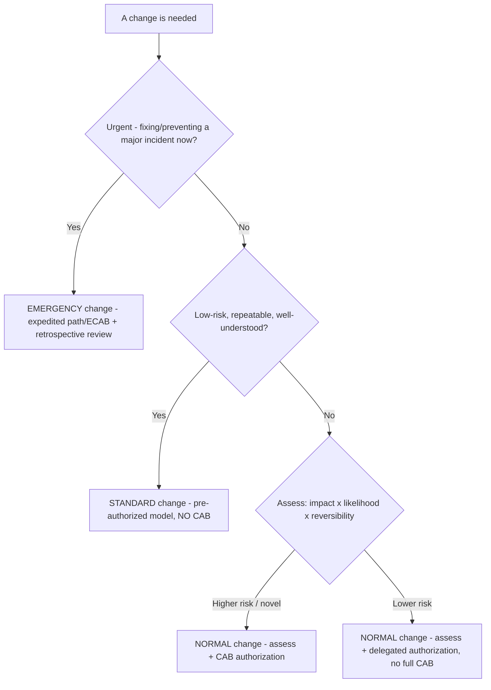
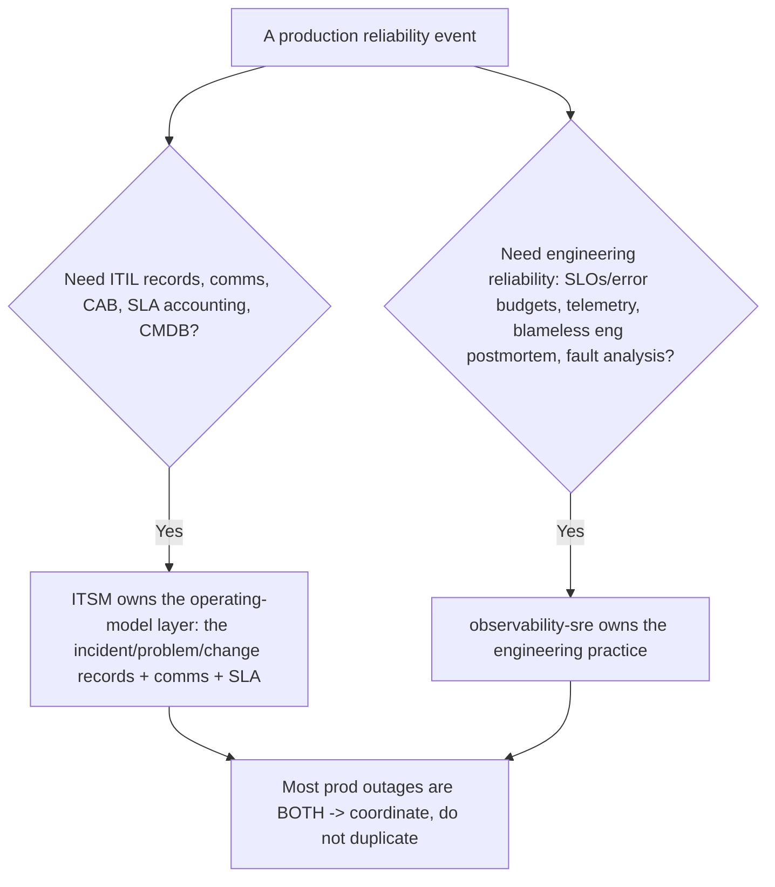

# ITSM — Decision Trees

_Decision trees for routing an issue and classifying a change. Traverse the relevant tree top-to-bottom before acting. Principle-stable (ITIL 4 structure); last reviewed: 2026-06-19._

## Decision Tree: Incident, problem, request, or change?

_The key split (§2 #1): restoring service now = incident; removing the cause = problem. They run in parallel for a recurring issue._

## Decision Tree: Which change type?

_The lever for de-bottlenecking (§2 #2, #3): move repeatable changes into standard models so the CAB only sees genuine, novel risk._

## Decision Tree: Is this ITSM's or observability-sre's?

_This team owns the ITIL/ITSM operating model; `observability-sre` owns the engineering reliability practice. A real outage is usually both at once._
