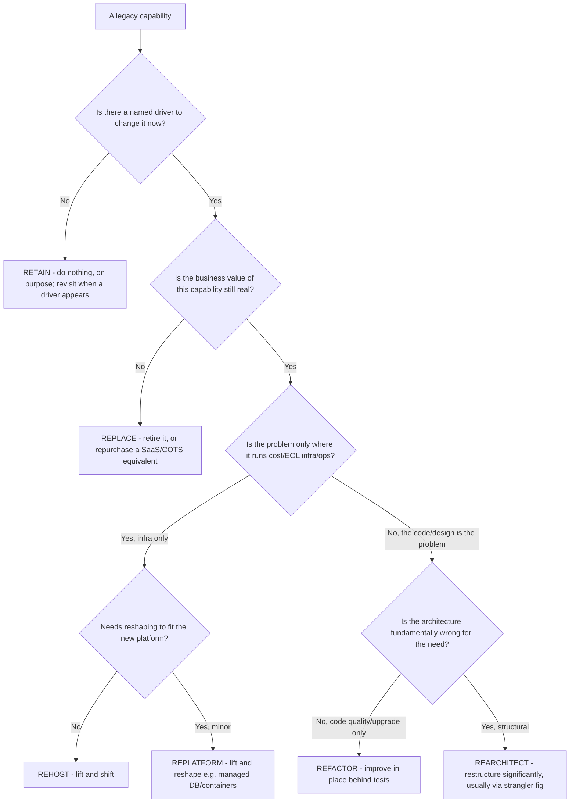
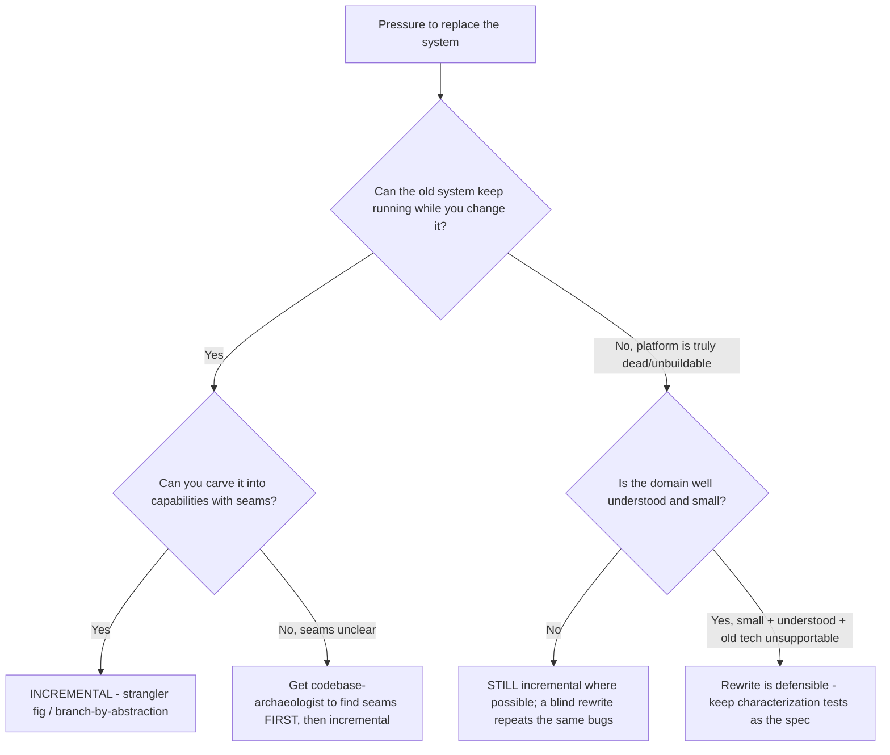
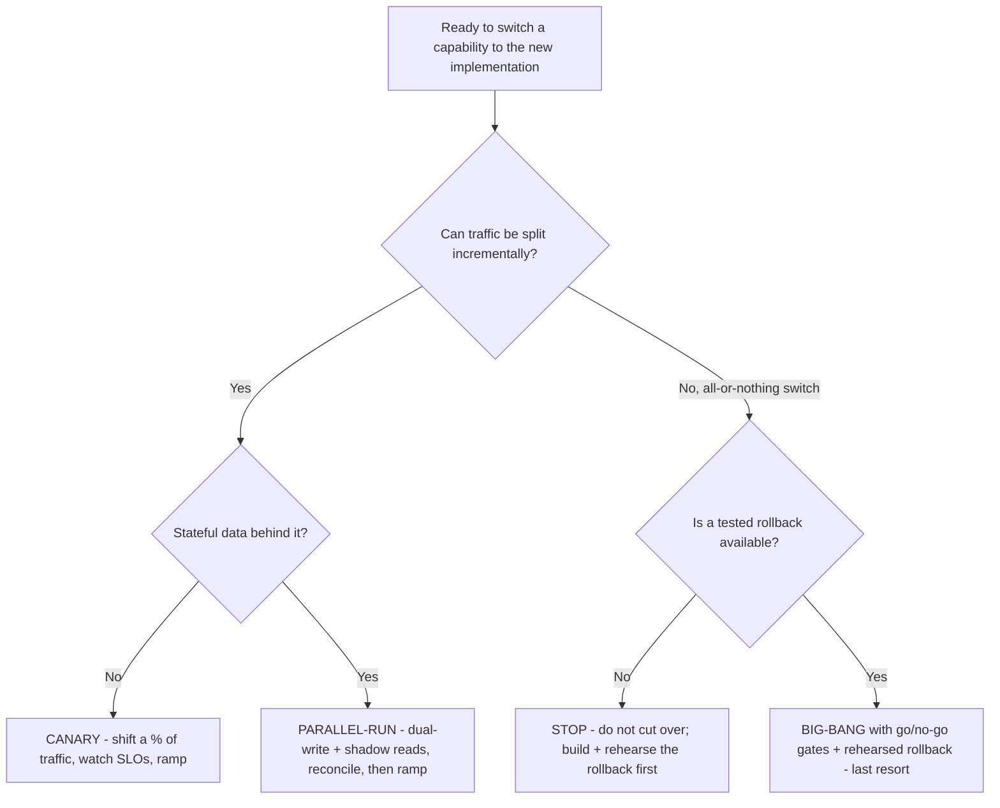

# Legacy Modernization — Decision Trees

_Decision trees for choosing a modernization strategy and a cutover approach. Traverse the relevant tree top-to-bottom before recommending — the proactive complement to the Capability Grounding Protocol. Last reviewed: 2026-06-19._

## Decision Tree: Which of the 6 R's?

Most estates are a *portfolio* of R's, decided capability by capability. No driver → retain.

_Name the trade: each R up the chain (rehost -> replatform -> refactor -> rearchitect -> replace) buys more improvement and pays more risk + cost. Pick the lowest R that clears the driver._

## Decision Tree: Rewrite from scratch, or modernize incrementally?

Rewrite-from-scratch is the default *wrong* answer — it must earn its risk (§2 #2).

_The embedded edge-case knowledge in a working legacy system is its most valuable and least documented asset; a from-scratch rewrite discards it and ships nothing until the end._

## Decision Tree: Which cutover strategy?

_Prefer parallel-run/canary; big-bang is the fallback only when traffic genuinely can't be split, and never without a rehearsed rollback (§2 #6)._
