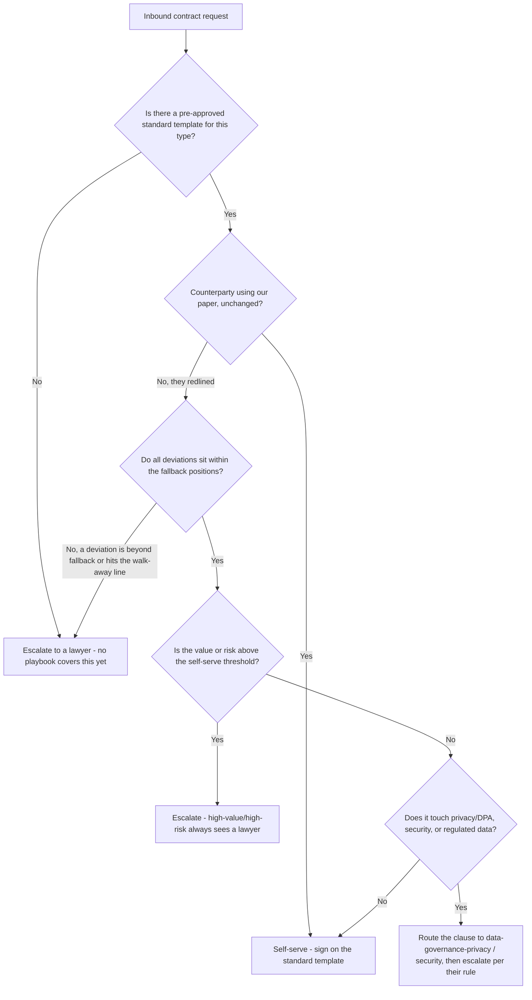
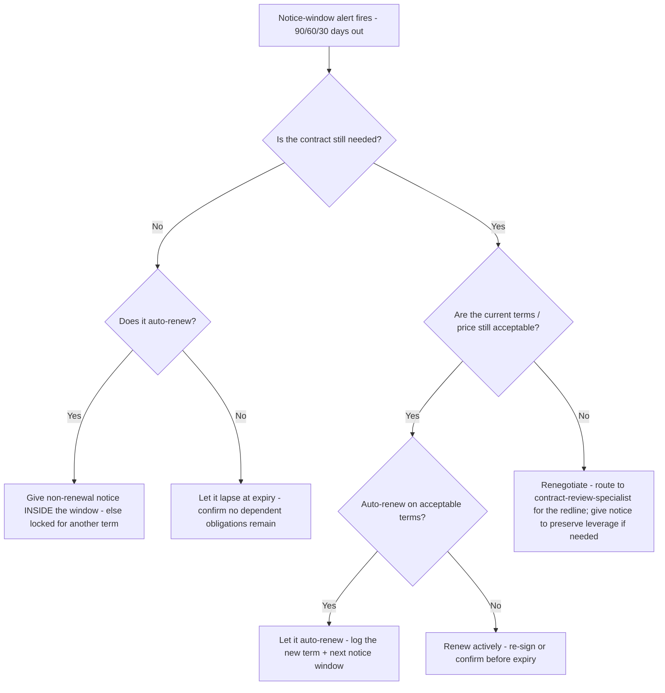

# Legal Ops & CLM — Decision Trees

_Decision trees + a dated capability map. Capability rows are `[verify-at-build]` — re-check against the vendor/product before quoting. Last reviewed: 2026-06-08._

> **Not legal advice.** These trees route *operational* decisions (self-serve vs. escalate, renew vs. exit). Any branch that lands on a legal-judgement call hands off to a qualified human lawyer. Traverse before triaging a contract or actioning a renewal.

## Decision Tree: Self-serve this contract, or escalate to a lawyer?

A playbook self-serves the low-risk majority and reserves lawyer time for the consequential. The escalation trigger is a bright line, not a vibe.

_If any branch reaches "escalate", a qualified lawyer owns the judgement. The playbook encodes the lawyer's pre-set bounds; it does not replace the lawyer for anything outside them._

## Decision Tree: Renew, renegotiate, or exit at the notice window?

The notice window — not the expiry — is the actionable deadline. Decide before it closes, or an auto-renew decides for you.

_Track the notice deadline per contract and alert in tiers to a named owner. A renewal decision made at expiry is a decision you didn't get to make._

---

## Capability map (2026, `[verify-at-build]`)

| Layer | Options | Notes |
|---|---|---|
| CLM platform (enterprise) | Ironclad, Icertis, Agiloft, SirionLabs, DocuSign CLM | End-to-end intake→repository→obligations; heavier to own `[verify-at-build]` |
| CLM / contract management (mid-market) | PandaDoc, ContractWorks, Concord, LinkSquares, Evisort | Lighter-weight repository + workflow; varying obligation/AI depth `[verify-at-build]` |
| E-signature | DocuSign eSignature, Adobe Acrobat Sign, Dropbox Sign | The `sign` step; check eIDAS/ESIGN/UETA posture for the jurisdiction `[verify-at-build]` |
| Clause / playbook AI assist | Ironclad AI, LinkSquares, Evisort, Spellbook, Luminance | Surfaces deviations vs. standard; a lawyer still owns the call `[verify-at-build]` |
| Obligation extraction | Evisort, Icertis, SirionLabs, LinkSquares | Extracts obligations/dates from signed PDFs; verify accuracy before trusting `[verify-at-build]` |
| Repository / metadata | Native CLM repository, SharePoint + metadata, a database | Prefer a schema (named fields) over folder conventions `[verify-at-build]` |
| Intake / workflow | CLM-native intake, ticketing (Jira/ServiceNow), forms | One structured front door; risk/value triage routing `[verify-at-build]` |
| Reporting / alerts | CLM dashboards, BI on the repository, calendar/notice alerts | Tiered notice-window alerts (90/60/30) to a named owner `[verify-at-build]` |

_Key clauses where risk concentrates: limitation of liability, indemnity, IP ownership, term/termination, confidentiality. Lifecycle reference: intake → draft → review → negotiate → sign → manage → renew. E-signature legal frameworks: ESIGN/UETA (US), eIDAS (EU) — confirm the current posture and jurisdiction before relying on it. Re-verify any product/framework specific before quoting it to a consumer; none of this is legal advice._
