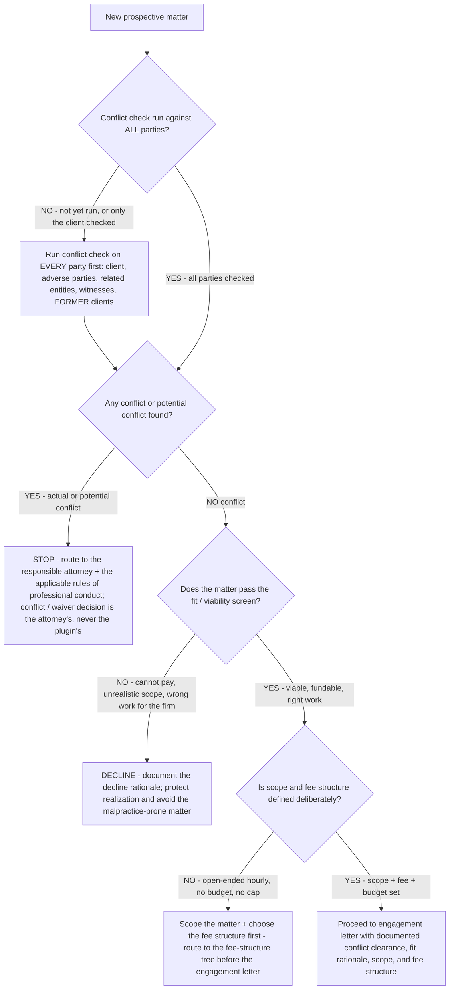
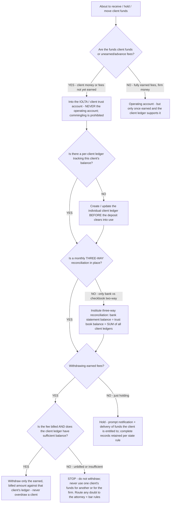

# Small-firm legal decision trees — conflict-checked intake & IOLTA trust accounting

**Last reviewed:** 2026-06-05 · **Confidence:** medium (ABA Model Rules + Clio 2025 benchmarks + state-bar trust-handbook framing, web-verified this date). Ethics, conflict, and trust-accounting rules are **adopted and varied state-by-state** — every rule reference carries an inline `[verify-at-use]` marker and must be validated against the firm's specific state rules of professional conduct before any deliverable. **Nothing here is legal advice; every output is decision-support for the responsible attorney, and every ethics/conflict/trust call routes to the attorney and the applicable bar rules** (CLAUDE.md §2, §3 #3, §3 #6).

> Two **net-new** topic-specific trees that **complement** the consolidated [`legal-practice-decision-trees.md`](legal-practice-decision-trees.md) (which covers fee-structure selection, A/R collection, and billing-rate review). These cover the two highest-stakes process surfaces a small firm gets wrong: **intake** (where realization *and* ethics exposure are born) and **trust accounting** (where a recordkeeping gap becomes a bar-discipline problem). They do not duplicate or contradict the consolidated trees — they sit upstream of them (intake precedes fee-structure selection; trust accounting is a hard guardrail independent of the economics).

---

## Decision Tree: Conflict-Checked Intake — Take, Decline, or Escalate a New Matter

**When this applies:** a prospective client has described a new matter and the firm must decide whether to take it, decline it, or escalate a question before any engagement letter is drafted. Intake is **risk management, not a sales step** — the conflict check and fit/viability screen run *before* the engagement, because the worst client is the one you should have declined (§3 #2).

**Rationale per leaf:**
- *Run conflict check on EVERY party* — the single most common real-conflict miss is checking only the prospective client. A conflict can sit in an adverse party, a related entity, a witness, or a **former** client (duties to former clients survive the representation). "The name didn't ring a bell" is not a conflict check.
- *Escalate (conflict found)* — the plugin produces the conflict *check*, never the conflict *resolution*. An actual or potential conflict, and any waiver decision, routes to the responsible attorney and the state rules of professional conduct (ABA Model Rules 1.7 / 1.9, as adopted) — this plugin gives no legal advice and forms no attorney-client relationship (§2).
- *Decline* — a documented decline (cannot pay, unrealistic scope, wrong work) is cheaper than a write-off plus the malpractice exposure of a matter the firm should not have taken. The decline rationale is part of the record.
- *Scope first* — an un-scoped open-ended hourly with no budget is where write-offs are born (§3 #4); route to the fee-structure tree in [`legal-practice-decision-trees.md`](legal-practice-decision-trees.md) before drafting the engagement letter.
- *Engage* — only with documented conflict clearance, fit rationale, scope, and a deliberate fee structure.

**The intake gate is ordered on purpose:** conflict → fit/viability → scope+fee. A failure at a higher gate stops the matter before the cheaper-to-fix lower gates even run.

---

## Decision Tree: IOLTA / Trust-Account Move — Is This Handling Compliant?

**When this applies:** the firm is about to receive, hold, move, or withdraw client funds (advance/retainer fees, settlement proceeds, filing-fee advances), or is setting up its monthly trust controls. Trust accounting is a **non-negotiable hard guardrail** — an efficiency that risks it is not an efficiency (§3 #6). This tree is a process check, **not** an ethics ruling; any genuine question routes to the attorney and the state bar rules.

**Rationale per leaf:**
- *Into trust (no commingling)* — ABA **Model Rule 1.15** requires client funds and unearned/advance fees be held **separate** from the lawyer's own property; commingling is prohibited. Whether a flat/advance fee is "earned on receipt" varies by state — `[verify-at-use]`.
- *Per-client ledger* — the trust account is not one pool; each client's funds are tracked on an **individual ledger**. Without it, the three-way reconciliation's third leg is impossible.
- *Three-way reconciliation* — the load-bearing control. Three figures must agree: **adjusted bank statement balance = trust account book balance = sum of all individual client ledger balances**. A two-way reconcile (bank ↔ checkbook) cannot prove no client's funds were used for another's — that is exactly what an audit checks. Several states are moving to a **30-day** monthly cadence and mandating three-way reconciliation (reporting indicates a 12-state uniform standard with a **July 1, 2026** date) — `[verify-at-use]` against the firm's state.
- *Withdraw only earned + billed against the ledger* — earned fees move to operating only once billed and the client's ledger supports the amount; never overdraw a client, never use one client's funds for another or for the firm.
- *Stop on any doubt* — trust questions are hard guardrails. Route to the responsible attorney and the applicable state bar rules; this plugin resolves no ethics question and stores no client funds (§2, §3 #6).

**Records & retention:** keep **complete records** of trust funds; ABA Model Rule 1.15 sets a **five-year** retention floor after termination of the representation — **many states require longer or a different cadence**, so the retention rule is the stricter of the ABA floor and the firm's state. `[verify-at-use]`.

---

## How to read these trees

Traverse top-to-bottom and stop at the first matching branch — the order encodes cheap-checks-before-expensive-checks and **guardrails-before-economics** (a conflict or a trust violation stops the matter regardless of how attractive the economics look). Each leaf names a skill, a specialist, or a house-opinion to apply. These two trees sit **upstream** of the consolidated trees: intake precedes fee-structure selection; trust accounting is independent of (and overrides) the economics.

## Escalation & guardrails

- Any **conflict, waiver, or ethics** question → the responsible attorney + the applicable rules of professional conduct (this plugin gives no legal advice, §2).
- Any **trust-accounting / client-funds** doubt → the responsible attorney + the state bar trust rules; anything touching client PII / regulated records → `ravenclaude-core` `security-reviewer`.
- Every figure or rule reference entering a deliverable carries a source URL + retrieval date, or an `[unverified — training knowledge]` / `[verify-at-use]` mark (§3 #8). State-specific rules are **always** `[verify-at-use]`.
- A recommendation ships only with an owner, a date, and an expected metric movement.

## Sources (retrieved 2026-06-05)

- ABA Model Rule 1.15 — *Safekeeping Property* (separation, records, 5-year retention): https://www.americanbar.org/groups/professional_responsibility/publications/model_rules_of_professional_conduct/rule_1_15_safekeeping_property/
- ABA Model Rules of Professional Conduct — Rule 1.7 (current-client conflicts) & Rule 1.9 (former-client duties), index: https://www.americanbar.org/groups/professional_responsibility/publications/model_rules_of_professional_conduct/model_rules_of_professional_conduct_table_of_contents/
- Three-Way IOLTA Reconciliation — step-by-step: https://stephsbooks.com/blog/iolta-three-way-reconciliation
- State-bar tightening (45→30 day deadline, mandatory three-way, July 1 2026 compliance): https://stephsbooks.com/news/three-way-iolta-reconciliation-mandatory-12-states
- Illinois ARDC Client Trust Account Handbook (a representative state handbook): https://www.iardc.org/Files/ClientTrustAccountHandbook.pdf
- Clio — 2025 Legal Trends benchmarks (intake/realization context): https://www.clio.com/resources/legal-trends/benchmarks/
