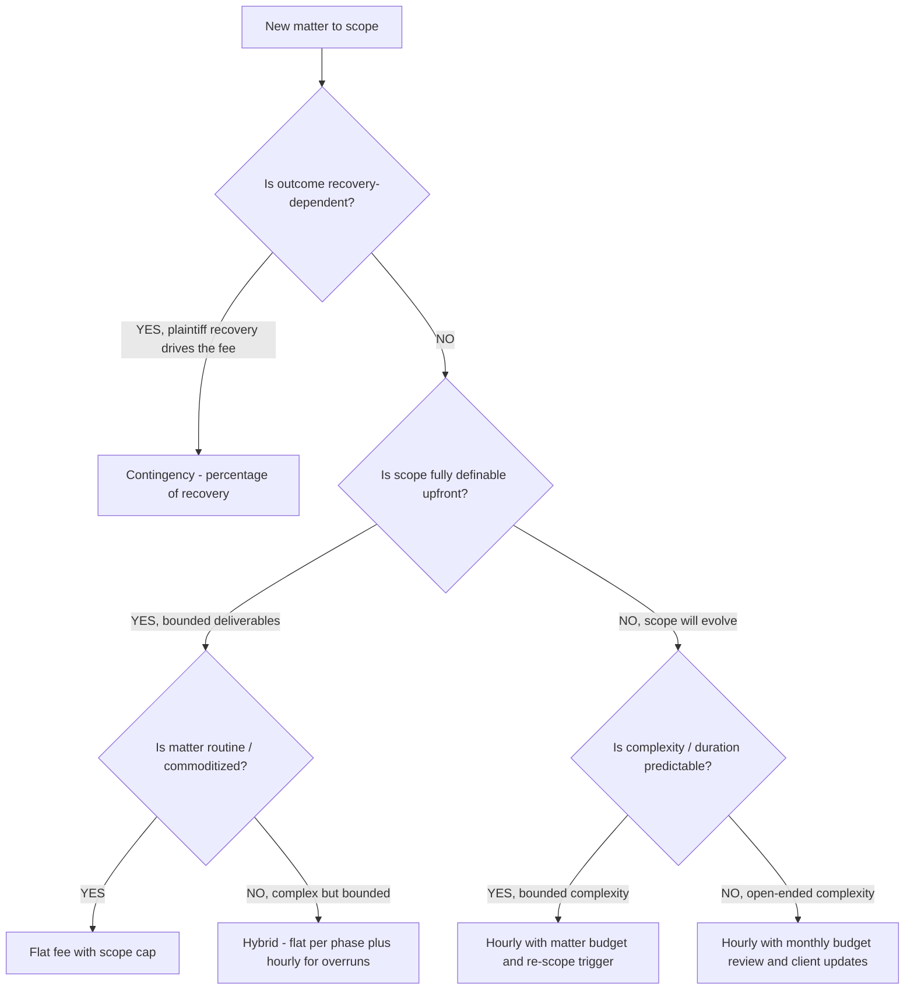
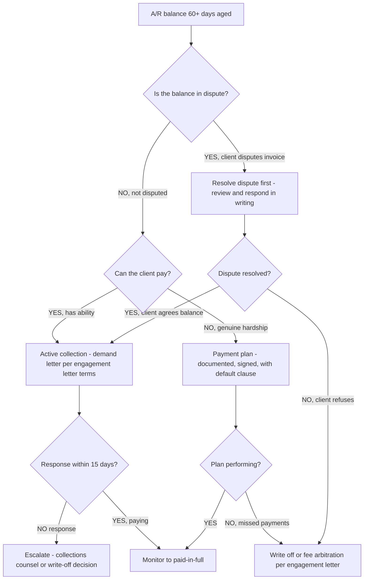
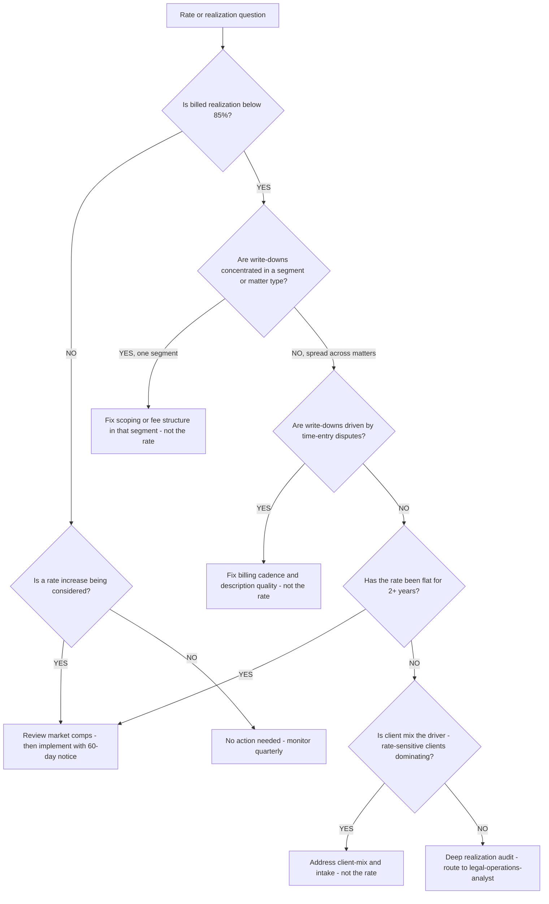

# Small-firm practice decision trees

Which analysis for which symptom — traverse top-to-bottom before picking a method.

## Decision Tree: Busy but broke

1) Read realization and the billed-vs-collected gap (§3 #1). 2) Locate write-down/write-off/A/R leakage. 3) Check intake and scope (§3 #2, #4). 4) Check utilization (§3 #5).

## Decision Tree: Should I take this matter?

1) Conflict check (§3 #2). 2) Fit/viability. 3) Scope and fee structure (§3 #4). Route the call to the attorney.

## Decision Tree: An ethics/trust question

Stop. Route to the responsible attorney and the applicable rules of professional conduct (§3 #6) — this plugin does not resolve ethics questions.

## How to read these trees

Traverse top-to-bottom and stop at the first matching branch — the order encodes the cheap-checks-before-expensive-checks discipline (§3). Each leaf names a skill, a specialist, or a house-opinion to apply. Never skip a higher branch because a lower one looks more interesting; a denominator, seasonal, or definitional artifact masquerades as a finding more often than not.

## Decision Tree: Which skill for which task

- **Read realization** → use when: Read realization and the billed-vs-collected gap, locating write-downs, write-offs, and A/R, so the practice's real economics are visible. ([`../skills/read-realization/SKILL.md`](../skills/read-realization/SKILL.md))
- **Run conflict-checked intake** → use when: Run intake as risk management — conflict check and fit/viability screen before the engagement — to prevent the matters that destroy realization. ([`../skills/run-conflict-checked-intake/SKILL.md`](../skills/run-conflict-checked-intake/SKILL.md))
- **Support drafting as work product** → use when: Draft and review documents from clause libraries with issue flags, as attorney-reviewed work product, never legal advice. ([`../skills/support-drafting/SKILL.md`](../skills/support-drafting/SKILL.md))
- **Scope the matter and fee** → use when: Scope a matter and choose the fee structure deliberately, since an open-ended hourly with no budget breeds write-offs. ([`../skills/scope-the-matter/SKILL.md`](../skills/scope-the-matter/SKILL.md))
- **Build a practice scorecard** → use when: Build a realization-led practice scorecard with utilization, collected revenue, and A/R, each defined and baselined. ([`../skills/build-practice-scorecard/SKILL.md`](../skills/build-practice-scorecard/SKILL.md))

## Decision Tree: Which specialist owns this

- **The engagement** → [`legal-engagement-lead`](../agents/legal-engagement-lead.md)
- **Litigation matters** → [`litigation-specialist`](../agents/litigation-specialist.md)
- **Transactional drafting** → [`contracts-drafting-specialist`](../agents/contracts-drafting-specialist.md)
- **The numbers** → [`legal-operations-analyst`](../agents/legal-operations-analyst.md)

When two leaves apply, route to the **lead** first to scope and sequence — overlapping symptoms usually mean two drivers at once, and the lead keeps the analysis from collapsing into a single-cause story.

## Decision Tree: Which house-opinion gates the call

Before picking any method, check whether one of the standing biases (§3) already decides the framing:

1. Realization, not billed hours, is the practice's truth — if this is in question, apply §3 #1 before any method.
2. Intake is risk management — conflict and fit before the engagement — if this is in question, apply §3 #2 before any method.
3. Work product is attorney decision-support, never legal advice — if this is in question, apply §3 #3 before any method.
4. Scope the matter and the fee structure deliberately — if this is in question, apply §3 #4 before any method.
5. Utilization and the non-billable load are a capacity story — if this is in question, apply §3 #5 before any method.
6. Trust accounting and ethics rules are non-negotiable guardrails — if this is in question, apply §3 #6 before any method.
7. Collections and A/R are part of the matter, not after it — if this is in question, apply §3 #7 before any method.
8. Date and source any rate, benchmark, or law reference — if this is in question, apply §3 #8 before any method.

## Escalation & guardrails

- Anything touching client PII / regulated records → stop and route to `ravenclaude-core` `security-reviewer`.
- Any external figure entering a deliverable → carry a source URL + retrieval date, or mark it `[unverified — training knowledge]` / `[ESTIMATE]` (§3, final house opinion).
- A recommendation ships only with an owner, a date, and an expected metric movement.
## Sourcing note

Figures in this file are from the author's domain knowledge and are marked `[unverified — training knowledge]` or `[ESTIMATE]` at point of use. Validate against a primary source before putting any figure in a client deliverable (§3 cite-or-mark rule).

---

## Decision Tree: Fee Structure Selection — Which Fee Model Fits This Matter

**When this applies:** the attorney is scoping a new matter and must choose between hourly, flat, contingency, or a hybrid structure. The client has described the matter and the attorney needs to match risk allocation and billing predictability to the engagement type before the engagement letter is drafted.

**Last verified:** 2026-06-05 against standard small-firm fee-structure practice.

**Rationale per leaf:**
- *Contingency* — appropriate when the client's recovery funds the fee; attorney bears the risk of no recovery; requires a written contingency agreement with percentage and scope clearly stated.
- *Flat fee with scope cap* — maximizes client predictability on routine, bounded matters; attorney carries execution risk; scope cap and re-scope trigger are essential.
- *Hybrid* — phase-by-phase flat fee protects both parties on complex-but-bounded work; hourly overrun clause preserves attorney margin if scope expands.
- *Hourly with matter budget* — appropriate when scope will evolve but complexity is somewhat predictable; budget + re-scope trigger forces the conversation before overruns, not after.
- *Hourly with monthly review* — last resort for genuinely open-ended matters; requires active client communication and documented budget updates to prevent billing surprises.

**Tradeoffs summary:**

| Method | Client certainty | Attorney risk | Works best when | Watch-out |
|---|---|---|---|---|
| Contingency | High (no win, no fee) | High (sunk cost if lose) | Plaintiff recovery clear | Cap the percentage; document scope of recovery |
| Flat fee | High | Medium (execution risk) | Routine, bounded deliverables | Scope creep without a cap destroys margin |
| Hybrid | Medium | Low-medium | Complex phased work | Phase definitions must be sharp |
| Hourly + budget | Medium | Low | Evolving but predictable scope | Budget must be updated in writing as facts develop |
| Hourly + review | Low | Low | Genuinely open-ended | Highest billing dispute risk; mitigate with frequent updates |

---

## Decision Tree: A/R Collection Decision — Pursue, Plan, or Write Off

**When this applies:** an A/R balance has aged past 60 days and the attorney must decide whether to pursue active collection, offer a payment plan, or write it off. The balance is identified, the root cause has been triaged (see `best-practices/aged-ar-is-a-collection-signal-not-a-billing-problem.md`), and a decision is needed before the account passes 90 days.

**Last verified:** 2026-06-05 against standard small-firm collections practice.

**Rationale per leaf:**
- *Resolve dispute* — a demand letter sent before the dispute is resolved hardens the client's position and waives the opportunity to correct a billing error; write response first.
- *Active collection* — a client who can pay and doesn't dispute the invoice has breached the engagement agreement; a formal demand within 60–90 days is appropriate.
- *Payment plan* — a documented plan with a default clause is better economics than a write-off on a client with genuine hardship who intends to pay.
- *Write off* — a balance that is disputed and unresolved or on a defaulted plan is better written off than carried as collectible A/R distorting the realization calculation.
- *Collections counsel / escalate* — for balances material enough to justify the cost; the engagement letter's governing-law and fee-shifting clause determines the economics.

**Tradeoffs summary:**

| Method | Recovery odds | Time cost | Relationship impact | Use when |
|---|---|---|---|---|
| Active collection | High if ability exists | Medium | Low-medium | Client can pay, not disputed |
| Payment plan | Medium | Low | Low | Client intends to pay, genuine hardship |
| Write off | None (tax benefit) | Very low | Neutral | Disputed/unresolvable or plan defaulted |
| Collections counsel | Variable | High | High | Large balance, strong claim, willing to litigate |

---

## Decision Tree: Billing Rate Review — When and How to Adjust Rates

**When this applies:** the attorney is considering a billing-rate increase, has received pushback on current rates from a client, or the practice scorecard shows billed realization below 85%. The question is whether the problem is the rate, the billing judgment, or the client mix — and what to do.

**Last verified:** 2026-06-05 against standard small-firm practice economics.

**Rationale per leaf:**
- *Fix scoping/fee structure* — a realization problem concentrated in one segment is a scoping or pricing-structure problem in that segment, not a blended-rate problem; changing the rate doesn't fix the segment.
- *Fix billing cadence* — write-downs driven by client disputes about time entries are a billing-description and cadence problem; the rate is not the lever.
- *Rate increase* — appropriate when rates have been flat 2+ years or market comps justify it; implement with advance written notice per engagement agreements.
- *Address client mix* — when low-rate-tolerance clients dominate the book, the fix is intake discipline and BD investment, not rate suppression.
- *Deep realization audit* — when no single cause is identifiable, the `legal-operations-analyst` runs the full waterfall analysis to isolate the driver before any action.

**Tradeoffs summary:**

| Method | Impact on revenue | Risk | Use when |
|---|---|---|---|
| Rate increase | High positive | Client attrition | Rates stale, market supports increase |
| Fix scoping/fee structure | Medium | Low | Segment-specific realization gap |
| Fix billing cadence | Medium | Low | Write-downs from description disputes |
| Address client mix | Long-term positive | BD investment required | Rate-sensitive clients dominate book |
| Deep realization audit | Diagnostic only | Low | Root cause unclear |
