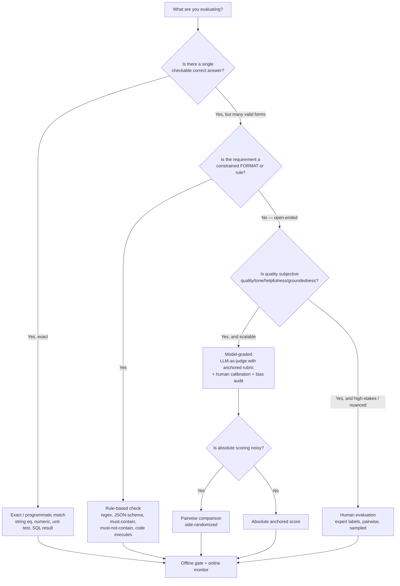

# Eval-method decision tree

> **Last reviewed:** 2026-07-07. Confidence: **high** (method taxonomy is stable). The *tooling* that
> implements each branch is volatile — see [`llm-eval-tooling-2026.md`](llm-eval-tooling-2026.md).
>
> Traverse this **before** picking a metric or reaching for an LLM judge. The cheapest reliable method
> wins — an LLM judge is powerful and expensive and itself needs evaluating, so don't use it where a
> regex, a schema check, or a unit test would do.

## Reading the leaves

| Leaf | Use when | Cost | Reliability |
|---|---|---|---|
| **Exact / programmatic** | Deterministic answer (math, extraction with a key, code that must pass tests) | Lowest | Highest |
| **Rule-based** | Format/policy constraints (valid JSON, contains a citation, no banned phrase, code compiles) | Low | High |
| **Model-graded (LLM judge)** | Subjective quality at scale (helpfulness, groundedness, tone) — with a rubric + calibration | Medium–high | Medium (only as good as its calibration) |
| **Human** | High-stakes, nuanced, or when you're validating the judge itself | Highest | High (with good guidelines) |

## The offline / online split (every leaf ends here)

- **Offline** — the frozen golden set gates the ship (a number decided before the run).
- **Online** — production signals catch what offline can't: implicit (edit distance, escalation, downstream conversion, retry rate) and explicit (thumbs, ratings). Drift shows up here first.

## Sanity checks before you trust a result

1. Is the eval set **real** (from your task's traffic) or synthetic? Real wins for ship decisions.
2. Is it **frozen and versioned**, with model output never leaking back as input?
3. Did you decide the **threshold before** seeing the score?
4. Are **capability** and **guardrail** evals separated with different pass bars?
5. Are **cost + latency** tracked next to quality?
