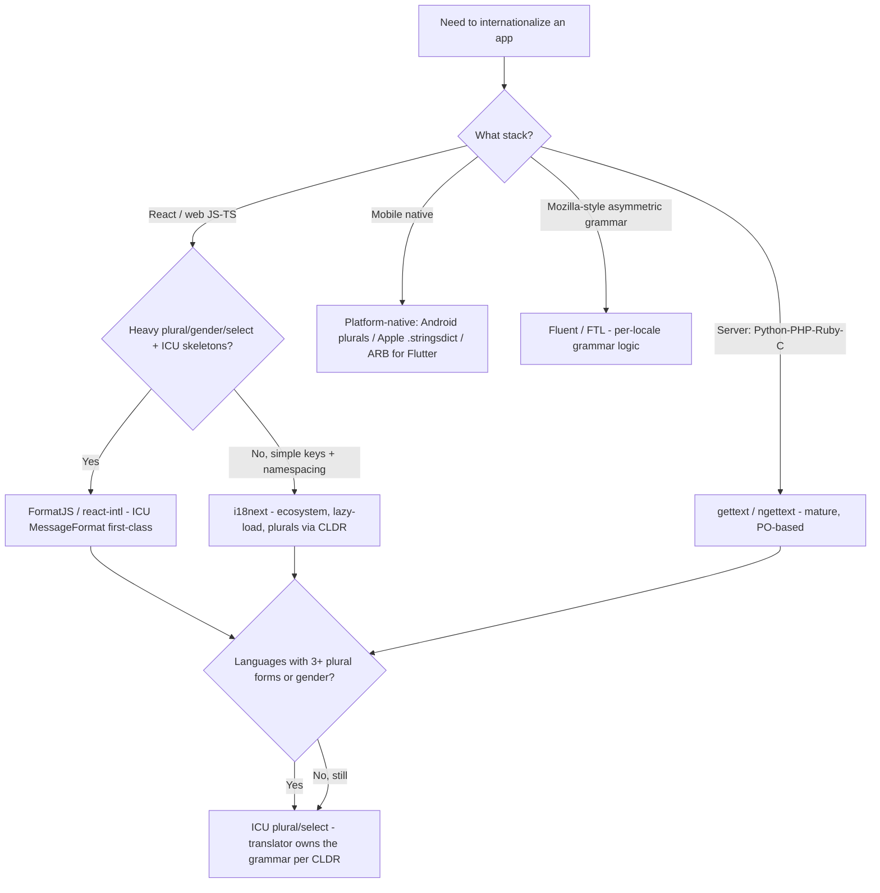
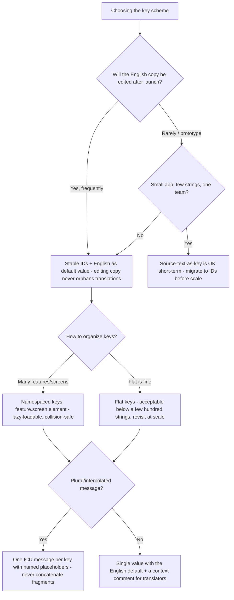

# Localization & i18n — Decision Trees

_Decision trees + a dated capability map. Capability rows are `[verify-at-build]` — re-check against the vendor/project before quoting. Last reviewed: 2026-06-08._

Traverse before choosing an i18n library, designing the translation-key scheme, or wiring the TMS.

## Decision Tree: Which i18n library / message-format model?

Pick the library the stack and your message complexity both want — and ICU MessageFormat unless the platform forces native.

_Default to ICU MessageFormat for plural/select; reach for platform-native only when the OS/toolchain owns the catalog (iOS/Android). Never let developer code decide the plural category._

## Decision Tree: Translation-key strategy?

Stable IDs beat source-text-as-key for anything that outlives a sprint.

_Source-text-as-key reads nicely until a typo fix in English silently orphans every translation. Prefer stable IDs; always attach a context comment._

---

## Capability map (2026, `[verify-at-build]`)

| Layer | Options | Notes |
|---|---|---|
| i18n library (web JS/TS) | i18next, FormatJS / react-intl, LinguiJS | i18next for ecosystem + lazy-load; FormatJS for first-class ICU MessageFormat `[verify-at-build]` |
| i18n library (server) | gettext / ngettext, Rails i18n, `.NET` resx, ICU4J/ICU4C | gettext mature + PO-based; ICU libraries for full MessageFormat `[verify-at-build]` |
| i18n library (mobile/desktop) | Apple `.strings`/`.stringsdict`, Android `strings.xml` + plurals, Flutter ARB | Platform-native owns the catalog + plural quantities `[verify-at-build]` |
| Asymmetric-grammar | Fluent / FTL (Mozilla) | Per-locale grammar logic lives in the translation, not the code `[verify-at-build]` |
| Message format | ICU MessageFormat (plural / select / selectordinal, number/date skeletons) | The cross-platform standard for plural/gender/select; CLDR-backed `[verify-at-build]` |
| Locale data | CLDR via `Intl` (`PluralRules`, `NumberFormat`, `DateTimeFormat`, `Collator`, `ListFormat`) | The source of truth for plural rules + formatting; never hand-roll `[verify-at-build]` |
| File formats | PO/POT (gettext), XLIFF 1.2/2.0, Android XML, ARB, Apple `.strings`/`.stringsdict`, JSON | Pick the format the stack + TMS round-trip without loss `[verify-at-build]` |
| TMS (cloud) | Crowdin, Lokalise, Phrase, Transifex, Smartling | Push/pull, branch handling, glossary + translation memory, context/screenshots `[verify-at-build]` |
| TMS (self-host/OSS) | Weblate, Pootle | Self-hosted option; budget the team to run it `[verify-at-build]` |
| Pseudo-localization | i18next-pseudo, FormatJS pseudo-locale, custom transform, pseudolocalization-tool | Length-inflate + accent + bracket to catch hardcoded strings + truncation `[verify-at-build]` |
| Localization QA | Visual-diff (Percy/Chromatic/Playwright snapshots), in-context review in the TMS | Pair automated layout diffs with human in-context linguistic review `[verify-at-build]` |

_Reference: CLDR plural categories — `zero`, `one`, `two`, `few`, `many`, `other` (Arabic uses all six; English uses `one`/`other`). ICU MessageFormat covers `plural`, `select`, `selectordinal`, plus number/date skeletons. Always read plural rules and formatting from CLDR via `Intl`; re-verify any product/library specific before quoting it to a consumer._
