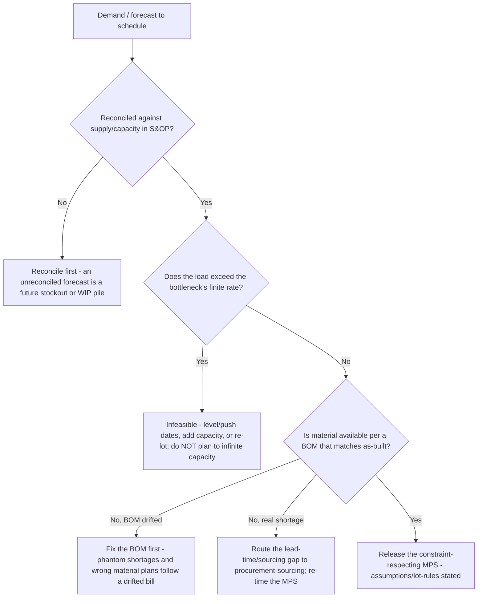
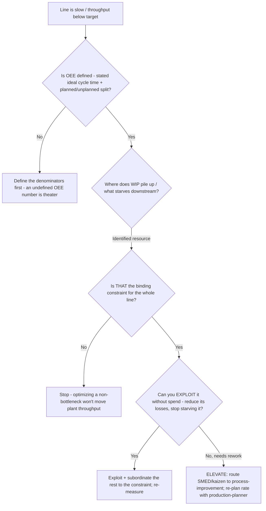
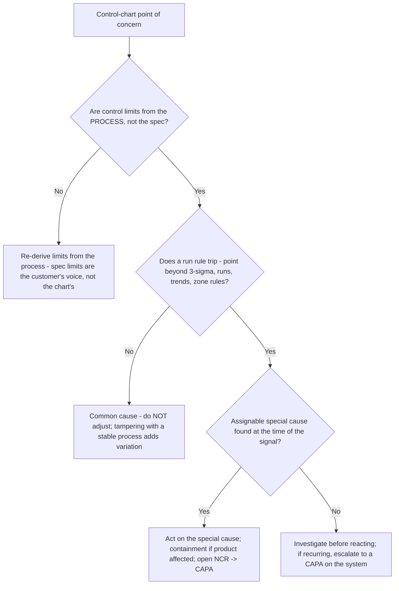
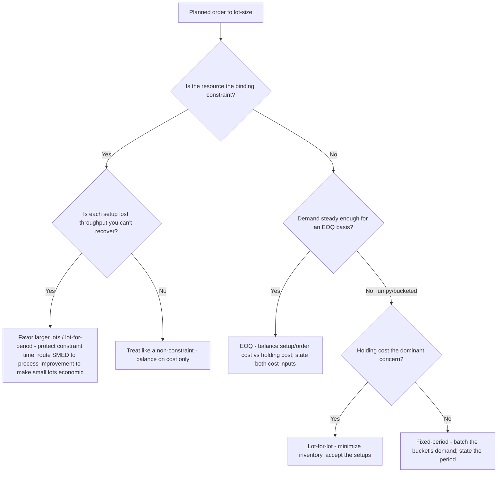
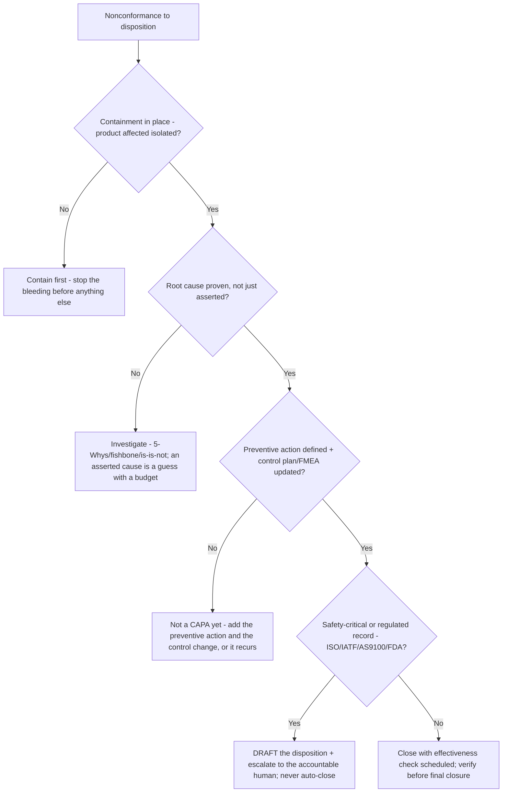

# Manufacturing Operations — Decision Trees

_Decision trees + a dated method/standard map. Map rows are `[verify-at-build]` — re-check against the current standard/source before quoting. Last reviewed: 2026-06-08._

Traverse before committing a schedule, declaring a bottleneck, or reacting to a control-chart point.

## Decision Tree: Is this production plan buildable (plan to the constraint)?

A schedule that ignores finite capacity or material is a wish, not a plan.

_The bottleneck sets the plant's rate (Theory of Constraints). Plan the schedule around the constraint and material availability, never to infinite capacity._

## Decision Tree: Where is the constraint, and is it worth optimizing?

Optimizing a non-bottleneck makes WIP, not throughput.

_Identify → exploit → subordinate → elevate the constraint. An hour at the bottleneck is plant throughput; an hour elsewhere is a mirage._

## Decision Tree: Is this control-chart signal special or common cause?

Tampering with common-cause noise adds variation; ignoring a special cause ships defects.

_Control limits come from the voice of the process; specs from the voice of the customer. The first SPC question is always special vs common cause._

## Decision Tree: How do I size this lot (setup vs holding, and is it the constraint)?

A lot size is a trade, not a habit — and the trade changes on the bottleneck.

_State the lot rule and its cost basis (setup cost, holding cost, constraint or not). A setup at the bottleneck is throughput you never get back._

## Decision Tree: Where does this nonconformance disposition stop (draft vs human sign-off)?

This plugin drafts; the accountable human signs a regulated or safety-critical disposition.

_Containment ≠ corrective ≠ preventive. On regulated/safety-critical product the agent drafts and escalates — it does not sign._

---

## Method & standard map (2026, `[verify-at-build]`)

| Area | Method / metric | Notes |
|---|---|---|
| Master planning | MPS, MRP (netting through the BOM), S&OP | Plan to finite capacity + material; reconcile demand vs supply `[verify-at-build]` |
| Lot sizing | EOQ, fixed-period, lot-for-lot | Trades setup vs holding cost; on a constraint, setups are lost throughput `[verify-at-build]` |
| Line rate | OEE = Availability × Performance × Quality | Denominators (ideal cycle time, planned downtime) must be stated `[verify-at-build]` |
| Loss model | The six big losses | Breakdowns/setup (A), minor stops/reduced speed (P), scrap/rework (Q) `[verify-at-build]` |
| Flow | Takt time = available time ÷ demand; cycle time | Produce to takt, not max speed; the gap is the signal `[verify-at-build]` |
| Constraint | Theory of Constraints (identify/exploit/subordinate/elevate) | The bottleneck governs plant throughput `[verify-at-build]` |
| Quality control | SPC (X̄-R, I-MR, p/np/c/u), run rules | Control limits from the process; special vs common cause `[verify-at-build]` |
| Capability | Cp / Cpk (and Pp/Ppk) | Meaningless on an unstable process; state sample size + MSA basis `[verify-at-build]` |
| Defect loop | NCR → containment → CAPA → effectiveness check | Corrective (this batch) ≠ preventive (the cause) `[verify-at-build]` |
| Risk | FMEA (S × O × D → RPN / Action Priority) | Must drive a control change, or it's paperwork `[verify-at-build]` |
| Inspection | Inspection plan, AQL sampling, control plan, PPAP | Prevention > detection > scrap; final inspection is the weakest control `[verify-at-build]` |
| Quality systems | ISO 9001, IATF 16949 (automotive), AS9100 (aero) | Regulated dispositions escalate to a human; never auto-close `[verify-at-build]` |

_Theory-of-Constraints reference: identify → exploit → subordinate → elevate → repeat. OEE world-class is often cited near 85% but is context-dependent — state your denominators, don't chase a benchmark. Re-verify any standard clause or metric definition before quoting it to a consumer._
