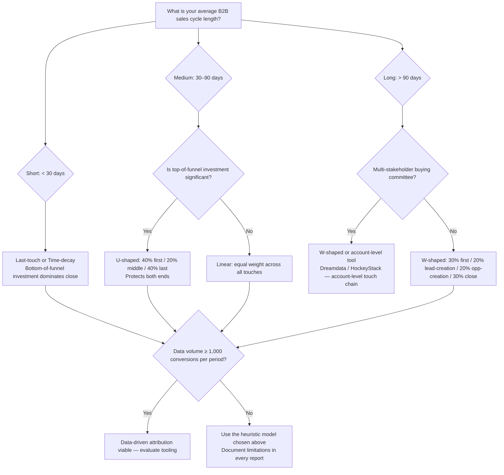
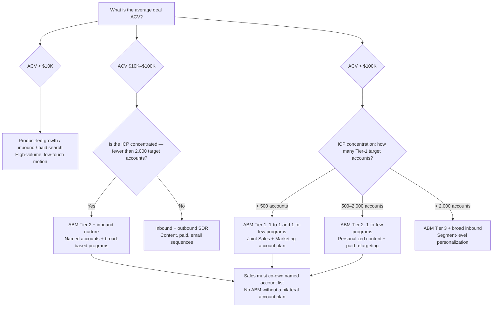
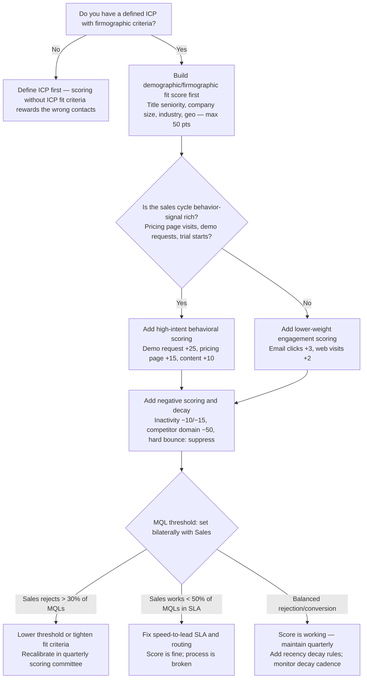

# Marketing Operations & Demand Generation — Decision Trees + 2026 Capability Map

> Canonical knowledge bank for `marketing-operations-demand-gen`. **Traverse the relevant Mermaid
> tree top-to-bottom before choosing** — the proactive complement to the Capability Grounding
> Protocol. Volatile product/pricing/benchmark facts in the capability map carry a retrieval date
> and a re-verify-at-use rider.

---

## Decision Tree 1: Attribution-model selection

**Leaf rule:** always name the model in every report. Below ~1,000 conversions per period, data-
driven attribution is underdetermined — use a named heuristic model with disclosed limitations.
The goal is relative comparison within a model, not absolute causal proof.

---

## Decision Tree 2: Channel-mix allocation (ABM vs inbound vs outbound)

**Leaf rule:** ABM without a named account list co-owned by Sales is content marketing with a
different label. Channel mix follows the ICP motion and deal economics — not Marketing's comfort
zone. Diversify across 3+ channels; platform concentration is a revenue risk.

---

## Decision Tree 3: Lead-score design

**Leaf rule:** a score built once and never refreshed rewards past behavior, not current intent.
Recency decay on behavioral points and negative scoring for inactivity are not optional. The MQL
threshold is a bilateral negotiation — never set unilaterally by Marketing.

---

## 2026 Capability Map — Martech landscape (dated, re-verify at use)

_Retrieved 2026-06-08. Product positioning, pricing, and feature sets are volatile — re-confirm
at use. This is orientation, not a procurement recommendation._

### Marketing Automation Platforms (MAP)

| Platform | Best for | Key notes [verify-at-use] |
|---|---|---|
| **HubSpot Marketing Hub** | SMB to mid-market; all-in-one CRM + MAP | Strong out-of-the-box reporting; native CRM sync; less flexible for complex segmentation than Marketo. Pricing by contact tier [verify-at-use]. |
| **Adobe Marketo Engage** | Enterprise and complex B2B | Deep segmentation, Smart Lists, Revenue Cycle Explorer; requires dedicated admin; strong Salesforce integration. |
| **Salesforce Marketing Cloud Account Engagement (Pardot)** | Salesforce-native B2B orgs | Deep CRM integration; scoring syncs natively; Pardot Engagement Studio for flows. Rebrand to "Account Engagement" — UI/docs in transition [verify-at-use]. |
| **ActiveCampaign** | SMB / e-commerce / PLG | Strong automation builder; more flexible than HubSpot at lower price point; lighter B2B enterprise features [verify-at-use]. |

### Attribution Platforms (B2B-focused)

| Platform | Best for | Key notes [verify-at-use] |
|---|---|---|
| **Dreamdata** | B2B multi-touch, account-level attribution | Connects CRM + MAP + paid channels; revenue attribution across the full funnel; strong for complex buying committees [verify-at-use]. |
| **HockeyStack** | B2B attribution + behavioral analytics | Cookieless attribution options; combines attribution with product analytics; growing traction in SaaS [verify-at-use]. |
| **Rockerbox** | B2C / DTC multi-touch | Better suited to e-commerce; less built for enterprise B2B [verify-at-use]. |
| **Northbeam** | B2C / DTC paid media attribution | Paid-media focused; not primary for B2B pipeline attribution [verify-at-use]. |
| **GA4** | Session-level web analytics | Not person-level in B2B (privacy-limited); good for top-of-funnel channel mix; use alongside CRM-native attribution for full-funnel. |

### Analytics and Measurement

| Tool | Use | Notes [verify-at-use] |
|---|---|---|
| **Salesforce Campaign Influence** | CRM-native multi-touch | Requires clean Campaign Member records; multiple model options (primary, related, custom) [verify-at-use]. |
| **HubSpot Revenue Attribution** | HubSpot-native | Simpler model set; suitable for mid-market; limited for 100+ touch journeys [verify-at-use]. |
| **Looker / Looker Studio** | BI layer on marketing data | Requires data-platform plugin for warehouse + semantic layer; this plugin produces the schema, data-platform owns the pipeline. |

### Data Enrichment and Intent

| Tool | Use | Notes [verify-at-use] |
|---|---|---|
| **ZoomInfo** | Contact + company data enrichment | Market leader; significant pricing; data freshness varies by industry [verify-at-use]. |
| **Clearbit / Breeze Intelligence** (acquired by HubSpot) | Real-time enrichment, IP de-anonymization | Now HubSpot-native "Breeze Intelligence"; standalone Clearbit legacy [verify-at-use]. |
| **Apollo.io** | Contact database + enrichment + outbound sequencing | Strong for SDR/outbound; data quality varies; useful for prospecting [verify-at-use]. |
| **Bombora** | B2B intent data (topic surging) | Cooperative intent data; commonly used for ABM account prioritization [verify-at-use]. |
| **6sense** | Intent + predictive ABM platform | Combines intent, predictive scoring, and advertising; enterprise pricing [verify-at-use]. |
| **G2 Buyer Intent** | Review-site intent signals | Useful for ICP accounts researching your category on G2 [verify-at-use]. |

> **Provenance:** martech analyst research (Martech Alliance, Chiefmartec landscape 2026), product
> documentation from respective vendor sites, and the marketing-ops practitioner community
> (MO Pros, Demand Gen Report), retrieved 2026-06-08. Product features, pricing, and market
> positioning are volatile — re-verify before any procurement recommendation. No invented products.

---

## See also

- [`../CLAUDE.md`](../CLAUDE.md) — team constitution & seams.
- [`../best-practices/README.md`](../best-practices/README.md) — the named, citable rules.
- Neighbour decision trees: `revenue-operations`, `data-platform`, `experimentation-growth-engineering`.

_Last reviewed: 2026-06-08 by `claude`._
