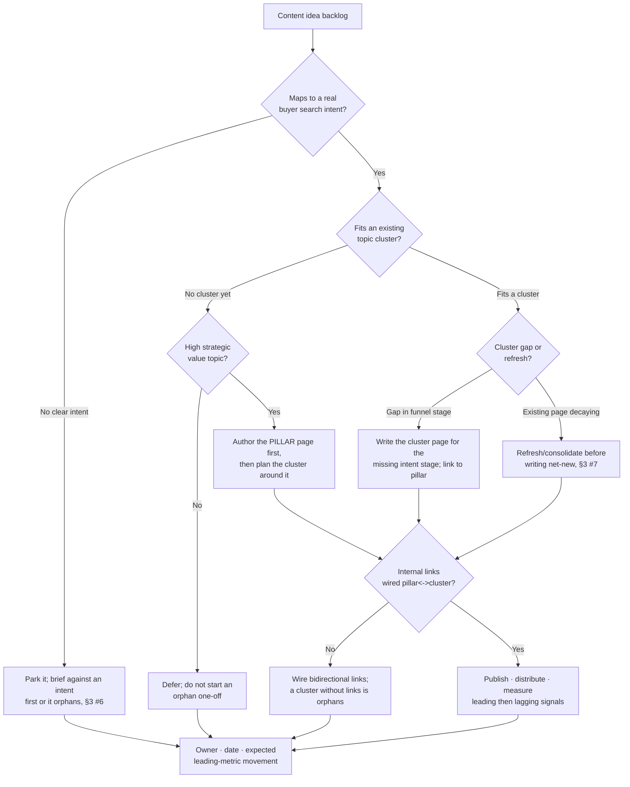

# Content Marketing Engine (2026)

> Dated reference for the `marketing-operations` team. **Every benchmark and platform statement here is `[unverified — training knowledge]`** and varies by segment, ICP, and date — and search/AI-answer behavior shifts fast. Confirm against a current, dated source before any deliverable (CLAUDE.md §2, §3 #8). Last reviewed: 2026-06-22.

Content is a *system*, not a stream of posts. The team's standing bias: **brief every piece against a search intent, build topic clusters around pillar pages, and measure leading content signals — not just the lagging pipeline they eventually feed.** Orphan posts with no intent and no internal links rarely earn or convert traffic.

---

## Decision Tree — topic-cluster / pillar-page prioritization

---

## Content brief structure

Every piece ships against a brief — the brief, not the draft, is where quality is won. Minimum fields:

- **Target search intent / job-to-be-done** — the question the reader is actually asking, and where they are in the funnel (top / mid / bottom).
- **Primary keyword + supporting terms** — and the SERP/AI-answer shape it must match (listicle, how-to, comparison, definition).
- **Audience + funnel stage** — awareness, consideration, or decision; this sets depth and CTA.
- **Angle / differentiated point of view** — why this beats what already ranks; original data, opinion, or experience.
- **Cluster + pillar** it belongs to, and the **internal links** in and out.
- **CTA / next step** — the one action this piece earns.
- **Success metric** — the leading signal that says it's working (see Measurement).

## Editorial calendar

- Plan by **cluster and funnel stage**, not by ad-hoc topic — every slot should fill a known cluster gap.
- Hold a sustainable, **consistent cadence** (consistency beats bursts for both search trust and audience habit).
- Reserve capacity for **refresh/consolidation**, not only net-new — decaying pages often return more than another orphan post (§3 #7).
- Track each piece: brief → draft → review → publish → distribute → measure → refresh.

## Topic clusters & internal linking

- A **pillar page** covers a broad topic comprehensively; **cluster pages** each address one specific sub-intent and link *up* to the pillar; the pillar links *down* to each cluster page.
- This structure signals topical authority to search and AI-answer engines and keeps related content discoverable.
- **No orphans** — every page is reachable from, and links to, the rest of its cluster. An unlinked page is invisible to both crawlers and readers.

## Distribution

Publishing is not distributing — plan distribution per piece, don't assume search alone:

- **Owned** — email/newsletter to the engaged list, site, community.
- **Earned** — search/AI-answer placement, mentions, syndication, PR.
- **Paid** — amplify the proven winners, not every piece.
- Repurpose one pillar into many formats (clips, threads, slides) across channels — atomize, don't re-create from scratch.

## Measurement — leading vs lagging

- **Leading (early, controllable)** — rankings/impressions, organic sessions, time-on-page/scroll depth, internal-link clicks, email engagement, returning readers, content-to-signup rate.
- **Lagging (outcome, slow)** — influenced/sourced pipeline and revenue contribution from content, assisted conversions, CAC impact (§3 #4).
- Read leading signals to steer week to week; judge the program on lagging contribution (§3 #4). Name the **attribution model** before crediting content with pipeline (§3 #2).

## See also
- [`../CLAUDE.md`](../CLAUDE.md) §3 #4 (revenue contribution over volume), §3 #2 (state the attribution model).
- [`../best-practices/brief-every-piece-against-a-search-intent.md`](../best-practices/brief-every-piece-against-a-search-intent.md)
- [`../best-practices/build-topic-clusters-not-orphan-posts.md`](../best-practices/build-topic-clusters-not-orphan-posts.md)
- [`../skills/content-engine/SKILL.md`](../skills/content-engine/SKILL.md)
