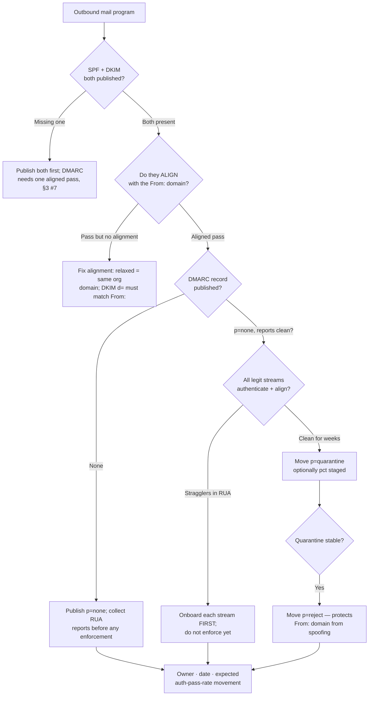
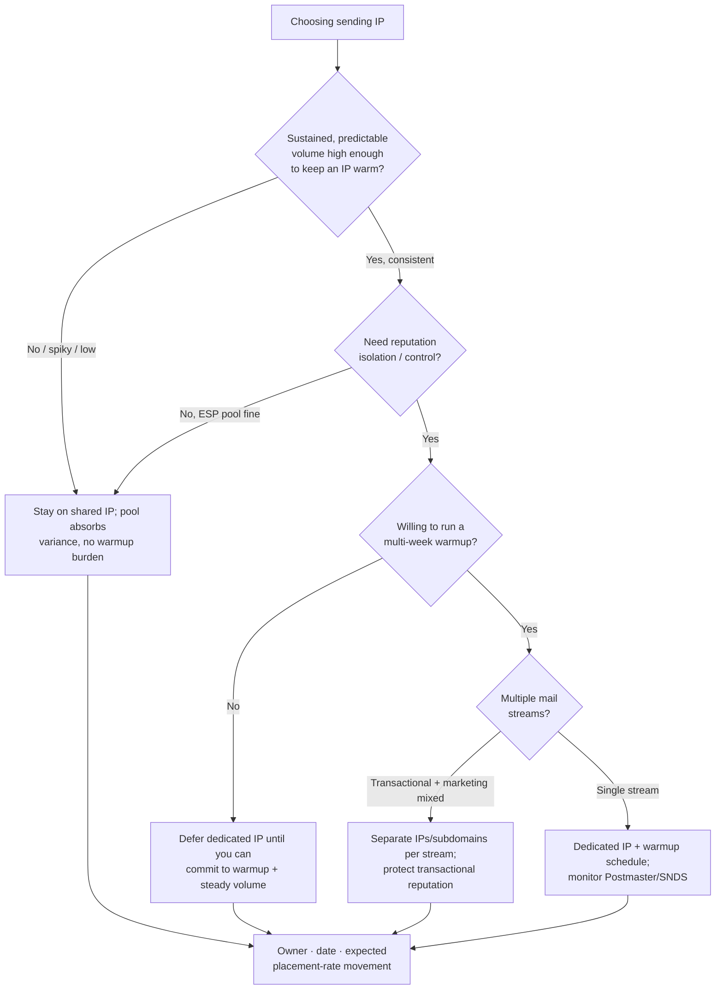

# Email Deliverability (2026)

> Dated reference for the `marketing-operations` team. **Every figure and provider/regulatory statement here is `[unverified — training knowledge]`** and changes as mailbox providers (Gmail, Yahoo, Microsoft) revise their bulk-sender rules. **Verify-at-use:** confirm against the current, dated provider guidelines before any deliverability deliverable, and route consent/privacy-law determinations (CAN-SPAM, GDPR, CASL) to the qualified authority (CLAUDE.md §2, §3 #8). Last reviewed: 2026-06-22.

Deliverability is *inbox placement*, not "sent." A send can succeed at the SMTP layer and still land in spam. The team's standing bias: **authenticate before you send, warm before you scale, and read sender reputation as a leading indicator — not the bounce report after the fact.**

---

## Authentication: SPF, DKIM, DMARC

- **SPF** (Sender Policy Framework) — a DNS TXT record listing the IPs/hosts authorized to send for the domain. Checked against the envelope `MAIL FROM` (the Return-Path), not the visible `From:`.
- **DKIM** (DomainKeys Identified Mail) — a cryptographic signature in the message header; the public key lives in DNS. Survives forwarding (SPF often does not).
- **DMARC** (Domain-based Message Authentication, Reporting & Conformance) — a policy record (`_dmarc.<domain>`) that tells receivers what to do when SPF *and/or* DKIM fail **alignment** with the visible `From:` domain, and where to send aggregate (RUA) reports.

**Alignment** is the concept that trips teams up: SPF/DKIM can *pass* while still failing DMARC, because the authenticated domain must **align** with the `From:` domain (relaxed alignment = same organizational domain; strict = exact match). A pass without alignment does not satisfy DMARC.

**Policy progression** — never publish `p=reject` first. Stage it: `none` (monitor only, collect RUA reports) → `quarantine` (route failures to spam, optionally with `pct=`) → `reject` (bounce failures). Each step waits until aggregate reports show your legitimate streams (ESP, transactional, internal relays) authenticate and align cleanly.

As of 2026, major mailbox providers require authenticated mail from bulk senders, a DMARC policy of at least `p=none`, low spam-complaint rates, and one-click list-unsubscribe (RFC 8058) for marketing mail. `[unverified — training knowledge — confirm current provider thresholds]`

### Decision Tree — SPF/DKIM/DMARC alignment & policy progression

---

## Dedicated vs shared sending IP

A **shared IP** pools your reputation with the ESP's other senders — fine at low/irregular volume because no single sender can build (or wreck) the pool's reputation alone. A **dedicated IP** isolates your reputation — worth it only above a sustained volume threshold, because reputation needs consistent volume to *stay warm*; a dedicated IP sending sporadically looks suspicious and decays.

### Decision Tree — dedicated vs shared sending IP

---

## IP / domain warmup

Reputation is built by *consistent, engaged* volume over time. Ramp gradually — start with the most-engaged segment and a small daily cap, then increase as complaint/bounce rates stay low and engagement holds. A cold IP or domain that blasts full volume on day one gets throttled or filtered. Warm the **domain** too, not just the IP — domain reputation increasingly dominates.

## List hygiene & engagement

- **Permission first** — send only to addresses that opted in. Purchased/scraped lists wreck reputation fast.
- **Validate at collection** (syntax + MX) and **suppress** hard bounces, role accounts, and spam-trap-shaped addresses.
- **Sunset inactive recipients** — engagement (opens/clicks, and increasingly *positive* signals like replies and not-spam) is what providers reward. Re-engage or suppress recipients who haven't engaged in a defined window.
- A smaller engaged list outperforms a large stale one on inbox placement.

## Reputation monitoring

- **Google Postmaster Tools** — domain/IP reputation, spam rate, authentication pass rates, encryption — for Gmail.
- **Microsoft SNDS** (Smart Network Data Services) + JMRP — volume, complaint, and trap data — for Outlook/Hotmail.
- **DMARC RUA aggregate reports** — who is sending as you, and whether streams align.
- Watch the **complaint rate** above all; providers publish a low ceiling (commonly cited around 0.3%, with 0.1% as a healthier target — `[unverified — confirm current provider thresholds]`).

## Bounce & complaint handling

- **Hard bounces** (invalid mailbox/domain) — suppress immediately and permanently.
- **Soft bounces** (full mailbox, transient) — retry with a cap, then suppress after repeated failures.
- **Complaints / spam reports** — feedback-loop (FBL) signals; suppress the complainer immediately. A rising complaint rate is the earliest reputation warning.
- Honor **unsubscribes** instantly (and offer one-click, RFC 8058) — failure here is both a deliverability and a legal exposure (route to the qualified authority, §2).

## Verify-at-use note (2026)

Mailbox-provider bulk-sender rules, complaint thresholds, and authentication requirements are revised periodically and differ by provider. **Treat every threshold and requirement in this file as `[unverified — training knowledge]` and verify against the provider's current, dated guidance at the time of the deliverable** (§3 #8). Consent and privacy-law determinations route to the qualified authority (§2).

## See also
- [`../CLAUDE.md`](../CLAUDE.md) §3 #7 (hygiene precedes analysis), §3 #8 (date/source benchmarks).
- [`../best-practices/authenticate-spf-dkim-dmarc-before-you-send.md`](../best-practices/authenticate-spf-dkim-dmarc-before-you-send.md)
- [`../best-practices/warm-up-and-protect-sender-reputation.md`](../best-practices/warm-up-and-protect-sender-reputation.md)
- [`../skills/email-deliverability/SKILL.md`](../skills/email-deliverability/SKILL.md)
