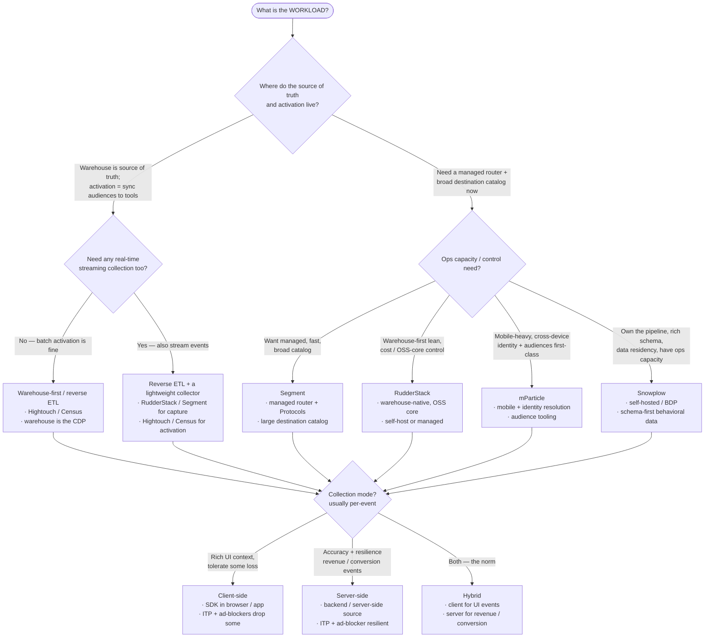

# Knowledge — CDP & collection-architecture decision tree

> **Last reviewed:** 2026-07-08 · **Confidence:** Medium-High (consensus on the packaged-vs-warehouse-first fork and the client-vs-server accuracy trade-off; **CDP feature parity, per-event pricing, and Consent Mode version specifics are volatile — re-verify before a client commitment**).
> The most-asked event-collection question is "what should collect and route our events — Segment, RudderStack, mParticle, Snowplow, or a warehouse-first / reverse-ETL stack, and client-side or server-side?". This is the decision tree the `event-taxonomy-architect` traverses **before** naming a CDP, plus the trade-off table and the seams to adjacent plugins.

The agent's discipline: **name the workload requirements first, name the CDP second.** The single biggest fork is **where the source of truth and activation live** — that decides packaged CDP vs warehouse-first before any brand comparison.

---

## Decision Tree: choosing a CDP + collection architecture

Traverse top-to-bottom. Gate on **source of truth / activation** first (packaged vs warehouse-first), then **ops capacity / control** (managed vs self-hosted), then **collection mode** (client vs server vs hybrid).

---

## Trade-off table

| Option | Sweet spot | Watch out for |
|---|---|---|
| **Segment** | Fast time-to-value, managed router, broad destination catalog, Protocols/Typewriter governance | Per-event/MTU pricing at scale; some lock-in; audience store can be redundant if warehouse-first |
| **RudderStack** | Warehouse-native, OSS core, cost/control-leaning, self-host option | Smaller destination catalog than Segment; self-hosting is ops you own |
| **mParticle** | Mobile-heavy, cross-device identity resolution, first-class audience tooling | Enterprise cost/complexity; overkill for a simple web app |
| **Snowplow** | Own the pipeline, rich/typed behavioral schema, data residency & control | You operate it (collector, enrich, loader); highest engineering lift |
| **Warehouse-first / reverse ETL (Hightouch / Census)** | Warehouse already the source of truth; activation = sync audiences to tools; one source of truth | Not a collector by itself — pair with a lightweight capture SDK; batch latency unless streamed |
| **Client-side collection** | Rich UI context (page, referrer, DOM state), simple to add | ITP / Safari / ad-blockers silently drop events → undercount, esp. revenue |
| **Server-side collection** | Accuracy, ITP/ad-blocker resilience, PII control, revenue/conversion events | Less UI context; more engineering to instrument backends |
| **Hybrid** | The realistic default — UI events client, revenue/conversion server | Two code paths; keep the identity + dedup consistent across both |

> **Volatile:** CDP feature parity, MTU/event-based pricing, mobile SDK capabilities, and Google Consent Mode version specifics change frequently. Treat the rows above as a 2026-07 snapshot and re-verify with `ravenclaude-core/deep-researcher` before a client commitment.

---

## Collection-mode sub-choice (after the CDP)

- **Client-side** — rich UI/session context; accept that ITP (Safari), Firefox ETP, and ad-blockers drop a meaningful slice. Never the sole path for revenue.
- **Server-side** — accurate and resilient; the home for revenue, conversion, and anything privacy-sensitive (PII stays server-side).
- **Hybrid** — the default: client for behavioral/UI events, server for revenue/conversion; keep `anonymousId`/identity and a dedup key consistent across both so the same action isn't double-counted.

Also decide: **where the identity graph lives** (CDP-native vs warehouse) and **where consent is gated** (must be at the source — Consent Mode / TCF / GPC — not the destination).

---

## Seams (this layer defines & captures; others consume)

- **dbt transforms of the captured events** → `analytics-engineering`.
- **A/B tests / growth experiments on the events** → `experimentation-growth-engineering`.
- **Campaign strategy / audience activation as a business function** → `marketing-operations`.
- **Org-wide privacy policy / DSAR / PII governance** → `data-governance-privacy` (this layer does consent *in collection*, not org policy).
- **The warehouse the events land in / BI** → `data-platform`.

---

## Provenance

- Packaged-vs-warehouse-first framing and the client-vs-server accuracy trade-off are established consensus in the martech/CDP literature, reviewed 2026-07-08.
- Vendor positioning — Segment (Protocols/Typewriter, destination catalog), RudderStack (warehouse-native, OSS core), mParticle (mobile + identity), Snowplow (self-hosted, schema-first), Hightouch/Census (reverse ETL) — as of 2026-07; **feature parity and pricing are volatile, re-verify before quoting.**
