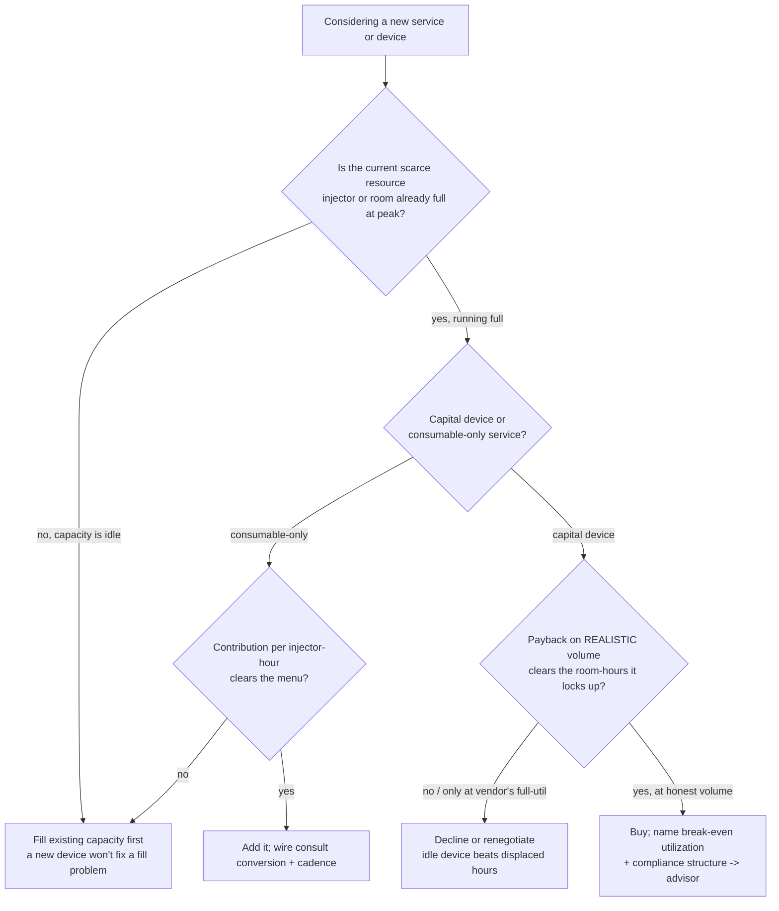
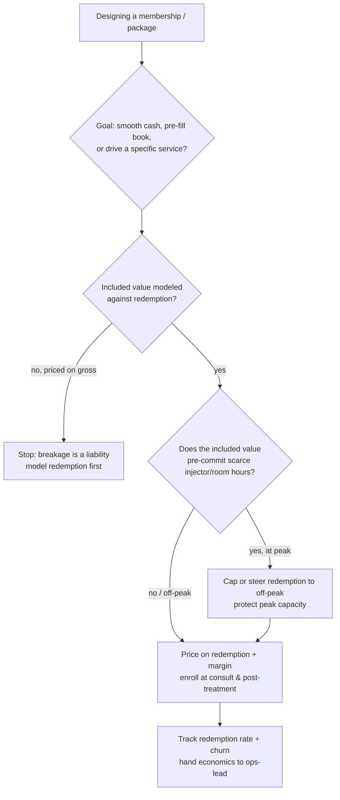
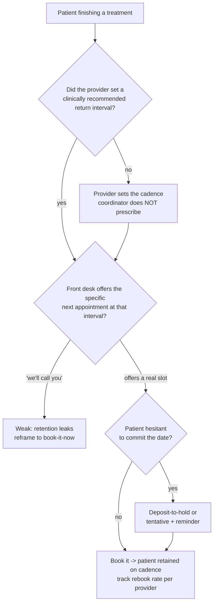
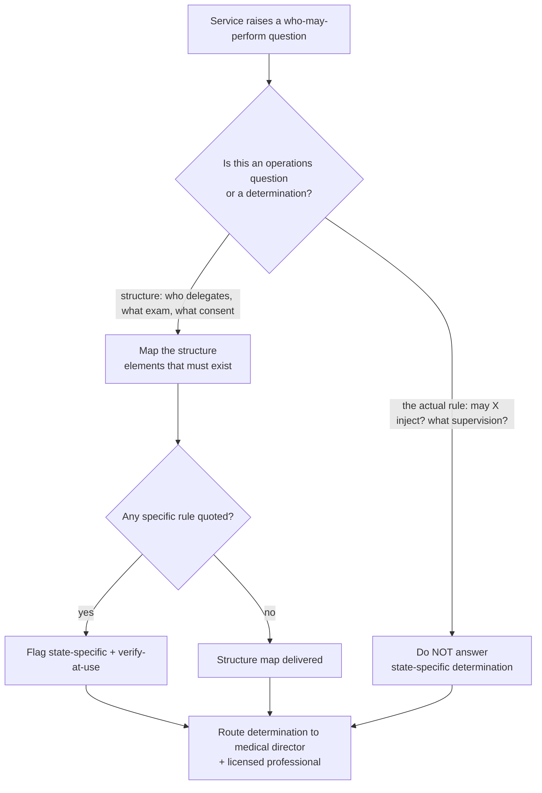

# Med-Spa / Medical Aesthetics — Decision Trees

> Reference decision trees for the `med-spa-aesthetics` team. Agents **traverse the relevant tree top-to-bottom before deciding** (the proactive complement to the Capability Grounding Protocol). Each `## Decision Tree` section is a Mermaid graph plus the rule it encodes.
>
> **Operations and financial decision-support, not legal, tax, or medical advice.** Anything touching scope of practice, supervision, good-faith exam, consent sufficiency, or corporate-practice-of-medicine is state-specific, `[verify-at-use]`, and routes to the medical director and a licensed professional. Clinical treatment plans and intervals are the provider's call. Benchmarks (injector productivity, service margins, membership norms) are volatile — confirm before quoting. No patient PHI/PII.
>
> _Last reviewed: 2026-07-04 by `claude`. Principles are durable; dated benchmarks live in [`med-spa-reference-2026.md`](med-spa-reference-2026.md)._

---

## Decision Tree: add a service or capital device

**Rule:** capacity first, contribution second, honest payback third. Never add a capital device to fix a fill problem, and never accept the vendor's full-utilization payback — model the practice's realistic booking against the room-hours the device locks up. Every device that touches scope routes its compliance structure to `aesthetics-compliance-advisor`. Margins/payback are `[verify-at-use]`.

---

## Decision Tree: design the membership

**Rule:** a membership is a demand-smoothing and retention tool, not free money. Model redemption before counting revenue, steer redemption away from peak scarce hours, and enroll at the moments of trust (consult, post-first-treatment). Breakage is a liability, not a windfall. Membership norms are `[verify-at-use]`.

---

## Decision Tree: rebook on the treatment cadence

**Rule:** the highest-yield retention act is booking the next visit at the **provider-set** clinical interval before the patient leaves. The provider owns the cadence; the coordinator operationalizes booking it. "We'll call you" is a hope; a booked slot is retention. Track rebook rate per provider.

---

## Decision Tree: scope & supervision structure

**Rule:** separate **structure** (which you may map) from **determination** (which you may not make). Scope, supervision level, good-faith-exam requirements, consent sufficiency, and corporate-practice-of-medicine are state-specific legal/medical determinations — flag every specific `[verify-at-use]` and route it to the medical director and a licensed professional. Flag, never decide.

---

## See also

- [`med-spa-reference-2026.md`](med-spa-reference-2026.md) — dated benchmarks + concepts (verify-at-use).
- Skills: [`../skills/service-mix-injectables-devices-memberships/SKILL.md`](../skills/service-mix-injectables-devices-memberships/SKILL.md), [`../skills/consult-to-treatment-conversion/SKILL.md`](../skills/consult-to-treatment-conversion/SKILL.md), [`../skills/treatment-room-and-injector-utilization/SKILL.md`](../skills/treatment-room-and-injector-utilization/SKILL.md), [`../skills/scope-of-practice-and-supervision/SKILL.md`](../skills/scope-of-practice-and-supervision/SKILL.md).
