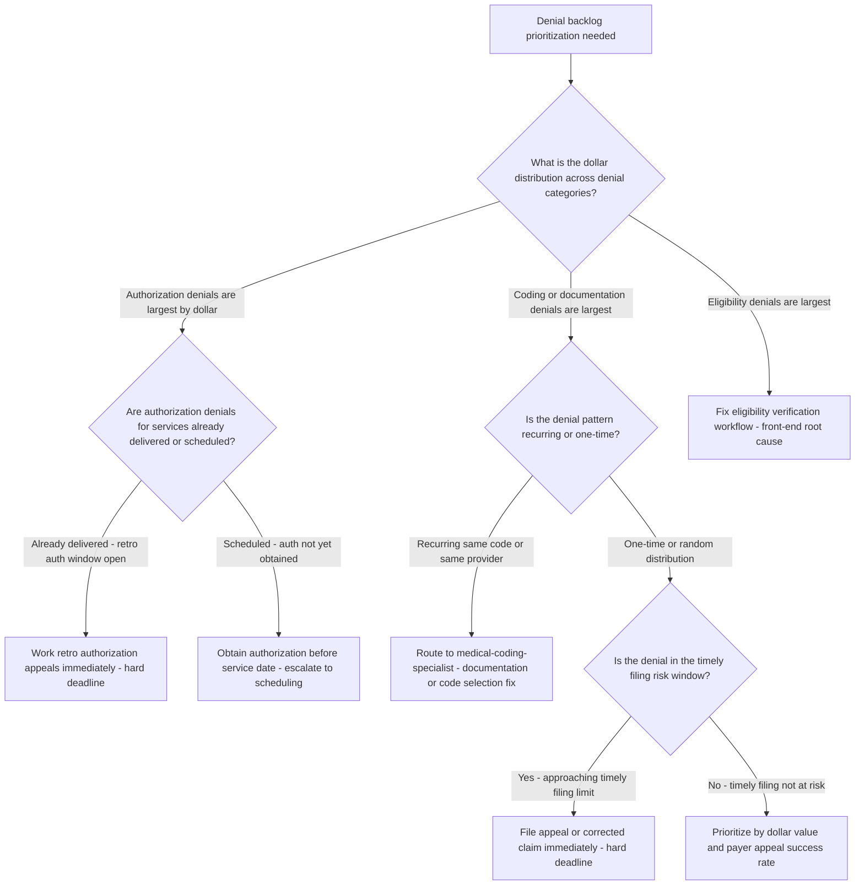
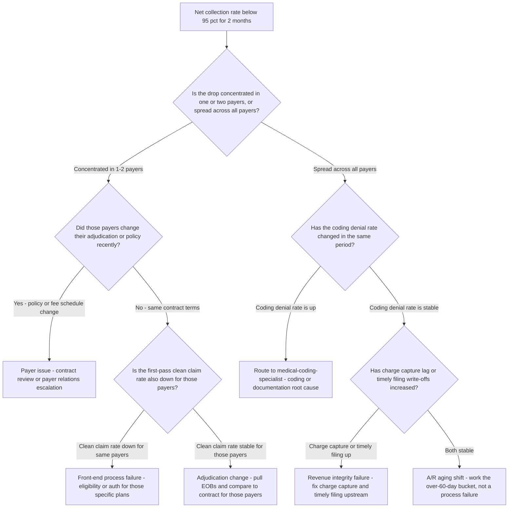
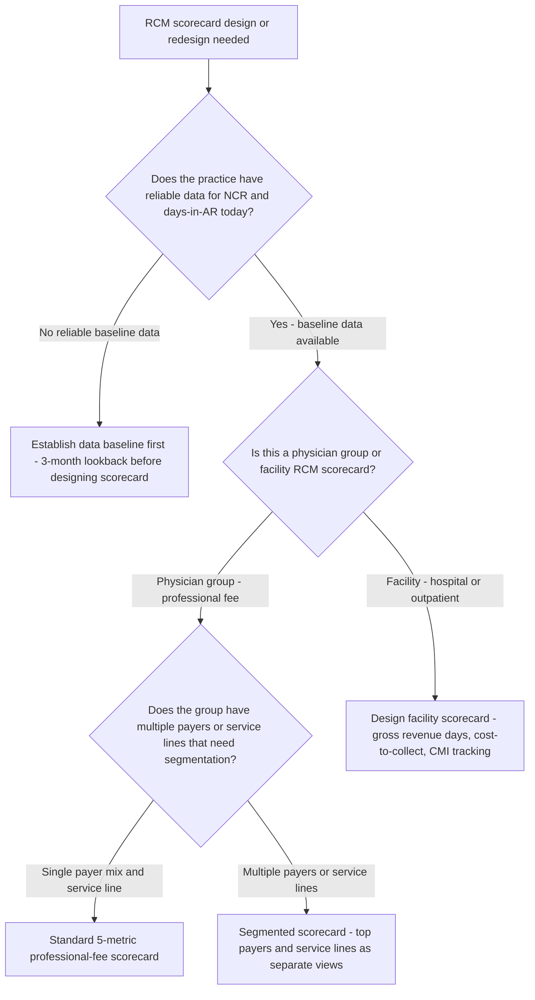

# RCM decision trees

Which analysis for which symptom — traverse top-to-bottom before picking a method.

## Decision Tree: Cash is slipping

1) Read net collection rate (§3 #4). 2) Read days-in-A/R by bucket (§3 #3). 3) Read first-pass/denial rate (§3 #2). 4) Categorize denials by root cause (§3 #5).

## Decision Tree: Denial rate is high

1) Categorize by root cause and owner (§3 #5). 2) Push eligibility/auth upstream (§3 #6). 3) Coding denials → documentation, not up-code (§3 #7).

## Decision Tree: A/R is piling up

1) Segment by bucket and payer (§3 #3). 2) Flag timely-filing risk. 3) Prioritize by recoverable dollars.

## How to read these trees

Traverse top-to-bottom and stop at the first matching branch — the order encodes the cheap-checks-before-expensive-checks discipline (§3). Each leaf names a skill, a specialist, or a house-opinion to apply. Never skip a higher branch because a lower one looks more interesting; a denominator, seasonal, or definitional artifact masquerades as a finding more often than not.

## Decision Tree: Which skill for which task

- **Prevent denials at the root** → use when: Categorize denials by root cause and owner and push fixes upstream to registration and authorization, instead of only appealing. ([`../skills/prevent-denials/SKILL.md`](../skills/prevent-denials/SKILL.md))
- **Read the cash cycle** → use when: Read net collection rate, first-pass resolution, and days-in-A/R together, against benchmark, so a cash problem is diagnosed correctly. ([`../skills/read-the-cash-cycle/SKILL.md`](../skills/read-the-cash-cycle/SKILL.md))
- **Work down aged A/R** → use when: Prioritize an A/R work-down by aging bucket, payer, and recoverable dollars, with timely-filing risk first. ([`../skills/work-down-ar/SKILL.md`](../skills/work-down-ar/SKILL.md))
- **Read coding-driven denials** → use when: Trace coding denials to documentation, code selection, or modifier use as decision-support, never to up-coding. ([`../skills/read-coding-denials/SKILL.md`](../skills/read-coding-denials/SKILL.md))
- **Build an RCM scorecard** → use when: Build a net-collection-led RCM scorecard with first-pass, denial-by-category, and days-in-A/R, each defined and baselined. ([`../skills/build-rcm-scorecard/SKILL.md`](../skills/build-rcm-scorecard/SKILL.md))

## Decision Tree: Which specialist owns this

- **The engagement** → [`rcm-engagement-lead`](../agents/rcm-engagement-lead.md)
- **Coding accuracy** → [`medical-coding-specialist`](../agents/medical-coding-specialist.md)
- **Denial prevention and A/R** → [`denials-management-specialist`](../agents/denials-management-specialist.md)
- **The metrics** → [`rcm-analytics-analyst`](../agents/rcm-analytics-analyst.md)

When two leaves apply, route to the **lead** first to scope and sequence — overlapping symptoms usually mean two drivers at once, and the lead keeps the analysis from collapsing into a single-cause story.

## Decision Tree: Which house-opinion gates the call

Before picking any method, check whether one of the standing biases (§3) already decides the framing:

1. Prevent denials; don't just appeal them — if this is in question, apply §3 #1 before any method.
2. First-pass resolution is the master efficiency number — if this is in question, apply §3 #2 before any method.
3. Days in A/R is the cash-cycle headline — if this is in question, apply §3 #3 before any method.
4. Net collection rate, not gross, measures the cycle — if this is in question, apply §3 #4 before any method.
5. Denials have a root cause and an owner — categorize them — if this is in question, apply §3 #5 before any method.
6. Front-end errors are back-end denials — fix them upstream — if this is in question, apply §3 #6 before any method.
7. Coding accuracy is decision-support, not autopilot — if this is in question, apply §3 #7 before any method.
8. Cite the source and date for every benchmark — if this is in question, apply §3 #8 before any method.

## Escalation & guardrails

- Anything touching client PII / regulated records → stop and route to `ravenclaude-core` `security-reviewer`.
- Any external figure entering a deliverable → carry a source URL + retrieval date, or mark it `[unverified — training knowledge]` / `[ESTIMATE]` (§3, final house opinion).
- A recommendation ships only with an owner, a date, and an expected metric movement.
## Sourcing note

Figures in this file are from the author's domain knowledge and are marked `[unverified — training knowledge]` or `[ESTIMATE]` at point of use. Validate against a primary source before putting any figure in a client deliverable (§3 cite-or-mark rule).

---

## Decision Tree: RCM — Which Denial Category to Attack First

**When this applies:** The denial rate is above 5% and the practice has a backlog of unworked denials. The denials-management-specialist or rcm-engagement-lead needs to prioritize which denial category to work first to maximize cash recovered per hour of effort.

**Last verified:** 2026-06-05 against standard RCM denial management prioritization practice.

**Rationale per leaf:**
- *Fix eligibility verification workflow* — eligibility denials have a front-end root cause; working the denial backlog without fixing the cause is Sisyphean.
- *Work retro authorization appeals immediately* — retro authorization windows are narrow (often 30–60 days from the date of service); this is the hardest deadline in the denial backlog.
- *Obtain authorization before service date* — a pending-service authorization gap is preventable; escalating to scheduling before the service happens costs nothing.
- *Route to medical-coding-specialist* — recurring coding denials are a documentation or code selection problem; the medical-coding-specialist is the correct resource, not the denial management queue.
- *File appeal or corrected claim immediately* — timely filing deadlines override all prioritization logic; a missed timely filing deadline is a 100% permanent loss.
- *Prioritize by dollar value and payer appeal success rate* — once hard deadlines are cleared, dollar-weighted prioritization with known appeal success rates maximizes cash per hour.

**Tradeoffs summary:**

| Method | Cost / time | Blast radius | Approval gate? | Use when |
|---|---|---|---|---|
| Front-end eligibility fix | Medium - workflow change | Medium - affects all future claims | Billing manager + front desk lead | Eligibility denials are top category |
| Retro auth appeal | Low - immediate action | Small - affects only current backlog | Billing manager | Auth denials for delivered services |
| Coding/documentation fix | Medium - education and audit | Large - affects future denials too | Medical-coding-specialist | Recurring coding denial pattern |
| Dollar-weighted triage | Low - prioritization only | Small | Denials manager | No hard deadlines in backlog |

---

## Decision Tree: RCM — Is a Low Net Collection Rate a Coding Problem or a Payer Problem?

**When this applies:** Net collection rate has dropped below 95% for two consecutive months. Before launching a denial management project, the rcm-analytics-analyst needs to determine whether the root cause is coding, payer behavior, or a mix.

**Last verified:** 2026-06-05 against standard RCM diagnostic methodology.

**Rationale per leaf:**
- *Payer issue - contract review* — payer-concentrated NCR drops without internal process changes signal a payer-side change; the fix is contract analysis or payer escalation.
- *Route to medical-coding-specialist* — coding denial rate increase with NCR drop confirms a coding or documentation root cause; coding is the right resource.
- *Front-end process failure* — payer-specific clean-claim rate decline points to eligibility or authorization failures specific to those plans.
- *Adjudication change - pull EOBs* — if clean claims are passing but NCR is down for specific payers, the payer is adjudicating differently; compare EOBs to contract terms.
- *Revenue integrity failure* — charge capture lag or timely filing write-offs are upstream revenue integrity problems that reduce NCR without a denial rate signal.
- *A/R aging shift* — if all metrics are stable but NCR is down, the denominator timing may have shifted; look at the aging bucket distribution before concluding there is a process failure.

**Tradeoffs summary:**

| Method | Cost / time | Blast radius | Approval gate? | Use when |
|---|---|---|---|---|
| Payer relations escalation | Medium - contract review + meeting | Large - may require renegotiation | RCM lead + CFO | Payer policy or fee schedule change confirmed |
| Coding review and fix | Medium - audit and education | Medium - ongoing denials until fixed | Medical-coding-specialist | Coding denial rate increase confirmed |
| Front-end process fix | Medium - workflow change | Medium | Billing manager + front desk | Clean claim rate down for specific payers |
| A/R aging work-down | Low - prioritized collection effort | Small | Denials manager | All other metrics stable |

---

## Decision Tree: RCM — Building or Rebuilding an RCM Scorecard

**When this applies:** The practice has no formal RCM scorecard, or the existing scorecard is not driving actionable decisions. The rcm-analytics-analyst is asked to design or redesign the scorecard structure.

**Last verified:** 2026-06-05 against HFMA and MGMA RCM benchmarking frameworks.

**Rationale per leaf:**
- *Establish data baseline first* — a scorecard built on unreliable data trains the team to distrust it; 3 months of clean baseline makes the scorecard credible on launch.
- *Design facility scorecard* — facility RCM has different headline metrics (gross revenue days, case mix index, cost-to-collect) than professional fee; applying professional-fee metrics to a facility is a category error.
- *Standard 5-metric professional-fee scorecard* — for a simple payer/service-line mix, a 5-metric scorecard (NCR, days-in-AR, first-pass rate, denial rate by category, A/R >90 days %) is sufficient to drive decisions.
- *Segmented scorecard* — multiple payers or service lines with different economics require segmented views; an aggregate NCR can be 96% while one payer or line is at 88% and another at 99% — the aggregate hides the problem.

**Standard 5-metric professional-fee RCM scorecard:**

| Metric | Definition | Target | Frequency |
|---|---|---|---|
| Net Collection Rate | Collections divided by allowed amount | 95-98% | Monthly |
| Days in A/R | Outstanding A/R divided by average daily charges | Under 40 | Monthly |
| First-Pass Rate | Claims paid without rework on first submission | 90-95% | Monthly |
| Denial Rate by Category | Denials by root cause as percent of claims | Under 5% total | Monthly |
| A/R Over 90 Days | Percent of total A/R aged over 90 days | Under 10% | Monthly |
