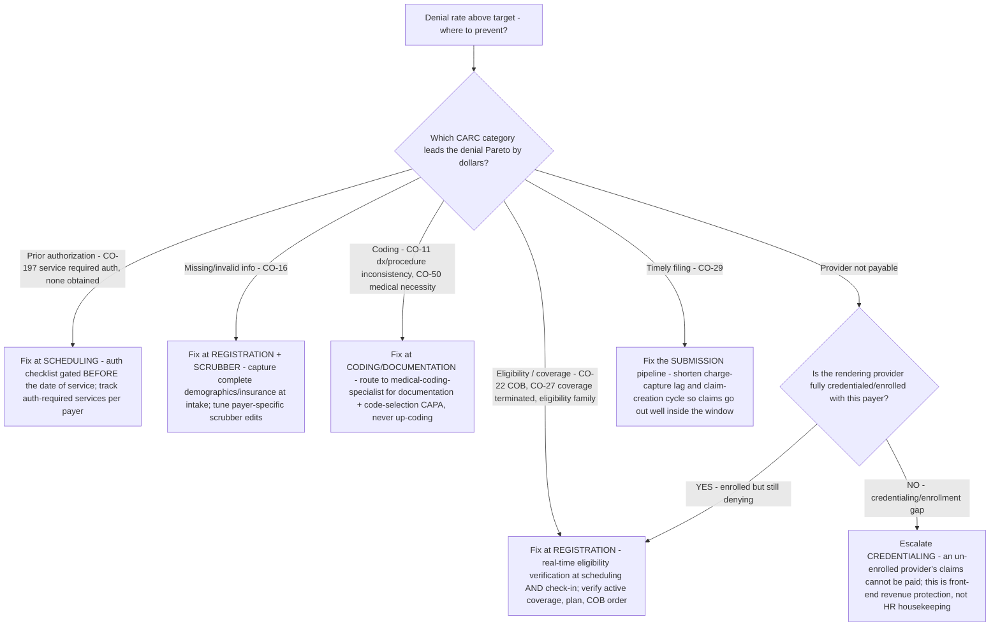

# RCM decision tree — front-end denial prevention (stop the denial before the claim goes out)

**Last reviewed:** 2026-06-05 · **Confidence:** medium (public RCM front-end / denial-prevention sources, web-verified this date). Category mixes and benchmark thresholds are **practice- and payer-specific** — they carry inline `[verify-at-use]` / `[ESTIMATE]` markers and must be validated against the client's own denial report before any deliverable (CLAUDE.md §3 #8).

> Canonical *upstream* tree for the [`denials-management-specialist`](../agents/denials-management-specialist.md) and the front-end / registration owners, embodying §3 #6 (front-end errors are back-end denials — fix them upstream). This **complements** the back-end trees in [`rcm-decision-trees.md`](rcm-decision-trees.md) and the per-claim disposition tree in [`rcm-write-off-vs-appeal-decision-tree.md`](rcm-write-off-vs-appeal-decision-tree.md): those decide what to do **after** a denial; this decides where to **prevent** it. Traverse before standing up an appeal project — prevention is cheaper than recovery (§3 #1).

---

## When this applies

A denial-prevention or front-end-process engagement: the denial rate is above target and you are deciding *where in registration/scheduling/coding* to invest to stop denials being born. Common triggers: a denial Pareto dominated by front-end categories, a new payer or service line, a registration/scheduling redesign.

## The tree

## Rationale per leaf

- **Eligibility/coverage → fix at registration** — eligibility denials (COB CARC **CO-22**, coverage-terminated **CO-27**, and the eligibility family) are born at the front desk. Real-time eligibility verification at **both** scheduling and check-in (coverage can change between them) catches active-coverage, plan, and COB-order errors before the claim is built. The cheapest fix is at the front desk, not the billing office (§3 #6).
- **Prior authorization → fix at scheduling** — CARC **CO-197** (service required prior auth, none obtained) is preventable: an auth checklist gated **before** the date of service, plus a per-payer list of auth-required services, stops the service being delivered without coverage in place. A pending-service auth gap costs nothing to close before the service; after, it is a hard appeal.
- **Missing/invalid info → registration + scrubber** — CARC **CO-16** (lacks information) is a data-capture problem: complete demographics/insurance at intake, then a **payer-specific** scrubber edit set as the safety net so the error is caught before submission, not at the payer.
- **Coding → documentation/code-selection CAPA** — CARC **CO-11** (dx/procedure inconsistency) and **CO-50** (medical necessity) route to a documentation + code-selection corrective action owned by the [`medical-coding-specialist`](../agents/medical-coding-specialist.md) — decision-support for a credentialed coder, and **never** up-coding (compliance risk dwarfs the marginal RVU, §3 #7).
- **Provider not payable → check credentialing first** — before treating a provider's denials as anything else, confirm the rendering provider is fully **credentialed/enrolled** with the payer. An un-enrolled provider's claims cannot be paid regardless of how clean the claim is; credentialing is front-end revenue protection.
- **Timely filing → fix the submission pipeline** — CARC **CO-29** prevention is upstream of billing: shorten **charge-capture lag** and the claim-creation cycle so claims clear well inside the filing window. A timely-filing write-off is a 100% permanent loss and is wholly preventable.

## The discipline (the load-bearing move)

**Categorize the denial Pareto by CARC and owner BEFORE choosing where to invest** (§3 #5). The top two categories are almost always front-end (eligibility + prior auth) and preventable far more cheaply than they are appealed. Build the Pareto from the client's own denial report, not from this tree's example ordering — the mix is practice- and payer-specific (§3 #8). Measure denial rate **by category** afterward so any recurrence is visible the month it happens, closing the CAPA loop.

## Gotchas

- **Don't add appeal staff before fixing the front end** — appealing a recurring eligibility/auth denial is treating the symptom; the same denial regenerates next week. Fix the cause upstream (§3 #1, #6).
- **Eligibility can change between scheduling and check-in** — verify at **both** touchpoints, not once.
- **Credentialing is invisible in a blended denial rate** — un-enrolled-provider claims age in the >90 A/R bucket and look like a collections problem; check enrollment early (see [`scenarios/2026-06-05-ar-days-reduction.md`](../scenarios/2026-06-05-ar-days-reduction.md)).
- **A scrubber that passes generic edits is a false safety net** — claims pass it and fail at the payer; tune **payer-specific** edits (see [`scenarios/2026-06-05-clean-claim-rate-improvement.md`](../scenarios/2026-06-05-clean-claim-rate-improvement.md)).

## Escalation & guardrails

- Documentation sufficiency / code selection → [`medical-coding-specialist`](../agents/medical-coding-specialist.md) (decision-support for a credentialed coder — CLAUDE.md §2).
- Cross-functional prevention program (registration + scheduling + coding + billing) → [`rcm-engagement-lead`](../agents/rcm-engagement-lead.md) to scope and sequence.
- Anything touching PHI / regulated records → stop and route to `ravenclaude-core` `security-reviewer`.
- Every figure entering a deliverable carries a source URL + retrieval date or an `[unverified — training knowledge]` / `[ESTIMATE]` mark (CLAUDE.md §3 #8).

## Sources (retrieved 2026-06-05)

- CARC/RARC code meanings (CO-22, CO-27, CO-16, CO-11, CO-29, CO-50, CO-197) — https://www.sprypt.com/denial-codes/carc-and-rarc-codes and https://x12.org/codes/claim-adjustment-reason-codes
- Front-end eligibility prevents denials — https://www.pmd.com/news/reduce-claim-denials-with-real-time-eligibility
- Proactive denial management & prevention — https://www.hfma.org/revenue-cycle/denials-management/61778/
- Measuring the cost of denials and impact of prevention — https://www.os-healthcare.com/news-and-blog/measuring-the-cost-of-denials-and-impact-of-prevention
