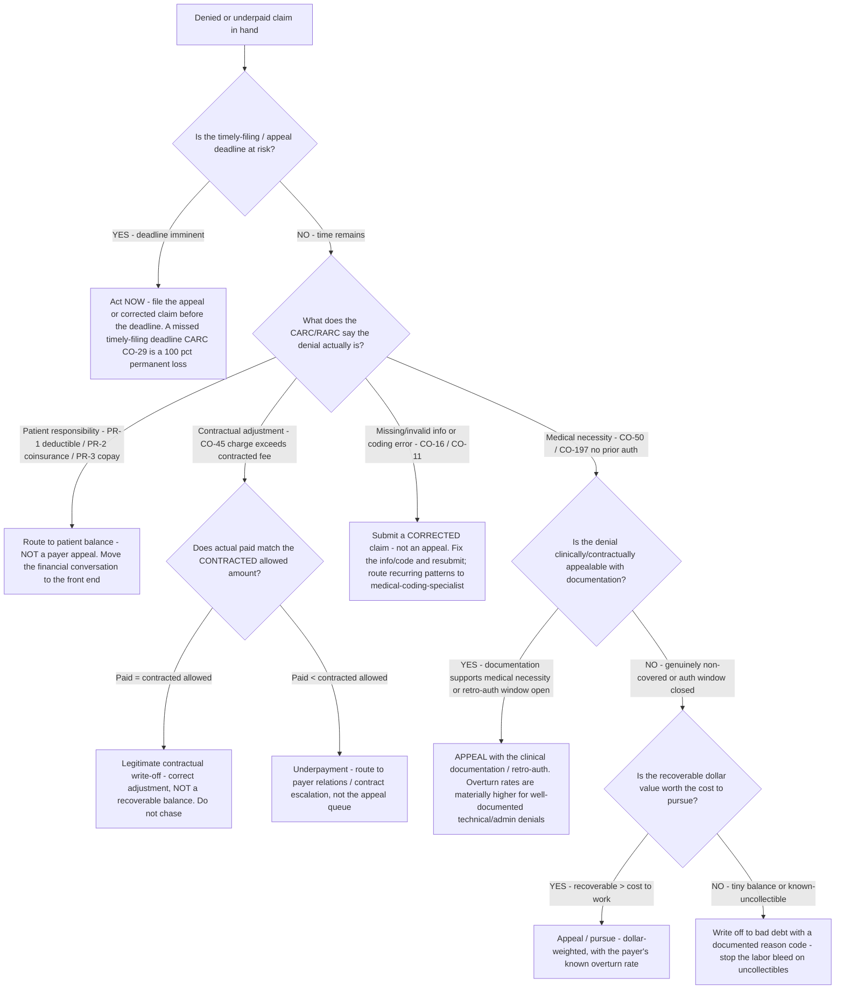

# RCM decision tree — write off, appeal, correct, or rebill a denied claim

**Last reviewed:** 2026-06-05 · **Confidence:** medium (public RCM denial-management + appeal-overturn sources, web-verified this date). Appeal-overturn rates, recoverable shares, and timely-filing windows are **payer- and plan-specific** — they carry inline `[verify-at-use]` / `[ESTIMATE]` markers and must be validated against the client's payer contracts and remittances before any deliverable (CLAUDE.md §3 #8).

> Canonical per-claim disposition tree for the [`denials-management-specialist`](../agents/denials-management-specialist.md), with a coding assist from [`medical-coding-specialist`](../agents/medical-coding-specialist.md). This **complements** the queue-prioritization tree in [`rcm-decision-trees.md`](rcm-decision-trees.md) ("Which Denial Category to Attack First" decides *which bucket* to work; this decides *what to do with one claim* once you pick it up). Traverse top-to-bottom before disposing of a denied claim. This is decision-support — final code assignment stays with a credentialed coder (CLAUDE.md §2).

---

## When this applies

A single denied or underpaid claim is in hand and the decision is: appeal it, submit a corrected claim, rebill, route to patient responsibility, escalate to the payer/contract, or write it off. Common triggers: working a denial worklist, a remittance review, an underpayment surfaced by expected-vs-actual reconciliation.

## The tree



## Rationale per leaf

- **Deadline imminent → act now** — timely-filing/appeal deadlines override all other prioritization; a missed deadline (CARC **CO-29**) is a 100% permanent loss, the one denial outcome that is never recoverable.
- **Patient responsibility → patient balance, not appeal** — PR-1 (deductible), PR-2 (coinsurance), PR-3 (copay) are correctly the patient's balance, not a payer error. The highest-leverage fix is moving the financial conversation to the **front end** (point-of-service estimate + collection), not the appeal queue.
- **Missing info / coding error → corrected claim, not appeal** — CARC **CO-16** (missing/invalid information) and **CO-11** (diagnosis/procedure inconsistency) are *corrected-claim* situations: fix and resubmit. Filing a formal appeal for a correctable error wastes the appeal window. Recurring patterns route to coding for a documentation/edit fix (a prevention CAPA, not per-claim rework).
- **Contractual adjustment (CO-45) → check paid vs contracted** — CARC **CO-45** ("charge exceeds the fee schedule / contracted amount") is the *correct* contractual write-down **only if** actual paid equals the contracted allowed amount. If paid is **below** contracted, it is a silent **underpayment** — route to payer relations/contract escalation, never the appeal queue (an underpayment is not a denial). This is the §3 #4 write-off-discipline split: contractual adjustment vs recoverable balance.
- **Medical necessity / no prior auth → appeal if defensible** — CARC **CO-50** (not deemed medically necessary, often LCD-driven) and **CO-197** (service required prior auth, none obtained) are appealable **when** documentation supports medical necessity or a retro-authorization window is still open. Well-documented technical/administrative denials carry the highest overturn rates [verify-at-use].
- **Not appealable + low value → write off to bad debt with a reason code** — once a denial is genuinely non-covered or the window has closed and the recoverable value is below the cost to pursue, write it off **with a documented reason code** so the write-off is auditable (§3 #4) and the pattern feeds prevention. Don't bleed labor on uncollectibles.

## The economic test (the load-bearing arithmetic)

Pursue a recoverable denial when, at the payer's realistic overturn rate, the expected recovery covers the cost to work it:

```
expected recovery = recoverable_balance × payer_overturn_rate
pursue if  expected recovery > cost_to_work (staff time × touches)
```

Industry context to calibrate, not to substitute for your own data: **50–65% of denied claims are never reworked**, roughly **two-thirds are recoverable**, and **recovery rates fall from ~70–80% (worked within 60 days) to ~40–60% (after 90 days)** — so speed compounds value. [`../scripts/rcm_calc.py`](../scripts/rcm_calc.py) `denial-recovery` quantifies the recoverable cash sitting in an unworked queue.

## Gotchas

- **A corrected claim is not an appeal** — using the appeal process for a CO-16/CO-11 correctable error burns the appeal window and is slower; resubmit a corrected claim instead.
- **An underpayment is not a denial** — CO-45-paid-below-contracted never enters the denial worklist; you only catch it if the **contracted allowed amount is loaded** for expected-vs-actual reconciliation (§3 #4).
- **Don't write off without a reason code** — an uncoded write-off is invisible to the prevention CAPA and unauditable; it conflates contractual adjustment with bad debt (§3 #4).
- **The cheapest denial is the one that never happens** — every leaf here is downstream of prevention. Recurring denials route to a front-end CAPA (eligibility, prior-auth, scrubber edits), not perpetual per-claim disposition (§3 #1, #6).

## Escalation & guardrails

- Final code assignment / documentation sufficiency → [`medical-coding-specialist`](../agents/medical-coding-specialist.md) (decision-support for a credentialed coder, never an order — CLAUDE.md §2).
- Contract terms / underpayment escalation → [`rcm-engagement-lead`](../agents/rcm-engagement-lead.md) to scope a payer-relations track.
- Anything touching PHI / regulated records → stop and route to `ravenclaude-core` `security-reviewer`.
- Every figure entering a deliverable carries a source URL + retrieval date or an `[unverified — training knowledge]` / `[ESTIMATE]` mark (CLAUDE.md §3 #8).

## Sources (retrieved 2026-06-05)

- CARC/RARC code meanings (CO-16, CO-11, CO-29, CO-45, CO-50, CO-197, PR-1/2/3) — https://www.sprypt.com/denial-codes/carc-and-rarc-codes and the authoritative X12 list https://x12.org/codes/claim-adjustment-reason-codes
- Denials never reworked / recoverable share — https://www.os-healthcare.com/news-and-blog/measuring-the-cost-of-denials-and-impact-of-prevention and https://www.mdclarity.com/rcm-metrics/denial-recovery-rate
- Appeal overturn rates (commercial 40–60%; technical/admin higher; MA appeals overturned >80%) — https://revecore.com/denial-overturn-rate/ and https://www.healthcaredive.com/news/insurance-denials-overturned-appeal-new-york-study-JAMA/817490/
- Recovery rate falls after 90 days — https://www.medicalbillersandcoders.com/blog/what-healthy-ar-and-denial-rates-look-like-in-2025/
