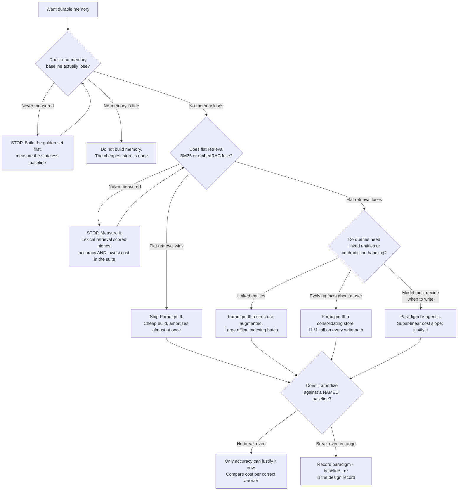
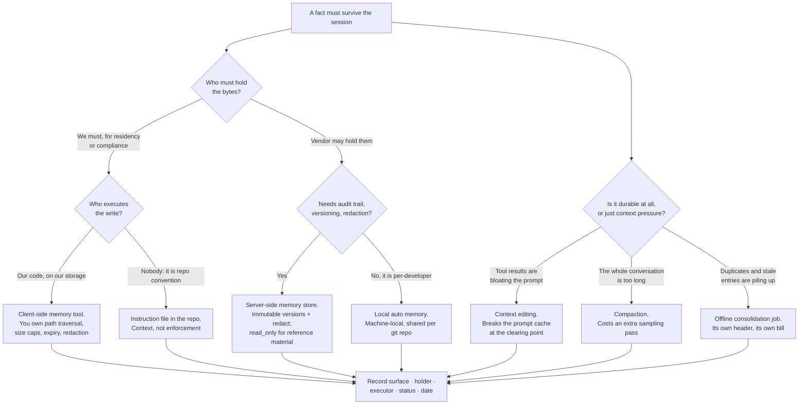
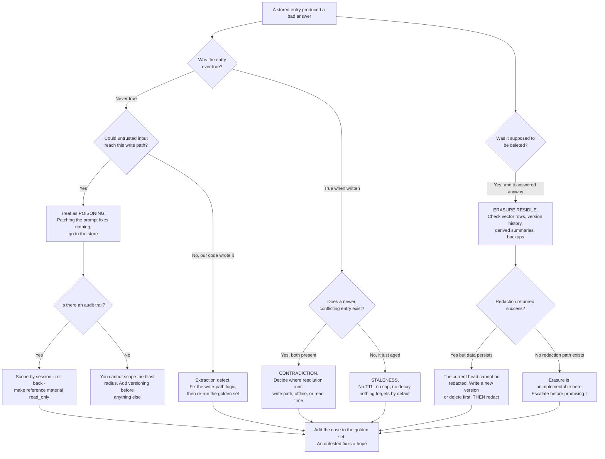

# Memory Engineering Decision Trees

**Last verified:** 2026-08-06 · the trees encode this plugin's six-decision spine; the evidence behind each leaf lives in the companion knowledge files.

> **Re-verify before quoting.** Anthropic beta→GA transitions invalidate this file independently of its age; the 90-day sweep surfaces it on a date, it does not check it.

> Traverse each tree top-to-bottom against the situation you actually have — do not keyword-match a symptom to a leaf. When two branches could apply, take the one with the smaller blast radius and escalate only when it demonstrably fails. The first node of trees 1 and 3 is a **stop**, on purpose.

## Tree 1 — Do you need memory at all, and which paradigm?

**Why the two stops.** A memory project that never measured its baselines has no way to know whether it improved anything, and the measured result that should worry you is that plain lexical retrieval was both the most accurate and the cheapest system in the benchmark suite. The evidence and its conditions: [paradigms](memory-engineering-paradigms.md). The break-even arithmetic: [economics](memory-engineering-economics.md).

## Tree 2 — Which surface owns this write?

**The two questions that do all the work** are *who holds the bytes* and *who executes the write* — they set data residency, who owns the security controls, and who can be compelled to produce the data. Exact headers, statuses and limits, dated: [memory surfaces](memory-surfaces-2026.md).

**Note the split at the top.** The right-hand branch is not memory at all — context editing, compaction and consolidation manage *pressure*, and nothing there survives on its own. Memory is what must survive both.

## Tree 3 — The entry is wrong. Which failure mode, and what fixes it?

**The distinction that matters most** is the first node. A never-true entry that arrived from untrusted input is a security incident whose defining property is persistence — it keeps acting after the session that planted it ends, and fixing the prompt does not fix the agent. A once-true entry that aged is a retention-policy defect. They look identical in the transcript and have nothing else in common. The evidence, controls and erasure residue: [memory security and privacy](memory-security-and-privacy.md).

## How to read these

- **Every leaf ends in a written record**, not a decision made in chat: paradigm, surface, who holds the bytes, who executes the write, the retention and erasure story, and the break-even against a named baseline.
- **A stop node is not an obstacle.** Trees 1 and 3 open with one because the two most expensive memory mistakes are building a store that never had to exist and patching a prompt when the store was the problem.
- **Smaller blast radius first.** Read-only before read-write; flat retrieval before an agentic write loop; a cap before a consolidation job.
- **Nothing here is enforcement.** These trees, and the files behind them, are context. To *block* an action, use a hook or a permission deny.
