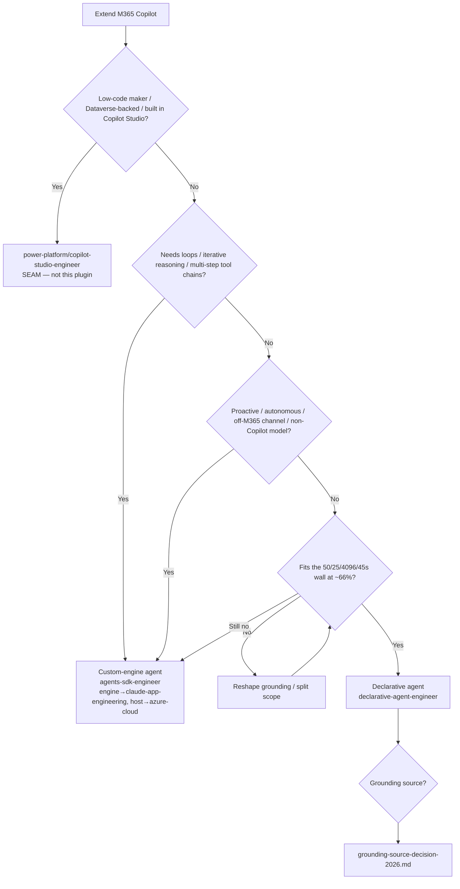

# Agent platform decision — declarative vs custom-engine vs Copilot Studio (2026)

**Last reviewed:** 2026-05-30
**Confidence:** High on the three-way framing (first-party). `[verify-at-build]` on per-feature GA/preview status — the surface ships monthly.
**Read when:** choosing *how* to extend M365 Copilot, or disambiguating this plugin's surface from the `power-platform` Copilot Studio surface.

---

## The three build paths (Microsoft's own framing)

| Path | You bring | Hosting | Orchestrator/model | Best for | Owner |
|---|---|---|---|---|---|
| **Declarative agent** | instructions + knowledge + actions | **none** (Copilot hosts) | **Copilot's** | scoped, grounded Q&A/assist *inside* Copilot; inherits M365 compliance | **this plugin** (`declarative-agent-engineer`) |
| **Custom-engine agent** | orchestrator + model + hosting | **yours** (Foundry / Container Apps) | **yours** | iterative/agentic, proactive/autonomous, off-M365 channels, non-Copilot model | **this plugin** (`agents-sdk-engineer`) + seams |
| **Copilot Studio (low-code)** | a low-code maker experience | Microsoft-managed | Copilot Studio | citizen/low-code makers, **Dataverse-backed**, topics + generative answers | **`power-platform/copilot-studio-engineer`** (the seam) |

Grounding: [agents overview / choose an agent type](https://learn.microsoft.com/microsoft-365/copilot/extensibility/agents-overview), [custom engine agent](https://learn.microsoft.com/microsoft-365/copilot/extensibility/overview-custom-engine-agent), [tool comparison](https://learn.microsoft.com/microsoft-365/copilot/extensibility/declarative-agent-tool-comparison).

## The hard limit that forces custom-engine

A declarative agent runs on Copilot's orchestrator and **cannot loop or iterate**: single grounding op + single tool call, sequential. Plus the budget wall — 50 grounding items / 25 plugin-response items / ~4,096 tokens / 45 s, all inclusive of overhead ([architecture](https://learn.microsoft.com/microsoft-365/copilot/extensibility/declarative-agent-architecture); full detail in [`declarative-agent-manifest-2026.md`](declarative-agent-manifest-2026.md)). **The moment the task needs iterative reasoning, multi-step tool chains, proactive triggers, or an off-M365 channel → custom-engine agent.**

## Build tools (declarative agents)

Agent Builder (no-code, in Copilot) → SharePoint (no-code, **not org-publishable**) → Copilot Studio (low-code → `power-platform`) → **Agents Toolkit** (`atk`, pro-code, Playground, CI/CD, the M365 Agents SDK). House rule: **source-control the Agents-Toolkit project; sideload for dev** ([agents-toolkit](https://learn.microsoft.com/microsoftteams/platform/toolkit/overview-agents-toolkit)).

## Decision Tree: Which agent platform?

## The seams (where this plugin stops)

- **Copilot Studio low-code / Dataverse-backed** → `power-platform/copilot-studio-engineer`. Cross-linked, not duplicated: see [`../../power-platform/knowledge/copilot-agents-2026.md`](../../power-platform/knowledge/copilot-agents-2026.md) (its `## Decision Tree: Copilot agents — which builder?` and the *Copy to Copilot Studio* upgrade path). **Litmus:** built in Copilot Studio, low-code, Dataverse-backed, governed in the Power Platform admin center → that team; Agent Builder / Agents Toolkit, Graph connectors / API plugins, M365 admin center → here.
- **The custom-engine agent's engine on Claude** (orchestrator/prompts/tools/evals/caching) → `claude-app-engineering`.
- **Entra app registration + CEA hosting** (Microsoft Foundry / Container Apps / Functions) → `azure-cloud`.
- **Connector ACLs / API-plugin auth / prompt-injection over ingested content** → `ravenclaude-core/security-reviewer`.

## Refresh triggers
- A new manifest schema version ships (monthly cadence) → re-check the hard limits + build-tool names.
- Agent 365 / Agent 365 SDK (Entra agent identity + governed MCP) reaches GA → re-evaluate a v0.2.0 `agent-365-engineer` `[verify-at-build]`.
