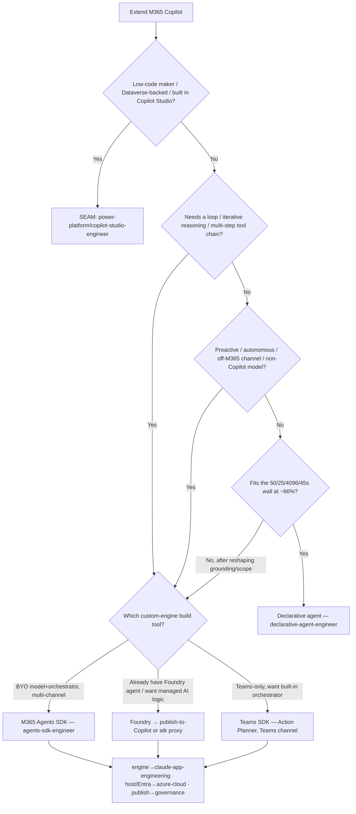
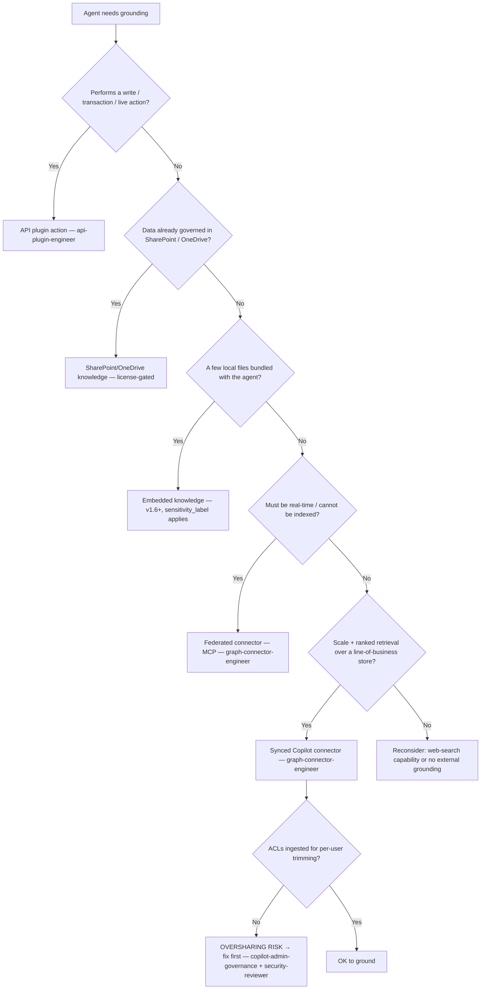
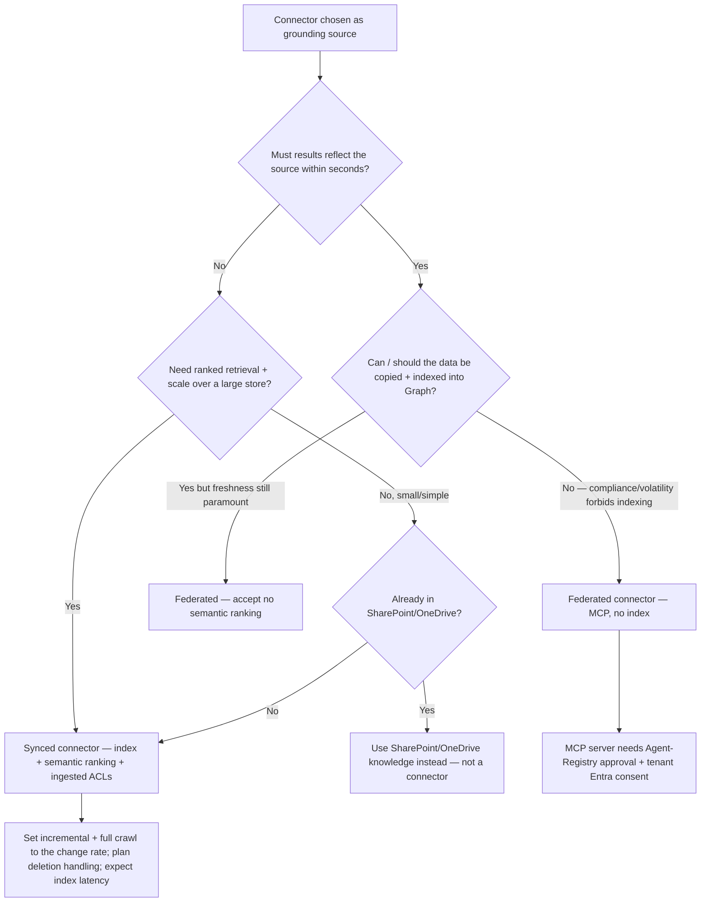
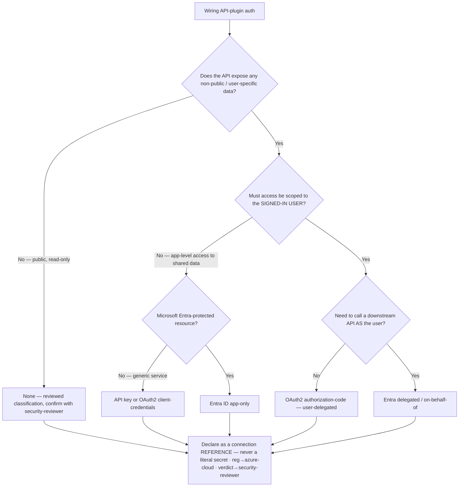
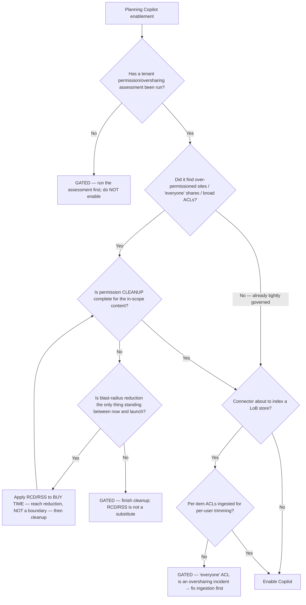

# Copilot extensibility — canonical decision trees (2026)

**Last reviewed:** 2026-05-30
**Confidence:** High on the branching shapes (first-party framing). `[verify-at-build]` on per-feature GA/preview status, schema version numbers, and the GCC-High caveats — the surface ships ~monthly.
**Read when:** an agent must pick a build path, grounding source, connector mode, plugin-auth scheme, or whether oversharing remediation gates launch — and you want to traverse before committing rather than keyword-matching.

> **Decision-tree traversal (priors).** When the user's situation matches a tree's **When this applies** entry condition, traverse the Mermaid graph top-to-bottom before selecting a method. Do NOT pattern-match on keywords in the user's description. The first branch where the condition resolves cleanly is the leaf to apply. The two trees that already live in [`agent-platform-decision-2026.md`](agent-platform-decision-2026.md) (platform) and [`grounding-source-decision-2026.md`](grounding-source-decision-2026.md) (grounding source) are the canonical references for those two questions; the trees below are *new* canonical sections and don't replace them — they go deeper on the connector mode, the plugin-auth scheme, and the launch-gate questions, and re-state the platform/grounding entry points only where a new branch needs them.

---

## Decision Tree: Build path — declarative vs custom-engine vs Copilot-Studio (deep cut)

**When this applies:** Someone asks "how should I extend Copilot for X?" / "declarative or custom-engine?" / the design seems to need iteration, proactivity, an off-M365 channel, or a non-Copilot model. (The summary tree is in [`agent-platform-decision-2026.md`](agent-platform-decision-2026.md); this adds the Foundry/Teams-SDK leaves and the seam routing.)

**Last verified:** 2026-05-30 against the Microsoft Learn custom-engine-agent overview (Copilot Studio / Teams AI / Agents SDK / Foundry comparison).

**Rationale per leaf:**
- *Copilot Studio (CS)* — low-code/Dataverse is a different product surface; this plugin doesn't own it.
- *Declarative agent (DA)* — no loop, fits the wall: cheapest, no hosting, inherits M365 compliance. The default.
- *Teams SDK* — Teams-only collaborative scenario with a built-in Action Planner orchestrator; lighter than the full Agents SDK.
- *M365 Agents SDK (SDK)* — needs BYO model/orchestrator and/or multi-channel reach (10+ channels); the full pro-code CEA.
- *Foundry (FND)* — AI logic already lives in Foundry; publish to Copilot directly (auto-provisions Bot Service + Entra) or wire via an `atk` proxy for custom logic/SSO.

**Tradeoffs summary table:**

| Leaf | Hosting/ops cost | Channels | Orchestrator/model | requires | Use when |
|---|---|---|---|---|---|
| Declarative agent | none (Copilot hosts) | M365 Copilot (+ SharePoint) | Copilot's | Copilot license; fits the wall | scoped grounded Q&A/assist, no loop |
| Teams SDK | yours (host) | Teams, M365 Copilot | built-in Action Planner | host + Entra (→azure-cloud) | Teams-only collaborative agent |
| M365 Agents SDK | yours (host) | 10+ (Copilot/Teams/web/SMS/…) | BYO (Semantic Kernel/LangChain/…) | engine→claude-app-eng; host→azure-cloud | iterative/proactive/multi-channel/BYO model |
| Foundry | yours (Foundry) | Copilot + Teams (others custom) | Foundry/BYO | Foundry; host residency→azure-cloud | AI logic already in Foundry |

---

## Decision Tree: Grounding source — connector vs API plugin vs SharePoint/knowledge (deep cut)

**When this applies:** A declarative or custom-engine agent needs to ground on data and you must pick the source. (Summary tree in [`grounding-source-decision-2026.md`](grounding-source-decision-2026.md); this adds the embedded-knowledge and Retrieval-API leaves and the ACL gate.)

**Last verified:** 2026-05-30 against the Microsoft Learn knowledge-sources + Copilot-connectors + plugins pages.

**Rationale per leaf:**
- *API plugin (API)* — a write/transaction/live-action is an *action*, not retrieval; only a plugin can do it.
- *SharePoint/OneDrive knowledge (SP)* — content already permission-governed in SharePoint; cheapest to reach, license-gated.
- *Embedded knowledge (EMB)* — a handful of files travels *in* the agent package; `sensitivity_label` (v1.6+) applies only here.
- *Federated/MCP (FED)* — real-time, no index; freshness over scale; ACLs per the source. GA status `[verify-at-build]`.
- *Synced connector (SYN)* — scale + semantic ranking over a LoB store; honors ingested ACLs → the ACL gate fires before grounding is allowed.

**Tradeoffs summary table:**

| Leaf | Freshness | Honors ACLs | Scale/rank | requires | Use when |
|---|---|---|---|---|---|
| API plugin | real-time | per the API auth | n/a (action) | plugin auth (→azure-cloud/security-reviewer) | write/transaction/live fetch |
| SharePoint knowledge | near-real-time | yes (SP perms) | SP search | Copilot license | content already in SharePoint/OneDrive |
| Embedded knowledge | static (packaged) | n/a (in package) | small | v1.6+; `sensitivity_label` if files | a few bundled reference files |
| Federated (MCP) | real-time | per source | no index | MCP server consent (Agent Registry) | freshness over scale; can't index |
| Synced connector | crawl/index latency | yes (ingested ACLs) | yes | connector quota; ACL design→security-reviewer | ranked scale over a LoB store |

---

## Decision Tree: Connector mode — synced vs federated/MCP

**When this applies:** A connector is the chosen grounding source and you must pick how it gets data to Copilot — observable signals: the source changes by the second (trading, inventory), or it's a large store needing ranked retrieval, or it can't be copied/indexed for compliance.

**Last verified:** 2026-05-30 against the Microsoft Learn Copilot-connectors overview (synced index-into-Graph vs federated-over-MCP).

**Rationale per leaf:**
- *Synced (SYN)* — only synced gives semantic ranking + scale + ingested-ACL per-user trimming; pay with crawl/index latency.
- *Federated / MCP (FED / FEDOK)* — only federated is truly real-time and never copies the data; pay with no index/ranking and per-source ACLs, plus the MCP consent gate.
- *SharePoint knowledge (SP)* — if the data is already in SharePoint, a connector is redundant; use the knowledge source.

**Tradeoffs summary table:**

| Leaf | Latency | Ranking | ACL model | Crawl | requires |
|---|---|---|---|---|---|
| Synced connector | crawl + semantic-index latency | semantic ranking | ingested ACLs (per-user trim) | 15 min incr / 1 wk full (default; tune) | connector quota; ACL design→security-reviewer |
| Federated (MCP) | real-time | none (no index) | per the source | n/a | MCP server approval + tenant Entra consent |
| SharePoint knowledge | near-real-time | SP search | SP permissions | n/a (already indexed) | Copilot license |

---

## Decision Tree: API-plugin auth scheme — none / API-key / OAuth2 / Entra

**When this applies:** An API plugin is being wired and you must choose how it authenticates — observable signals: the API serves per-user data, or it's public/read-only, or it's a server-to-server backend, or it must call a downstream API as the user.

**Last verified:** 2026-05-30 against the Microsoft Learn Copilot plugin-auth scheme table (None / Basic / ApiKey / ServiceHttp / OAuth auth-code / OAuth client-creds / Entra app-only / Entra delegated).

**Rationale per leaf:**
- *None* — only for genuinely public, read-only, no-user-data APIs; a reviewed decision, not a default.
- *API key / client-credentials (KEYCC)* — server-to-server or key-authenticated service with no per-user authorization need.
- *Entra app-only (ENTRAAPP)* — the app acts as itself against an Entra-protected resource; no user context.
- *OAuth2 auth-code (AUTHCODE)* — the usual choice for line-of-business data: the backend authorizes per the signed-in user.
- *Entra delegated/OBO (OBO)* — the plugin must call a *downstream* API carrying the user's identity.

**Tradeoffs summary table:**

| Leaf | Identity carried | Per-user authz | Secret location | requires |
|---|---|---|---|---|
| None | anonymous | no | n/a | reviewed public-data classification (security-reviewer) |
| API key / client-creds | app / shared secret | no | registered connection, NOT manifest | connection registration (azure-cloud) |
| Entra app-only | the app | no | registration | Entra app reg + admin consent (azure-cloud) |
| OAuth2 auth-code | the user | yes | registration | Entra app reg + consent; verdict→security-reviewer |
| Entra delegated / OBO | user + app | yes (downstream) | registration | app reg + downstream scopes; verdict→security-reviewer |

> **GCC-High:** API-plugin auth is not supported there `[verify-at-build]` — surface on any sovereign-cloud question. Every non-None leaf routes the registration to `azure-cloud` and the verdict to `ravenclaude-core/security-reviewer` (mandatory).

---

## Decision Tree: Does oversharing remediation gate launch?

**When this applies:** A rollout is being planned and you must decide whether Copilot can be enabled now or whether remediation must come first — observable signals: tenant has un-audited "shared with everyone" sites, no sensitivity labels, a connector about to index a LoB store, or no permission review on record.

**Last verified:** 2026-05-30 against the Microsoft Learn restricted-content-discovery + DLP-for-Copilot pages.

**Rationale per leaf:**
- *GATED (no assessment)* — you can't certify safety you never measured; enabling first turns latent oversharing into active discovery (#10).
- *RCD/RSS reduce (REDUCE)* — Restricted Content Discovery / Restricted SharePoint Search buy time for cleanup; they are reach reduction, **never** a security boundary (#9), so they loop back to cleanup, they don't end the gate.
- *GATED (cleanup incomplete)* — permission cleanup is the *real* fix; RCD/RSS and DLP/labels complement it, they don't replace it.
- *GATED (connector ACL)* — a connector indexed with "everyone" ACLs surfaces every item to every user; fix ingestion first (#7).
- *ENABLE* — only when assessed, cleaned (or genuinely already clean), and any connector trims per-user.

**Tradeoffs summary table:**

| Leaf | Gates launch? | Blast radius | Owner | requires |
|---|---|---|---|---|
| No assessment → GATED | yes | unknown (worst case) | copilot-admin-governance | run assessment first |
| RCD/RSS reduce | not on its own — buys time | reduced reach (not a boundary, #9) | copilot-admin-governance | E5/Suite for RSS `[verify-at-build]` |
| Cleanup incomplete → GATED | yes | high until cleaned | copilot-admin-governance + site owners | permission remediation |
| Connector 'everyone' ACL → GATED | yes | every item to every user | graph-connector-engineer + security-reviewer | per-item ACL ingestion |
| ENABLE | no — clear to launch | trimmed per identity | copilot-admin-governance | assessed + cleaned + ACL-trimmed |

> Purview DLP-for-Copilot + sensitivity labels (E5/Suite-gated) sit in the cleanup phase as data-layer complements — they block *processing*, not citation titles/URLs (#11). The sufficiency verdict for any ACL/DLP design is `ravenclaude-core/security-reviewer`'s (mandatory).

---

## The seams (where these trees route out)

- **Copilot Studio low-code / Dataverse** → `power-platform/copilot-studio-engineer`.
- **CEA engine on Claude** → `claude-app-engineering`. **Entra app reg + host** → `azure-cloud`.
- **Connector ACLs / API-plugin auth / prompt-injection over ingested content** → `ravenclaude-core/security-reviewer` (mandatory).
- **Fabric/OneLake as the connector data origin** → `microsoft-fabric`.
- **Cross-domain residency/identity** → `ravenclaude-core/architect` + `azure-cloud`.

## Refresh triggers

- A new DA manifest (v1.7→…) or plugin manifest (v2.4→…) version ships → re-verify version-pinned leaves + capability names.
- Federated/MCP connector, Retrieval API, or Foundry-publish paths change GA/preview status `[verify-at-build]`.
- GCC-High / sovereign-cloud auth-support or Agents-Toolkit-publishing support changes.
- RSS/RCD or DLP-for-Copilot capabilities change (re-verify they remain non-boundaries / processing-only).

## Why these are separate from the existing two trees

The platform tree ([`agent-platform-decision-2026.md`](agent-platform-decision-2026.md)) and grounding tree ([`grounding-source-decision-2026.md`](grounding-source-decision-2026.md)) are the canonical *entry* decisions and stay where they are. This file holds the **deeper** branches an engineer hits *after* those: connector mode, plugin-auth scheme, and the launch-gate — each with ≥3 leaves and a tradeoffs table, per [`../../docs/best-practices/decision-trees-in-knowledge-files.md`](../../docs/best-practices/decision-trees-in-knowledge-files.md). No tooling parses these; agents traverse the same markdown a human reads.
