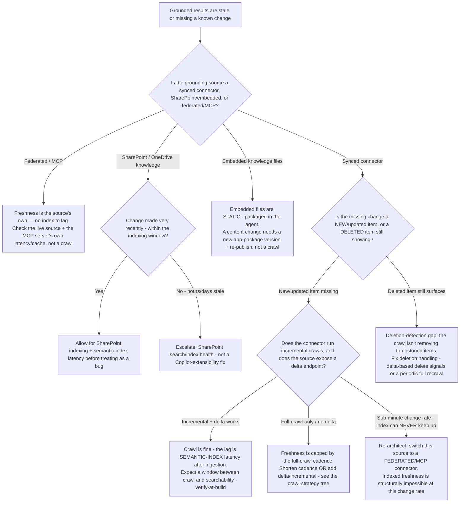

# Grounding-source freshness & staleness — decision trees (2026)

**Last reviewed:** 2026-06-05
**Confidence:** High on the branching shapes (first-party framing). `[verify-at-build]` on the specific crawl-cadence defaults, semantic-index latency windows, and per-feature GA/preview status — the connector surface ships ~monthly.
**Read when:** a grounded agent is returning **stale, missing, or just-changed-but-not-reflected** results, or you must choose a freshness strategy up front for a source whose change rate is the deciding factor. Complements — does not replace — the connector-mode and crawl-strategy trees in [`copilot-extensibility-decision-trees.md`](copilot-extensibility-decision-trees.md) and the grounding-source tree in [`grounding-source-decision-2026.md`](grounding-source-decision-2026.md): those pick *which* source and *which* connector mode; these diagnose *why the data is stale* and route the fix.

> **Decision-tree traversal (priors).** When the user's situation matches a tree's **When this applies** entry condition, traverse the Mermaid graph top-to-bottom against the user's *observable signals* before selecting a fix. Do NOT keyword-match. The first branch that resolves cleanly is the leaf to apply. Default to the smaller-blast-radius leaf (a crawl/config change) before the larger one (re-architect the grounding source). No tooling parses these — agents traverse the same markdown a human reads (per [`../../../docs/best-practices/decision-trees-in-knowledge-files.md`](../../../docs/best-practices/decision-trees-in-knowledge-files.md)).

---

## Decision Tree: Grounded results are stale or just-changed-content isn't reflected — what's the fix?

**When this applies:** A declarative or custom-engine agent grounds on a connector / SharePoint knowledge / embedded files and the answers lag the source — a document was updated/deleted but Copilot still cites the old version, a new item never appears, or results trail the source by minutes/hours/days. Observable signals: a known recent change is missing from results; deleted items still surface; freshness expectation (seconds vs hours) doesn't match what's seen.

**Last verified:** 2026-06-05 against the Microsoft Learn Copilot-connectors crawl + semantic-index documentation and the knowledge-sources overview.

**Rationale per leaf:**
- *Federated/MCP (FED)* — a federated connector has **no index to lag**; "staleness" is either the live source itself or the MCP server's own caching. Don't chase a crawl that doesn't exist.
- *Embedded knowledge (EMB)* — embedded files travel *in* the agent package and are **static**; a content change requires a new package version + re-publish, not a crawl tune. (Discoverable via the grounding-source tree's embedded-knowledge leaf.)
- *SharePoint, recent change (WAIT)* — SharePoint knowledge has its own indexing + semantic-index latency; a just-made change needs a window before it's a bug.
- *SharePoint, persistently stale (ESC)* — hours/days of lag is a SharePoint search/index-health issue, not a Copilot-extensibility config — escalate out of this surface.
- *Deletion gap (DEL)* — a deleted source item still surfacing means the crawl isn't applying delete/tombstone signals; fix deletion handling (delta-based deletes or a periodic full recrawl that re-bases the index).
- *Semantic-index latency (SEMIDX)* — when the crawl is healthy, the residual lag is the gap between ingestion and the item becoming searchable (the semantic index settling). It's expected; size it `[verify-at-build]` against current docs, don't "fix" a non-bug.
- *Cadence-capped (CADENCE)* — full-crawl-only over a source with no delta endpoint caps freshness at the crawl cadence; shorten it or add incremental/delta (route to the crawl-strategy tree in [`copilot-extensibility-decision-trees.md`](copilot-extensibility-decision-trees.md)).
- *Re-architect to federated (REARCH)* — if the source changes sub-minute, **no index can keep up**; the freshness problem is structural and the fix is to switch this source to a federated/MCP connector (route to the connector-mode tree).

**Tradeoffs summary:**

| Leaf | Is it actually a bug? | Blast radius of the fix | Where it routes |
|---|---|---|---|
| Federated/MCP | No — check the live source / MCP cache | small (config / source) | the MCP server + live source |
| Embedded static | No — by design static | medium (new package + re-publish) | declarative-agent-engineer |
| SharePoint recent | No — within indexing window | none (wait) | — |
| SharePoint persistent | Yes — out of scope | escalate | SharePoint search/index health (out of this plugin) |
| Deletion gap | Yes | small/medium (deletion handling, maybe full recrawl) | graph-connector-engineer |
| Semantic-index latency | No — expected window | none | `[verify-at-build]` the window |
| Cadence-capped | Partly — design choice | small (shorten cadence) / medium (add delta) | crawl-strategy tree |
| Re-architect to federated | Yes — structural | large (change connector mode) | connector-mode tree |

> The #1 wasted effort here is treating an **expected latency window** (semantic-index settling, SharePoint indexing) as a bug and re-crawling repeatedly, or treating a **structural** mismatch (sub-minute source on a synced/indexed connector) as a crawl-tuning problem. Diagnose *which* lag you have before touching the crawl. Any connector ACL/schema change made as part of the fix triggers a **full recrawl** and re-approval — and routes the ACL design through `ravenclaude-core/security-reviewer` (mandatory; CLAUDE.md §3 #7).

---

## The seams (where this tree routes out)

- **Which connector mode (synced vs federated)** / **crawl cadence** → the connector-mode + crawl-strategy trees in [`copilot-extensibility-decision-trees.md`](copilot-extensibility-decision-trees.md).
- **Which grounding source at all** → [`grounding-source-decision-2026.md`](grounding-source-decision-2026.md).
- **SharePoint search/index health** (persistent SharePoint-knowledge lag) → out of this plugin's surface; escalate via the Team Lead.
- **Connector ACL / re-ingestion design** → `graph-connector-engineer` + `ravenclaude-core/security-reviewer` (mandatory).
- **Fabric/OneLake as the connector data origin** → `microsoft-fabric`.

## Refresh triggers

- Connector crawl-cadence defaults, delta-endpoint support, or semantic-index latency windows change `[verify-at-build]`.
- Federated/MCP connector freshness/caching behavior changes GA/preview status.
- A new knowledge-source type ships (changes the first branch's options).
