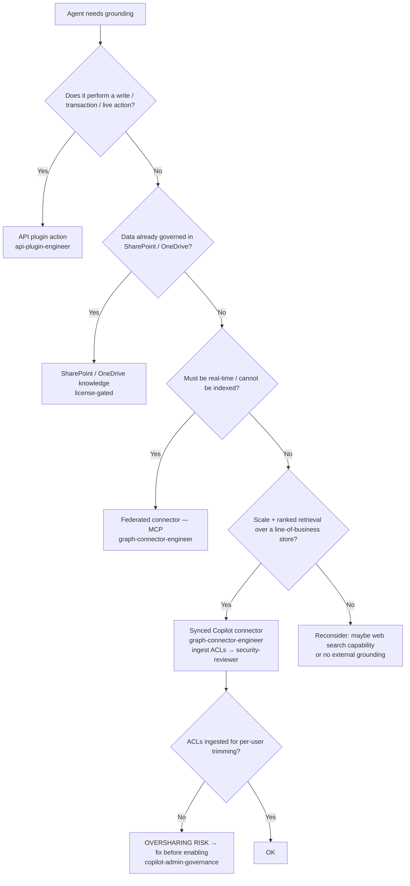

# Grounding-source decision — connector vs SharePoint knowledge vs API plugin (2026)

**Last reviewed:** 2026-05-30
**Confidence:** High on the source taxonomy (first-party). `[verify-at-build]` on item/latency limits + preview features (Copilot Retrieval API, remote SharePoint knowledge).
**Read when:** a declarative (or custom-engine) agent needs grounding and you must pick the source.

---

## The four grounding sources

| Source | Shape | Freshness | Honors ACLs | License gate | Use when |
|---|---|---|---|---|---|
| **Synced Copilot connector** | index into Microsoft Graph, semantic ranking | crawl/refresh latency | **yes** (ingested ACLs, per-user trim) | connector quota / Copilot | scale + ranked retrieval over a line-of-business store |
| **Federated connector (MCP)** | real-time over **MCP**, no index | real-time | per the source | varies | freshness over scale; data that can't/shouldn't be indexed |
| **SharePoint / OneDrive knowledge** | tenant content as knowledge | near-real-time | yes (SharePoint perms) | **license-gated** (Copilot) | content already governed in SharePoint/OneDrive |
| **API plugin (action)** | OpenAPI; real-time fetch *or* transactional action | real-time | per the API auth | Copilot seats | a *fetch* or a *write/transaction* the agent performs |

Grounding: [knowledge sources](https://learn.microsoft.com/microsoft-365/copilot/extensibility/knowledge-sources), [Copilot connectors overview](https://learn.microsoft.com/microsoft-365/copilot/extensibility/overview-copilot-connector), [API plugins](https://learn.microsoft.com/microsoft-365/copilot/extensibility/instructions-api-plugins).

## The license line (mandatory)

**Licensing impact:** every org-data grounding source is gated. SharePoint/OneDrive knowledge and Copilot connectors require Copilot licensing; connectors meter item quotas. State the seat + quota + PAYG impact on every grounding recommendation — house opinion #8. (This doc itself carries the line so the hook is satisfied.)

## Budget note

Synced-connector + API-plugin results land inside the declarative-agent wall — **50 grounding items / 25 plugin-response items / ~4,096 tokens / 45 s**. Design retrieval to **~66%** of the budget; a connector that returns 50 fat items will blow the token budget before ranking helps. See [`declarative-agent-manifest-2026.md`](declarative-agent-manifest-2026.md).

## Decision Tree: Which grounding source?

## Preview-gated (flag the status)

- **Copilot Retrieval API** — preview `[verify-at-build]`; programmatic retrieval over Graph/SharePoint for custom-engine agents.
- **Remote SharePoint knowledge** — preview `[verify-at-build]`.

## The seams
- Connector schema/ACL/crawl internals → `graph-connector-engineer`.
- API-plugin OpenAPI/auth internals → `api-plugin-engineer`.
- The ACL security verdict + prompt-injection over ingested content → `ravenclaude-core/security-reviewer`.
- Fabric/OneLake as the *origin* of connector data → `microsoft-fabric`.

## Refresh triggers
- Copilot Retrieval API / remote SharePoint knowledge change GA/preview status.
- Connector item-quota or wall limits change with a new manifest version.
