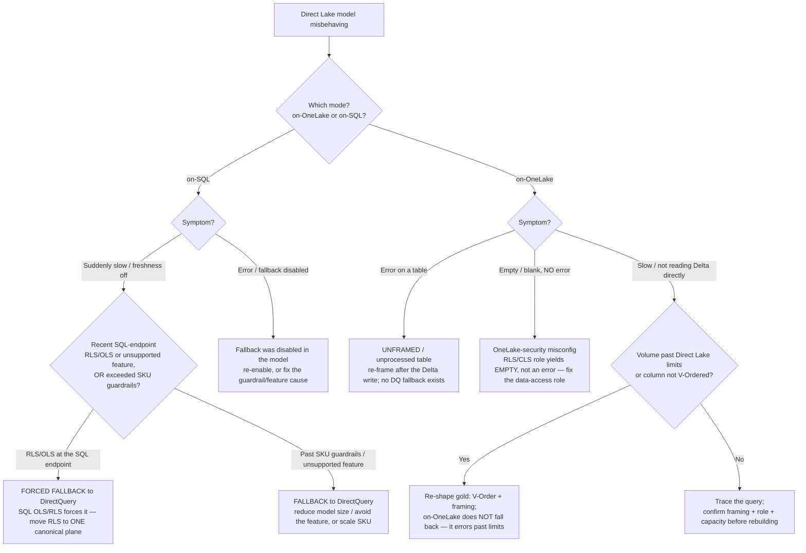
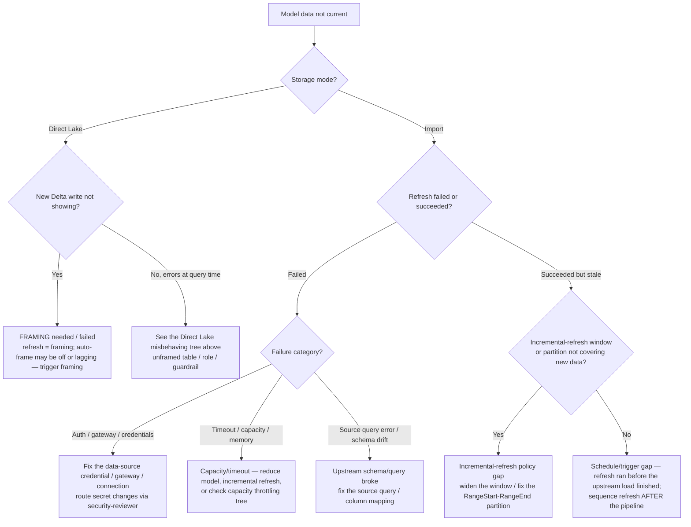

# Direct Lake & semantic-model diagnostic decision trees

**Last reviewed:** 2026-06-05 · **Confidence:** high (first-party Microsoft Learn, retrieved 2026-06-05).
**Owner:** `fabric-semantic-model-engineer` (Direct Lake triage) + `fabric-admin` (refresh/framing operations). Traverse the relevant tree *before* naming a root cause — do **not** keyword-match "Direct Lake is slow" to a fix.
**Source:** linked per tree.

> **Orientation — these are *diagnostic* trees, complementing the *selection* trees in [`fabric-decision-trees.md`](fabric-decision-trees.md).** That file answers "which storage mode / which Direct Lake variant should I choose?" (Direct Lake vs Import vs DirectQuery; on-OneLake vs on-SQL). This file answers the question *after* you've built it: "the model is misbehaving — fall-back, errors, empty visuals, or a failed/stale refresh — what's the root cause?" Added 2026-06-05 to complement the consolidated trees (PR #315) and back the [`../scenarios/2026-06-05-direct-lake-fallback-to-directquery.md`](../scenarios/2026-06-05-direct-lake-fallback-to-directquery.md) field note.

> **Decision-tree traversal (priors).** When a situation matches a tree's *When this applies*, traverse the Mermaid graph top-to-bottom and apply the first leaf whose condition resolves cleanly. **Name the Direct Lake mode (on-OneLake vs on-SQL) before traversing** — the failure taxonomy is mode-specific (house opinion #8; [`../best-practices/name-your-direct-lake-mode.md`](../best-practices/name-your-direct-lake-mode.md)). Re-verify any tree whose **Last verified** date is older than ~90 days (Fabric ships monthly).

---

## Decision Tree: Direct Lake misbehaving — fell back to DirectQuery, errored, or returned empty?

**When this applies:** an existing Direct Lake semantic model has regressed — visuals are suddenly slow (a DirectQuery-fallback signature), throw an error, or return **empty/blank** with no error — and you must find the root cause before "fixing" it (the wrong fix, e.g. "rebuild as Import," trades one problem for two). Observable entry terms: the report worked, nobody changed the *report*, and the regression often correlates with a **security change**, a **schema/load change**, or **data growth**. **First name the mode** — on-OneLake and on-SQL fail *oppositely*.

**Last verified:** 2026-06-05 against Microsoft Learn ([Direct Lake overview](https://learn.microsoft.com/fabric/fundamentals/direct-lake-overview), [How Direct Lake works](https://learn.microsoft.com/fabric/fundamentals/direct-lake-how-it-works), [Direct Lake & DirectQuery fallback](https://learn.microsoft.com/fabric/fundamentals/direct-lake-overview#fallback-behavior)).

**Rationale per leaf:**

- *SQLRLS (the #1 field case)* — **Direct Lake on SQL falls back to DirectQuery**, and **SQL-endpoint OLS/RLS forces that fallback**. A report that "got slow" right after a Warehouse-RLS rollout is almost always this. Fix: pick **one** canonical RLS plane (warehouse **or** semantic model), never both (house opinions #6 + #8). This is the [`../scenarios/2026-06-05-direct-lake-fallback-to-directquery.md`](../scenarios/2026-06-05-direct-lake-fallback-to-directquery.md) case.
- *SQLGUARD* — on-SQL falls back gracefully when the model exceeds SKU guardrails or hits an unsupported feature; reduce model footprint / avoid the feature, or scale the SKU. Slow-but-correct, not broken.
- *SQLERR* — if DirectQuery fallback was *disabled* in the model, the same conditions that would fall back instead **error**. Re-enable fallback or remove the triggering cause.
- *OLUNFRAMED* — **Direct Lake on OneLake has NO DirectQuery fallback.** An unframed/unprocessed table **errors** (it can't silently degrade). Re-frame after the Delta write; framing is the on-OneLake refresh.
- *OLSEC (the silent one)* — on-OneLake, a misconfigured OneLake-security RLS/CLS role yields **empty results, not an error**. "Blank visuals, no error message" on an on-OneLake model points at a data-access role, not a data bug. Escalate to `ravenclaude-core/security-reviewer`.
- *OLSHAPE / OLINVESTIGATE* — on-OneLake past volume limits **errors** (no fallback), so re-shape gold (V-Order + framing) or confirm framing/role/capacity before any rebuild.

**Tradeoffs / symptom→cause summary table:**

| Mode | Symptom | Most likely root cause | First fix |
|---|---|---|---|
| **on-SQL** | suddenly slow, freshness off | SQL-endpoint RLS/OLS forcing DirectQuery | one canonical RLS plane |
| **on-SQL** | slow under load / large model | past SKU guardrails → DQ fallback | shrink model / avoid feature / scale |
| **on-SQL** | hard error | fallback disabled + a fallback trigger | re-enable fallback or remove trigger |
| **on-OneLake** | error on a table | unframed/unprocessed table (no fallback) | re-frame after the Delta write |
| **on-OneLake** | **empty/blank, no error** | OneLake-security role misconfig | fix data-access role (`security-reviewer`) |
| **on-OneLake** | slow / not reading Delta | volume/V-Order shape (errors past limits) | re-shape gold + reframe |

> The load-bearing fact: **on-SQL degrades (falls back / slows), on-OneLake breaks (errors / empties).** Naming the mode is non-optional ([`../best-practices/name-your-direct-lake-mode.md`](../best-practices/name-your-direct-lake-mode.md)). Every data-security verdict escalates to `ravenclaude-core/security-reviewer` (CLAUDE.md §10).

---

## Decision Tree: Semantic-model refresh / framing failed or is stale — what's the root cause?

**When this applies:** a model isn't showing current data — a scheduled refresh failed, succeeded but data is stale, or (Direct Lake) framing didn't pick up a new Delta write. Observable entry terms: a refresh error in the workspace, "the numbers are old," or a Direct Lake model not reflecting an upstream gold reload. The trap is treating every "stale data" as the same fix — Import, Direct Lake, and "succeeded-but-stale" have **different** root causes.

**Last verified:** 2026-06-05 against Microsoft Learn ([Direct Lake & framing](https://learn.microsoft.com/fabric/fundamentals/direct-lake-overview#refresh), [Refresh semantic models](https://learn.microsoft.com/power-bi/connect-data/refresh-data), [Troubleshoot refresh scenarios](https://learn.microsoft.com/power-bi/connect-data/refresh-troubleshooting-refresh-scenarios)).

**Rationale per leaf:**

- *FRAME* — for **Direct Lake**, "refresh" *is* **framing** (a metadata operation pointing the model at the current Delta files — seconds, no data copy). A new gold write not showing means framing hasn't run / lagged; trigger framing (auto or via API/`fab`/Semantic Link).
- *AUTH / CAP / SRC* — the three Import-refresh **failure** families: credential/gateway, capacity/timeout/memory, and upstream query/schema. Each has a distinct fix; don't retry blindly. A capacity/timeout failure cross-references the capacity-throttling tree ([`fabric-decision-trees.md`](fabric-decision-trees.md)); credential changes route through `ravenclaude-core/security-reviewer`.
- *INC* — a refresh that **succeeds but is stale** is usually an **incremental-refresh** window/partition that doesn't cover the new rows (RangeStart/RangeEnd mapping), not a failure.
- *SCHED* — the other "succeeded-but-stale": the refresh **ran before the upstream load finished**. Sequence the refresh *after* the pipeline (orchestrate it as a pipeline step / trigger on completion), don't race it on a fixed clock.

**Tradeoffs / symptom→cause summary table:**

| Mode | Symptom | Root cause | First fix |
|---|---|---|---|
| **Direct Lake** | new Delta write not showing | framing hasn't run / lagged | trigger framing (refresh = framing) |
| **Import** | refresh **failed** (auth) | credential/gateway/connection | fix data source (`security-reviewer` for secrets) |
| **Import** | refresh **failed** (timeout) | capacity/memory/model size | incremental refresh / shrink / check throttling |
| **Import** | refresh **failed** (source) | upstream schema/query drift | fix source query/mapping |
| **Import** | **succeeded but stale** | incremental window/partition gap | widen window / fix RangeStart-RangeEnd |
| **Import** | **succeeded but stale** | refresh raced the upstream load | sequence refresh after the pipeline |

> Direct Lake "refresh" is framing (cheap, metadata); Import refresh copies data (heavy) and has the richer failure taxonomy. A "succeeded but stale" model is a *sequencing or window* problem, not a failure — don't keep re-running it.

---

## Staleness note

Per [`../../../docs/best-practices/decision-trees-in-knowledge-files.md`](../../../docs/best-practices/decision-trees-in-knowledge-files.md), each tree's **Last verified** date is the anti-staleness backstop; the Researcher sweep re-verifies any tree older than ~90 days. Direct Lake variants, framing behavior, and incremental-refresh mechanics ship monthly — re-confirm against [What's new in Fabric](https://learn.microsoft.com/fabric/fundamentals/whats-new) before quoting to a client (house opinion #9). Freshness anchor: [`fabric-2026-capability-map.md`](fabric-2026-capability-map.md). Selection-side companions live in [`fabric-decision-trees.md`](fabric-decision-trees.md); the canonical mode/security/refresh references are [`direct-lake-and-semantic-models.md`](direct-lake-and-semantic-models.md) and [`onelake-security-and-governance.md`](onelake-security-and-governance.md).
