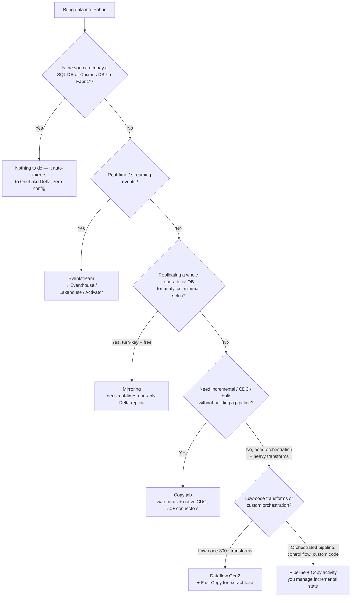
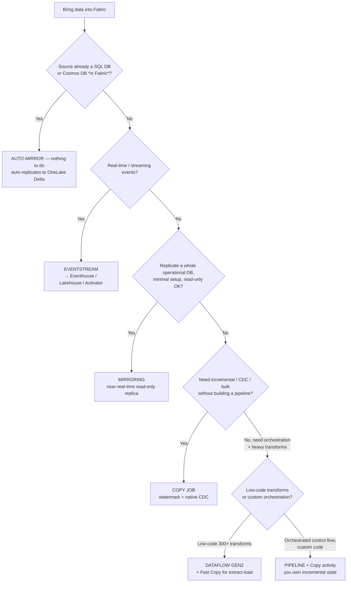
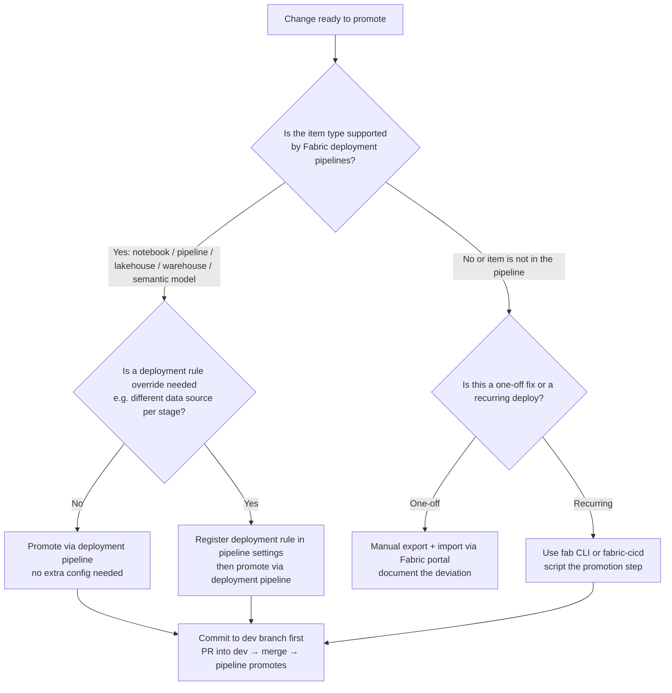
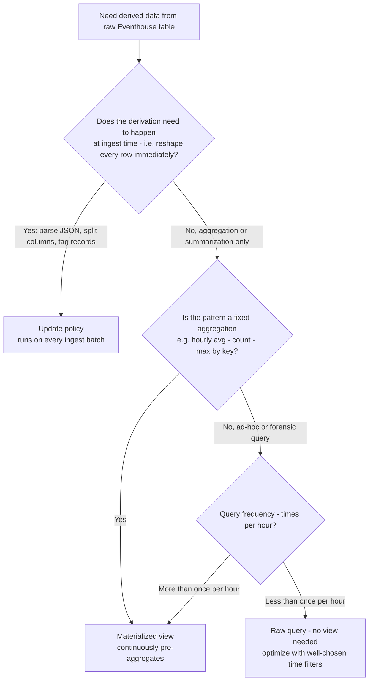
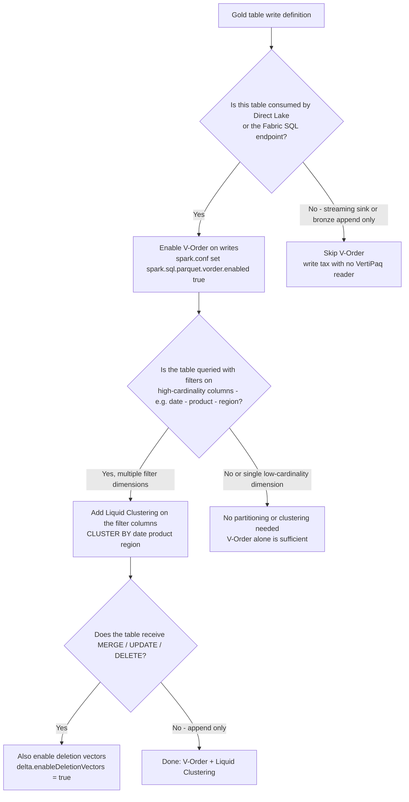

# Decision tree: how to get data into Fabric?

**Last reviewed:** 2026-05-28 · **Confidence:** high (first-party Microsoft Learn, retrieved 2026-05-28).
**Owner:** `data-factory-engineer` (traverse before recommending an ingestion method).
**Source:** [Choose a data movement strategy](https://learn.microsoft.com/fabric/data-factory/decision-guide-data-movement), [Choose a data integration strategy](https://learn.microsoft.com/fabric/data-factory/decision-guide-data-integration), [Get data into Fabric](https://learn.microsoft.com/fabric/fundamentals/get-data).

---

## Decision Tree: Fabric data movement — how to get a source into Fabric

**When this applies:** you have a named source (an operational SQL/Cosmos DB, a streaming event feed, a file landing in ADLS/S3/GCS, or an in-Fabric store) and must pick *how* the data arrives in OneLake. Observable entry terms: the source type is known, you are choosing between Mirroring / Copy job / pipeline / Eventstream / Dataflow Gen2, and you have not yet committed to one. **Traverse top-to-bottom before naming a method — do NOT keyword-match "real-time" or "CDC" to a method without checking the earlier branches.**

**Last verified:** 2026-05-30 against Microsoft Learn (Fabric Data Factory decision guides, retrieved 2026-05-28; convention re-confirmed 2026-05-30).

**Rationale per leaf:**

- *Auto-mirror* — if the source is **already a SQL DB / Cosmos DB in Fabric**, it replicates itself to OneLake Delta with zero config (HTAP); there is nothing to set up.
- *Eventstream* — the only **no-code low-latency streaming** path; also does CDC initial-snapshot and content-based routing to Eventhouse / Lakehouse / Activator.
- *Mirroring* — turn-key **near-real-time read-only Delta replica** of an *external* operational DB; **free to replicate, billed to query**, single read-only destination.
- *Copy job* — fills the gap between Mirroring (too simple) and pipelines (too much to manage): native **incremental + CDC**, 50+ connectors, no pipeline scaffolding.
- *Dataflow Gen2* — **low-code 300+ transforms** with Fast Copy for extract-load; the analyst-led path. Fast Copy is 13–21× faster but only on folding-friendly extract-load steps.
- *Pipeline* — **orchestration**: `ForEach` / `Lookup` / notebook / SQL / Dataflow activities, schedule or event triggers; you own incremental state via watermark + control table.

**Tradeoffs summary table:**

| Method | Copies data? | CDC | Incremental | Cost | Use when |
|---|---|---|---|---|---|
| **Auto-mirror** | Yes, zero-config | Yes | continuous | CU-billed query, replicate-free | Source is a SQL/Cosmos DB already in Fabric |
| **Mirroring** | Yes, read-only replica | Yes | — | **free to replicate, billed to query** | Replicate an external operational DB, minimal setup |
| **Eventstream** | continuous | Yes (snapshot) | — (continuous) | billed | Real-time / streaming / event-driven |
| **Copy job** | Yes | Yes | Yes (watermark) | billed | Incremental / CDC / bulk, no pipeline to build |
| **Dataflow Gen2** | Yes | — | — | billed | Low-code transforms (300+) + Fast Copy ingest |
| **Pipeline** | Yes | — | manual (control table) | billed | Orchestrated ELT, control flow, custom code |

> If the situation matches multiple branches, prefer the **earlier** leaf (less to build, less duplication): shortcut/auto-mirror before mirror before copy job before pipeline.

---

## The comparison

| Method | Use case | Flexibility | CDC | Incremental | Cost |
|---|---|---|---|---|---|
| **Mirroring** | near-real-time replica of an operational DB | fixed, simple | Yes | — | **free to replicate, not free to query** |
| **Copy job** | bulk / incremental / CDC, no pipeline to build | easy + advanced options | Yes | Yes (watermark) | billed |
| **Copy activity (pipeline)** | orchestrated, fully customizable ELT | advanced | — | manual (control table) | billed |
| **Eventstream** | real-time streaming, event-driven, CDC initial snapshot | simple + customizable | Yes | — (continuous) | billed |
| **Dataflow Gen2** | low-code transforms (300+); Fast Copy for extract-load | low-code | — | — | billed |

Sources: [data-movement decision guide table](https://learn.microsoft.com/fabric/data-factory/decision-guide-data-movement#data-movement-decision-guide).

## Sharp edges (state these to the client)

- **Mirroring is "free to replicate, not free to query."** Replication compute + storage are free only up to a CU-based allowance (~1 TB free per CU; F64 ≈ 64 TB); beyond that or when the capacity is paused, OneLake storage is billed. **Query compute is always billed at normal rates**, and cross-region sources incur egress. Mirroring writes a **single read-only** Delta destination. Source: [Data Factory overview](https://learn.microsoft.com/fabric/data-factory/data-factory-overview).
- **Dataflow Gen2 Fast Copy** is up to **13-21× faster** than Gen1 because it bypasses the mashup engine — but only for extract-load steps that meet the [Fast Copy prerequisites](https://learn.microsoft.com/fabric/data-factory/dataflows-gen2-fast-copy); any folding-breaking transform falls back to the standard engine. Treat Fast Copy as the *default for ingestion*; reserve heavy reshaping for notebooks/Spark. Source: [dataflow strategy benchmarks](https://learn.microsoft.com/fabric/data-factory/decision-guide-data-transformation).
- **Copy job** fills the gap between Mirroring (too simple) and pipelines (too much to manage): native incremental + CDC, no pipeline scaffolding.
- **Pipelines** orchestrate everything else: `ForEach`, `Lookup`, notebook/SQL/Dataflow activities, schedule or event triggers; you own incremental state via watermark expressions + control tables.
- **Eventstream** is the only no-code path for low-latency streaming; it can also do CDC initial-snapshot replication and content-based routing to Eventhouse / Lakehouse / Activator. See [`../knowledge/fabric-2026-capability-map.md`](fabric-2026-capability-map.md).

> House-opinion link: **#1 shortcut-first** (if you only need to read it, shortcut beats any copy) and **#5 capacity is shared** (ingestion is a background CU consumer — schedule heavy loads with smoothing in mind).

---

## Decision Tree: Fabric ALM — which promotion path for this workspace change?

**When this applies:** A developer has made a change to a Fabric workspace item (notebook, pipeline, lakehouse table definition, semantic model) and must decide how to promote it to test and then prod — observable at the point of committing a change and deciding whether to use a deployment pipeline, a manual export, or a `fab`/`fabric-cicd` CLI script.

**Last verified:** 2026-06-05 against Microsoft Learn Fabric deployment pipelines + fabric-cicd library documentation.

**Rationale per leaf:**
- *Deployment pipeline (no rule)* — the simplest promotion path for supported items with no stage-specific config; one click or one API call.
- *Deployment pipeline + rule* — when data-source bindings, parameters, or connection strings differ per stage, register the override in the pipeline rule before promoting.
- *Manual export/import* — acceptable once for an unsupported item type; becomes a pipeline bug if repeated; document and plan to automate.
- *fab CLI / fabric-cicd* — for unsupported item types or items outside the deployment pipeline, script the promotion using the Fabric REST API or the `fabric-cicd` Python library.

**Tradeoffs summary:**

| Path | Automation | Stage-specific config | Supported items | Use when |
|---|---|---|---|---|
| Deployment pipeline | high | rules | notebooks / pipelines / lakehouses / warehouses / models | standard item types, team ALM |
| Deployment pipeline + rule | high | explicit overrides | same | source bindings differ per stage |
| Manual portal | none | manual | any | one-off, unsupported type |
| fab CLI / fabric-cicd | scriptable | REST payload | any | unsupported types, advanced CI/CD |

---

## Decision Tree: Eventhouse — update policy vs materialized view vs raw query?

**When this applies:** You have a high-rate raw table in an Eventhouse and must decide how to make derived data available for dashboards and downstream consumers — observable when a KQL query that re-parses or re-aggregates the raw table appears on a dashboard at < 15-minute refresh.

**Last verified:** 2026-06-05 against Microsoft Learn Fabric Real-Time Intelligence materialized-views and update-policies documentation.

**Rationale per leaf:**
- *Update policy* — runs synchronously with ingestion on each micro-batch; the correct tool for schema normalization (parsing JSON, splitting fields, tagging) so the derived table is always in sync with the raw table. Not for aggregations.
- *Materialized view* — the correct tool for recurring fixed aggregations; pre-computes the result set continuously so dashboard queries hit a small result, not the full raw table.
- *Raw query* — acceptable for ad-hoc or rare queries; always use a bounded time filter to limit scan scope.

**Tradeoffs summary:**

| Leaf | When to use | Query cost | Freshness | Watch-out |
|---|---|---|---|---|
| Update policy | row-level reshape at ingest | low (pre-shaped) | real-time | adds ingest latency; keep logic simple |
| Materialized view | fixed recurring aggregation | very low | near-real-time | materialization lag; backfill on creation |
| Raw query | ad-hoc / rare | high (full scan) | real-time | add time filter or cache in dashboard |

---

## Decision Tree: Lakehouse gold-table shape — V-Order, Liquid Clustering, or both?

**When this applies:** You are finalizing a gold Delta table that will be consumed by Direct Lake or the SQL endpoint, and must decide which write-time optimizations to apply — observable when defining the CREATE TABLE statement or the final MERGE/write in the notebook.

**Last verified:** 2026-06-05 against Microsoft Learn Fabric V-Order and Liquid Clustering documentation + CLAUDE.md house opinions #4 and #12.

**Rationale per leaf:**
- *V-Order* — mandatory for Direct Lake / SQL endpoint consumers; VertiPaq reads V-Ordered files significantly faster; there is no reason to skip it on gold.
- *No V-Order (bronze/streaming)* — bronze is append-only and never read by VertiPaq; the write overhead is not paid back.
- *Liquid Clustering* — file-skipping for multi-dimension filters without partition explosion; the default for silver/gold with multi-column query patterns.
- *No partitioning* — for small tables or single-dimension patterns, V-Order alone is sufficient and partitioning adds overhead.
- *Deletion vectors* — add when the table also receives DML to avoid full-file rewrites; pairs cleanly with Liquid Clustering.

**Tradeoffs summary:**

| Configuration | Write overhead | Query benefit | Use when |
|---|---|---|---|
| V-Order only | low | Direct Lake / SQL speed | gold, append-mostly, single filter dim |
| V-Order + Liquid Clustering | moderate | file skipping, multi-dim | gold, multi-column filters |
| V-Order + LC + Deletion Vectors | moderate | DML without rewrite | gold, merge-heavy SCD patterns |
| No optimization (bronze) | none | n/a | append-only bronze / streaming sink |
