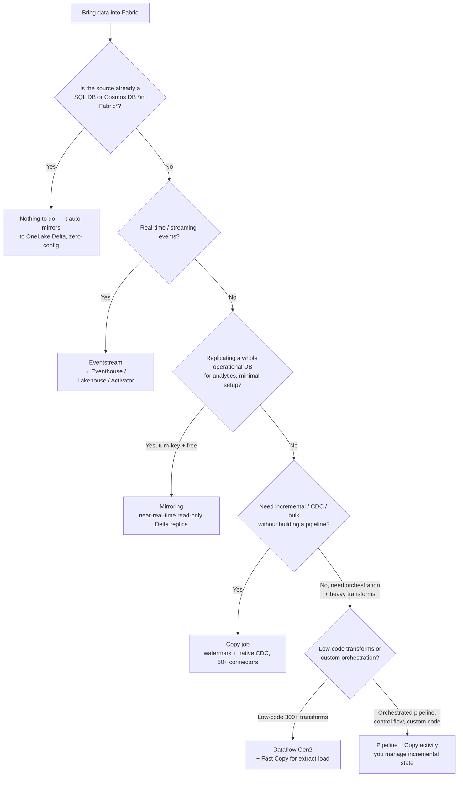

# Decision tree: how to get data into Fabric?

**Last reviewed:** 2026-05-28 · **Confidence:** high (first-party Microsoft Learn, retrieved 2026-05-28).
**Owner:** `data-factory-engineer` (traverse before recommending an ingestion method).
**Source:** [Choose a data movement strategy](https://learn.microsoft.com/fabric/data-factory/decision-guide-data-movement), [Choose a data integration strategy](https://learn.microsoft.com/fabric/data-factory/decision-guide-data-integration), [Get data into Fabric](https://learn.microsoft.com/fabric/fundamentals/get-data).

## The comparison

| Method | Use case | Flexibility | CDC | Incremental | Cost |
|---|---|---|---|---|---|
| **Mirroring** | near-real-time replica of an operational DB | fixed, simple | Yes | — | **free to replicate, not free to query** |
| **Copy job** | bulk / incremental / CDC, no pipeline to build | easy + advanced options | Yes | Yes (watermark) | billed |
| **Copy activity (pipeline)** | orchestrated, fully customizable ELT | advanced | — | manual (control table) | billed |
| **Eventstream** | real-time streaming, event-driven, CDC initial snapshot | simple + customizable | Yes | — (continuous) | billed |
| **Dataflow Gen2** | low-code transforms (300+); Fast Copy for extract-load | low-code | — | — | billed |

Sources: [data-movement decision guide table](https://learn.microsoft.com/fabric/data-factory/decision-guide-data-movement#data-movement-decision-guide).

## Sharp edges (state these to the client)

- **Mirroring is "free to replicate, not free to query."** Replication compute + storage are free only up to a CU-based allowance (~1 TB free per CU; F64 ≈ 64 TB); beyond that or when the capacity is paused, OneLake storage is billed. **Query compute is always billed at normal rates**, and cross-region sources incur egress. Mirroring writes a **single read-only** Delta destination. Source: [Data Factory overview](https://learn.microsoft.com/fabric/data-factory/data-factory-overview).
- **Dataflow Gen2 Fast Copy** is up to **13-21× faster** than Gen1 because it bypasses the mashup engine — but only for extract-load steps that meet the [Fast Copy prerequisites](https://learn.microsoft.com/fabric/data-factory/dataflows-gen2-fast-copy); any folding-breaking transform falls back to the standard engine. Treat Fast Copy as the *default for ingestion*; reserve heavy reshaping for notebooks/Spark. Source: [dataflow strategy benchmarks](https://learn.microsoft.com/fabric/data-factory/decision-guide-data-transformation).
- **Copy job** fills the gap between Mirroring (too simple) and pipelines (too much to manage): native incremental + CDC, no pipeline scaffolding.
- **Pipelines** orchestrate everything else: `ForEach`, `Lookup`, notebook/SQL/Dataflow activities, schedule or event triggers; you own incremental state via watermark expressions + control tables.
- **Eventstream** is the only no-code path for low-latency streaming; it can also do CDC initial-snapshot replication and content-based routing to Eventhouse / Lakehouse / Activator. See [`../knowledge/fabric-2026-capability-map.md`](fabric-2026-capability-map.md).

> House-opinion link: **#1 shortcut-first** (if you only need to read it, shortcut beats any copy) and **#5 capacity is shared** (ingestion is a background CU consumer — schedule heavy loads with smoothing in mind).
