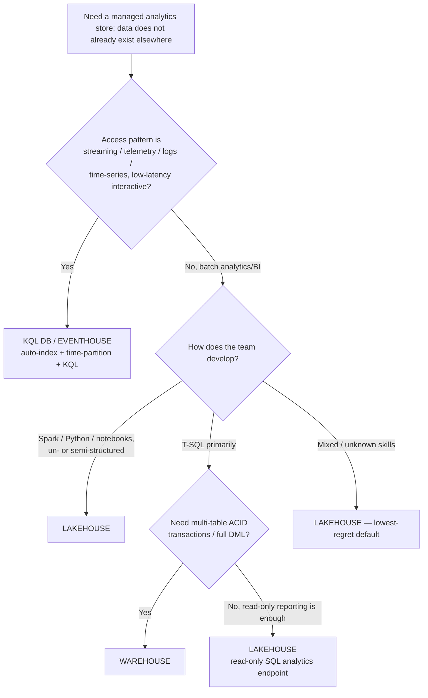
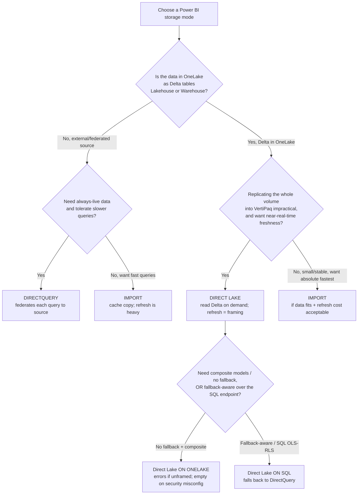
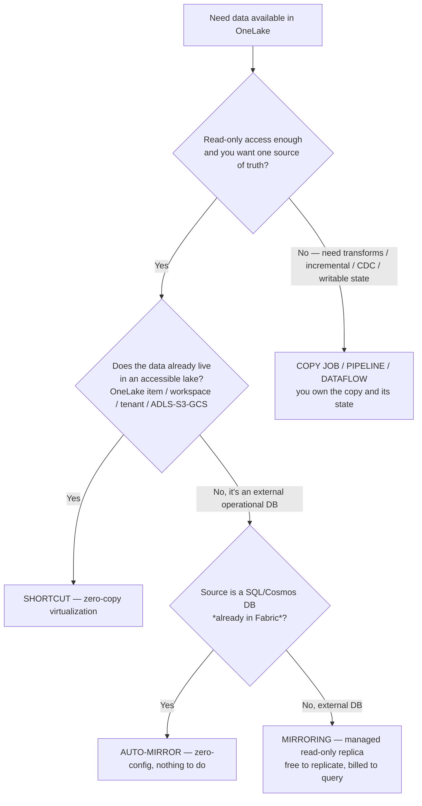
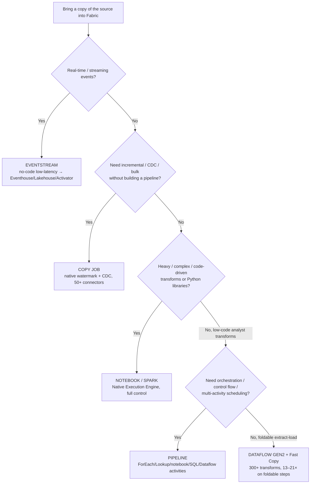
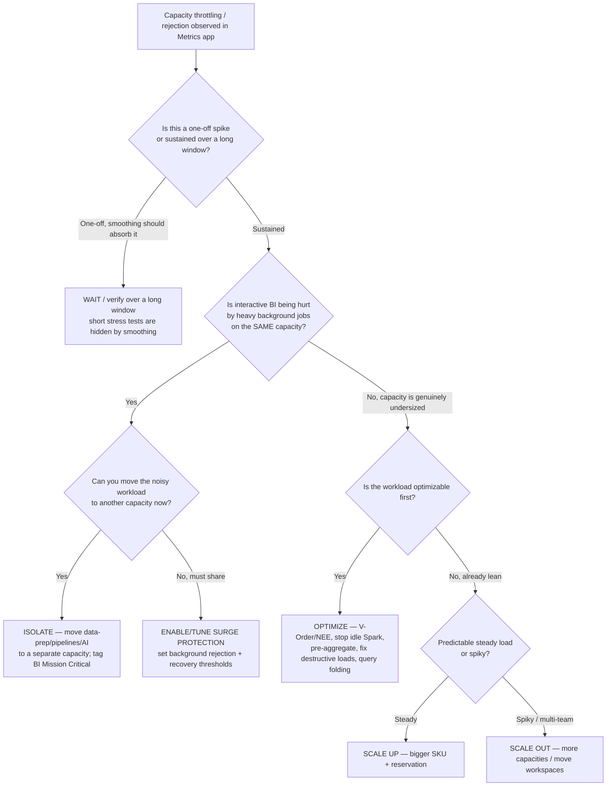
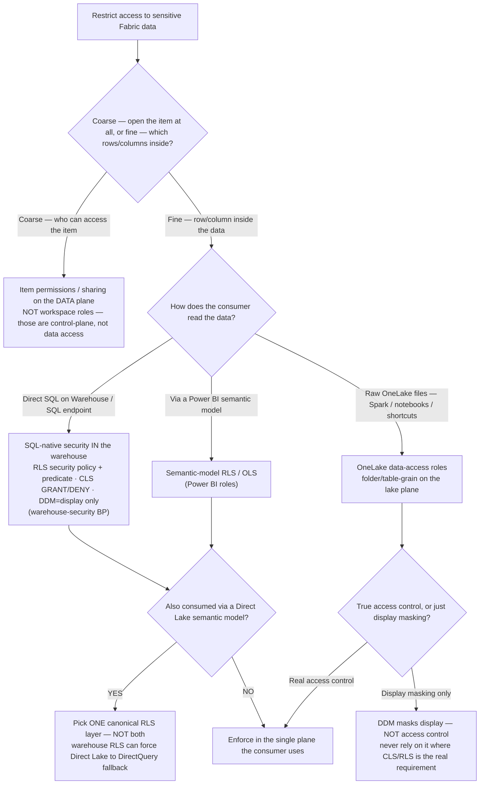

# Fabric decision trees (canonical)

**Last reviewed:** 2026-05-30 · **Confidence:** high (first-party Microsoft Learn, retrieved 2026-05-30).
**Owner:** all agents — traverse the relevant tree *before* naming a store / storage mode / movement method / capacity response. Do **not** keyword-match the user's wording to a leaf.
**Source:** linked per tree. This file holds the canonical `## Decision Tree:` sections (Mermaid + per-leaf rationale + tradeoffs table) per [`../../../docs/best-practices/decision-trees-in-knowledge-files.md`](../../../docs/best-practices/decision-trees-in-knowledge-files.md). The legacy `# Decision tree:` H1 files ([`fabric-store-decision-tree.md`](fabric-store-decision-tree.md), [`fabric-data-movement-decision-tree.md`](fabric-data-movement-decision-tree.md)) keep their own in-file canonical sections; these complement, not replace, them.

> **Decision-tree traversal (priors).** When a situation matches a tree's *When this applies*, traverse the Mermaid graph top-to-bottom and apply the first leaf whose condition resolves cleanly. If multiple branches match, prefer the **earlier** leaf (less to build, less duplication). Re-verify any tree whose **Last verified** date is older than ~90 days.

---

## Decision Tree: Fabric storage engine — Lakehouse vs Warehouse vs KQL DB

**When this applies:** you need a managed analytics store in Fabric and the data does **not** already exist elsewhere (if it does → shortcut; see the store-decision-tree file). Observable entry terms: you are choosing among **Lakehouse**, **Warehouse**, and **Eventhouse/KQL DB**, and you have not yet committed. Do not map the word "SQL" to Warehouse without checking the dev-profile and transaction branches.

**Last verified:** 2026-05-30 against Microsoft Learn ([Choose the right data store](https://learn.microsoft.com/fabric/fundamentals/decision-guide-data-store), [Warehouse vs Lakehouse](https://learn.microsoft.com/fabric/fundamentals/decision-guide-lakehouse-warehouse)).

**Rationale per leaf:**
- *KQL DB / Eventhouse* — purpose-built for data-in-motion: auto-index, time-partition, autoscale, KQL windowing/anomaly in place. Streaming into a lakehouse Delta table fights the format (small-file flood).
- *Lakehouse (Spark)* — Spark/Python over un/semi/structured data; the medallion engine. SQL analytics endpoint is **read-only** (no DML).
- *Warehouse* — full T-SQL with **multi-table ACID** + DML; the SQL-first structured star-schema store.
- *Lakehouse (read-only reporting)* — when the team is T-SQL but only *reads*, the lakehouse SQL endpoint covers it without standing up a Warehouse.
- *Lakehouse (mixed/unknown)* — the lowest-regret default; you can expose curated gold to a Warehouse later (medallion pattern 2).

**Tradeoffs summary table:**

| Store | Dev profile | Multi-table ACID | Engine | Time to value | Pick when |
|---|---|---|---|---|---|
| **KQL DB / Eventhouse** | analyst/engineer (KQL) | n/a | KQL + managed T-SQL endpoint | fast (autoscale) | Streaming, telemetry, logs, time-series |
| **Lakehouse** | data engineer (Spark/Python) | No (read-only SQL endpoint) | Spark + read-only T-SQL | medium | Big data, medallion, mixed/unknown skills |
| **Warehouse** | SQL developer | **Yes** | full T-SQL (DQL/DML/DDL) | medium | Structured star schema, SQL-first, ACID |

> Many teams use Lakehouse **and** Warehouse together (land/transform in Lakehouse, serve gold via Warehouse). When in doubt, default Lakehouse.

---

## Decision Tree: Power BI storage mode — Direct Lake vs Import vs DirectQuery

**When this applies:** you are choosing the **storage mode** for a Power BI semantic model over Fabric data, and must commit before building. Observable entry terms: the data is in OneLake (Lakehouse/Warehouse Delta) or an external source; you are weighing freshness vs query speed vs refresh cost. If Direct Lake is the answer, you **also** name the variant (on-OneLake vs on-SQL) — that is a separate, non-optional decision.

**Last verified:** 2026-05-30 against Microsoft Learn ([Direct Lake overview](https://learn.microsoft.com/fabric/fundamentals/direct-lake-overview), [How Direct Lake works](https://learn.microsoft.com/fabric/fundamentals/direct-lake-how-it-works)).

**Rationale per leaf:**
- *DirectQuery* — source isn't OneLake Delta and data must be always-live; federates each query (slowest, freshest).
- *Import* — fastest queries via a cached VertiPaq copy; stale between refreshes, heavy refresh. Right for small/stable external data or when absolute query speed beats freshness.
- *Direct Lake* — Delta in OneLake + Import-class speed with near-real-time freshness and **no data copy at refresh** (refresh = seconds-long framing). The default for large Fabric-resident models.
- *Direct Lake on OneLake* — reads via OneLake APIs; **no DirectQuery fallback** (unframed → errors; bad security role → empty), supports composite models. The modern default. **requires:** every gold table framed + correct OneLake-security roles.
- *Direct Lake on SQL* — reads via the SQL endpoint; **falls back to DirectQuery** past guardrails or on SQL OLS/RLS. Choose when you want graceful degradation or already enforce SQL-endpoint security.

**Tradeoffs summary table:**

| Mode | Query speed | Freshness | Refresh cost | Fallback behavior | Pick when |
|---|---|---|---|---|---|
| **Import** | fastest | stale between refreshes | heavy (full copy) | n/a | Small/stable data; speed > freshness |
| **DirectQuery** | slowest | always live | none | n/a | External source must be always-live |
| **Direct Lake on OneLake** | Import-class | near-real-time | framing (seconds) | **none — errors/empty** | Large Fabric model, composite, modern default |
| **Direct Lake on SQL** | Import-class | near-real-time | framing (seconds) | **falls back to DQ** | Want graceful degradation / SQL-endpoint security |

---

## Decision Tree: OneLake access — Shortcut vs Copy/Ingest

**When this applies:** you need data available in OneLake for a Fabric workload and must decide whether to **virtualize it in place (shortcut)** or **bring a copy in (ingest)**. Observable entry terms: the data either already exists in an accessible lake (another OneLake item/workspace/tenant, ADLS/S3/GCS) or in an external operational DB, and you have not yet committed to copying.

**Last verified:** 2026-05-30 against Microsoft Learn ([Choose the right data store](https://learn.microsoft.com/fabric/fundamentals/decision-guide-data-store), [Data Factory overview](https://learn.microsoft.com/fabric/data-factory/data-factory-overview)).

**Rationale per leaf:**
- *Shortcut* — data already exists in an accessible lake and you only need to **read** it; virtualize, no copy. Compute bills to the consumer, storage stays with the owner. **First choice** (house opinion #1).
- *Auto-mirror* — source is a **SQL/Cosmos DB in Fabric**; it already replicates itself to OneLake Delta (HTAP) — nothing to set up.
- *Mirroring* — external operational DB you want as a near-real-time read-only Delta replica; **free to replicate, billed to query**, cross-region egress applies.
- *Copy job / Pipeline / Dataflow* — you need transforms, incremental/CDC, or writable state; a shortcut is read-through, not an ELT engine (see the data-movement tree for which one).

**Tradeoffs summary table:**

| Option | Copies data? | Single source of truth? | Cost shape | Use when |
|---|---|---|---|---|
| **Shortcut** | No | Yes | compute to consumer, storage to owner | Read-only, data already in an accessible lake |
| **Auto-mirror** | Yes, zero-config | replica | replicate-free, query-billed | Source is SQL/Cosmos DB already in Fabric |
| **Mirroring** | Yes, managed replica | replica | **free to replicate, billed to query** + egress | External operational DB, minimal setup |
| **Copy/ingest** | Yes, you own state | new copy | billed | Transforms / incremental / CDC / writable |

> Prefer the **earliest** matching leaf: shortcut → auto-mirror → mirror → copy/ingest.

---

## Decision Tree: Ingestion method — Pipeline vs Dataflow vs Notebook vs Eventstream

**When this applies:** you've decided to **bring a copy in** (the Copy/ingest leaf above) and must pick *how*. Observable entry terms: a named source (operational DB, streaming feed, files), known transform needs, and a choice among **Eventstream / Copy job / Dataflow Gen2 / Pipeline / Notebook**. Do not keyword-match "real-time" or "CDC" to a method without checking the earlier branches.

**Last verified:** 2026-05-30 against Microsoft Learn ([Choose a data movement strategy](https://learn.microsoft.com/fabric/data-factory/decision-guide-data-movement), [Choose a data transformation strategy](https://learn.microsoft.com/fabric/data-factory/decision-guide-data-transformation)).

**Rationale per leaf:**
- *Eventstream* — the only no-code low-latency streaming path; also CDC initial-snapshot + content routing.
- *Copy job* — fills the gap between Mirroring (too simple) and pipelines (too much to manage): native incremental + CDC, no scaffolding.
- *Notebook / Spark* — heavy/complex/code-driven reshaping or Python libraries; full control with the Native Execution Engine (house opinion #11; not autotune). **requires:** Spark/lakehouse-engineer skills.
- *Pipeline* — orchestration: control flow, multi-activity, triggers; you own incremental state via watermark + control table.
- *Dataflow Gen2 + Fast Copy* — low-code analyst-led foldable extract-load; Fast Copy is 13–21× faster on folding-friendly steps but **falls back to the mashup engine** on any folding-breaking transform — so keep heavy reshaping in Spark.

**Tradeoffs summary table:**

| Method | Skill | CDC / incremental | Transform depth | Cost note | Use when |
|---|---|---|---|---|---|
| **Eventstream** | analyst | continuous (CDC snapshot) | light routing | billed | Real-time / streaming |
| **Copy job** | analyst/engineer | **Yes (watermark + CDC)** | none | billed | Incremental/CDC, no pipeline to build |
| **Notebook / Spark** | data engineer | manual | heavy/custom | billed; NEE for efficiency | Complex reshaping, Python libs |
| **Pipeline** | data engineer | manual (control table) | via activities | billed | Orchestration, control flow |
| **Dataflow Gen2** | analyst | — | low-code (300+); folding for Fast Copy | billed; Fast Copy fast on foldable | Analyst-led foldable extract-load |

> Prefer the **earlier**/lower-ceremony leaf when several match; reserve pipelines for genuine orchestration and notebooks for genuinely heavy transforms.

---

## Decision Tree: Capacity is throttled — what do I do right now?

**When this applies:** a capacity is showing throttling/rejection **now** — observable via the Fabric Capacity Metrics app: interactive delay, interactive rejection, or background rejection above limits; users report slow or failed reports; a state event shows `Overloaded / AllRejected` or `…SurgeProtectionActive`. You must choose an immediate response and a durable fix.

**Last verified:** 2026-05-30 against Microsoft Learn ([Evaluate and optimize capacity](https://learn.microsoft.com/fabric/enterprise/optimize-capacity), [Surge protection](https://learn.microsoft.com/fabric/enterprise/surge-protection), [Throttling policy](https://learn.microsoft.com/fabric/enterprise/throttling)).

**Rationale per leaf:**
- *Wait/verify* — background smooths over 24h; a short burst often resolves itself. Validate over a long window before acting (don't panic-scale on a 5-minute test).
- *Isolate* — throttling is per-capacity; moving noisy background work off the BI capacity is the real protection for critical interactive users. **requires:** capacity admin + a target capacity.
- *Surge protection* — when they must share, set background-rejection + recovery thresholds (tuned from the Metrics charts) so the capacity rejects *new background* ops before deep throttling. Not a substitute for sizing/isolation; can reject SQL/UI ops billed as background. **requires:** capacity admin.
- *Optimize* — cheapest first move when the workload is wasteful: enable NEE/V-Order, stop idle Spark sessions, pre-aggregate, fix destructive Direct Lake loads, enable query folding.
- *Scale up* — genuinely undersized + steady load → bigger SKU; reserve for the lowest steady cost.
- *Scale out* — spiky or multi-team → spread workspaces across capacities (also enables per-team isolation/admin).

**Tradeoffs summary table:**

| Response | Time to effect | Cost delta | Reversible? | Use when |
|---|---|---|---|---|
| **Wait/verify** | immediate | none | n/a | One-off spike; smoothing should absorb |
| **Optimize** | hours–days | none/negative | yes | Workload is wasteful (no NEE, idle Spark, destructive loads) |
| **Isolate** | minutes–hours | +1 capacity | yes | Background jobs starving interactive BI |
| **Surge protection** | minutes | none | yes | Must share; protect interactive over background |
| **Scale up** | minutes | + (mitigated by reservation) | yes (resize) | Undersized + steady predictable load |
| **Scale out** | hours | + capacities | yes | Spiky/multi-team; want isolation + spread |

> Order of preference: verify → optimize → isolate/surge-protect → scale. Reach for a bigger SKU only after confirming the workload is lean and smoothing isn't already covering the spike. **Capacity overage (preview)** can absorb *rare* spikes without scaling, but it prevents throttling without adding performance — set surge protection to 100% to stop new background jobs while it's on.

---

## Decision Tree: Data security — which plane (and engine) enforces this restriction?

**When this applies:** sensitive data lives in Fabric and you must decide **where** the access restriction is enforced — not _whether_ (assume it's required), but on _which plane and engine_. Observable inputs: is the restriction "can they open the item at all" vs "which rows/columns inside it", and **how the consumer reads the data** (direct SQL on the Warehouse/SQL endpoint · a Power BI semantic model · raw OneLake files via Spark/notebooks/shortcuts). The failure this prevents: enforcing row security in two engines and silently double-filtering — or worse, assuming a workspace role _is_ data security (it is not — house opinion #6).

**Last verified:** 2026-05-30 against [`onelake-security-and-governance.md`](onelake-security-and-governance.md) (the two-plane model + GA/preview matrix) and [`../best-practices/warehouse-security-rls-cls-masking.md`](../best-practices/warehouse-security-rls-cls-masking.md). RLS/CLS/OneLake-data-access-role GA-vs-preview status varies by surface and ships monthly — `[verify-at-build]`; **every data-security verdict escalates to `ravenclaude-core/security-reviewer`** (house rule).

**Rationale per leaf:**

- _PLANE_ — coarse "can they touch the item" is a data-plane permission (item share / OneLake), **not** a workspace role. The two-plane model (house opinion #6) is explicit: workspace roles are administration, not data access; granting Viewer is not a data-security control.
- _SQLNATIVE_ — when end users query the Warehouse/SQL endpoint directly, enforce in the SQL engine: RLS via a security policy + predicate function, CLS via column GRANT/DENY, DDM for display only. This is the `warehouse-security-rls-cls-masking` BP.
- _SEMANTIC_ — when users only ever consume through a Power BI semantic model, model RLS/OLS is the natural canonical layer and the warehouse may not need its own RLS.
- _ONELAKE_ — when Spark/notebooks/shortcuts read raw OneLake files, OneLake data-access roles enforce folder/table-grain security on the lake plane (the SQL engine isn't in the path).
- _ONECANON_ — the load-bearing trap: if the same data is also read via a **Direct Lake** model, enabling warehouse RLS can force the model to **fall back to DirectQuery** (on-SQL mode) or error (on-OneLake mode). Decide one canonical RLS layer (warehouse _or_ semantic model), never silently both (house opinion #8).
- _DDM_ — dynamic data masking obfuscates display; a determined querier can infer values. Never use it as the access control where CLS/RLS is the real requirement.

**Tradeoffs summary table:**

| Plane / engine | Grain | Enforced by | Use when | Trap avoided |
|---|---|---|---|---|
| Item permission (data plane) | whole item | OneLake / sharing | coarse "can they open it" | mistaking a workspace role for data security |
| Warehouse SQL-native (RLS/CLS/DDM) | row / column / display | SQL engine | direct SQL consumers | DDM treated as access control |
| Semantic-model RLS / OLS | row / column (model) | Power BI | model-only consumers | double RLS with the warehouse |
| OneLake data-access roles | folder / table | lake plane | Spark/notebook/shortcut readers | SQL-only thinking on raw-file access |

Plane definitions, the GA/preview matrix, and the "workspace roles ≠ data access" rule are owned by [`onelake-security-and-governance.md`](onelake-security-and-governance.md); this tree routes _which_ plane/engine, that file owns _what each plane is_. Every verdict escalates to `ravenclaude-core/security-reviewer`.

---

## Staleness note

Per [`../../../docs/best-practices/decision-trees-in-knowledge-files.md`](../../../docs/best-practices/decision-trees-in-knowledge-files.md), each tree's **Last verified** date is the anti-staleness backstop; the Researcher sweep re-verifies any tree older than ~90 days. Fabric ships monthly — re-confirm GA/preview-sensitive leaves (Direct Lake variants, capacity overage, RLS-on-Eventhouse) against [What's new in Fabric](https://learn.microsoft.com/fabric/fundamentals/whats-new) before quoting to a client (house opinion #9). See also the freshness anchor [`fabric-2026-capability-map.md`](fabric-2026-capability-map.md).
