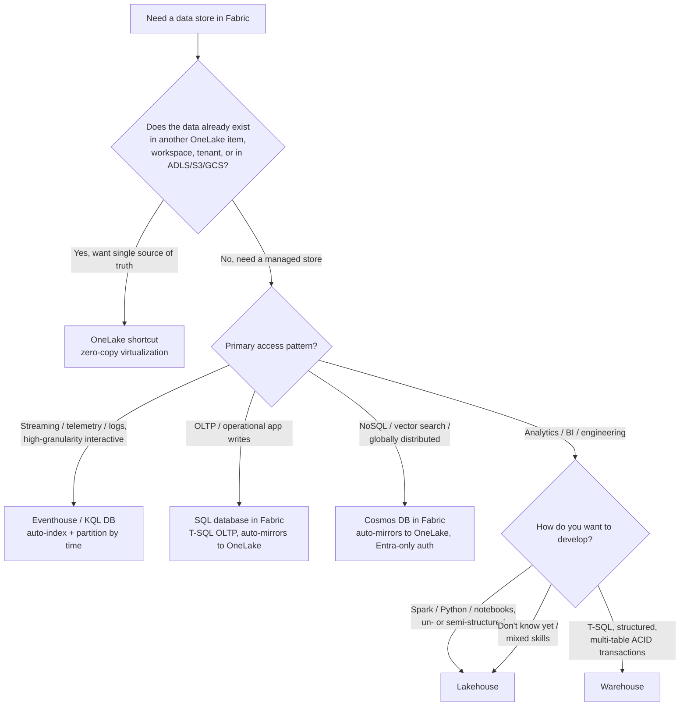
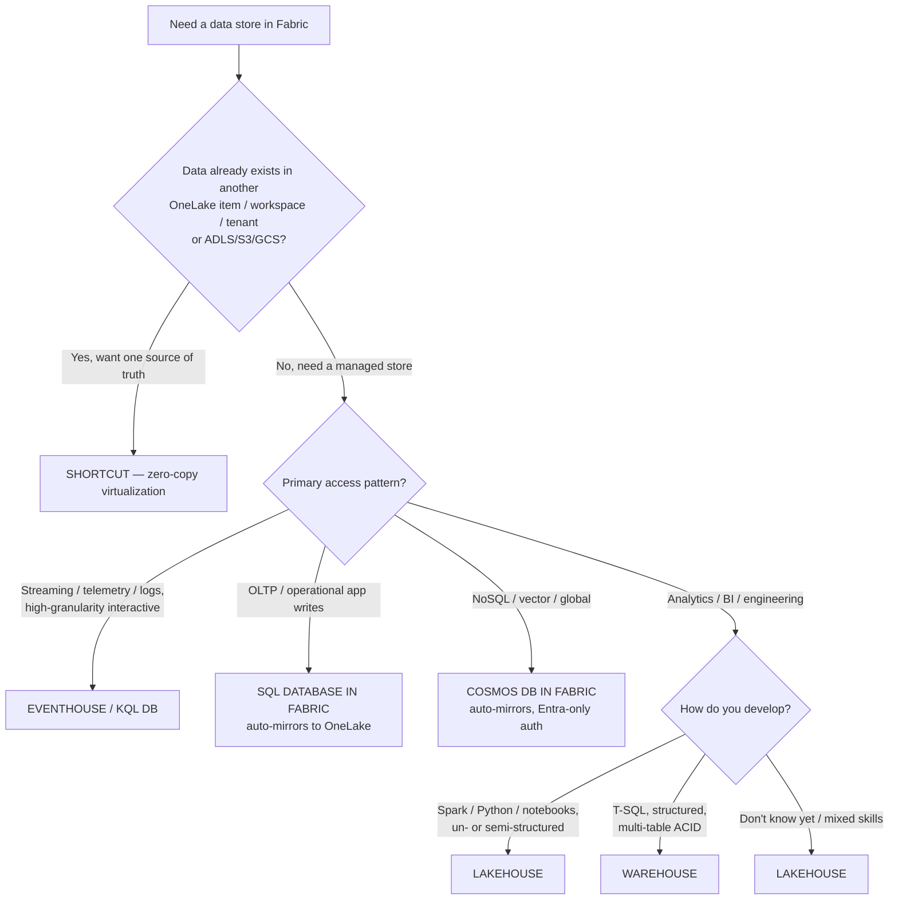

# Decision tree: which Fabric data store?

**Last reviewed:** 2026-05-28 · **Confidence:** high (first-party Microsoft Learn, retrieved 2026-05-28).
**Owner:** `fabric-architect` (traverse this before naming a store — never keyword-match a store to a request).

Every store below keeps **one copy of data in OneLake in open Delta format** by default, so the choice is about the *engine and write pattern*, not about where the bytes live. Source: [Choose the right data store](https://learn.microsoft.com/fabric/fundamentals/decision-guide-data-store), [Warehouse vs Lakehouse](https://learn.microsoft.com/fabric/fundamentals/decision-guide-lakehouse-warehouse).

---

## Decision Tree: Fabric store selection — which store for this workload?

**When this applies:** you need a place to land or serve data in Fabric and must name the store *before* building. Observable entry terms: the data either already exists elsewhere (another OneLake item / workspace / tenant / ADLS/S3/GCS) or doesn't, and you are choosing among Lakehouse / Warehouse / Eventhouse / SQL DB in Fabric / Cosmos DB in Fabric / shortcut. **Traverse top-to-bottom before naming a store — never keyword-match a store to a request (e.g. "SQL" → Warehouse) without checking the access-pattern and dev-profile branches.**

**Last verified:** 2026-05-30 against Microsoft Learn (Fabric "Choose the right data store" + "Warehouse vs Lakehouse" decision guides, retrieved 2026-05-28; convention re-confirmed 2026-05-30).

**Rationale per leaf:**

- *Shortcut* — the data **already exists**; virtualize it for a single source of truth with **no copy** (compute bills to the consumer, storage stays with the owner). House opinion #1: shortcut-first.
- *Eventhouse / KQL DB* — **streaming / telemetry / time-series / logs** with auto-index + time-partition and high-granularity interactive query.
- *SQL database in Fabric* — **OLTP / operational app writes** in T-SQL; auto-mirrors to OneLake Delta for analytics (HTAP), no mirroring to set up.
- *Cosmos DB in Fabric* — **NoSQL / vector search / globally distributed, low-latency**; auto-mirrors to OneLake; CU-billed; Entra-only auth.
- *Lakehouse* — **analytics/engineering with Spark/Python** over un/semi/structured data; the default when the dev profile is unclear or skills are mixed. SQL analytics endpoint is **read-only** T-SQL (no DML).
- *Warehouse* — **structured star-schema, SQL-first team, multi-table ACID**; full T-SQL (DQL/DML/DDL).

**Tradeoffs summary table:**

| Store | Dev profile | Multi-table ACID | Engine | Pick when |
|---|---|---|---|---|
| **Shortcut** | n/a | n/a | virtualization (no copy) | Data already exists elsewhere; want one source of truth |
| **Eventhouse** | analyst / engineer (KQL) | n/a | KQL + managed T-SQL endpoint | Streaming, telemetry, time-series, logs |
| **SQL DB in Fabric** | app developer (T-SQL) | Yes | T-SQL; auto-mirrors to OneLake | OLTP + operational analytics |
| **Cosmos DB in Fabric** | app developer | per-item | NoSQL; auto-mirrors; Entra-only | NoSQL, vector search, low-latency global |
| **Lakehouse** | data engineer (Spark/Python) | No | Spark + read-only SQL endpoint | Big data, medallion, mixed/unknown skills |
| **Warehouse** | SQL developer | **Yes** | full T-SQL | Structured star-schema, SQL-first, multi-table ACID |

> Many teams use **both** Lakehouse and Warehouse: land + transform in a Lakehouse with Spark, expose curated gold to a Warehouse for SQL-first reporting (medallion pattern 2). If the situation matches multiple branches, prefer the **earlier** leaf — shortcut before any managed store.

---

## The criteria table

| Store | Pick when | Dev profile | Multi-table ACID | Engine |
|---|---|---|---|---|
| **Lakehouse** | big data, un/semi/structured, medallion, data engineering | data engineer (Spark/Python) | No | Spark + read-only SQL analytics endpoint |
| **Warehouse** | structured star-schema, enterprise BI/OLAP, SQL-first team | SQL developer | **Yes** | full T-SQL (DQL/DML/DDL) |
| **Eventhouse** | streaming/telemetry, time-series, log analytics | analyst / data engineer (KQL) | n/a | KQL + managed T-SQL endpoint |
| **SQL database in Fabric** | OLTP + operational analytics | app developer (T-SQL) | Yes | T-SQL; **auto-mirrors** to OneLake Delta |
| **Cosmos DB in Fabric** | NoSQL, vector search, low-latency global | app developer | per-item | NoSQL; **auto-mirrors** to OneLake; CU-billed; Entra-only |
| **Shortcut** | data already exists elsewhere | n/a | n/a | virtualization (no copy) |

## Lakehouse vs Warehouse — the recurring call

Both share the same SQL engine and store Delta in OneLake. The decision points (from the [decision guide](https://learn.microsoft.com/fabric/fundamentals/decision-guide-lakehouse-warehouse)):

1. **How do you develop?** Spark → **Lakehouse**. T-SQL → **Warehouse**.
2. **Multi-table transactions?** Yes → **Warehouse**. No → **Lakehouse**.
3. **Data complexity?** Unstructured/mixed or "don't know" → **Lakehouse**. Structured only → **Warehouse**.

The Lakehouse's **SQL analytics endpoint** is *read-only* T-SQL (DQL + limited DDL like views/TVFs, **no DML**). The Warehouse is *full* T-SQL with multi-table transactions. Many teams use **both**: land + transform in a Lakehouse with Spark, expose curated gold to a Warehouse for SQL-first reporting (medallion pattern 2 — see [`medallion-on-onelake.md`](medallion-on-onelake.md)).

## Shortcut vs mirror vs auto-mirror (the "do I copy?" call — `fabric-architect` owns it)

- **Shortcut** — data lives elsewhere (another workspace/tenant, ADLS/S3/GCS); you want a single source of truth with **no copy**. Compute bills to the consuming capacity; storage stays with the owner.
- **Mirroring** — a **near-real-time read-only Delta replica** of an external operational DB (SQL Server, Azure SQL, Snowflake, etc.) in OneLake. **Free to replicate** (up to a CU-based storage allowance — ~1 TB free per CU; F64 ≈ 64 TB), **not free to query**. See [`fabric-data-movement-decision-tree.md`](fabric-data-movement-decision-tree.md).
- **Auto-mirror** — **SQL database in Fabric** and **Cosmos DB in Fabric** replicate themselves into OneLake Delta with **zero configuration** (HTAP), exposing a read-only SQL analytics endpoint. If the operational store is already in Fabric, you don't set up mirroring — it's automatic.

> House-opinion link: **#1 shortcut-first** (reach for a shortcut before copying); **#2 pick the store from this tree, not from habit**.
