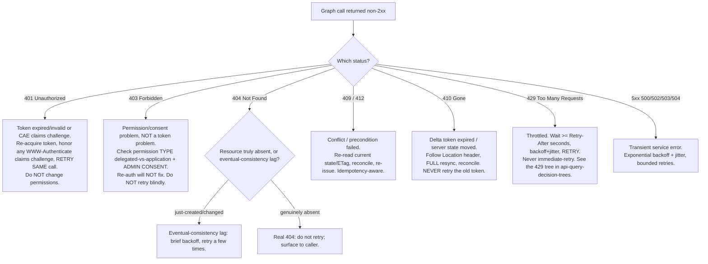

# Microsoft Graph — error & runtime-disposition decision trees

**Last reviewed:** 2026-06-05 · **Confidence:** medium-high (first-party Microsoft Learn). HTTP-status semantics are stable; per-resource token/expiry durations and permission names are volatile — carried with inline markers + per-tree `Last verified` dates; re-verify on the Researcher sweep before quoting.

> Canonical decision trees for **dispositioning a Graph response at runtime** — given an observed HTTP status (or a delta/subscription signal), what is the correct, non-interchangeable action? These complement the *design-time* trees in [`api-query-decision-trees.md`](./api-query-decision-trees.md), [`identity-auth-decision-trees.md`](./identity-auth-decision-trees.md), and [`workloads-notifications-decision-trees.md`](./workloads-notifications-decision-trees.md): those choose the call; **these choose the recovery when a call comes back non-200.** Traverse before writing an error handler — keying off the wrong status (e.g. retrying a `403` or a `410`) is the most common Graph reliability bug.
>
> **The load-bearing principle (mirrors CLAUDE.md §5 + the repo Accuracy rule):** the *specific status* selects the fix and is **not** interchangeable. A `401` (re-auth, then retry the same call) is not a `403` (wrong/absent permission — re-auth will never fix it); a `429` (wait `Retry-After`, retry) is not a `410` (token gone — full resync, never retry the same token). Guessing the cause picks the wrong fix.

---

## Decision Tree: Graph API — disposition a non-2xx response (which status → which action)

**When this applies:** A Graph call returned a non-success status and you must decide the *correct* recovery. Observable: the HTTP status code, the `error.code` in the body, and (for 401) the `WWW-Authenticate` header.

**Last verified:** 2026-06-05 against Microsoft Graph error responses + throttling guidance. `[verify-at-build]` — `error.code` strings and per-resource retry semantics evolve.



**Rationale per leaf (why the status is not interchangeable):**
- **401** — the *token* is the problem (expired, or a Conditional-Access **CAE claims challenge** asking for fresh claims). Re-acquire the token (honoring a `WWW-Authenticate` claims challenge if present) and **retry the same call**. Changing permissions here is wrong — the permission was fine.
- **403** — the *authorization* is the problem: wrong permission **type** (delegated where application was needed or vice-versa), a permission not consented, or admin consent never granted. Re-authenticating produces the same 403. This is the [`app-only-consent-failure`](../scenarios/2026-06-05-app-only-consent-failure.md) trap. Fix the permission/consent, not the token.
- **404** — ambiguous: a *just-created* resource can 404 briefly under eventual consistency (retry a few times), but a genuinely absent resource should **not** be retried. Distinguish before looping.
- **409 / 412** — optimistic-concurrency / precondition: re-read the current state (or `ETag`), reconcile, re-issue. Retrying the *same* stale write repeats the conflict.
- **410** — a **delta** signal, not a generic error: the token is gone; follow the `Location` header to a **full resync** and reconcile. Retrying the expired token always 410s. This is the [`delta-query-410-resync`](../scenarios/2026-06-05-delta-query-410-resync.md) trap.
- **429** — throttled: wait **at least** `Retry-After`, then backoff+jitter retry. An immediate retry restarts the throttle window — the [`throttling-429-retry-after-cascade`](../scenarios/2026-06-05-throttling-429-retry-after-cascade.md) trap.
- **5xx** — transient: bounded exponential backoff + jitter.

**Disposition summary:**

| Status | Root cause | Correct action | Retry the same call? |
|---|---|---|---|
| 401 | token expired / CAE claims challenge | re-acquire token (honor `WWW-Authenticate`), retry | **Yes**, after re-auth |
| 403 | wrong permission type / not consented | fix permission + admin consent | **No** — re-auth won't help |
| 404 | absent OR eventual-consistency lag | retry briefly if just-created; else fail | conditionally |
| 409 / 412 | conflict / precondition (ETag) | re-read, reconcile, re-issue | re-issue reconciled |
| 410 | delta token gone | follow `Location`, full resync, reconcile | **Never** the old token |
| 429 | throttled | wait ≥ `Retry-After`, backoff+jitter | **Yes**, after the wait |
| 5xx | transient service error | bounded backoff + jitter | **Yes**, bounded |

---

## Decision Tree: Graph API — runtime tier: silent failure vs hard failure (is "green" actually healthy?)

**When this applies:** A Graph integration *appears* healthy (no exception, monitoring green) but data has stopped flowing — or you're deciding what to alert on. Observable: whether the failure raises an error at all, and whether a 200 envelope can hide a sub-failure.

**Last verified:** 2026-06-05 against change-notifications, delta-query, and `$batch` guidance. `[verify-at-build]`.

```mermaid
flowchart TD
    START[Integration looks healthy but is it?] --> Q1{What kind of operation?}
    Q1 -->|Change-notification subscription| Q2{Renewal + lifecycle handling present?}
    Q1 -->|"$batch envelope returned 200"| BATCH[200 on the envelope is NOT 200 on sub-requests.<br/>Inspect each responses[] status: a sub-request can be 429/4xx.<br/>Retry only the failed sub-requests by their own Retry-After.]
    Q1 -->|Delta-based mirror| DELTA[A long pause can silently age out the token.<br/>Expect 410 on resume; have a resync branch. Build for replays + consistency lag.]
    Q1 -->|Webhook stream assumed complete| MISSED[Webhooks are best-effort: a notification can be dropped.<br/>Treat 'missed' as a resync-via-delta trigger, not an error.]
    Q2 -->|NO| SILENT[SILENT DEATH: subscription expires with no error.<br/>Green monitoring is NOT proof of life. Add renewal + lifecycleNotificationUrl + delta resync.]
    Q2 -->|YES| OK[Renew before expiry, handle reauthorizationRequired/subscriptionRemoved/missed.]
```

**Rationale per leaf:**
- **Subscription with no renewal** — expiry is **silent**: notifications just stop, no exception is thrown, monitoring stays green. "No error" is not "healthy." Add a renewal loop (PATCH before expiry), a `lifecycleNotificationUrl`, and a delta resync path — the [`subscription-silent-expiry`](../scenarios/2026-06-05-subscription-silent-expiry.md) trap.
- **`$batch` 200 envelope** — the batch *call* succeeded; individual sub-requests carry their **own** status in `responses[]` and can be `429`/`4xx`. Read per-sub-request status and `Retry-After`; retry only the failed ones.
- **Delta mirror** — a long pause ages the token out; plan for `410` on resume (see the disposition tree above), and build for **replays** (same change twice) and **eventual-consistency lag**.
- **Webhook completeness** — notifications are best-effort and can be dropped even on a healthy subscription; a `missed` lifecycle event (or any gap) is a trigger to **resync via delta**, not an error to swallow.

**Disposition summary:**

| Operation | The hidden failure | The guard |
|---|---|---|
| Subscription, no renewal | silent expiry — green ≠ alive | renewal loop + `lifecycleNotificationUrl` + delta resync |
| `$batch` (200 envelope) | sub-request 429/4xx hidden under a 200 | inspect `responses[]`; retry failed sub-requests by their `Retry-After` |
| Delta mirror, long pause | token aged out → 410 on resume | resync branch; build for replays + consistency lag |
| Webhook assumed complete | dropped notification | treat `missed`/gaps as delta-resync triggers |

---

## See also

- [`../../../docs/best-practices/decision-trees-in-knowledge-files.md`](../../../docs/best-practices/decision-trees-in-knowledge-files.md) — the format these trees follow
- [`api-query-decision-trees.md`](./api-query-decision-trees.md) (design-time: poll/delta/batch/429/advanced-query) · [`identity-auth-decision-trees.md`](./identity-auth-decision-trees.md) (permission type / flow / credential / consent) · [`workloads-notifications-decision-trees.md`](./workloads-notifications-decision-trees.md)
- Scenarios these trees disposition: [`throttling-429-retry-after-cascade`](../scenarios/2026-06-05-throttling-429-retry-after-cascade.md), [`app-only-consent-failure`](../scenarios/2026-06-05-app-only-consent-failure.md), [`delta-query-410-resync`](../scenarios/2026-06-05-delta-query-410-resync.md), [`subscription-silent-expiry`](../scenarios/2026-06-05-subscription-silent-expiry.md)
- Sources (retrieved 2026-06-05): [Graph error responses](https://learn.microsoft.com/graph/errors) · [Throttling](https://learn.microsoft.com/graph/throttling) · [Delta query — synchronization reset (410)](https://learn.microsoft.com/graph/delta-query-overview#limitations) · [Change-notification lifecycle events](https://learn.microsoft.com/graph/change-notifications-lifecycle-events) · [Continuous access evaluation / claims challenges](https://learn.microsoft.com/entra/identity-platform/app-resilience-continuous-access-evaluation)
