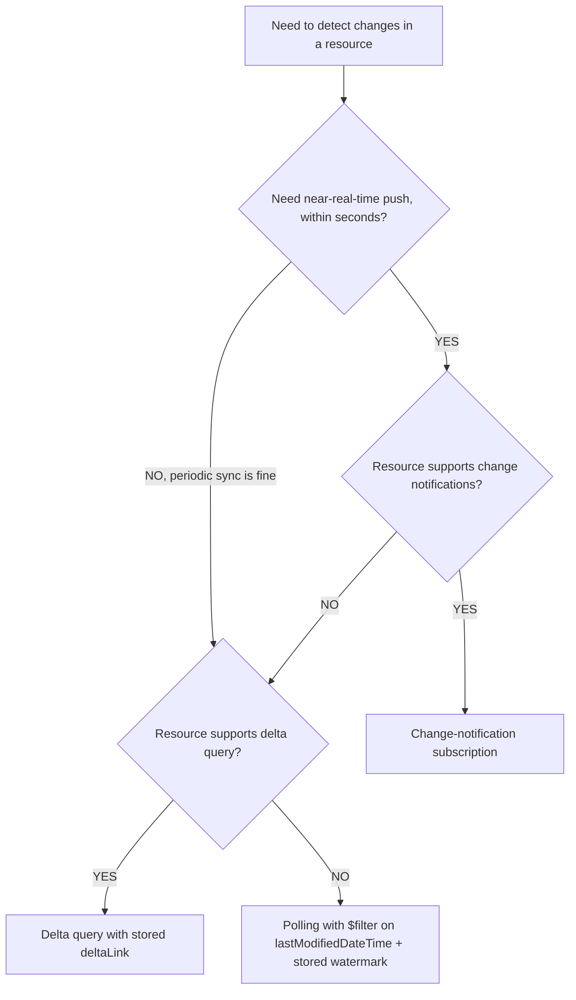
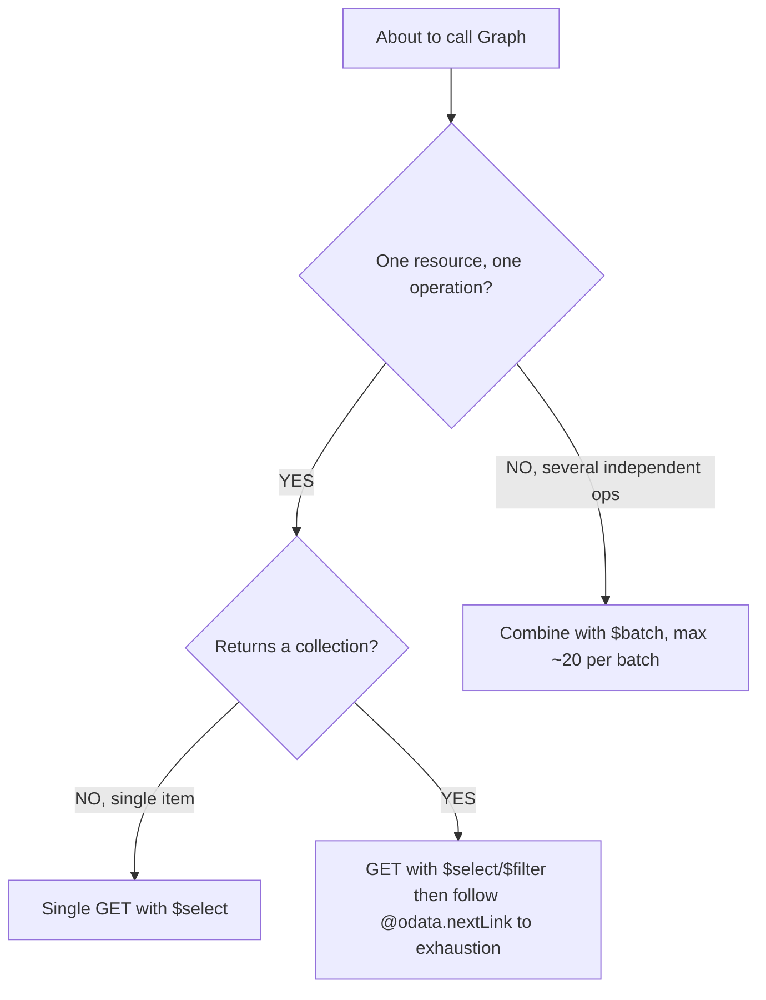
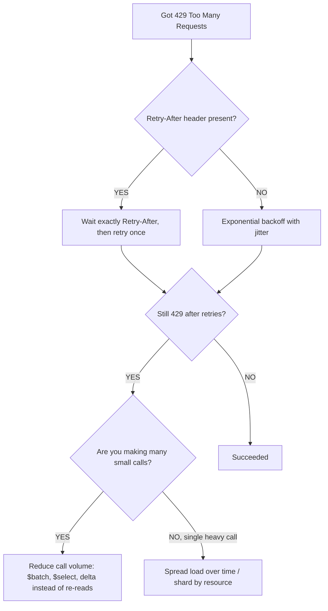
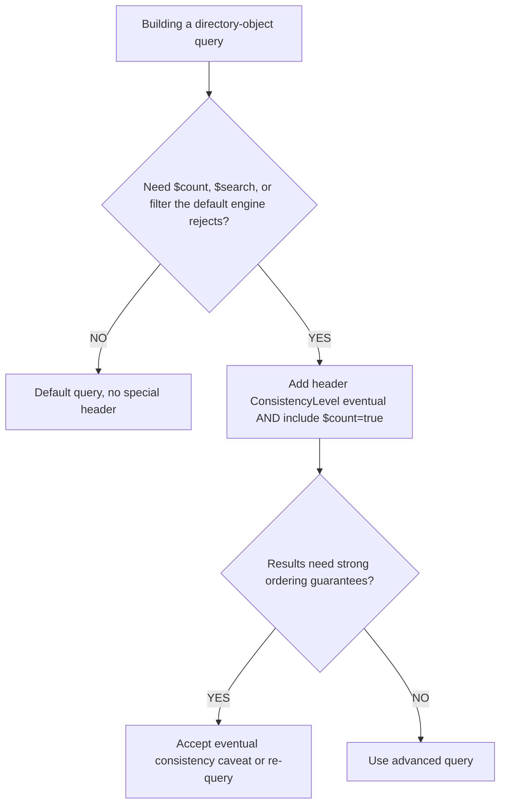
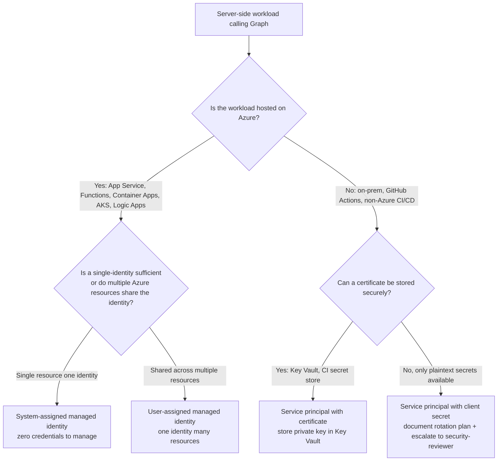
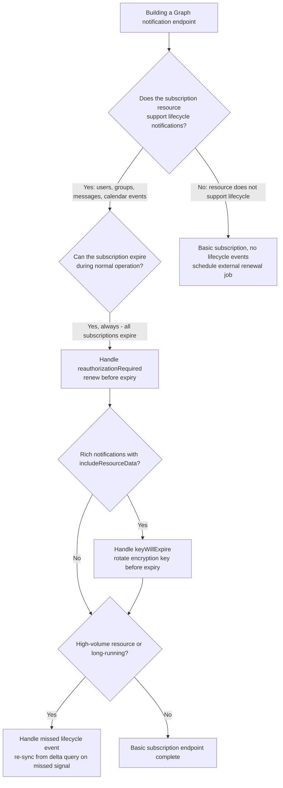

# Microsoft Graph — API & query decision trees

**Last reviewed:** 2026-05-30 · **Confidence:** medium-high (first-party Microsoft Learn). Volatile facts (throttling limits, beta-vs-v1.0 availability, header names) carry inline markers + per-tree `Last verified` dates; re-verify on the Researcher sweep before quoting.

> Canonical decision trees for the `graph-api-engineer` surface. Traverse the relevant tree top-to-bottom against the user's observable situation **before** choosing a method (per the pre-action-traversal prior in [`../CLAUDE.md`](../CLAUDE.md) §5). Default to the smaller-blast-radius leaf; escalate only when it demonstrably fails.
>
> Volatile facts (throttling limits, beta-vs-v1.0 endpoint availability, header names) are marked inline and re-verified before quoting. See [`api-honor-throttling-and-retry-after.md`](../best-practices/api-honor-throttling-and-retry-after.md), [`api-page-to-exhaustion.md`](../best-practices/api-page-to-exhaustion.md), [`api-delta-for-what-changed.md`](../best-practices/api-delta-for-what-changed.md).

---

## Decision Tree: Graph API — "what changed?" (poll vs delta vs change-notification)

**When this applies:** You need to react to changes in a Graph resource (new mail, updated user, new Teams message) and are deciding how to detect them — not a one-time read.

**Last verified:** 2026-05-30 against Microsoft Graph v1.0 change-tracking docs (delta query + subscriptions). `[verify-at-build]` — supported resources for delta and for rich notifications change over time.



**Rationale per leaf:**
- _Change-notification subscription_ — push within seconds; lowest latency and lowest call volume, but stateful (validation + renewal + lifecycle handling required). See the notifications tree + `notify-subscriptions-need-renewal-and-lifecycle-handling.md`.
- _Delta query_ — periodic "what changed since last sync" without re-pulling the whole collection; persist the `deltaLink` and resume from it.
- _Polling with watermark_ — only when neither is supported; filter server-side on a change timestamp and store the high-water mark. Most expensive; last resort.

**Tradeoffs summary:**

| Method | Latency | Call volume | State to manage | Use when |
|---|---|---|---|---|
| Subscription | seconds | lowest | subscription id + renewal + (cert for rich) | near-real-time, resource supports it |
| Delta query | minutes (your cadence) | low | `deltaLink` per resource | periodic sync, resource supports delta |
| Poll + watermark | your cadence | high | timestamp watermark | neither delta nor notifications available |

---

## Decision Tree: Graph API — request efficiency (single vs page-loop vs $batch)

**When this applies:** You are issuing one or more Graph reads/writes and deciding how to structure the calls to minimize round-trips and avoid throttling.

**Last verified:** 2026-05-30 against Graph `$batch` (max 20 requests/batch `[verify-at-build]`) and paging docs.



**Rationale per leaf:**
- _Single GET with `$select`_ — never fetch a full entity when you need three fields.
- _Page to exhaustion_ — a collection response is one page; follow `@odata.nextLink` until absent. A first-page result is not "all results."
- _`$batch`_ — fold up to ~20 independent requests into one round-trip; respect per-request dependencies via `dependsOn`. Cuts latency and throttling pressure.

**Tradeoffs summary:**

| Method | Round-trips | Best for | Watch out |
|---|---|---|---|
| Single GET + `$select` | 1 | one item, few fields | over-fetch if `$select` omitted |
| Page loop | N pages | full collections | client-side filtering instead of `$filter` |
| `$batch` | 1 | many independent ops | 20-request cap; inner 429s still possible |

---

## Decision Tree: Graph API — throttled (HTTP 429) response

**When this applies:** A Graph call returned **429 Too Many Requests** (or you are designing for it). Observable: `429` status + a `Retry-After` header.

**Last verified:** 2026-05-30 against Graph throttling guidance (`Retry-After` is authoritative; limits are per-workload and per-app/per-tenant). `[verify-at-build]` — specific limits vary by service.



**Rationale per leaf:**
- _Honor `Retry-After`_ — it is a contract; waiting exactly that long and retrying once is the sanctioned path.
- _Backoff + jitter_ — when no header, exponential backoff with jitter avoids synchronized retry storms.
- _Reduce volume_ — persistent throttling is a design smell: batch, select fewer fields, switch re-reads to delta.
- _Spread / shard_ — a single hot resource needs load spreading, not just retries.

**Tradeoffs summary:**

| Response | When | Effect |
|---|---|---|
| Honor `Retry-After` | header present | correct, polite, usually sufficient |
| Backoff + jitter | no header | avoids retry storms |
| Reduce volume (`$batch`/`$select`/delta) | repeated 429s | fixes the cause |
| Spread / shard | one hot path | smooths the spike |

---

## Decision Tree: Graph API — advanced query (default vs ConsistencyLevel=eventual)

**When this applies:** You need `$count`, `$search`, `$orderby` with `$filter`, or `$filter` on a directory property that the default query engine rejects (often a `400` telling you to use advanced query).

**Last verified:** 2026-05-30 against Graph advanced-query guidance for directory objects. `[verify-at-build]`.



**Rationale per leaf:**
- _Default query_ — for simple equality filters and reads; no header needed.
- _Advanced query_ — `ConsistencyLevel: eventual` **plus** `$count=true` unlocks `$search`, `$count`, and not-supported-by-default `$filter`/`$orderby` on directory objects.
- _Eventual-consistency caveat_ — advanced queries are eventually consistent; don't assume read-your-write immediacy.

**Tradeoffs summary:**

| Mode | Header | Capability | Caveat |
|---|---|---|---|
| Default | none | equality filter, basic reads | limited operators |
| Advanced | `ConsistencyLevel: eventual` + `$count=true` | `$search`/`$count`/rich `$filter`/`$orderby` | eventual consistency |

---

## Decision Tree: Graph identity — managed identity vs service principal with certificate vs client secret

**When this applies:** You are designing authentication for a server-side or daemon workload that calls Microsoft Graph and must pick the credential type — observable at the point of designing the Entra app registration or the Azure resource identity.

**Last verified:** 2026-06-05 against Microsoft Graph managed identity documentation and MSAL best practices.



**Rationale per leaf:**
- *System-assigned managed identity* — the Azure runtime manages credentials; no rotation, no storage, no leakage risk.
- *User-assigned managed identity* — same benefit, shareable across resources; the right choice when many resources call the same Graph APIs.
- *Certificate* — for non-Azure hosts where managed identity is unavailable; certificate theft is harder than secret theft; rotate on a documented schedule.
- *Client secret* — the weakest option; acceptable only when the host cannot store a certificate; requires documented rotation and mandatory security-reviewer escalation.

**Tradeoffs summary:**

| Credential | Rotation | Leakage risk | Host requirement | Use when |
|---|---|---|---|---|
| System-assigned MI | automatic | none | Azure-hosted | single Azure resource |
| User-assigned MI | automatic | none | Azure-hosted | shared across Azure resources |
| Certificate | manual (yearly) | low (private key in KV) | any | non-Azure host with secure store |
| Client secret | manual (scheduled) | high | any | last resort, no certificate support |

---

## Decision Tree: Graph notifications — which subscription lifecycle event to handle

**When this applies:** You are implementing a Graph change-notification subscription and must decide which lifecycle events your endpoint needs to handle — observable when writing the notification endpoint handler.

**Last verified:** 2026-06-05 against Microsoft Graph change-notification lifecycle events documentation.



**Rationale per leaf:**
- *Renew on reauthorizationRequired* — all subscriptions expire; the `reauthorizationRequired` lifecycle event fires before expiry and is the trigger to renew. Ignoring it = silent notification gaps.
- *Handle keyWillExpire* — rich subscriptions use an encryption key; the `keyWillExpire` event fires before the key expires. Missing it = decryption failures for all notifications after key expiry.
- *Handle missed* — the `missed` lifecycle event fires when Graph could not deliver a notification (endpoint down, throttled). Trigger a delta query to re-sync what was missed.
- *External renewal job* — for resources without lifecycle-notification support, schedule a background job to renew the subscription on a cadence shorter than its max lifetime.

**Tradeoffs summary:**

| Event | Consequence if missed | Priority |
|---|---|---|
| reauthorizationRequired | subscription silently stops | must handle |
| keyWillExpire (rich only) | all notifications undecryptable | must handle if rich |
| missed | data gap without re-sync | handle for high-volume |

---

## Decision Tree: Graph workloads — Teams vs SharePoint vs Mail/Calendar API for a given document/content scenario

**When this applies:** A new Graph integration involves documents, files, or content and you must pick the correct API surface — observable when the use case mentions "files," "documents," "meeting content," or "shared content" without specifying Teams vs SharePoint vs Exchange.

**Last verified:** 2026-06-05 against Microsoft Graph v1.0 Teams, SharePoint, and Mail API documentation.

```mermaid
flowchart TD
    START[Working with files or content via Graph] --> Q1{Content is a file or document<br/>not an email or calendar item?}
    Q1 -->|Email or calendar item| MAIL[Mail/Calendar API<br/>/me/messages or /me/events]
    Q1 -->|File or document| Q2{Where does the file live?}
    Q2 -->|SharePoint site / document library| SP[SharePoint Files API<br/>/sites/{id}/drives/{id}/items]
    Q2 -->|User OneDrive personal| OD[OneDrive Files API<br/>/me/drive/items or /drives/{id}/items]
    Q2 -->|Teams channel files tab| TEAMS[Teams channel SharePoint drive<br/>/teams/{id}/channels/{id}/filesFolder then /drives/{id}/items]
    Q2 -->|Unknown - could be either| Q3{Is the context a user's working files?}
    Q3 -->|Yes| SEARCH[Graph Search API<br/>POST /search/query entityType=driveItem]
    Q3 -->|No, org-wide| SP
```

**Rationale per leaf:**
- *Mail/Calendar API* — Exchange content lives on its own API surface; use `/me/messages` for mail and `/me/events` or `/calendarView` for calendar.
- *SharePoint Files API* — files in document libraries are drives under a site; use the drive-item model.
- *OneDrive* — personal files are the user's own drive; accessible via `/me/drive`.
- *Teams channel files* — Teams channel files live in a SharePoint site associated with the team; get the `filesFolder` drive item and then use the drives API.
- *Graph Search* — when the location is unknown, `POST /search/query` with `entityType: driveItem` searches across OneDrive + SharePoint + Teams files with one call.

**Tradeoffs summary:**

| Surface | API family | Permission scope | Use when |
|---|---|---|---|
| SharePoint document library | Sites / Drives | Sites.Read.All or Sites.ReadWrite.All | Org content in document libraries |
| OneDrive personal | Drives | Files.ReadWrite | User's own files |
| Teams channel files | Teams + Drives | Files.ReadWrite.All + Group.Read.All | Files attached to a Teams channel |
| Mail attachment | Mail | Mail.Read | Files embedded in email |
| Cross-surface search | Search | Files.Read.All | Location unknown |

---

## See also

- [`../../../docs/best-practices/decision-trees-in-knowledge-files.md`](../../../docs/best-practices/decision-trees-in-knowledge-files.md) — the format these trees follow
- [`identity-auth-decision-trees.md`](./identity-auth-decision-trees.md) · [`workloads-notifications-decision-trees.md`](./workloads-notifications-decision-trees.md)
- [`../agents/graph-api-engineer.md`](../agents/graph-api-engineer.md) — the agent that traverses these
