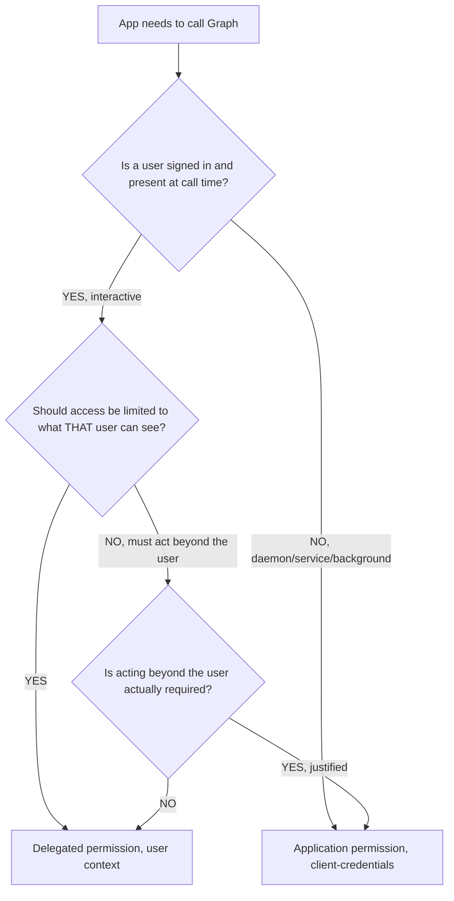
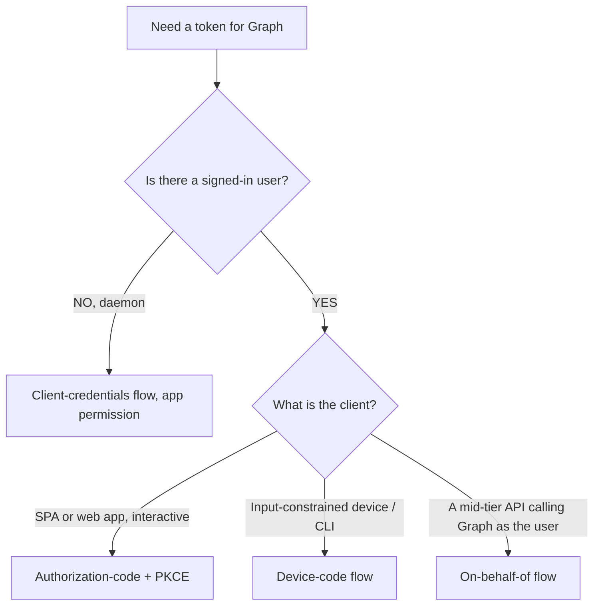
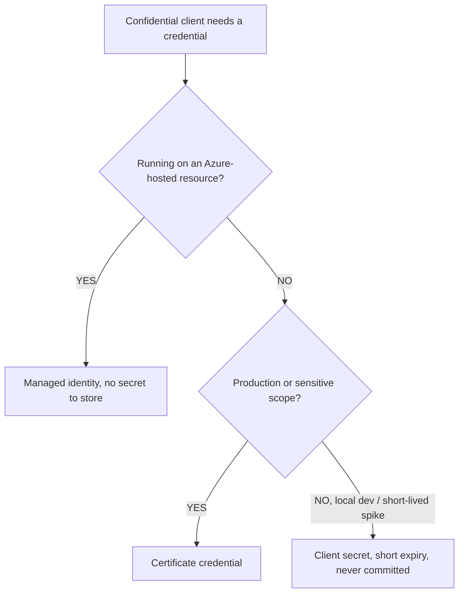
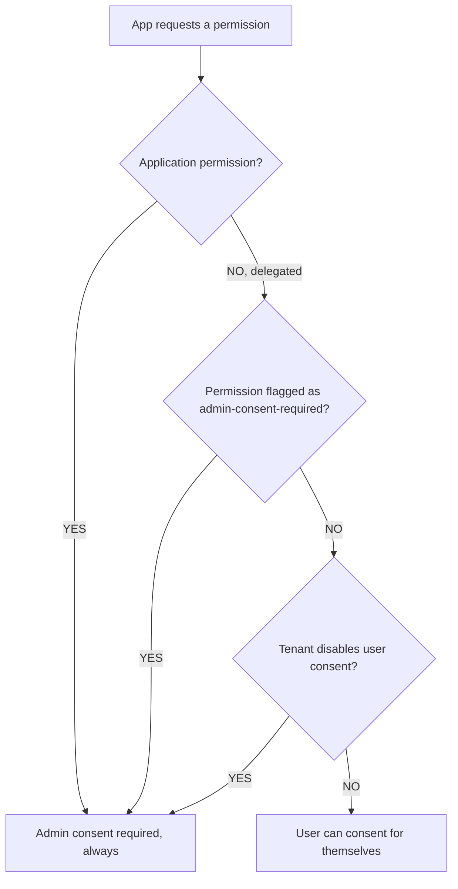

# Microsoft Graph — identity & authorization decision trees

**Last reviewed:** 2026-05-30 · **Confidence:** medium-high (first-party Microsoft Learn). Permission names + flow availability are volatile — carried with inline markers + per-tree `Last verified` dates; re-verify on the Researcher sweep before quoting.

> Canonical decision trees for the `graph-identity-engineer` surface. Traverse before choosing a permission type, auth flow, or credential. **Every leaf here is security-relevant — the permission/scope/secret verdict escalates to `ravenclaude-core/security-reviewer`** (per [`../CLAUDE.md`](../CLAUDE.md) §1, §8).
>
> Permission names and flow availability are volatile — marked inline and re-verified before quoting. See [`identity-least-privilege-permission-selection.md`](../best-practices/identity-least-privilege-permission-selection.md), [`identity-delegated-vs-application-is-a-design-choice.md`](../best-practices/identity-delegated-vs-application-is-a-design-choice.md), [`auth-pick-the-flow-by-client-type.md`](../best-practices/auth-pick-the-flow-by-client-type.md).

## Recent GA capabilities (weekly sweep, verified 2026-06-19 against [Graph what's-new](https://learn.microsoft.com/graph/whats-new-overview))

- **Programmatic FIDO2 passkey registration — GA (June 2026).** An app can now register a passkey on a user's behalf: call the [`fido2AuthenticationMethod: creationOptions`](https://learn.microsoft.com/graph/api/fido2authenticationmethod-creationoptions) function to get WebAuthn credential-creation options, then complete registration by `POST`ing the new `publicKeyCredential` property to the [`fido2AuthenticationMethod`](https://learn.microsoft.com/graph/api/resources/fido2authenticationmethod) resource. Permission/consent verdict still escalates to `security-reviewer`.
- **`agentUser` resource — GA in v1.0 (May 2026)** `[verify-at-use — brand-new, surface still moving]`. A specialized [`agentUser`](https://learn.microsoft.com/graph/api/resources/agentuser) subtype of `user` for AI agents acting as digital workers (`idtyp=user` tokens, 1:1 to a parent agent identity). **Security-load-bearing caveat:** an agent user has **no password authentication and cannot hold privileged admin roles** — it carries guest-like permissions by design. The companion [`verifiedIdProfile`](https://learn.microsoft.com/graph/api/resources/verifiedidprofile) (Entra Verified ID config) also reached v1.0.

---

## Decision Tree: Graph identity — delegated vs application permission

**When this applies:** You are choosing the permission type for an app calling Graph and must decide between **delegated** (acts as a signed-in user) and **application** (acts as itself, no user).

**Last verified:** 2026-05-30 against Microsoft Graph permissions/auth concepts. `[verify-at-build]` — per-resource availability of delegated vs application permissions varies.

**Rationale per leaf:**
- _Delegated_ — default when a user is present; access is the intersection of the app's scopes and the user's own rights — naturally least-privilege.
- _Application_ — only for daemons/services with no user, or a justified need to act tenant-wide; it bypasses per-user limits, so it gets the most scrutiny and admin consent.
- The `requires:` here is **justification**: an application permission must be defended, not defaulted to.

**Tradeoffs summary:**

| Type | Acts as | Consent | Blast radius | Use when |
|---|---|---|---|---|
| Delegated | signed-in user | user or admin | bounded by the user | a user is present |
| Application | the app itself | admin only | tenant-wide | daemon / justified tenant-wide need |

---

## Decision Tree: Graph identity — which auth flow

**When this applies:** You've chosen the permission type and need the OAuth2 flow for token acquisition. Observable: the client type (SPA, web app, daemon, mobile/CLI, API-calling-Graph-for-a-user).

**Last verified:** 2026-05-30 against MSAL / Microsoft identity platform flow guidance. `[verify-at-build]`.

**Rationale per leaf:**
- _Authorization-code + PKCE_ — the default interactive flow for web/SPA; PKCE is mandatory for public clients.
- _Client-credentials_ — daemon/service with an application permission and a certificate (preferred) or secret.
- _Device-code_ — CLIs/devices with no browser; user authorizes on a second device.
- _On-behalf-of_ — a downstream API exchanges the user's token to call Graph as that user without re-prompting.

**Tradeoffs summary:**

| Flow | Client | Credential | Note |
|---|---|---|---|
| Auth-code + PKCE | SPA / web | none (public) / cert (confidential) | the interactive default |
| Client-credentials | daemon | cert > secret | app permission only |
| Device-code | CLI / device | public | second-device authorization |
| On-behalf-of | mid-tier API | cert/secret | propagates user identity |

---

## Decision Tree: Graph identity — app credential type

**When this applies:** A confidential client (web app, daemon, API) needs a credential to prove itself to Entra. Choosing between client secret, certificate, and managed identity.

**Last verified:** 2026-05-30 against Entra app-credential guidance. `[verify-at-build]`.

**Rationale per leaf:**
- _Managed identity_ — best when hosted on Azure; Entra manages the credential, nothing to store or rotate by hand.
- _Certificate_ — production default off-Azure; far stronger than a string secret and not loggable as a bearer value.
- _Client secret_ — acceptable only for local dev / short-lived work, with a short expiry, and **never** in source, config, or a URL. Escalate any secret-handling choice to security review.

**Tradeoffs summary:**

| Credential | Where | Strength | Rotation |
|---|---|---|---|
| Managed identity | Azure-hosted | strongest, no stored secret | platform-managed |
| Certificate | off-Azure prod | strong | you rotate the cert |
| Client secret | dev/short-lived only | weakest | manual, short expiry |

---

## Decision Tree: Graph identity — user vs admin consent

**When this applies:** Deciding whether a permission can be granted by an end user or requires a tenant administrator. Observable: the permission's consent requirement and whether the resource is org-wide.

**Last verified:** 2026-05-30 against the Microsoft identity consent framework. `[verify-at-build]` — per-permission consent requirements change.

**Rationale per leaf:**
- _Admin consent_ — all application permissions, all high-privilege delegated permissions, and any tenant with user-consent disabled. Grant once, tenant-wide.
- _User consent_ — low-privilege delegated permissions in tenants that allow it; scoped to the consenting user.
- Design for the **least** consent tier that works; requesting admin-consent scopes you don't need creates rollout friction and over-privilege.

**Tradeoffs summary:**

| Consent | Applies to | Scope of grant | Rollout |
|---|---|---|---|
| Admin | app perms + high-priv delegated | tenant-wide | one-time admin step |
| User | low-priv delegated (if allowed) | per user | self-service |

---

## See also

- [`../../../docs/best-practices/decision-trees-in-knowledge-files.md`](../../../docs/best-practices/decision-trees-in-knowledge-files.md) — the format these trees follow
- [`api-query-decision-trees.md`](./api-query-decision-trees.md) · [`workloads-notifications-decision-trees.md`](./workloads-notifications-decision-trees.md)
- [`../agents/graph-identity-engineer.md`](../agents/graph-identity-engineer.md) — escalates permission/secret verdicts to `ravenclaude-core/security-reviewer`
