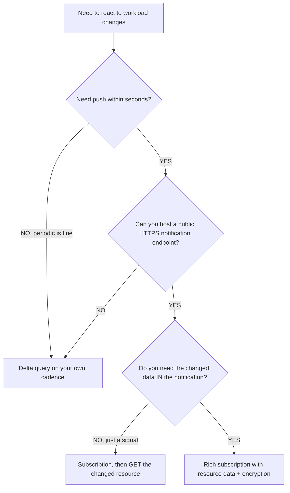
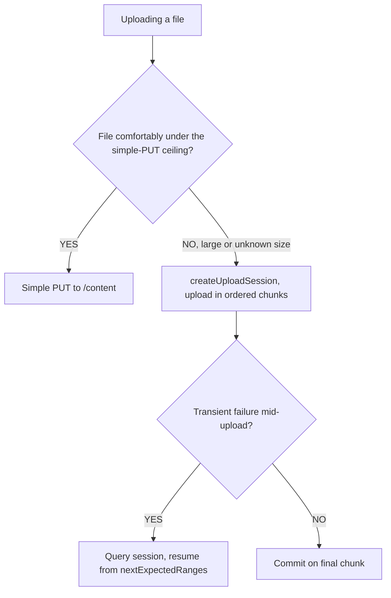
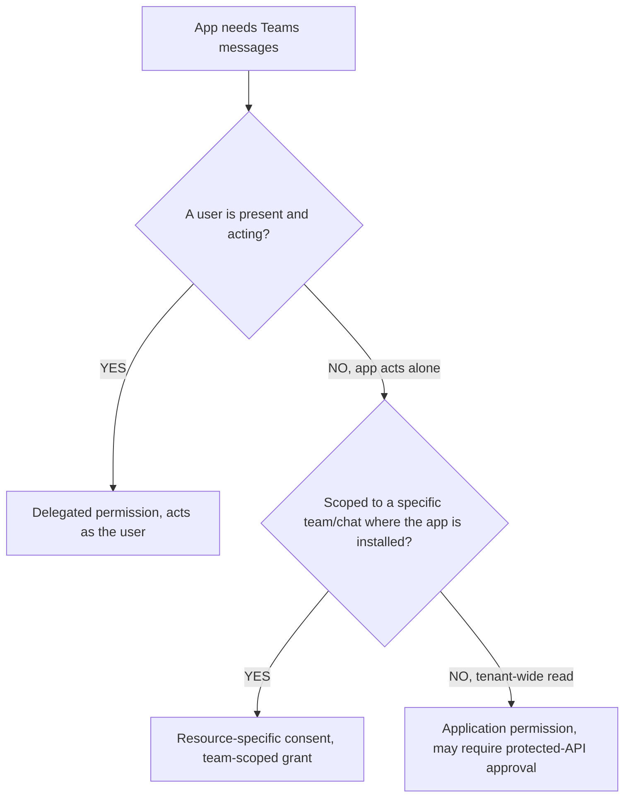
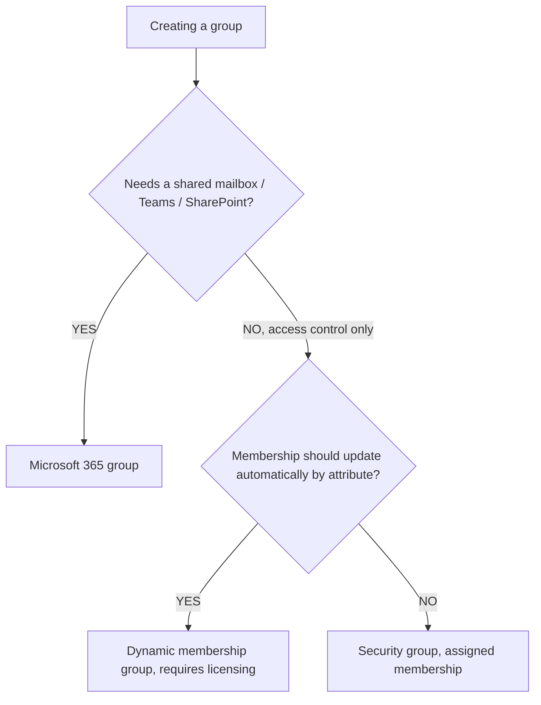

# Microsoft Graph — workloads & notifications decision trees

**Last reviewed:** 2026-05-30 · **Confidence:** medium-high (first-party Microsoft Learn). Resource availability + limits are volatile — carried with inline markers + per-tree `Last verified` dates; re-verify on the Researcher sweep before quoting.

> Canonical decision trees for the `graph-workloads-engineer` surface (users/groups, mail/calendar, Teams, files, change notifications). Traverse before choosing a mechanism. Notification-payload decryption keys and any permission choice escalate to `ravenclaude-core/security-reviewer` (per [`../CLAUDE.md`](../CLAUDE.md) §1, §8).
>
> Resource availability and limits are volatile — marked inline and re-verified before quoting. See [`notify-subscriptions-need-renewal-and-lifecycle-handling.md`](../best-practices/notify-subscriptions-need-renewal-and-lifecycle-handling.md), [`notify-validate-the-handshake-and-verify-the-sender.md`](../best-practices/notify-validate-the-handshake-and-verify-the-sender.md), [`notify-encrypt-rich-payloads-and-guard-the-key.md`](../best-practices/notify-encrypt-rich-payloads-and-guard-the-key.md).

---

## Decision Tree: Graph workloads — change detection (delta vs change-notification subscription)

**When this applies:** You must react to changes in a workload resource (mailbox, drive, group membership, Teams channel) and are choosing between delta polling and a push subscription.

**Last verified:** 2026-05-30 against Graph subscriptions + delta docs. `[verify-at-build]` — supported resources and max subscription lifetimes vary by resource.

**Rationale per leaf:**
- _Delta query_ — no endpoint to host, no renewal; right when minutes-latency sync is acceptable.
- _Subscription (signal only)_ — push notification carries the changed resource id; you GET the detail. Requires a validated public endpoint + renewal.
- _Rich subscription_ — payload includes encrypted resource data (fewer follow-up GETs) but you must manage an encryption certificate and decrypt — escalate the key handling to security review.

**Tradeoffs summary:**

| Method | Latency | Infra | State / risk | Use when |
|---|---|---|---|---|
| Delta | your cadence | none | `deltaLink` | periodic sync ok |
| Subscription (signal) | seconds | public HTTPS endpoint | validation + renewal | near-real-time, signal enough |
| Rich subscription | seconds | endpoint + cert | renewal + **decryption key** | need the data inline, high volume |

---

## Decision Tree: Graph files — small upload vs upload session

**When this applies:** Uploading a file to OneDrive/SharePoint via Graph and choosing the upload mechanism by size.

**Last verified:** 2026-05-30 against Graph driveItem upload docs (simple PUT for small files; upload session for large, chunked). `[verify-at-build]` — the simple-PUT size ceiling is version-specific (historically ~4 MB).

**Rationale per leaf:**
- _Simple PUT_ — one request for small files under the ceiling.
- _Upload session_ — chunked, resumable transfer for large files; the only correct path above the ceiling, and resilient to mid-transfer failures via `nextExpectedRanges`.

**Tradeoffs summary:**

| Method | Size | Resumable | Round-trips |
|---|---|---|---|
| Simple PUT | under ceiling | no | 1 |
| Upload session | any (required when large) | yes | N chunks + create |

---

## Decision Tree: Graph Teams — which permission for messages

**When this applies:** Reading or posting Teams chat/channel messages and choosing the permission model. Observable: whether a user is present and whether the app is installed in the team.

**Last verified:** 2026-05-30 against Teams Graph permissions incl. resource-specific consent (RSC). `[verify-at-build]` — RSC scope names and protected-API requirements change.

**Rationale per leaf:**
- _Delegated_ — user-context posting/reading; least-privilege when a user drives it.
- _RSC_ — app acts within a specific team/chat it's installed in, consented by a team owner — narrower than tenant-wide application permissions.
- _Application permission_ — tenant-wide app-only access; some message-read APIs are metered/protected and require Microsoft approval. Escalate.

**Tradeoffs summary:**

| Model | Scope | Consent | Note |
|---|---|---|---|
| Delegated | the user | user/admin | user present |
| RSC | one team/chat | team owner | narrowest app access |
| Application | tenant-wide | admin (+ protected-API approval) | may be metered |

---

## Decision Tree: Graph directory — which group type

**When this applies:** Creating a group via Graph and choosing the type by what it must do (security gating vs collaboration vs automatic membership).

**Last verified:** 2026-05-30 against Entra group concepts (security, Microsoft 365, dynamic membership). `[verify-at-build]` — dynamic membership requires the appropriate licensing.

**Rationale per leaf:**
- _Microsoft 365 group_ — collaboration workloads (mailbox, Teams, SharePoint) attached.
- _Security group_ — pure access control with assigned membership.
- _Dynamic group_ — membership computed from a rule on user attributes; requires the appropriate license and re-evaluates automatically.

**Tradeoffs summary:**

| Type | Purpose | Membership | Caveat |
|---|---|---|---|
| Microsoft 365 | collaboration | assigned | brings workloads |
| Security | access control | assigned | no workloads |
| Dynamic | attribute-driven | rule-computed | licensing required |

---

## See also

- [`../../../docs/best-practices/decision-trees-in-knowledge-files.md`](../../../docs/best-practices/decision-trees-in-knowledge-files.md) — the format these trees follow
- [`api-query-decision-trees.md`](./api-query-decision-trees.md) · [`identity-auth-decision-trees.md`](./identity-auth-decision-trees.md)
- [`../agents/graph-workloads-engineer.md`](../agents/graph-workloads-engineer.md) — the agent that traverses these
