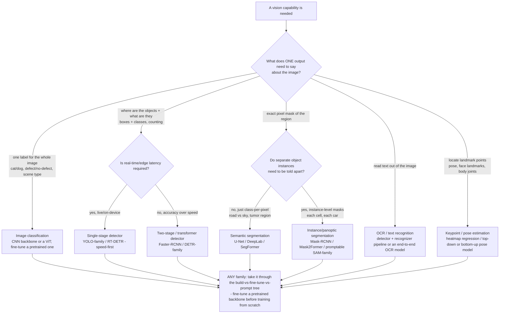
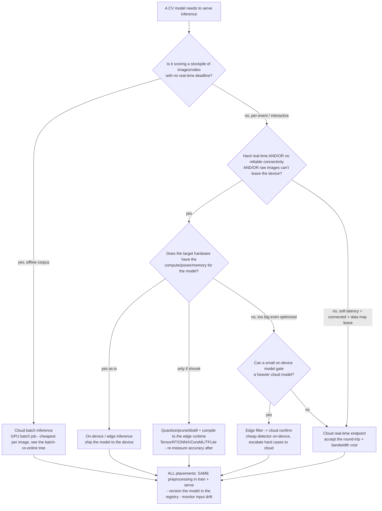

# ML Engineering — Computer-Vision Engineering Decision Trees & Notes

_The computer-vision sub-domain of MLOps. CV is **not a separate plugin** — it deepens the same train->register->serve->monitor loop the rest of this plugin owns, with image/video-specific choices for architecture, data/annotation, augmentation, evaluation, and inference placement. Two decision trees ((a) CV task -> architecture, (b) inference placement edge-vs-cloud) plus data/annotation, transfer-learning, augmentation-leakage, and per-task-metric notes. Capability rows are `[verify-at-use]` — re-check against the vendor before quoting. Last reviewed: 2026-06-22._

Traverse the relevant tree top-to-bottom before choosing. The §2 house opinions in [`../CLAUDE.md`](../CLAUDE.md) (reproducibility floor, no skew, no leakage, monitor + retrain trigger, route significance to `applied-statistics`) apply unchanged to every CV choice below — CV adds task-specific edges, it does not relax the floor.

## Decision Tree: What CV task is this? — task -> architecture family

**When this applies:** a vision capability is needed and the team is choosing the *model family* from the task shape. Picking the wrong family is the most common CV over/under-build: reaching for object detection when whole-image classification answers the question, or hand-rolling a detector when a hosted/pretrained model ships in a day. This is the CV-specific refinement of the build-vs-fine-tune-vs-prompt sourcing tree in [`model-sourcing-and-feature-serving-decision-trees.md`](model-sourcing-and-feature-serving-decision-trees.md) — decide the *task family* here, then take it through that sourcing tree.

**Last verified:** 2026-06-22 against the ml-platform-architect + training-pipeline-engineer mandates and [`../CLAUDE.md`](../CLAUDE.md) §2.

**Rationale per leaf:**

- *Image classification* — one label per image. A CNN backbone (ResNet/EfficientNet/ConvNeXt) or a Vision Transformer, almost always **fine-tuned from a pretrained checkpoint** rather than trained from scratch. The cheapest CV task; if the question is "is X present in the whole frame?", do **not** escalate to detection.
- *Object detection (single-stage / real-time)* — boxes + classes when latency matters (live video, on-device). YOLO-family / RT-DETR trade a little accuracy for speed and run on modest hardware.
- *Object detection (two-stage / transformer)* — when accuracy beats speed (offline batch, high-stakes). Faster-RCNN or DETR-family models are heavier but more accurate, especially on small/dense objects.
- *Semantic segmentation* — class-per-pixel where instances don't need separating (drivable surface, tissue region). U-Net (medical/small data), DeepLab, or SegFormer.
- *Instance / panoptic segmentation* — pixel masks **and** instance identity (each cell, each vehicle). Mask-RCNN, Mask2Former, or a promptable SAM-family model when you have prompts/weak supervision. The most expensive to label.
- *OCR / text recognition* — reading text from images. Usually a two-stage pipeline (text **detection** then **recognition**) or an end-to-end model; document OCR (layout/tables) is its own sub-problem.
- *Keypoint / pose estimation* — locating named landmarks (joints, facial points). Heatmap-regression models, top-down (detect-then-pose) or bottom-up.

**Tradeoffs summary:**

| Task | Output | Label cost | Typical metric | Use when |
|---|---|---|---|---|
| Classification | 1 label/image | Lowest | Accuracy / precision-recall / F1 | One question about the whole image |
| Detection | Boxes + classes | Medium | mAP @ IoU | Where + what; counting |
| Semantic seg | Class-per-pixel | High | mean IoU / Dice | Region extent, no instances |
| Instance/panoptic seg | Masks + identity | Highest | mask mAP / PQ | Per-object masks |
| OCR | Text strings | Medium-high | CER / WER (+ detection mAP) | Read text |
| Keypoint/pose | Landmark points | High | PCK / OKS-mAP | Locate landmarks |

> **Match the task to the cheapest family that answers the question, then take that family through the build-vs-fine-tune-vs-prompt sourcing tree — fine-tune a pretrained backbone before you train from scratch.** Don't reach for detection/segmentation when classification answers the question, and don't train a bespoke detector when a hosted/pretrained model clears quality, latency, and cost. Whether a CV model's lift over the cheaper option is *real* → `applied-statistics`.

## Decision Tree: Where does inference run? — edge/on-device vs cloud/batch

**When this applies:** a CV model is chosen and the team is deciding *where it runs at inference*. CV inference is heavier than tabular (images/video are large, models are GPU-hungry), so placement drives latency, cost, privacy, and connectivity in ways tabular serving doesn't. This is the CV-specific refinement of the online-vs-batch serving tree in [`ml-engineering-decision-trees.md`](ml-engineering-decision-trees.md) — that tree picks online/batch; this one picks **edge vs cloud** within an online choice and folds in CV's bandwidth/privacy/power constraints.

**Last verified:** 2026-06-22 against the model-serving-engineer mandate and [`../CLAUDE.md`](../CLAUDE.md) §2 #4–#5.

**Rationale per leaf:**

- *Cloud batch inference* — an offline corpus with no real-time deadline (label an archive, nightly scoring). A GPU batch job is the cheapest per image; route through the batch-vs-online serving tree.
- *On-device / edge inference* — hard real-time, intermittent connectivity, or raw imagery that **must not leave the device** (privacy/regulatory), and the hardware fits the model as-is. Lowest latency, no bandwidth, strongest privacy; you trade model size/accuracy and own device-side updates.
- *Quantize/prune/distill + compile to the edge runtime* — the model is too big for the device as-is but fits once compressed and compiled (TensorRT / ONNX Runtime / CoreML / TFLite). **Re-measure accuracy after every optimization** — quantization and pruning move the metric, and INT8 can shift per-class behavior. This is a serving-engineering task with a training-side eval gate.
- *Edge filter -> cloud confirm (hybrid)* — a cheap on-device model handles the common case / gates which frames are worth sending; a heavier cloud model confirms the hard ones. Cuts bandwidth and cloud cost while keeping accuracy on the cases that matter.
- *Cloud real-time endpoint* — soft latency, reliable connectivity, and data may leave the device. Easiest to update and scale (autoscaling GPU), at the cost of round-trip latency and image-upload bandwidth.

**Tradeoffs summary:**

| Placement | Latency | Per-inference cost | Privacy | Update path | Use when |
|---|---|---|---|---|---|
| Cloud batch | N/A (offline) | Lowest/image | Data leaves | Redeploy job | Offline corpus, no deadline |
| On-device/edge | Lowest | Device amortized | Strongest (raw stays local) | Hardest (ship to fleet) | Real-time / offline / private |
| Edge-opt (compiled) | Low | Device amortized | Strong | Hard + re-validate | Edge but model too big as-is |
| Edge->cloud hybrid | Low common case | Medium | Mixed | Two surfaces | High volume, tight bandwidth |
| Cloud real-time | Round-trip | Per-request GPU | Data leaves | Easiest | Connected, soft latency |

> **Placement is a latency/cost/privacy/connectivity trade, not a default — and every edge optimization (quantize/prune/distill) is an accuracy change that must be re-measured against the held-out set before it ships.** The preprocessing pipeline (resize/normalize/color space) must be **identical in training and at the inference target**, or you have reintroduced training-serving skew in image form (see [`../best-practices/right-size-the-vision-model-for-the-inference-target.md`](../best-practices/right-size-the-vision-model-for-the-inference-target.md)). Whatever the placement, the model is versioned in the registry and input drift is monitored (lighting/camera/domain shift is the CV drift surface).

## Data & annotation pipeline

CV data work is the dominant cost and the dominant source of silent failure. Notes (grounded in §2 reproducibility + leakage discipline):

- **Annotation is the bottleneck and the risk.** Boxes, masks, keypoints, and transcriptions are expensive and inconsistent across annotators. Define a labeling guideline, measure **inter-annotator agreement**, and treat the label schema as a versioned artifact — a relabel is a new data version (see [`../best-practices/data-versioning-is-part-of-reproducibility.md`](../best-practices/data-versioning-is-part-of-reproducibility.md)).
- **Class imbalance is the norm.** Rare defects/objects dominate the business value but a tiny share of pixels/boxes. Track per-class metrics, not just the aggregate; an mAP that looks fine can hide a near-zero recall on the rare class that matters.
- **Label leakage hides in metadata and near-duplicates.** Capture device, timestamp, or filename patterns can correlate with the label; the model learns the shortcut, not the object. Near-duplicate frames split across train/test silently leak (see the split tree below and [`../best-practices/split-cv-data-by-scene-not-random-frame.md`](../best-practices/split-cv-data-by-scene-not-random-frame.md)).
- **Provenance + privacy.** Faces, plates, medical imagery, and PII in images route to `data-governance-privacy` + `security-engineering` before training; on-device placement is often the privacy answer (above).

## Transfer learning vs. from scratch

- **Default to transfer learning / fine-tuning a pretrained backbone.** In 2026, pretrained vision backbones (CNN and ViT) plus a fine-tuned head beat from-scratch training on almost every real dataset and need far less labeled data and compute. This is the CV instance of the sourcing tree's "adapt/transfer-learn" leaf.
- **Train from scratch only when the domain is far from any pretrained corpus** (exotic sensors — SAR, hyperspectral, certain medical/microscopy modalities) **and** you have a large labeled set. It is the slowest, most data-hungry, least reproducible path; justify it explicitly.
- **Freeze then unfreeze.** Start by training only the head on the frozen backbone, then unfreeze and fine-tune with a low learning rate. Reproducibility floor still applies: version the pretrained checkpoint exactly (a silently updated upstream checkpoint breaks reproducibility).

## Augmentation cautions (leakage)

Augmentation is essential in CV but is a leakage and skew trap:

- **Augment the training split only — after the split, never before.** Augmenting before splitting puts transformed copies of the same source image on both sides of the split: textbook leakage that inflates the offline metric. (See [`../best-practices/watch-augmentation-and-label-leakage.md`](../best-practices/watch-augmentation-and-label-leakage.md).)
- **Augmentations must preserve label validity.** A horizontal flip can be label-destroying for OCR/text, asymmetric poses, or left/right-handed classes; a rotation/crop must carry the box/mask/keypoint with it or the label is now wrong. Geometry-changing augmentations have to transform the annotation too.
- **Augment train, NOT validation/test.** Test-time augmentation (TTA) is a deliberate, separate inference technique — don't conflate it with leaking augmented copies into the eval set, which must mirror real production inputs.
- **Don't augment past the deployment distribution.** Augmentations the camera will never produce (extreme color jitter on a fixed-lighting line) teach invariances you don't need and can hurt. Match augmentation to the real variation at the inference target.

## Evaluation metrics by task

The metric is task-specific; the wrong metric hides the failure that matters. (Whether a metric difference is *statistically real* is `applied-statistics`' call — §2 #6.)

| Task | Primary metric(s) | What it captures / watch-outs |
|---|---|---|
| Classification | Accuracy, **precision/recall/F1**, PR-AUC, confusion matrix | Accuracy lies under class imbalance — report per-class PR; pick the operating threshold from the PR curve to the business cost |
| Object detection | **mAP @ IoU** (e.g. mAP@0.5, mAP@[.5:.95]) | mAP averages precision over recall at IoU thresholds; report per-class AP and check small-object recall |
| Semantic segmentation | **mean IoU (Jaccard)**, Dice/F1 | IoU = overlap/union per class; Dice is favored on imbalanced medical masks; watch boundary pixels |
| Instance/panoptic seg | mask mAP, Panoptic Quality (PQ) | Combines detection + mask quality (+ stuff classes for PQ) |
| OCR | Character/Word Error Rate (CER/WER), exact-match; detection mAP for the detector stage | End-to-end accuracy hides whether detection or recognition is the failure — measure both stages |
| Keypoint/pose | PCK, **OKS-based mAP** | OKS is the keypoint analogue of IoU; per-keypoint accuracy matters for occluded joints |

**Cross-task discipline:** the eval set is **held out and not augmented** (mirror real production inputs), per-class/per-slice metrics over aggregate, and the metric maps to the business cost (a false-negative defect ≠ a false-positive defect). The split that feeds these metrics must be scene/source-aware, not random-frame (next).

## Splitting CV data (the recurring trap)

CV data is rarely i.i.d. at the frame level: video frames, multi-shot product photos, and tiled large images are **near-duplicates of the same underlying scene/object/patient**. A random per-frame split puts near-identical frames in both train and test, leaking and inflating every metric above. **Split by the source unit (scene / video / patient / capture session), not by individual frame** — see the dedicated rule [`../best-practices/split-cv-data-by-scene-not-random-frame.md`](../best-practices/split-cv-data-by-scene-not-random-frame.md). This is the CV-specific face of §2 #3 (validate honestly) and the temporal-split discipline in [`ml-engineering-decision-trees.md`](ml-engineering-decision-trees.md).

## Seam back to the core MLOps loop

CV does not bypass the train->register->serve->monitor loop:

- **Training** → `training-pipeline-engineer` (reproducible CV training, leakage-free scene-aware splits, augmentation discipline, experiment tracking of the backbone + checkpoint version).
- **Serving / edge** → `model-serving-engineer` (edge-vs-cloud placement above, quantize/compile with an accuracy re-check, latency budget at the inference target).
- **Monitoring** → `ml-monitoring-engineer` (input drift for CV = lighting/camera/domain shift; performance decay when labels arrive; the retraining trigger). The drift calculator [`../scripts/drift_check.py`](../scripts/drift_check.py) applies to derived numeric/categorical features extracted from images.
- **Architecture / build-vs-buy** → `ml-platform-architect`.
- The **`computer-vision-pipeline` skill** [`../skills/computer-vision-pipeline/SKILL.md`](../skills/computer-vision-pipeline/SKILL.md) walks the end-to-end CV lane and names these seams at each stage.

## Verify-at-use (2026 tooling note)

The architecture families, edge runtimes, and metric conventions above are stable; **specific model names, version floors, and toolkit APIs are version-volatile — re-confirm at use.** As of 2026-06-22 `[verify-at-use]`: YOLO-family and RT-DETR for real-time detection, DETR/Mask2Former-family for accuracy-first detection/segmentation, SegFormer/DeepLab/U-Net for semantic segmentation, SAM-family for promptable/instance masks; edge compilation via TensorRT / ONNX Runtime / CoreML / TFLite; training/eval ecosystems (PyTorch + torchvision, the Ultralytics and Detectron2/MMDetection families, Hugging Face Transformers for ViT/DETR). Re-check the current recommended model + the exact quantization/compile API against the vendor docs before quoting a version or a command — the same `[verify-at-use]` discipline as the §6/§7 capability rows in [`../CLAUDE.md`](../CLAUDE.md).
