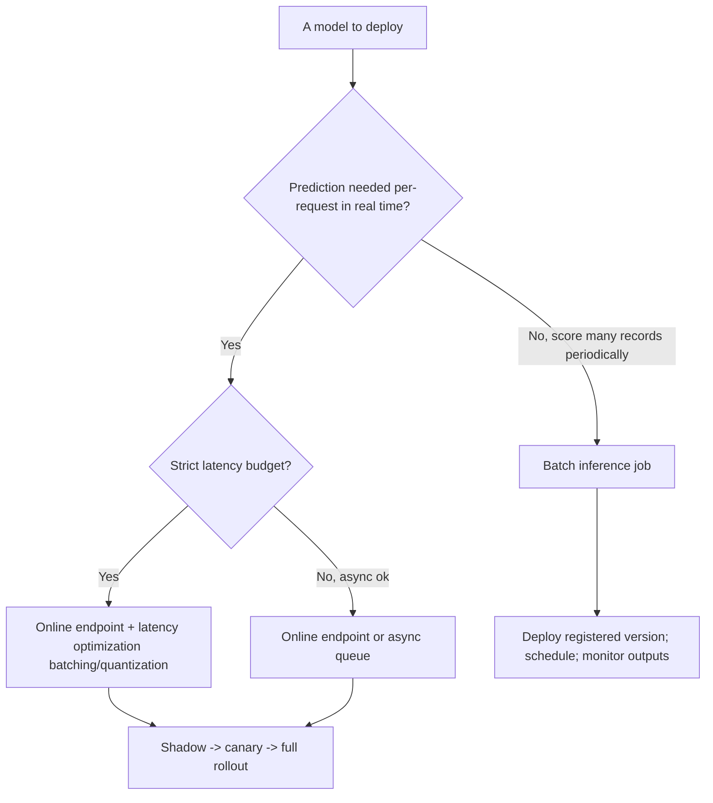
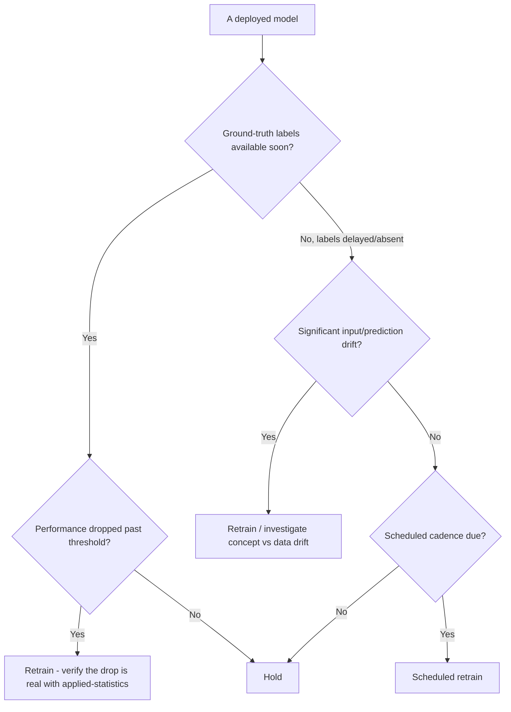
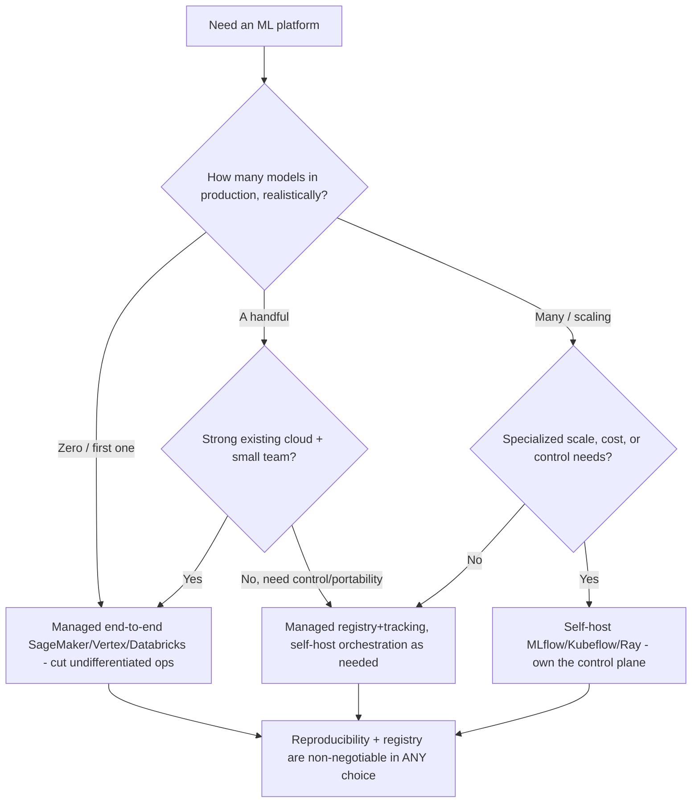
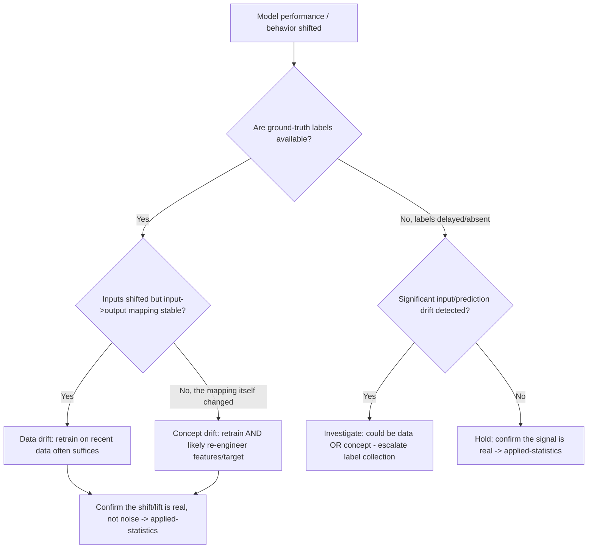
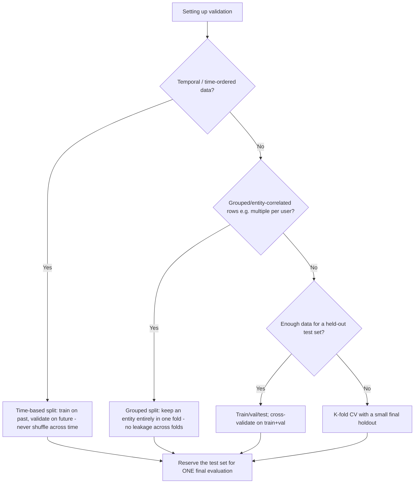

# ML Engineering — Decision Trees

_Decision trees + a dated capability map. Capability rows are `[verify-at-build]` — re-check against the vendor before quoting. Last reviewed: 2026-06-04._

Traverse before choosing a serving pattern or a retraining trigger.

## Decision Tree: Serving pattern: online or batch?

Match the serving pattern to the latency and request shape.

_Deploy a registered version from the registry, never a copied file._

## Decision Tree: When to retrain?

Decide the trigger before launch; drift is the early warning before labels arrive.

## Decision Tree: Build or buy the ML platform?

Match the platform to ML maturity; don't over-build for one model or hand-run fifty.

_Managed cuts ops you don't differentiate on; self-host buys control and cost-at-scale. Choose by team size, control needs, and existing cloud — not hype._

## Decision Tree: Data drift or concept drift — what's the response?

The diagnosis selects the fix; they are not interchangeable.

_Data drift = inputs moved; concept drift = the relationship moved. Same symptom, different fix. Whether the change is real routes to applied-statistics._

## Decision Tree: Which validation split for this problem?

Pick the split that prevents leakage for the data's structure, then use the test set once.

_Shuffling time-ordered data or splitting an entity across folds leaks future/correlated information; the inflated metric is a production disappointment with a delay._

## Capability map (dated — verify at build)

| Capability | 2026 state `[verify-at-build]` | Notes |
|---|---|---|
| MLflow / experiment tracking | GA | Params/metrics/artifacts/registry |
| Model registry | GA (MLflow/SageMaker/Vertex) | Source of truth for promotion |
| Feature stores (Feast/managed) | GA | Train-serve consistency |
| Drift detection (Evidently/managed) | GA | Data + prediction drift |
| Serving (KServe/Seldon/managed) | GA | Online + batch; canary |
| Managed platforms (SageMaker/Vertex/Databricks) | GA | Build-vs-buy by maturity |
