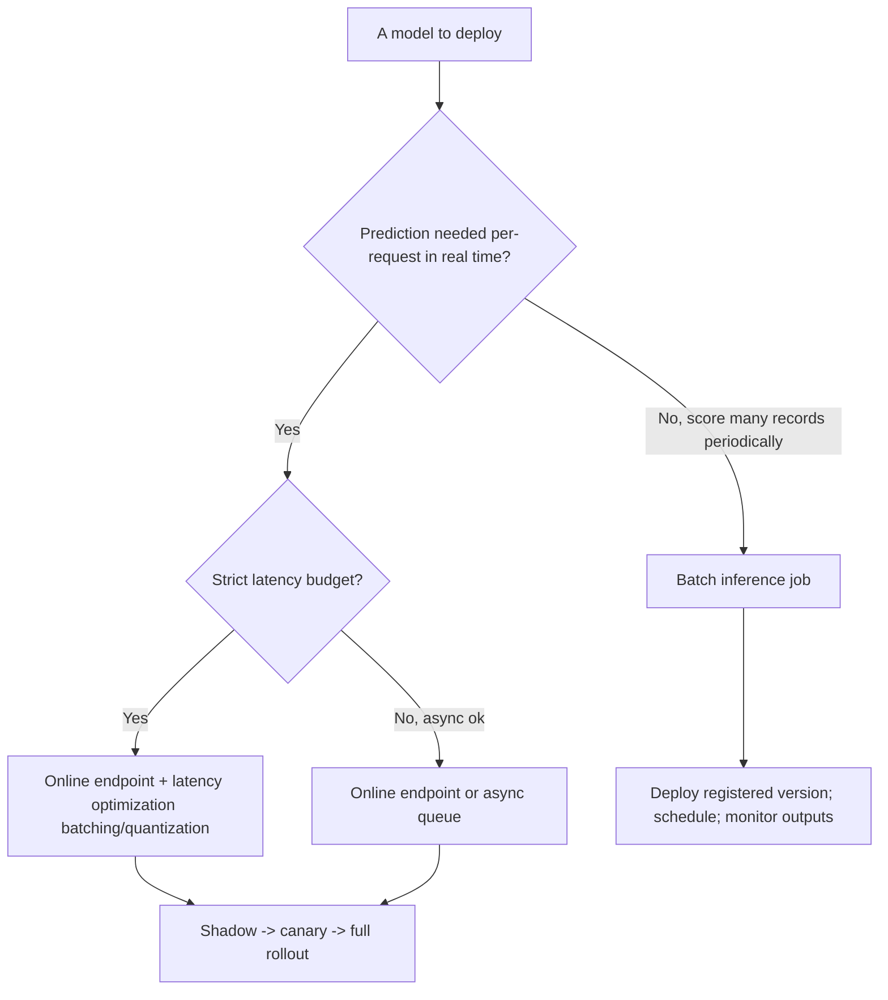
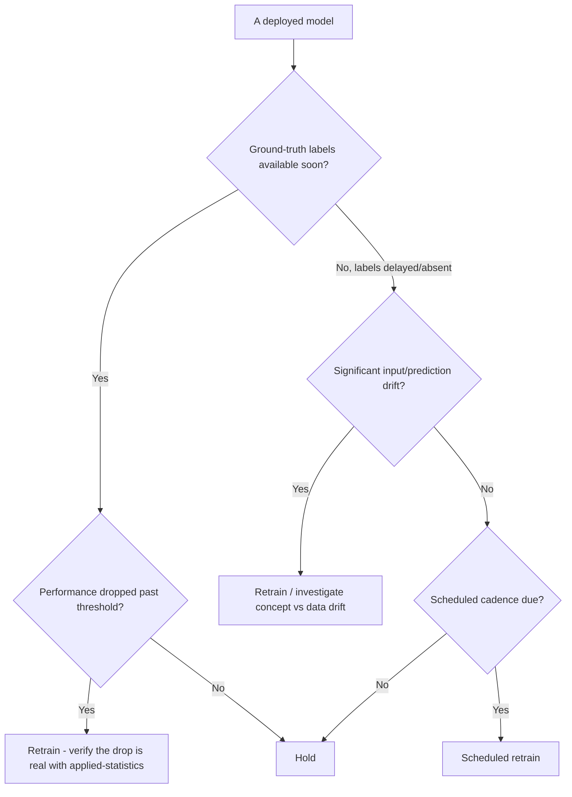
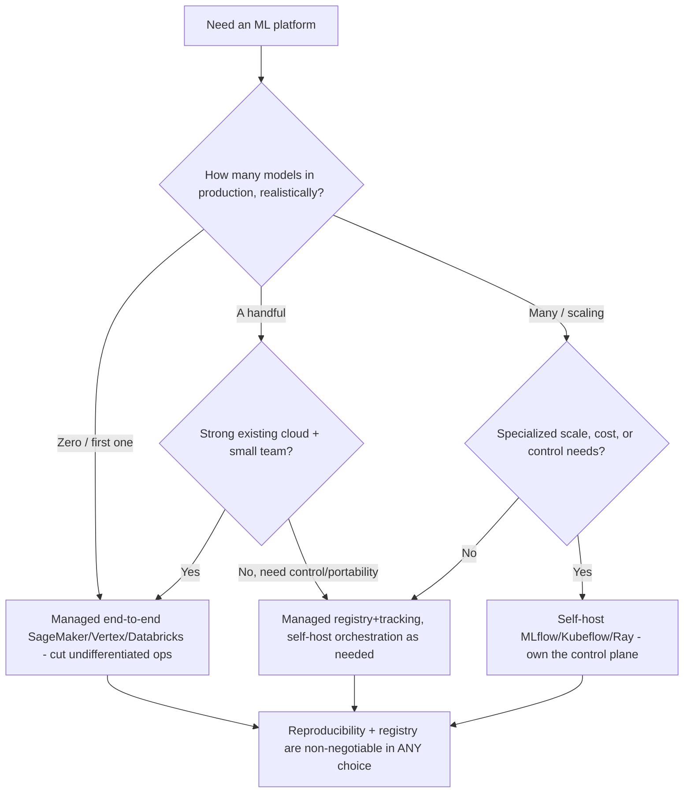
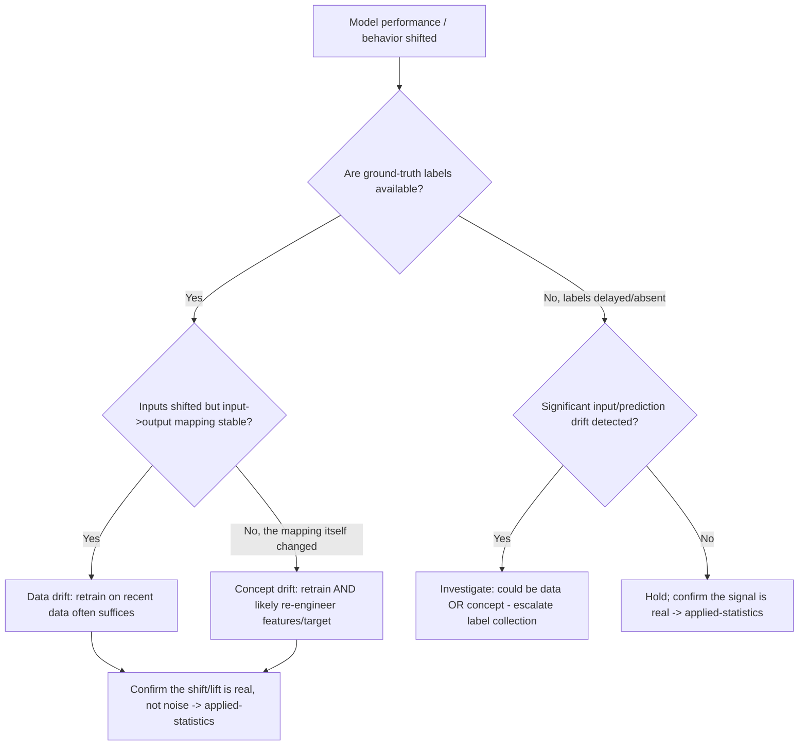
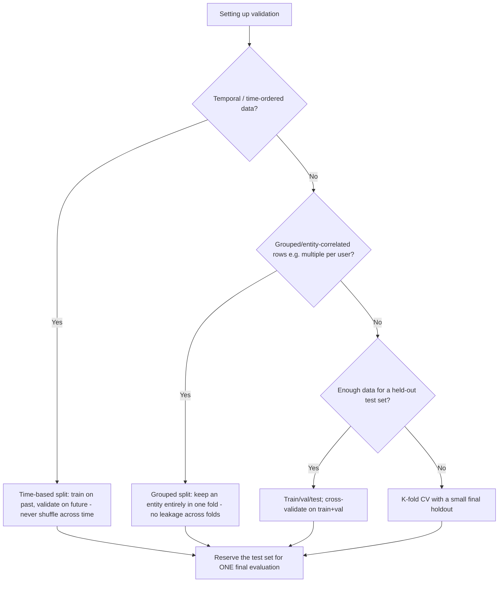
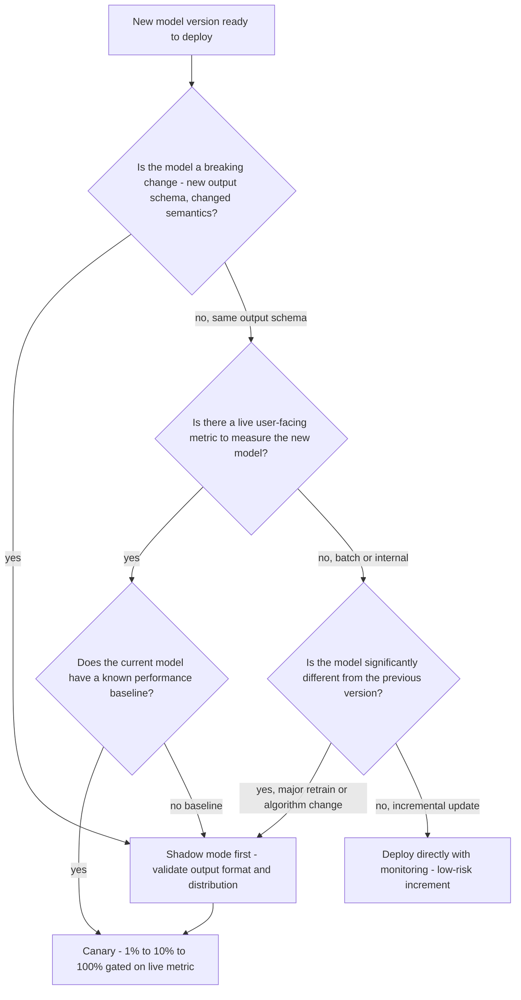
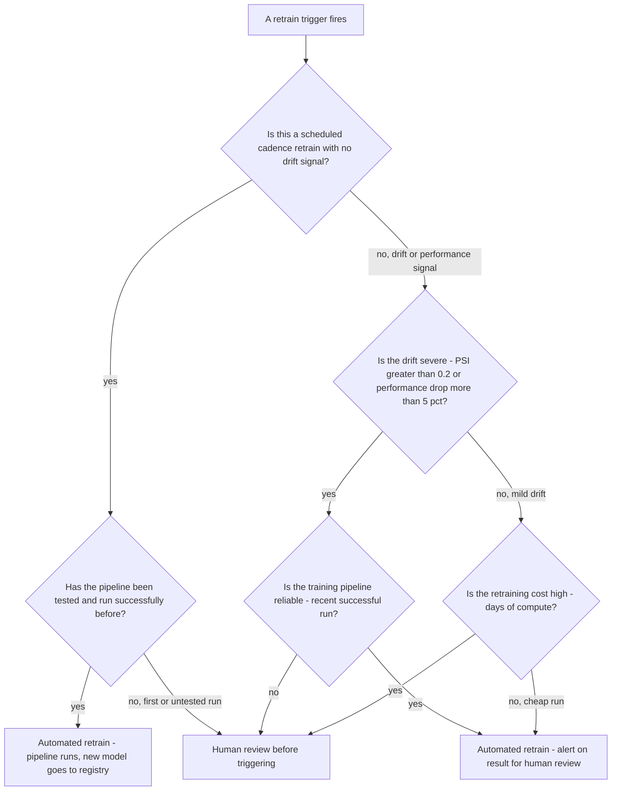
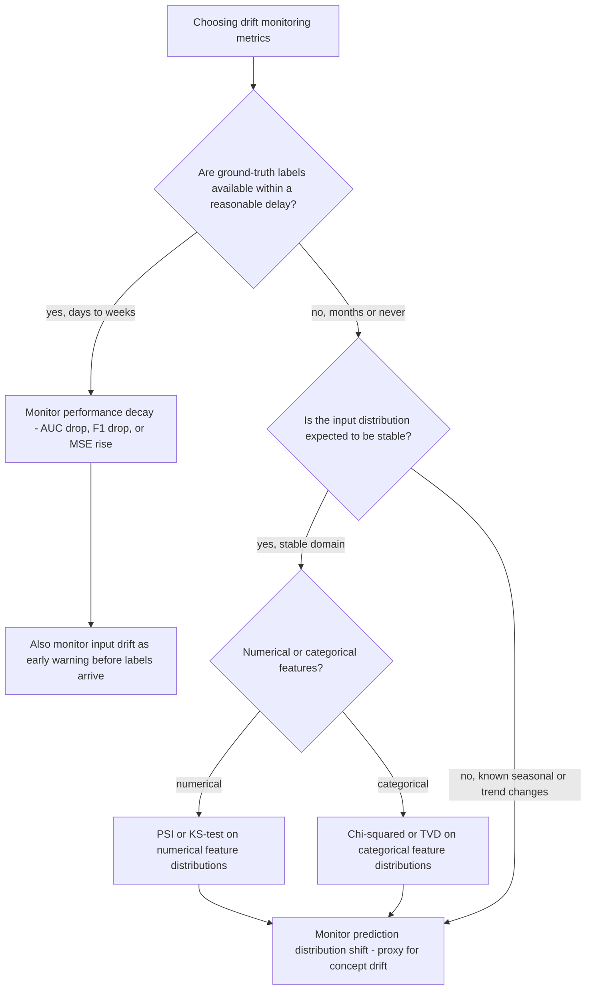

# ML Engineering — Decision Trees

_Decision trees + a dated capability map. Capability rows are `[verify-at-build]` — re-check against the vendor before quoting. Last reviewed: 2026-06-04._

Traverse before choosing a serving pattern or a retraining trigger.

## Decision Tree: Serving pattern: online or batch?

Match the serving pattern to the latency and request shape.

_Deploy a registered version from the registry, never a copied file._

## Decision Tree: When to retrain?

Decide the trigger before launch; drift is the early warning before labels arrive.

## Decision Tree: Build or buy the ML platform?

Match the platform to ML maturity; don't over-build for one model or hand-run fifty.

_Managed cuts ops you don't differentiate on; self-host buys control and cost-at-scale. Choose by team size, control needs, and existing cloud — not hype._

## Decision Tree: Data drift or concept drift — what's the response?

The diagnosis selects the fix; they are not interchangeable.

_Data drift = inputs moved; concept drift = the relationship moved. Same symptom, different fix. Whether the change is real routes to applied-statistics._

## Decision Tree: Which validation split for this problem?

Pick the split that prevents leakage for the data's structure, then use the test set once.

_Shuffling time-ordered data or splitting an entity across folds leaks future/correlated information; the inflated metric is a production disappointment with a delay._

## Capability map (dated — verify at build)

| Capability | 2026 state `[verify-at-build]` | Notes |
|---|---|---|
| MLflow / experiment tracking | GA | Params/metrics/artifacts/registry |
| Model registry | GA (MLflow/SageMaker/Vertex) | Source of truth for promotion |
| Feature stores (Feast/managed) | GA | Train-serve consistency |
| Drift detection (Evidently/managed) | GA | Data + prediction drift |
| Serving (KServe/Seldon/managed) | GA | Online + batch; canary |
| Managed platforms (SageMaker/Vertex/Databricks) | GA | Build-vs-buy by maturity |

## Decision Tree: Model rollout — shadow, canary, or full deploy?

**When this applies:** a new model version has passed offline evaluation and is ready for production deployment. The rollout strategy depends on the risk of the model and the availability of a live signal.

**Last verified:** 2026-06-05 against model-serving-engineer mandate and ML deployment best practices.

**Rationale per leaf:**
- *Shadow first* — a breaking output schema must be validated before any user sees the prediction; shadow mode has zero user impact.
- *Canary* — when a live metric exists and a baseline is known, canary delivers statistical evidence of improvement or regression before full rollout.
- *Shadow then canary* — when the baseline is unknown, establish it via shadow observation, then canary for the promotion gate.
- *Direct deploy* — incremental retrains of the same architecture with no schema change have low enough risk for a direct deploy with monitoring.

**Tradeoffs summary:**

| Method | Cost / time | Blast radius | Approval gate? | Use when |
|---|---|---|---|---|
| Shadow mode | Doubled serving cost | Zero user impact | Metric review | Breaking changes, no baseline |
| Canary | Partial traffic cost | Small - 1-10% users | Live metric gate | Live metric available |
| Direct deploy | No extra cost | Full - all users | Monitoring alert | Low-risk incremental update |

## Decision Tree: Retraining — automated trigger or human decision?

**When this applies:** the ML monitoring system has detected drift, performance decay, or a scheduled retrain cadence is due. The team must decide whether to trigger retraining automatically or require human sign-off.

**Last verified:** 2026-06-05 against ml-monitoring-engineer and training-pipeline-engineer mandates.

**Rationale per leaf:**
- *Automated scheduled* — a tested pipeline on a known cadence has low risk; automation reduces toil.
- *Human review* — untested pipelines, unreliable infra, or expensive runs warrant human sign-off before committing compute.
- *Automated on drift* — severe drift is an urgency signal; automated trigger keeps response time short with human review of the output.
- *Human on mild drift + high cost* — mild drift may not justify expensive recomputation; a human can weigh the cost vs. the expected lift.

**Tradeoffs summary:**

| Method | Cost / time | Blast radius | Approval gate? | Use when |
|---|---|---|---|---|
| Automated scheduled | Low - routine | Low | Monitoring alert on result | Tested pipeline, regular cadence |
| Automated on drift | Medium - triggered | Low | Human reviews output | Severe drift, reliable pipeline |
| Human decision | High - latency | Lowest | Human required | Untested pipeline, expensive run, mild drift |

## Decision Tree: Which drift metric to monitor for this model?

**When this applies:** deploying a new model and designing the monitoring strategy. Choosing the wrong drift metric produces noisy false alarms (alert fatigue) or silent degradation (missed decay).

**Last verified:** 2026-06-05 against ml-monitoring-engineer mandate and Evidently/Seldon drift detection documentation.

**Rationale per leaf:**
- *Performance decay* — when labels are available, this is the ground truth; a drop in AUC/F1/RMSE is the most direct signal.
- *PSI/KS-test* — Population Stability Index and Kolmogorov-Smirnov tests are standard for numerical feature drift detection with no labels needed.
- *Chi-squared/TVD* — Total Variation Distance and chi-squared test for categorical distribution shifts.
- *Prediction distribution shift* — a shift in the model's output distribution is a proxy for concept drift when labels are unavailable; easier to monitor than input drift.

**Tradeoffs summary:**

| Method | Cost / time | Blast radius | Approval gate? | Use when |
|---|---|---|---|---|
| Performance decay | Requires labels | Direct signal | Retrain trigger | Labels available within weeks |
| Input drift - PSI/KS | No labels needed | Early warning | Alert for review | Numerical features, no labels |
| Prediction drift | No labels needed | Proxy signal | Alert for review | Output distribution monitorable |
