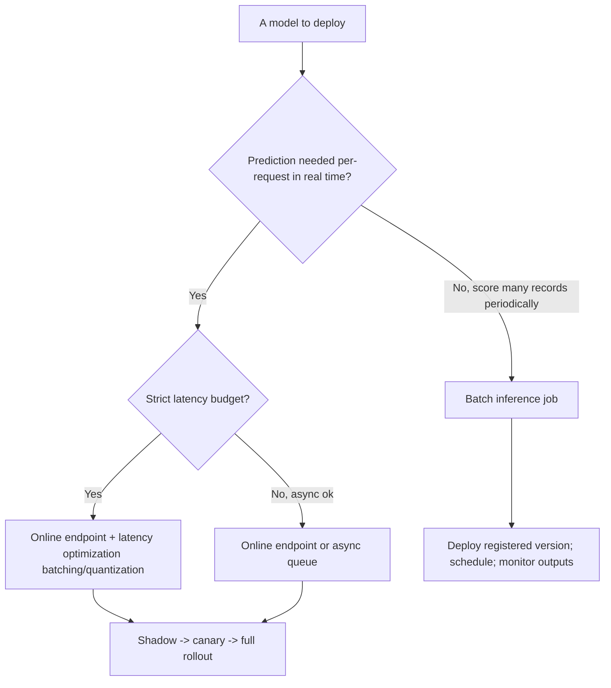
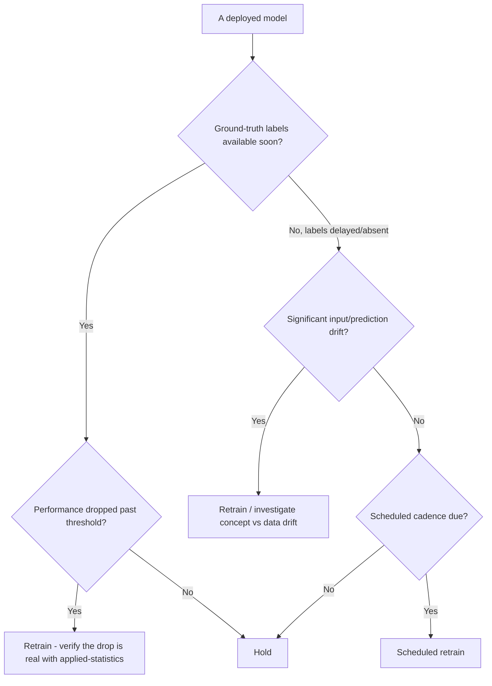

# ML Engineering — Decision Trees

_Decision trees + a dated capability map. Capability rows are `[verify-at-build]` — re-check against the vendor before quoting. Last reviewed: 2026-06-04._

Traverse before choosing a serving pattern or a retraining trigger.

## Decision Tree: Serving pattern: online or batch?

Match the serving pattern to the latency and request shape.

_Deploy a registered version from the registry, never a copied file._

## Decision Tree: When to retrain?

Decide the trigger before launch; drift is the early warning before labels arrive.

## Capability map (dated — verify at build)

| Capability | 2026 state `[verify-at-build]` | Notes |
|---|---|---|
| MLflow / experiment tracking | GA | Params/metrics/artifacts/registry |
| Model registry | GA (MLflow/SageMaker/Vertex) | Source of truth for promotion |
| Feature stores (Feast/managed) | GA | Train-serve consistency |
| Drift detection (Evidently/managed) | GA | Data + prediction drift |
| Serving (KServe/Seldon/managed) | GA | Online + batch; canary |
| Managed platforms (SageMaker/Vertex/Databricks) | GA | Build-vs-buy by maturity |
