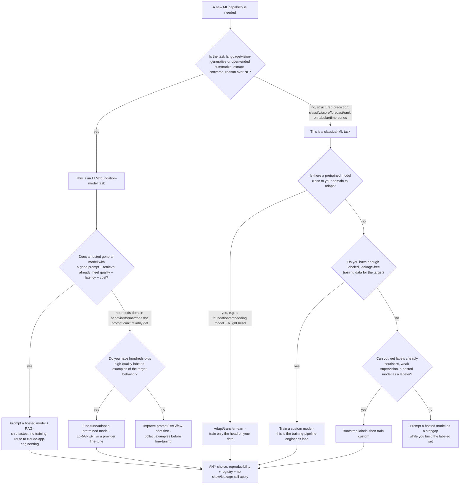
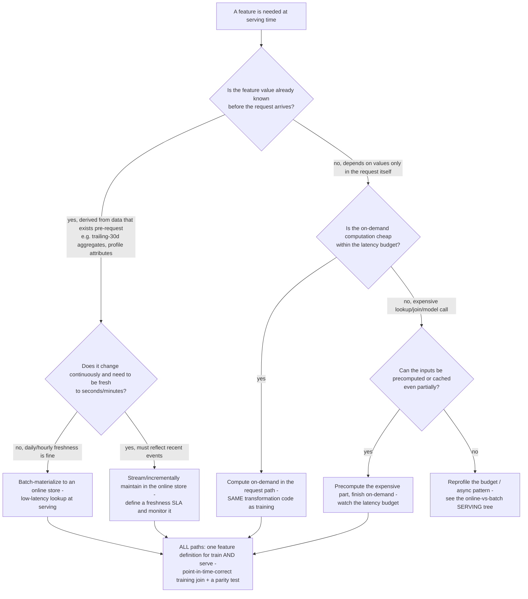

# ML Engineering — Model-Sourcing & Feature-Serving Decision Trees

_Two decision trees that complement [`ml-engineering-decision-trees.md`](ml-engineering-decision-trees.md) (which covers serving pattern, retrain trigger, build-vs-buy platform, drift response, validation split, rollout, retrain automation, and drift metric). These two fill the remaining gaps: **how to source the model** (train your own vs. fine-tune vs. prompt an API) and **how to compute a feature at serving time** (precompute vs. on-demand). Capability rows are `[verify-at-use]` — re-check against the vendor before quoting. Last reviewed: 2026-06-05._

Traverse the relevant tree top-to-bottom before choosing.

## Decision Tree: Build, fine-tune, or prompt? — how to source the model

**When this applies:** a new ML capability is needed and the team is deciding *where the model comes from* — train a custom model on your own data, fine-tune/adapt an existing pretrained model, or call a hosted general model with prompting/retrieval. This is the most common over-engineering decision in 2026: teams train a bespoke model when a prompt would have shipped in a day, or call an expensive API per-request when a tiny custom classifier would have been cheaper and faster.

**Last verified:** 2026-06-05 against the ml-platform-architect mandate and the cross-cutting house opinions in [`../CLAUDE.md`](../CLAUDE.md) §2 (reproducibility floor, skew/leakage discipline apply to *any* sourcing choice).

**Rationale per leaf:**

- *Prompt a hosted model + RAG* — fastest to ship, zero training/MLOps overhead, and in 2026 a strong general model with retrieval clears the bar for most open-ended language/vision tasks. The cost is per-request inference spend and less control. This is `claude-app-engineering`'s lane (prompts, evals, the Agent SDK), not this team's — escalate it.
- *Fine-tune / adapt a pretrained model* — when a prompt can't reliably get the domain-specific behavior, format, or tone *and* you have enough labeled examples. Far cheaper than training from scratch; LoRA/PEFT adapts a large model with a fraction of the compute. Needs a labeled set and a reproducible training + eval pipeline.
- *Train a custom model* — the right call for structured prediction (tabular/time-series classify/score/forecast/rank) where no close pretrained model exists and you have leakage-free labeled data. Often a small gradient-boosted or linear model beats an LLM on tabular tasks at a fraction of the latency and cost. This is the `training-pipeline-engineer`'s core lane.
- *Adapt / transfer-learn* — when a pretrained backbone (embeddings, a foundation model) is close to your domain, train only a light head on your data. Less data, less compute than training from scratch.
- *Bootstrap labels then train* — no labels yet but you can manufacture them (heuristics, weak supervision, a hosted model as a one-time labeler). Build the labeled set, then own a cheap custom model.
- *Improve prompt/RAG/few-shot first* / *prompt as a stopgap* — don't fine-tune or train without enough data; exhaust prompting and collect examples first. A hosted model can also serve as a stopgap *while* you assemble the training set.

**Tradeoffs summary:**

| Choice | Time to ship | Ongoing cost | Control / customization | Data needed | Use when |
|---|---|---|---|---|---|
| Prompt hosted + RAG | Fastest (days) | Per-request inference | Low (prompt only) | None (retrieval corpus) | Open-ended NL/vision; a prompt clears quality/latency/cost |
| Fine-tune / adapt | Medium | Training once + cheaper inference | Medium-high | Hundreds-plus labeled | Prompt can't get the behavior; you have examples |
| Train custom | Slowest | Train + own serving; cheapest inference | Highest | Full labeled, leakage-free | Tabular/structured; no close pretrained model |

> **The 2026 default for open-ended language tasks is: prompt first, fine-tune only when a prompt provably can't, train from scratch only for structured prediction or when no pretrained model fits.** Don't train a bespoke model for something a prompt ships in a day; don't pay per-request API cost for a high-volume tabular classification a 50-KB model does faster. Whether a sourcing choice's quality lift over the cheaper option is *real* → `applied-statistics`. The LLM-application craft (prompt/eval/RAG/Agent SDK) is `claude-app-engineering`'s lane; this team owns the classical/custom-model and fine-tuning MLOps.

## Decision Tree: Compute this feature online or precompute it? — feature serving

**When this applies:** a model needs a feature at serving time and you're deciding *how it's computed* — precomputed and stored for low-latency lookup, computed on-demand from raw inputs in the request, or streamed/incrementally maintained. This is downstream of the "online vs batch *serving*" choice in [`ml-engineering-decision-trees.md`](ml-engineering-decision-trees.md) (that picks how *predictions* are served; this picks how a *feature* reaches the model) and it is the most common source of training-serving skew and serving-latency blowups.

**Last verified:** 2026-06-05 against the training-pipeline-engineer + model-serving-engineer mandates and the feature-store consistency house opinion ([`../CLAUDE.md`](../CLAUDE.md) §2 #2).

**Rationale per leaf:**

- *Batch-materialize to an online store* — the feature is known pre-request and daily/hourly freshness suffices (most profile/aggregate features). A batch job materializes it; serving does a fast key lookup. Cheapest and lowest-latency.
- *Stream / incrementally maintain* — the feature must reflect recent events (last few clicks, current session, fraud velocity). Maintain it incrementally with a streaming job and **declare a freshness SLA** (how stale is too stale) and monitor it — a silently stale online feature is a skew source. The streaming pipeline itself is `data-streaming-engineering`'s lane.
- *Compute on-demand in the request path* — the feature depends on request-time values and is cheap to compute. **Use the exact same transformation code as training** (a shared definition / feature store), or you've reintroduced the two-pipeline skew that makes a great offline model fail online.
- *Precompute the expensive part, finish on-demand (hybrid)* — an expensive lookup/join can be precomputed while a cheap final step runs in-request, keeping inside the latency budget.
- *Reprofile the budget / async* — if even the hybrid can't fit the latency budget, the problem is the serving pattern, not the feature; revisit the online-vs-batch serving tree (async queue / batch scoring).

**Tradeoffs summary:**

| Path | Freshness | Serving latency | Skew risk | Use when |
|---|---|---|---|---|
| Batch-materialize | Daily/hourly | Lowest (lookup) | Low (one batch def) | Pre-request feature, slow-moving |
| Stream/incremental | Seconds/minutes | Low (lookup) | Medium — needs a freshness SLA | Pre-request but must be fresh |
| On-demand | Real-time | Higher (compute in path) | High unless shared transform | Depends on request values, cheap |
| Hybrid | Mixed | Tunable | Medium | Expensive feature, tight budget |

> **Whatever the path, a feature has ONE definition that both training and serving consume, the training join is point-in-time-correct (as-of the row's label time), and a parity test gates promotion** (offline-materialized value == online-served value for the same entity at the same timestamp, within tolerance). The path picks freshness and latency; the single-definition + point-in-time + parity discipline is what prevents training-serving skew on *every* path. See the launch-day-shortfall scenario [`../scenarios/2026-06-05-training-serving-skew-feature-source.md`](../scenarios/2026-06-05-training-serving-skew-feature-source.md) and [`../best-practices/feature-store-is-the-consistency-contract.md`](../best-practices/feature-store-is-the-consistency-contract.md).
