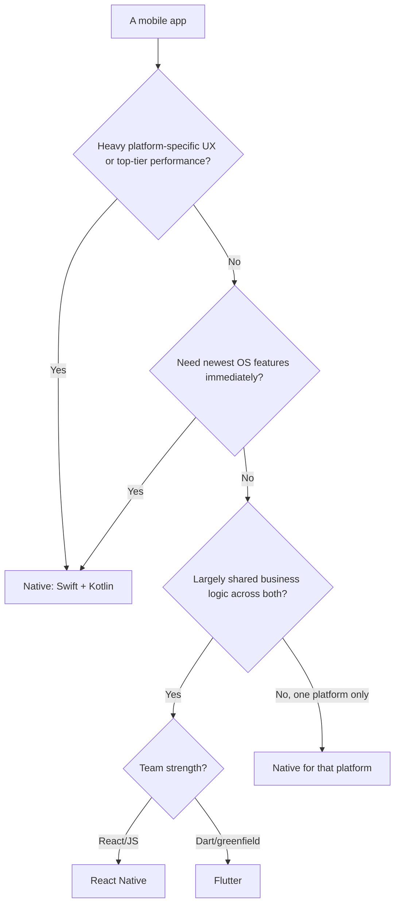
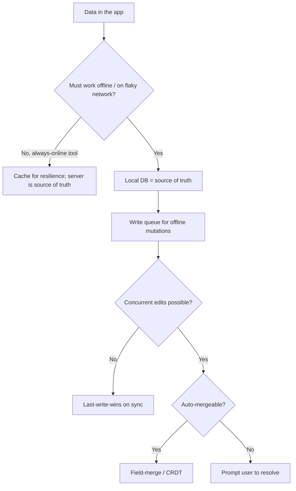
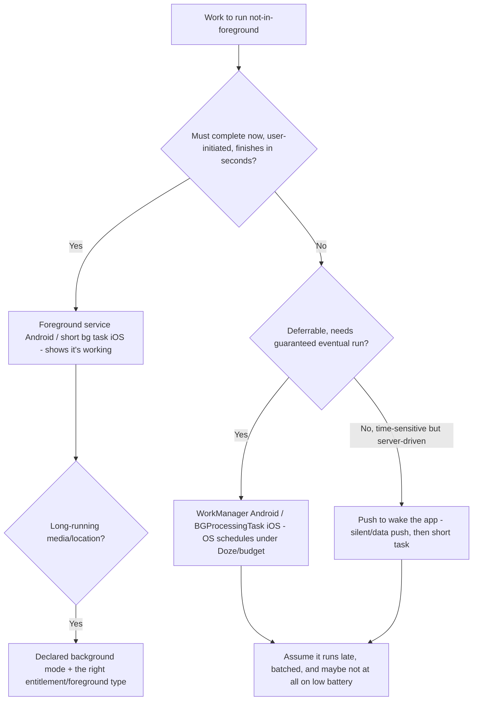
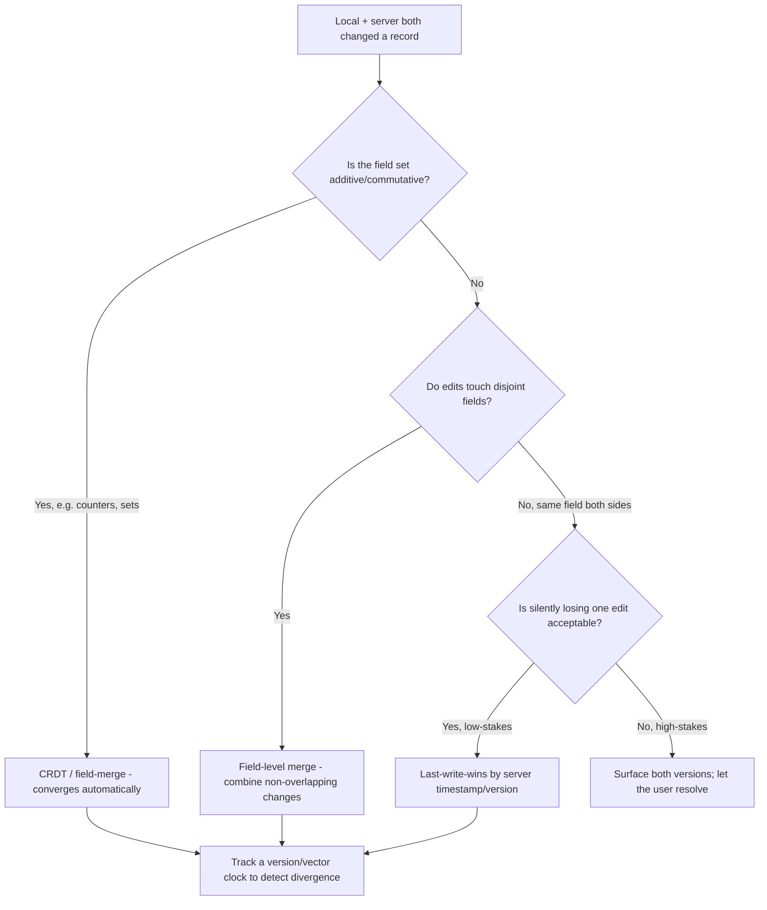
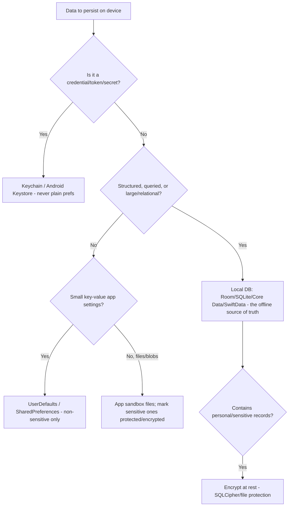
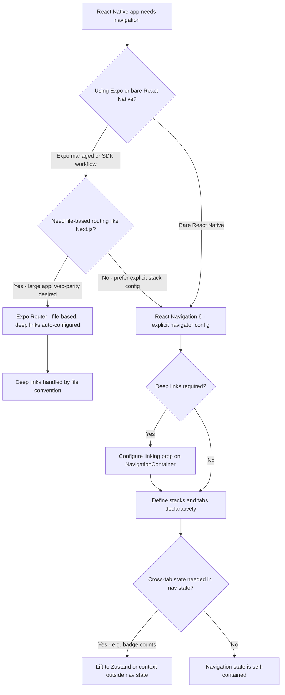
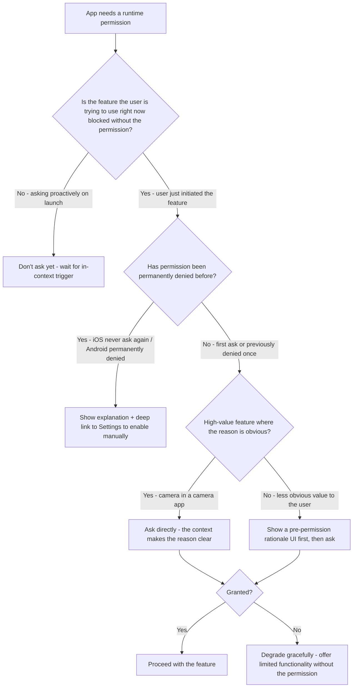
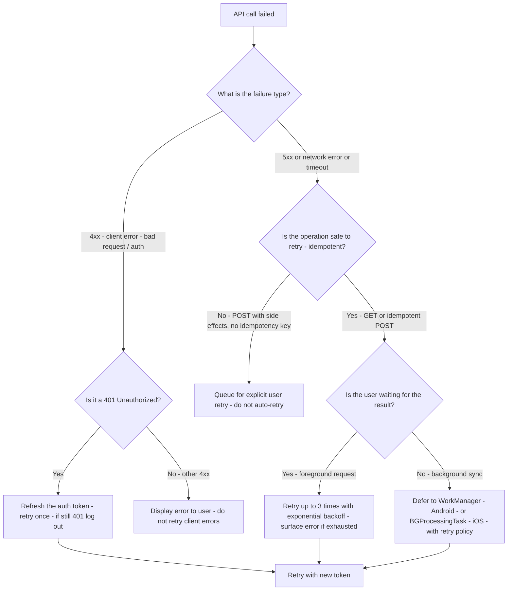

# Mobile Engineering — Decision Trees

_Decision trees + a dated capability map. Capability rows are `[verify-at-build]` — re-check against the vendor before quoting. Last reviewed: 2026-06-04._

Traverse before choosing a platform approach or an offline strategy.

## Decision Tree: Native or cross-platform?

Choose by the app's real needs, not team familiarity.

_Name the trade — cross-platform buys shared iteration and pays at the native boundary + last-5% UX._

## Decision Tree: Offline & sync strategy

Mobile is offline-first; design the source of truth and conflict policy up front.

## Decision Tree: Background work — which API, and is it even allowed?

The OS, not your code, decides when background work runs; pick the API that matches the job's urgency and constraints.

_There is no "run whenever I want" background API — the OS throttles everything. Design the work to be deferrable, batched, and resumable, and let push wake the app for time-sensitive cases._

## Decision Tree: Resolving a sync conflict

The concurrent edit will happen; decide the policy by how costly a wrong merge is.

_Last-write-wins is the cheap default that quietly destroys one user's edit; for anything the user would miss, detect the conflict with a version and let a merge or the human decide._

## Decision Tree: Where should this data live on the device?

Match the store to sensitivity and shape; the secure store is for secrets, not bulk data.

_Preferences stores are plaintext and the secure store is small — put secrets in the Keychain/Keystore and structured offline data in an (encrypted-if-sensitive) local database, never the other way around._

## Capability map (dated — verify at build)

| Capability | 2026 state `[verify-at-build]` | Notes |
|---|---|---|
| SwiftUI + Swift Concurrency | GA | State-driven; actors for races |
| Jetpack Compose + Coroutines/Flow | GA | State hoisting; lifecycle scopes |
| React Native new architecture (Fabric/TurboModules) | GA-ing | Verify per RN version |
| Flutter | GA | Const widgets; impeller renderer |
| Keychain / Android Keystore | GA | Secure storage for secrets |
| WorkManager / BGTaskScheduler | GA | Battery-respecting background |
| Push (APNs / FCM) | GA | On-device handling here; backend elsewhere |

## Decision Tree: Which navigation architecture for a React Native app?

**When this applies:** You are setting up navigation in a React Native application and must choose between navigation libraries and decide the navigation state model. Triggered at project setup or when the current navigation structure causes deep-linking or state-restoration problems.

**Last verified:** 2026-06-05 against React Navigation 6 and Expo Router documentation.

**Rationale per leaf:**
- *Expo Router* — file-based routing reduces navigation boilerplate and makes deep links automatic; best for Expo SDK apps with many routes.
- *React Navigation 6* — the explicit stack/tab/drawer API gives precise control; the standard for bare React Native.
- *Linking config* — required for Universal Links and App Links to map URLs to screens.
- *Zustand outside nav state* — navigation state is not the right place for cross-tab business state; keep nav state purely navigational.

**Tradeoffs summary:**

| Method | Cost / time | Blast radius | Approval gate? | Use when |
|---|---|---|---|---|
| Expo Router | Low | File-convention coupling | None | Expo SDK app, many routes |
| React Navigation 6 | Medium | Explicit config overhead | None | Bare RN or complex nav trees |
| Zustand for cross-tab state | Low | External dep | None | Shared state across tab roots |

## Decision Tree: Handle a runtime permission request — when and how?

**When this applies:** The app needs a runtime permission (camera, location, notifications, contacts) and you must decide when to ask and how to handle denial.

**Last verified:** 2026-06-05 against Apple Human Interface Guidelines (permission best practices) and Android developer documentation.

**Rationale per leaf:**
- *Wait for context* — asking on launch without context produces denial; users don't know why the app needs the permission.
- *Settings deep link* — once permanently denied, the OS will not show the permission dialog again; the only path is manual Settings.
- *Ask directly* — when context makes the need obvious (camera in a camera app), an explanation screen adds friction without value.
- *Pre-permission rationale* — a brief "we need your location to show nearby stores" screen before the OS dialog improves grant rates.
- *Graceful degradation* — the app must work (with reduced features) for users who deny; never crash or block on a denied permission.

**Tradeoffs summary:**

| Method | Cost / time | Blast radius | Approval gate? | Use when |
|---|---|---|---|---|
| Ask directly | Minimal | May reduce grant rate | None | Feature need is self-evident |
| Rationale then ask | Low | Better grant rate | None | Non-obvious permission |
| Settings deep link | Low | Friction for user | None | Permanently denied |
| Graceful degradation | Medium | Reduced feature set | None | Permission denied or not yet granted |

## Decision Tree: Implement network retry for a mobile API call

**When this applies:** A mobile API call fails and you need to decide whether to retry, show an error, or queue for later. Triggered by a network error, a 5xx response, or a timeout during any foreground or background network operation.

**Last verified:** 2026-06-05 against URLSession and OkHttp retry documentation and standard mobile networking patterns.

**Rationale per leaf:**
- *Token refresh then retry* — a 401 usually means an expired access token; refresh and retry once before logging out.
- *Display 4xx errors* — client errors indicate a bug or a user action that cannot succeed by retrying; auto-retry would loop forever.
- *Queue for user retry* — non-idempotent writes (create order, submit payment) should not auto-retry; the user should confirm.
- *Exponential backoff for foreground* — transient server errors usually resolve quickly; a few retries with backoff are appropriate.
- *WorkManager / BGTask for background* — the OS job scheduler handles retry policy, battery budgets, and connectivity waits.

**Tradeoffs summary:**

| Method | Cost / time | Blast radius | Approval gate? | Use when |
|---|---|---|---|---|
| Immediate retry | Minimal | May amplify server load | None | Very short transient errors |
| Exponential backoff | Low | Bounded retry count | None | Foreground transient failures |
| User-initiated retry | Minimal | User friction | None | Non-idempotent operations |
| WorkManager / BGTask | Low-medium | OS-deferred | None | Background sync, deferrable |
