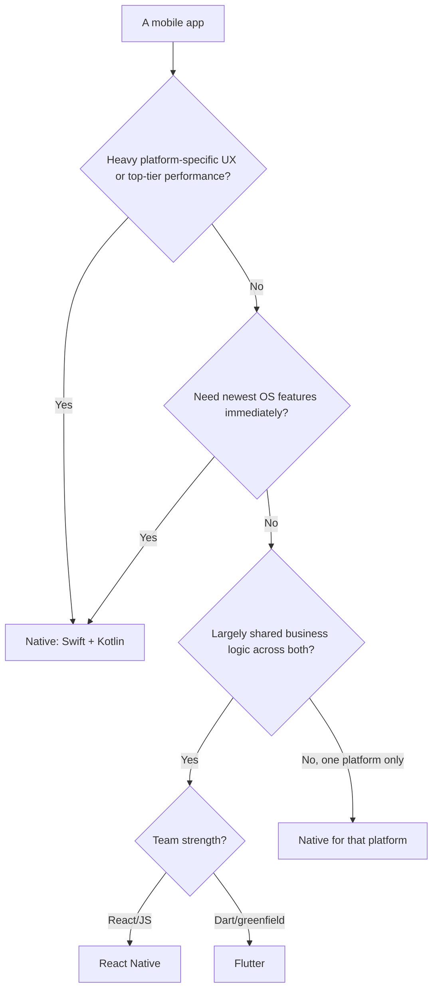
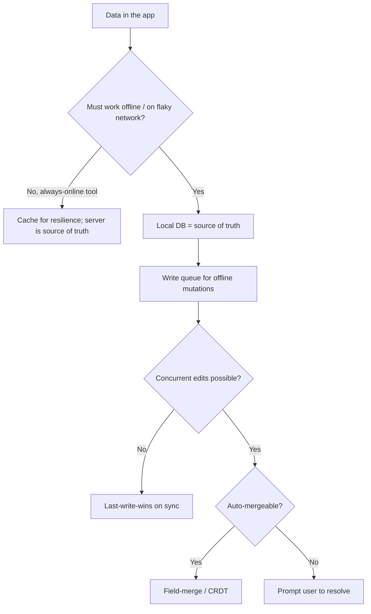
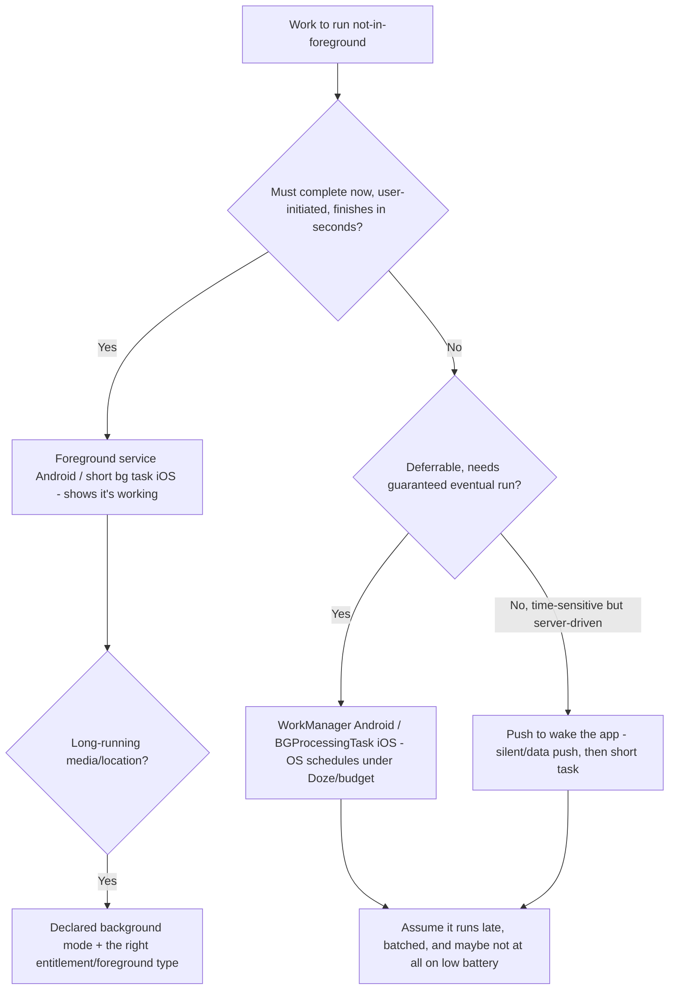
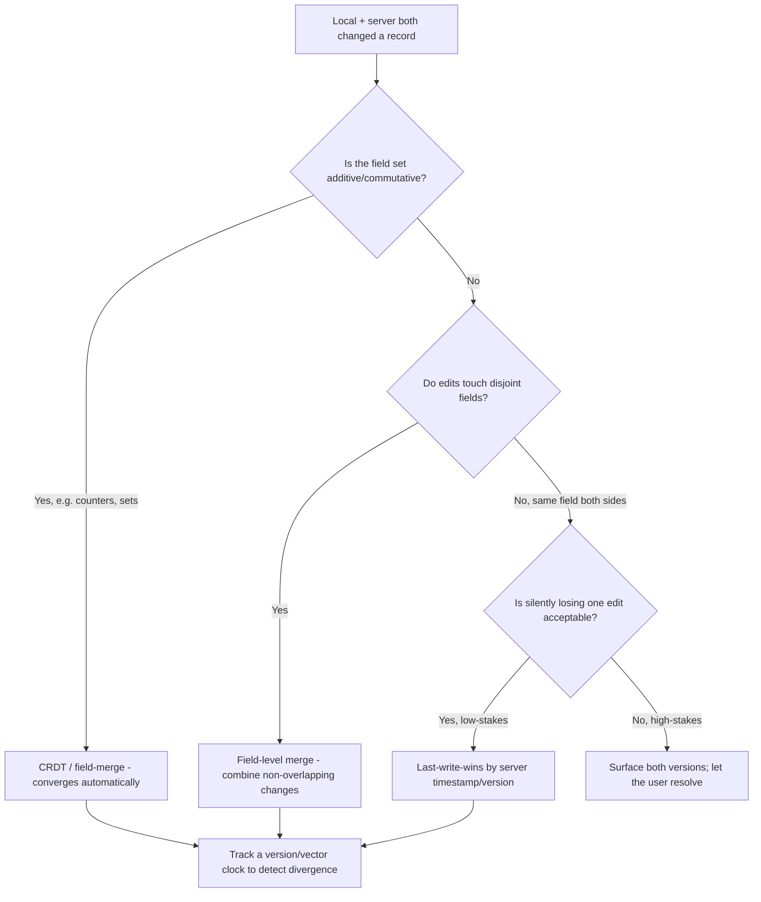
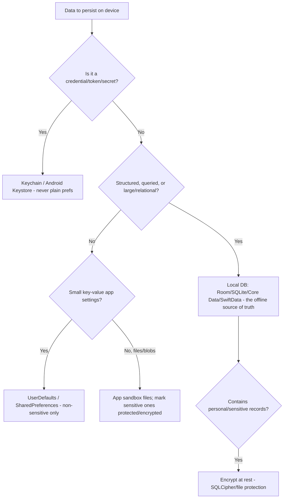

# Mobile Engineering — Decision Trees

_Decision trees + a dated capability map. Capability rows are `[verify-at-build]` — re-check against the vendor before quoting. Last reviewed: 2026-06-04._

Traverse before choosing a platform approach or an offline strategy.

## Decision Tree: Native or cross-platform?

Choose by the app's real needs, not team familiarity.

_Name the trade — cross-platform buys shared iteration and pays at the native boundary + last-5% UX._

## Decision Tree: Offline & sync strategy

Mobile is offline-first; design the source of truth and conflict policy up front.

## Decision Tree: Background work — which API, and is it even allowed?

The OS, not your code, decides when background work runs; pick the API that matches the job's urgency and constraints.

_There is no "run whenever I want" background API — the OS throttles everything. Design the work to be deferrable, batched, and resumable, and let push wake the app for time-sensitive cases._

## Decision Tree: Resolving a sync conflict

The concurrent edit will happen; decide the policy by how costly a wrong merge is.

_Last-write-wins is the cheap default that quietly destroys one user's edit; for anything the user would miss, detect the conflict with a version and let a merge or the human decide._

## Decision Tree: Where should this data live on the device?

Match the store to sensitivity and shape; the secure store is for secrets, not bulk data.

_Preferences stores are plaintext and the secure store is small — put secrets in the Keychain/Keystore and structured offline data in an (encrypted-if-sensitive) local database, never the other way around._

## Capability map (dated — verify at build)

| Capability | 2026 state `[verify-at-build]` | Notes |
|---|---|---|
| SwiftUI + Swift Concurrency | GA | State-driven; actors for races |
| Jetpack Compose + Coroutines/Flow | GA | State hoisting; lifecycle scopes |
| React Native new architecture (Fabric/TurboModules) | GA-ing | Verify per RN version |
| Flutter | GA | Const widgets; impeller renderer |
| Keychain / Android Keystore | GA | Secure storage for secrets |
| WorkManager / BGTaskScheduler | GA | Battery-respecting background |
| Push (APNs / FCM) | GA | On-device handling here; backend elsewhere |
