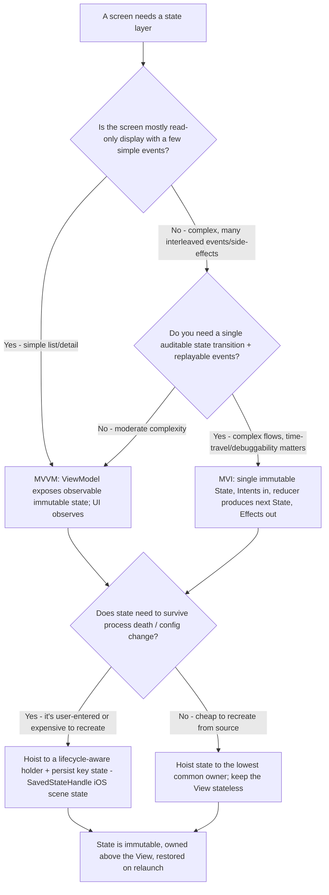
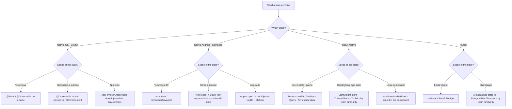

# Mobile State & Architecture — Decision Trees

_Two Mermaid trees that **complement** [`mobile-engineering-decision-trees.md`](mobile-engineering-decision-trees.md) (platform choice, offline/sync, background work, conflict, on-device storage, RN navigation, permissions, retry). These cover the gap that file leaves: the **app-architecture pattern** and the **per-platform state-management library** choice. Traverse the relevant tree top-to-bottom before choosing. Library rows are `[verify-at-use]` — re-check the maintainer/vendor before quoting a name or status. Last reviewed: 2026-06-05._

---

## Decision Tree: Which app-architecture pattern? (MVVM vs MVI vs plain unidirectional)

**When this applies:** You are setting up (or refactoring) the presentation/state layer of a mobile app and must choose how UI state flows. Triggered at project start, when a screen's state logic becomes unmanageable, or when recomposition/redraw bugs trace back to mutable, scattered state.

**The house position (CLAUDE.md §2.3 — respect the lifecycle; state survives process death):** prefer a **unidirectional data flow** where the UI is a function of immutable state. MVVM and MVI are both unidirectional shapes; the question is how much ceremony the screen's complexity justifies.

**Rationale per leaf:**

- **MVVM** — the default for typical screens. A ViewModel owns immutable, observable state; the View renders it and sends events up. Lower ceremony than MVI; the right altitude for most CRUD/list/detail UI.
- **MVI** — for complex screens with many interleaved events and side-effects, where a *single* `State` value + an explicit reducer (`Intent → State`) buys debuggability, replayability, and a single source of truth. The ceremony pays off when the state machine is genuinely hard; it's overkill for a settings screen.
- **Hoist state / stateless View** — both Compose and SwiftUI reward state hoisting: the View is a pure function of state, state lives in the lowest common owner above it. This is what makes recomposition/redraw predictable (the project's `compose-state-hoisting` / `swiftui-state-ownership-hierarchy` best-practices).
- **Survive process death** — anything user-entered or expensive to recreate must be persisted (`SavedStateHandle` / restored scene state) so a backgrounded-then-killed app restores correctly (CLAUDE.md §2.3; the `survive-process-death` best-practice).

**Tradeoffs summary:**

| Pattern | Cost / ceremony | Blast radius | Approval gate? | Use when |
|---|---|---|---|---|
| MVVM | Low | Per-screen ViewModel | None | Typical display + simple events |
| MVI | Medium-high | Reducer + Intent/Effect plumbing | None | Complex, event-heavy, needs single auditable state |
| Plain unidirectional + hoisting | Low | Minimal | None | Small screens / leaf components |

> **Boundary:** all three are unidirectional. The wrong default is *bidirectional* mutable state scattered across the View — that's the anti-pattern the team flags, not "MVVM vs MVI." Pick the lightest shape the screen's complexity justifies.

---

## Decision Tree: Which state-management library, per platform?

**When this applies:** You've chosen a pattern (above) and now need the concrete state primitive/library for your stack. Triggered at project setup or when the current state tool is fighting the framework.

**Last verified:** 2026-06-05 against each ecosystem's current first-party guidance; **all library rows are `[verify-at-use]`** — the cross-platform ecosystem in particular moves fast, so confirm the maintained/recommended option before committing.

**Rationale per leaf (`[verify-at-use]` — confirm the current recommended option per ecosystem):**

- **SwiftUI** — view-local state in `@State`; an observable model (the `@Observable` macro, current Swift) for shared/app scope, injected via `@Environment`. Don't reach for a third-party store before the framework primitives fall short. *(The `@Observable` macro vs older `ObservableObject`/`@StateObject` is version-dependent — `[verify-at-use]`.)*
- **Jetpack Compose** — `remember`/`rememberSaveable` for UI-local; a `ViewModel` exposing immutable UI state via `StateFlow` for screen scope; an app-scoped holder via DI (Hilt/Koin) for app-wide. This is the Android-recommended unidirectional shape.
- **React Native** — separate **server state** from **client state**: a server-state/cache library (e.g. TanStack Query) for fetched data, and a lightweight client store (Zustand or Redux Toolkit) for global app state, with local `useState`/`useReducer` staying in the component. Conflating server cache with global client state is the common RN mistake. *(Specific library popularity shifts — `[verify-at-use]`.)*
- **Flutter** — `setState` for local widget state; a maintained shared-state library (Riverpod/Bloc/Provider) chosen by team familiarity for app/shared scope. *(Pick the actively-maintained option at adoption — `[verify-at-use]`.)*

**Cross-cutting rule (all stacks):** scope the state to the **lowest owner that needs it**, keep it **immutable + observed**, and reach for a heavier library only when the framework primitive genuinely falls short. App-wide global state for screen-local concerns is a coupling smell on every platform.

**Tradeoffs summary:**

| Stack | Local | Screen/shared | App-wide | Note |
|---|---|---|---|---|
| SwiftUI | `@State` | `@Observable` + `@Environment` | App-level store via Environment | Framework primitives first |
| Compose | `remember(Saveable)` | `ViewModel` + `StateFlow` | DI-scoped holder | Android-recommended UDF |
| React Native | `useState`/`useReducer` | server-state lib for fetched data | lightweight client store | Split server vs client state |
| Flutter | `setState` | maintained state lib | same lib, app scope | Pick maintained at adoption |

> **Boundary:** this tree picks the *state primitive*, not the *navigation* model (see the RN-navigation tree in the sibling file) and not the *on-device persistence* store (see the "Where should this data live on the device?" tree). State-in-memory, navigation-state, and persisted-state are three different decisions — don't collapse them.

---

## Sources

- SwiftUI state management & `@Observable` — Apple Developer documentation, "Managing model data in your app" / Observation framework (retrieved 2026-06-05): https://developer.apple.com/documentation/swiftui/managing-model-data-in-your-app
- Android app architecture & UI state (UDF, ViewModel + StateFlow) — Android Developers, "Guide to app architecture" / "UI state production" (retrieved 2026-06-05): https://developer.android.com/topic/architecture
- React Navigation 6 / Expo Router (referenced by the sibling nav tree) and server-vs-client state split — React Navigation docs (https://reactnavigation.org/) and TanStack Query docs (https://tanstack.com/query) (retrieved 2026-06-05).
- Flutter state management options — Flutter docs, "List of state management approaches" (retrieved 2026-06-05): https://docs.flutter.dev/data-and-backend/state-mgmt/options

> All specific library names, macros, and "recommended" status are version-volatile and marked `[verify-at-use]`. Re-confirm against the listed first-party docs before quoting in a deliverable.
</content>
