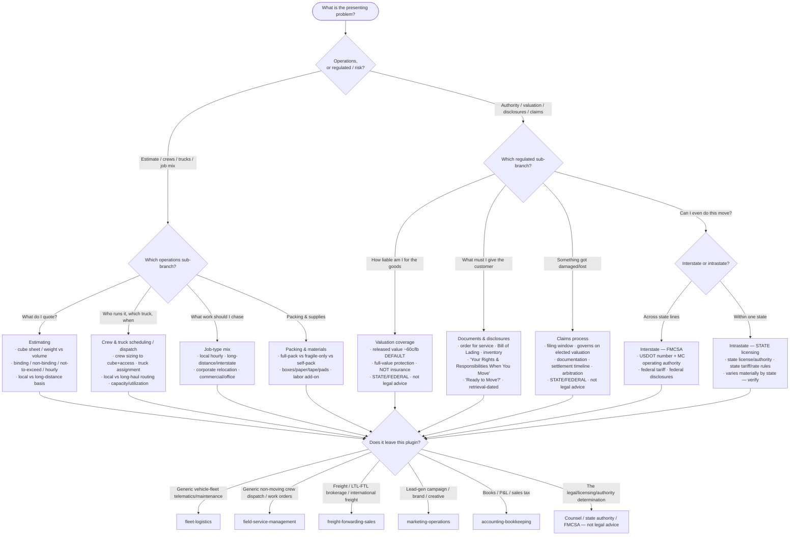

# Knowledge — Moving & relocation decision tree

> **Last reviewed:** 2026-07-13 · **Confidence:** Medium-High (consensus on the operations-vs-regulated framing, the estimate-type distinctions, the released-vs-full-value valuation split, and the general interstate-FMCSA / intrastate-state-licensing divide; **specific FMCSA rules, the 60¢/lb figure, disclosure-booklet titles, state licensing regimes, tariff conventions, and moving-software features are volatile — re-verify with a state/federal + retrieval date before a client commitment. Authority, tariff, valuation, licensing, and liability mechanics here are operational guidance, NOT legal advice.**).
> The first question in any moving engagement is "is this an *operations* problem or a *regulated/risk* one?" This is the decision tree the `moving-operations-lead` traverses to scope and route, and the `moving-compliance-and-claims-specialist` traverses to reach its regulated sub-branch — **before** prescribing a fix, a price, or a compliance call.

The team's discipline: **name the branch before the fix; build the estimate from an inventory before quoting; pin interstate vs intrastate before any authority/tariff/valuation call; and flag state/federal + retrieval date and "not legal advice" on any authority, licensing, tariff, valuation, or claims step.** Generic vehicle-fleet telematics leaves this plugin for `fleet-logistics`; generic non-moving dispatch is `field-service-management`; freight (not household goods) is `freight-forwarding-sales`.

---

## Decision Tree: scope & route a moving engagement

Traverse top-to-bottom. Gate on **operations vs regulated/risk** first, then the sub-branch.

---

## Estimating: the estimate types you must not conflate

| Estimate type | What it means | Who carries the under-count risk |
|---|---|---|
| **Binding** | A fixed price for the described inventory/services; doesn't change if the actual weight differs | The **mover** (if under-estimated) — unless the shipment/services materially change |
| **Non-binding** | An estimate of likely cost; the final charge is based on actual weight/services (with federal limits on how much more can be collected at delivery) | The **customer** — the bill can rise with actual weight |
| **Not-to-exceed (guaranteed-not-to-exceed)** | The customer pays the **lower** of the estimate or the actual — a customer-favorable cap | The **mover** on the upside; customer benefits from any downside |
| **Local hourly** | Crew-hours × hourly rate + travel + materials (typical for local moves) | Shared — hours can run over; buffer and communicate |

Build every one of these from a **cube sheet / inventory**, not a guess. The *estimate-type recommendation and the number* are the operations lead's; the *disclosure of the type and the accompanying federal paperwork* are the specialist's.

---

## The interstate-vs-intrastate fork (after "it's a regulated problem")

| Regime | Governs | Watch out for |
|---|---|---|
| **Interstate (across state lines)** | **FMCSA** — federal operating authority: a **USDOT number** and, for for-hire household goods, an **MC number**; a federal **tariff**; the mandated federal **disclosures** | No authority = can't legally do the move; the disclosure set is mandatory; verify current FMCSA requirements + retrieval date |
| **Intrastate (within one state)** | **That state's** licensing / authority and tariff/rate rules — **varies materially by state** | Never assume another state's rule applies; some states have their own household-goods tariff and licensing regimes — verify per state |

Pinning interstate vs intrastate is the **first** move on the regulated branch — it selects the entire regime, the paperwork, and the tariff basis. Getting it wrong makes every downstream answer wrong.

---

## Valuation vs insurance — the distinction the specialist enforces

| | Released value | Full-value protection | Actual insurance |
|---|---|---|---|
| **What it is** | The mover's **default liability limit** (~**60¢ per pound per article**) | The mover is liable to **repair / replace / settle** at the item's value | A separate **third-party insurance** product |
| **Cost** | No separate charge (the default) | Priced separately, customer elects it | Bought from an insurer, separate premium |
| **Is it insurance?** | **No** — it's a liability level | **No** — it's a liability level | **Yes** — route the insurance question out |

Valuation is the mover's **liability**, mandated to be offered on interstate moves; it is **not** insurance. The claim later settles on **whichever valuation the customer elected**.

---

## Seams (this plugin operates the moving BUSINESS — not a vehicle fleet, generic dispatch, or freight)

- **Generic vehicle-fleet telematics, maintenance scheduling, route-optimization for a vehicle fleet** → `fleet-logistics` (this plugin owns moving crews & trucks in the context of moves, not a generic fleet platform).
- **Generic mobile-crew dispatch / work-order routing for non-moving field service** → `field-service-management`.
- **Freight forwarding, LTL/FTL freight brokerage, international ocean/air freight** → `freight-forwarding-sales` (freight, **not** household goods).
- **Lead-gen / paid-search *campaign* strategy, brand, creative** → `marketing-operations`.
- **Bookkeeping, the P&L, sales tax on the move/valuation** → `accounting-bookkeeping`.
- **The actual legal / licensing / authority determination** on a move, tariff, valuation, or claim → the client's counsel, the **state licensing authority**, and/or **FMCSA** (this team gives operational guidance, not legal advice).

---

## Provenance

- Durable framing (operations-vs-regulated split, the estimate-type distinctions, cube-sheet/weight estimating, the interstate-FMCSA / intrastate-state-licensing divide, released-vs-full-value valuation as a liability level not insurance, the general claims sequence) is consensus household-goods moving practice, reviewed 2026-07-13 — **Medium-High confidence**.
- **FMCSA rules, the ~60¢/lb released-value figure, the federal disclosure-booklet titles ("Your Rights and Responsibilities When You Move", "Ready to Move?"), state intrastate licensing regimes, tariff conventions, and moving-software feature sets (SmartMoving, MoveitPro, Elromco, Supermove) are volatile** — treat any specific claim as a 2026-07 snapshot, attach a state/federal and/or retrieval date, and re-verify with `ravenclaude-core/deep-researcher` before a client commitment. Authority, tariff, valuation, licensing, and claims mechanics are **operational guidance, not legal advice** — route the determination to counsel / the state authority / FMCSA.
