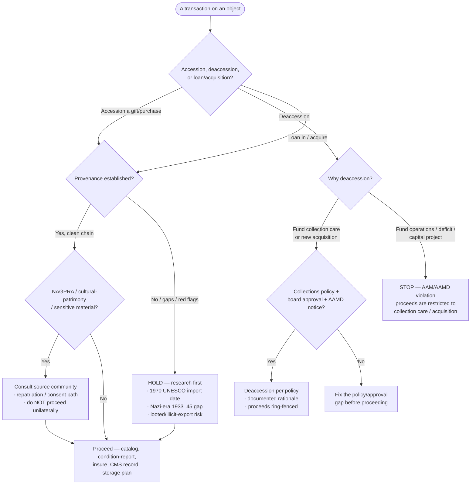
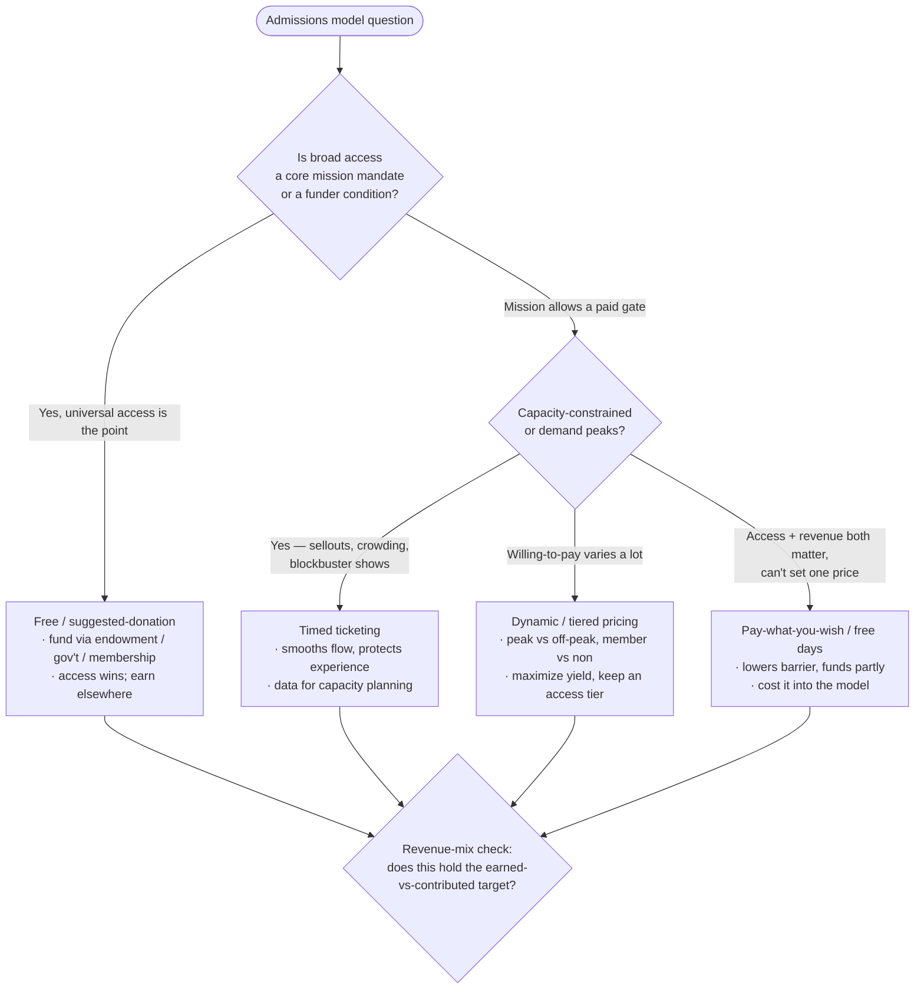

# Knowledge — Museum operations decision tree

> **Last reviewed:** 2026-07-09 · **Confidence:** Medium-High (consensus on the ethics gate — deaccession-proceeds restriction, provenance/NAGPRA due diligence — and on the pricing-model and revenue-mix framing; **specific AAM/AAMD standard wording, NAGPRA rule details, and CMS feature/pricing claims are volatile — re-verify before a board or client commitment**).
> The recurring museum-operations questions are "can we accession/deaccession this?", "which admissions/pricing model?", "which collections CMS?", "do we publish this online?", and "what earned-vs-contributed mix should we hold?". This is the decision tree the two agents traverse **before** answering, plus the trade-off tables and the seams to adjacent plugins.

The team's discipline: **the ethics/provenance/rights gate runs first** — no accession, deaccession, loan, or publication clears until it does. Then name the operating model. Generic donor strategy, event production, and the grant lifecycle **leave this layer** for `nonprofit-fundraising`, `event-management`, and `grants-management`.

---

## Decision Tree A: the collections ethics & lifecycle gate

Traverse top-to-bottom. **Nothing moves until the gate clears.**



**The rule that catches most mistakes:** deaccession proceeds fund **collection care or acquisition only** — never operations, a deficit, or a capital project. That single restriction (AAM Code of Ethics / AAMD) is the field's brightest line.

---

## Decision Tree B: admissions & pricing model



Cross-cut every model with the **access-vs-revenue trade-off** — say what access the model buys or spends, and what funds the gap.

---

## Decision Tree C: collections management system (CMS)

```mermaid
graph TD
  C([Need a collections CMS]) --> SIZE{Collection size + staff + budget?}

  SIZE -->|Large, multi-dept,<br/>enterprise budget + IT| ENT{Prefer a market-leader<br/>or a broad ecosystem?}
  SIZE -->|Small-to-mid, lean staff,<br/>tight budget, history/heritage| PP[PastPerfect<br/>· affordable, widely used by<br/>small museums & historical societies]
  SIZE -->|Want open-source, no license lock-in,<br/>tech capacity to host/configure| CS[CollectionSpace<br/>· open-source, configurable<br/>· needs implementation capacity]

  ENT -->|Fine-art / large museum default| TMS[TMS (Gallery Systems)<br/>· deep art-museum feature set<br/>· registration/loans/exhibitions]
  ENT -->|Library/archive/heritage breadth,<br/>global support| AX[Axiell<br/>· museums + archives + libraries<br/>· EMu / Collections lines]

  TMS --> MIG
  AX --> MIG
  PP --> MIG
  CS --> MIG
  MIG{Migration cost + data cleanup + training} --> DONE[Decision + flip conditions]
```

> **A CMS is a decade-long commitment; migration is brutal.** The data-migration + cleanup + retraining cost is *part of* the decision, not an afterthought — a "better" system rarely justifies a two-year migration.

---

## Decision Tree D: digital-collections publish (rights gate)

```mermaid
graph TD
  D([Publish an object online]) --> RIGHTS{Copyright status?}

  RIGHTS -->|Public domain| SENS{Culturally sensitive /<br/>NAGPRA / community-restricted?}
  RIGHTS -->|In copyright — museum holds/clears| SENS
  RIGHTS -->|In copyright — NOT cleared| HOLD[Do not publish full image<br/>· thumbnail/metadata only<br/>· clear rights or wait]

  SENS -->|Yes| COMM[Consult source community<br/>· traditional-knowledge labels<br/>· restrict or contextualize]
  SENS -->|No| OPEN{Open access?}

  OPEN -->|Yes — expand reach| OA[Open access / CC0 / CC-BY<br/>· IIIF image API + manifest<br/>· rights statement (rightsstatements.org)]
  OPEN -->|Rights-restricted display| RES[Publish under a clear license<br/>· IIIF with access terms<br/>· DAMS as source of truth]

  COMM --> RES
  OA --> DAMS[DAMS + online catalog + IIIF viewer]
  RES --> DAMS
```

---

## Trade-off table — admissions/pricing models

| Model | Sweet spot | Watch out for |
|---|---|---|
| **Free / suggested donation** | Access is the mission (civic/national museums); endowment/gov't/membership funds it | Leaves ticket revenue on the table; suggested-donation yields are low — earn elsewhere |
| **Timed ticketing** | Capacity-constrained sites, blockbusters, post-2020 flow control | Adds friction/ops overhead; can suppress spontaneous visits if too rigid |
| **Dynamic / tiered pricing** | Variable willingness-to-pay, peak vs off-peak, special exhibitions | Perceived fairness risk; needs demand data; always keep an accessible tier |
| **Pay-what-you-wish / free days** | Balancing access with some revenue; community goodwill | Partial funding only — must be costed into the model with a named funding source |

## Trade-off table — earned vs contributed levers

| Earned levers | Contributed levers |
|---|---|
| Admissions (timed/dynamic), **membership**, retail/shop, café/restaurant, **venue rental**, program fees, traveling-exhibition fees, image licensing | Individual **development** (patron circles, major gifts), **corporate sponsorship**, galas/benefits, **grants** (govt/foundation), **endowment** draw, planned/legacy gifts |

> A healthy mix is **deliberate and diversified** — a museum that is ~90% one line (all-earned or all-endowment) is one shock away from crisis. Name the target split and the levers on each side.

---

## Seams (museum operations is a domain, not a rival to the general disciplines)

- **Generic individual-donor *strategy*** (annual fund architecture, major-gift moves management, planned giving, capital-campaign methodology) → `nonprofit-fundraising`. This team does museum-*specific* development (membership, patron circles, sponsorship, galas).
- **Generic event *production*** (logistics, AV, catering, run-of-show for a gala/opening/rental) → `event-management`. This team decides the program & revenue; they produce the event.
- **The grant *lifecycle*** (prospect research, proposal writing, award compliance, reporting) → `grants-management`. This team names the contributed-revenue need.
- **Audience marketing / CRM / advertising** for membership/exhibitions → `marketing-operations`.
- **University-museum parent-institution governance/HR** → `higher-education-administration`.

---

## Provenance

- Ethics framing — deaccession-proceeds restriction, provenance/1970-UNESCO/Nazi-era due diligence, NAGPRA/repatriation — is consensus practice per the **AAM Code of Ethics**, **AAMD** deaccession guidance, and the **ICOM Code of Ethics for Museums**, reviewed 2026-07-09; **exact current wording is volatile — re-verify before quoting to a board**.
- CMS positioning (TMS/Gallery Systems, Axiell, PastPerfect, CollectionSpace) and admissions-model patterns are a 2026-07 snapshot; **feature sets, pricing, and sector benchmarks change — re-verify with `ravenclaude-core/deep-researcher` before a client commitment.**
