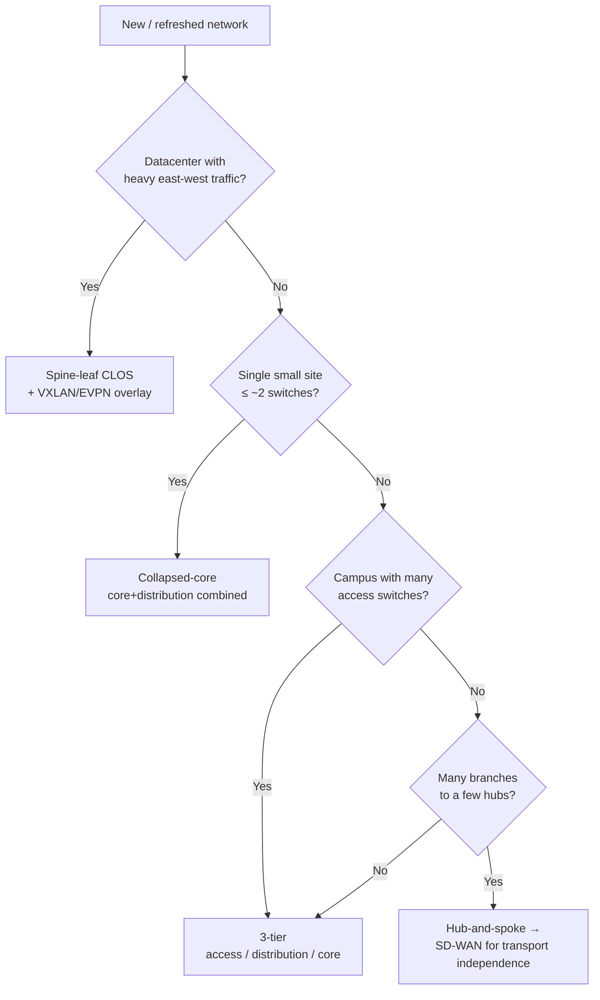
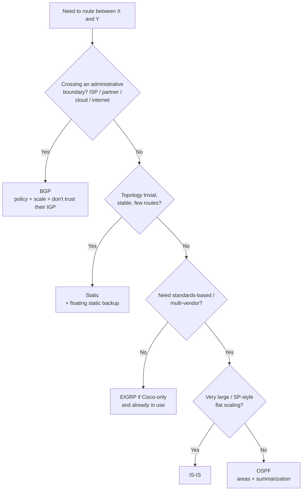
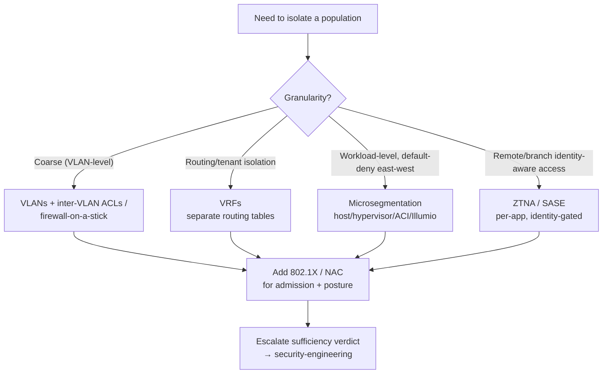
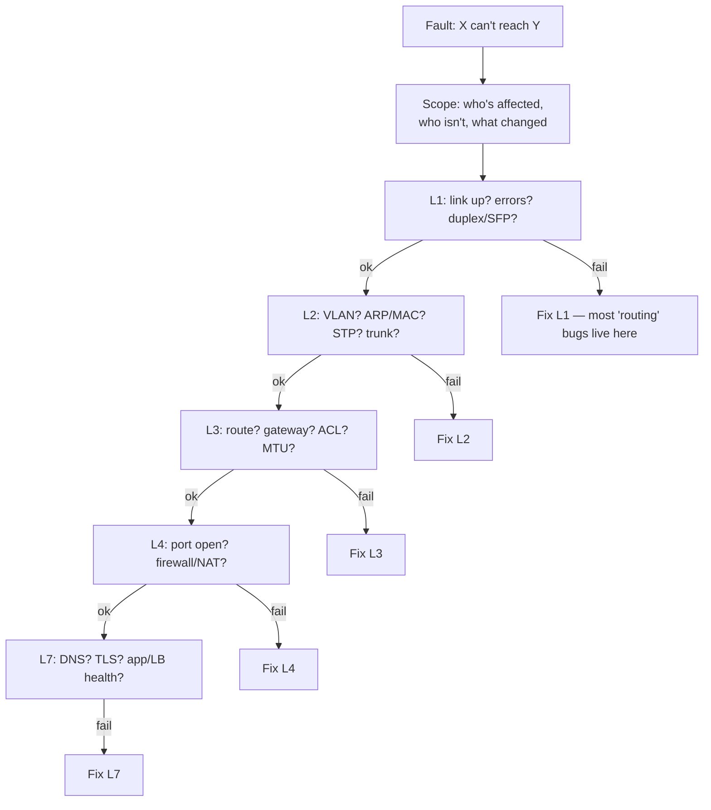

# Network engineering — decision trees

> **Last reviewed:** 2026-06-29. Confidence: **High** for the durable design principles (topology selection, routing-protocol boundaries, OSI troubleshooting, segmentation) — these are stable network-engineering fundamentals. Vendor-specific feature support is in the companion [`network-engineering-2026-capability-map.md`](network-engineering-2026-capability-map.md) and carries its own freshness rider.
>
> Source of truth for the agents' decision-tree traversals (Capability Grounding Protocol). Inline priors live on the agents; this file is re-read on demand.

## 1. Topology selection

**Why:** match the topology to the *traffic pattern and scale*, not to fashion. Spine-leaf gives predictable any-to-any east-west latency (great for DC/virtualization, overkill for a small office). Collapsed-core is right-sized for a small site. 3-tier scales a campus. SD-WAN modernizes hub-and-spoke with policy-driven, transport-independent branch connectivity.

## 2. Routing-protocol selection

**Why:** the *boundary* drives the choice. BGP at any boundary you don't fully control (including most cloud interconnects — Direct Connect/ExpressRoute use BGP). An IGP inside a domain you own. Static when running a protocol buys nothing. Always summarize at area/AS edges; authenticate adjacencies; add BFD for sub-second convergence.

## 3. Segmentation / zero-trust mechanism

**Why:** segment by *trust*, not convenience. Default-deny east-west from a real flow inventory; the management plane is its own out-of-band segment. Zero-trust = never trust network location alone (identity + device posture + least privilege). This plugin *designs* the segmentation; `security-engineering` rules whether it's *sufficient*.

## 4. Connectivity troubleshooting triage (bottom-up OSI)

**Why:** isolate before you fix; confirm each layer with a command before forming the next hypothesis. Establish the working boundary, then bisect toward the break. The fault is usually where the symptom *isn't*.

## Quick reference — first-hop & link redundancy

| Need | Mechanism |
|---|---|
| Gateway redundancy | HSRP / VRRP / GLBP |
| Link aggregation | LACP (802.3ad) |
| Multi-chassis (no STP block, active-active uplinks) | MLAG / vPC / stacking |
| Loop prevention (where MLAG isn't used) | RSTP / MST (and prune the L2 domain) |
| Sub-second failure detection | BFD (with the routing protocol) |
| WAN path redundancy | Dual transport + SD-WAN failover / BGP multi-homing |
