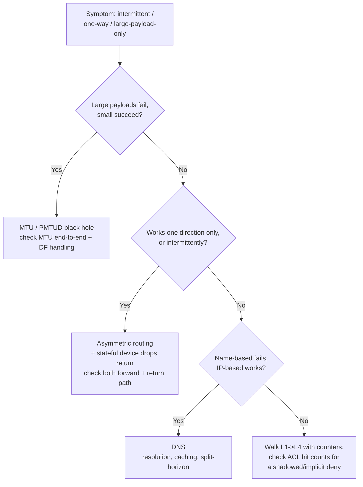

# Network troubleshooting reference — the layered method

When a network "is down," isolate the break **layer by layer with evidence** instead
of guessing. Work bottom-up (L1→L7) unless a symptom points you straight at a layer.
Each step names *what to check* and *the bug that hides there*.

## The layered walk

| Layer | Check | Evidence | Bug that hides here |
|---|---|---|---|
| **L1 — physical** | Link state, errors/CRC, transceiver, MTU | Interface counters, `show interface` | Dirty fiber, duplex mismatch, **MTU mismatch** |
| **L2 — switching** | VLAN membership, trunk allowed-list, STP state, MAC table | MAC-address-table, STP root/port state | Wrong VLAN, pruned trunk, STP blocking the good path |
| **L3 — routing** | Is there a route? Correct next-hop? | Routing table, neighbor/adjacency state | Missing/summary route, **asymmetric routing**, wrong default |
| **L3.5 — policy** | ACL/firewall permit? NAT translating right? | ACL hit counters, NAT table | **Shadowed ACL rule**, NAT collision, stateful-return drop |
| **L4 — transport** | Port reachable? Handshake completing? | Connection state, SYN/SYN-ACK | Firewall dropping the return path, port not listening |
| **L7 — application/DNS** | Name resolves? Right record? | `dig`/`nslookup`, resolver reachability | **DNS** (resolution, caching, split-horizon) — the perennial culprit |

## The high-value asymmetries (where "impossible" bugs live)

## Method rules

- **Change one thing, observe, revert if it didn't help.** Shotgun changes create new bugs and hide the original.
- **Counters don't lie; assumptions do.** Read interface/ACL/NAT counters before theorizing.
- **Check both directions.** A firewall or route problem is often only on the return path — forward-only testing misses it.
- **Verify DNS explicitly.** Resolve the name *and* confirm the record is what you expect before blaming the network.
- **Capture packets when the layers disagree** — a capture at two points localizes the drop faster than more `show` commands.

## Escalation seams

- The break is a **firewall-rule intent/appsec** question → `security-engineering`.
- It's a **reliability/SLO/incident** with monitoring gaps → `observability-sre`.
- It's inside **Kubernetes networking (CNI/mesh)** → `cloud-native-kubernetes`.

> Method is timeless; tool syntax varies by platform. Last reviewed 2026-07-01.
