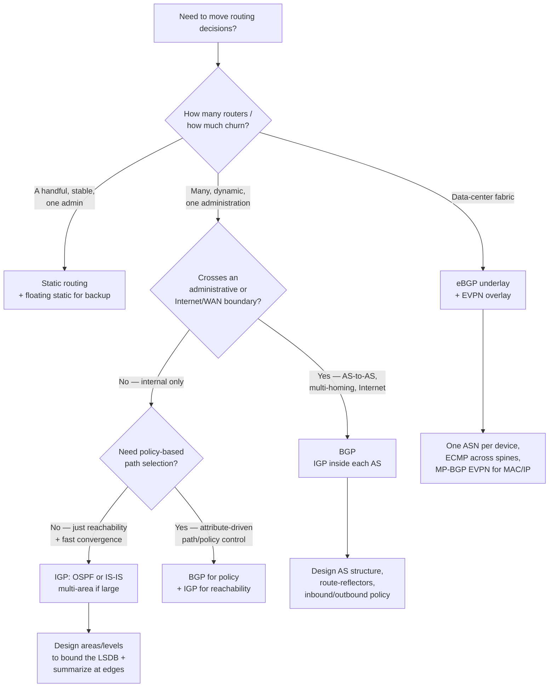

# Routing-protocol decision tree

Traverse this before naming a routing protocol. The choice is driven by **scale**,
**administrative boundaries**, and **policy needs** — not by familiarity. Separate
*reachability* (an IGP's job) from *policy* (BGP's job).

## Reference

| Protocol | Type | Reach for it when | Watch out for |
|---|---|---|---|
| **Static** | — | Few routers, one admin, stable topology, stub sites | No automatic failover unless you add floating statics/IP SLA |
| **OSPF** | Link-state IGP | Enterprise/campus, single administration, fast convergence needed | LSDB size — bound it with areas (stub/NSSA) and summarization |
| **IS-IS** | Link-state IGP | Large/SP-scale IGP, protocol-agnostic (CLNS), clean level structure | Less ubiquitous tooling/familiarity than OSPF in enterprise |
| **eBGP (underlay)** | Path-vector | Spine-leaf DC fabric — simple failure domains, per-device ASN | It's a design pattern, not "BGP for the LAN" |
| **BGP (edge/WAN)** | Path-vector | Internet edge, multi-homing, multi-AS, policy control | Policy complexity; it does what you tell it, including wrong |

## Rules of thumb

- **IGP = reachability, BGP = policy.** Don't run BGP to do an IGP's job on a single-admin LAN; don't stretch an IGP across an administrative boundary that wants policy.
- **Bound the failure domain.** Areas/levels (IGP) and route-reflectors/confederations (BGP) exist to keep churn local. Place their boundaries where you can summarize.
- **Summarize at every boundary the addressing allows.** Unsummarized IGPs turn a link flap into a network-wide event.
- **A default route has an owner and a failure behavior.** Never an accidental default.

> Protocol *behavior* is standards-stable (OSPF RFC 2328, BGP RFC 4271, IS-IS RFC 1195). Platform *features/syntax* are volatile — verify against the target platform and cite a retrieval date. Last reviewed 2026-07-01.
