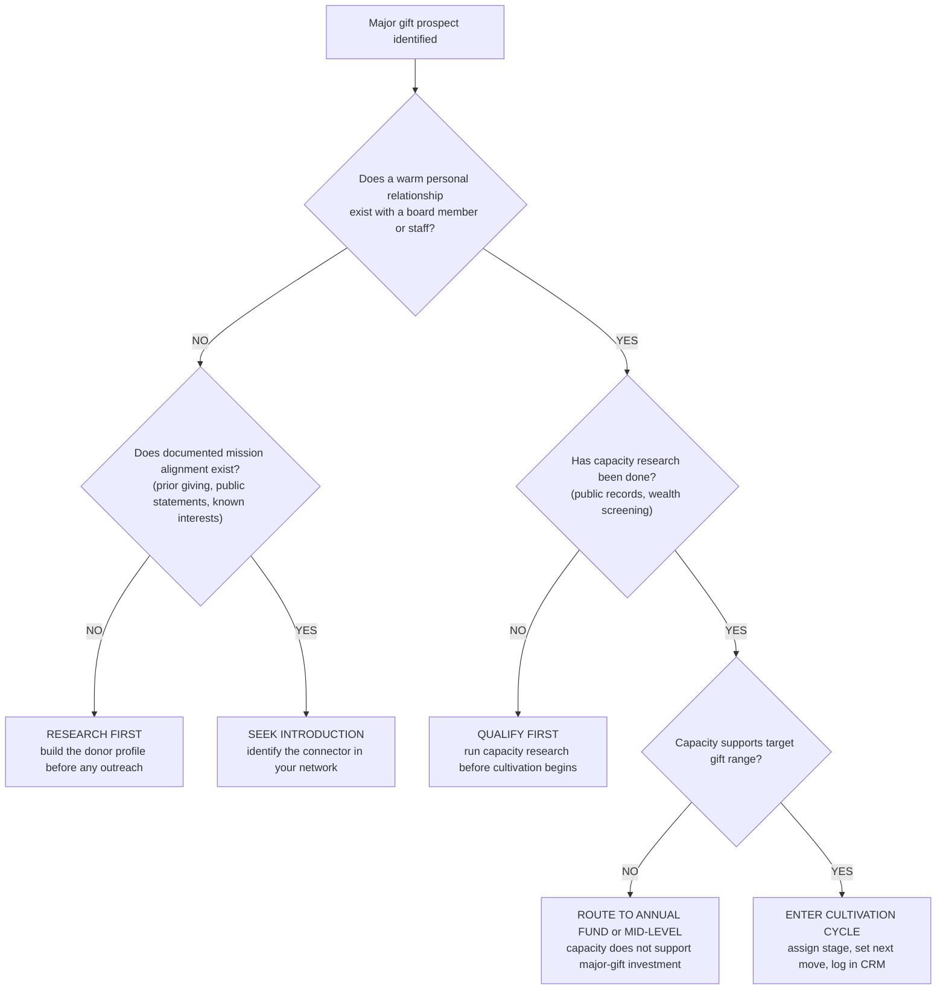
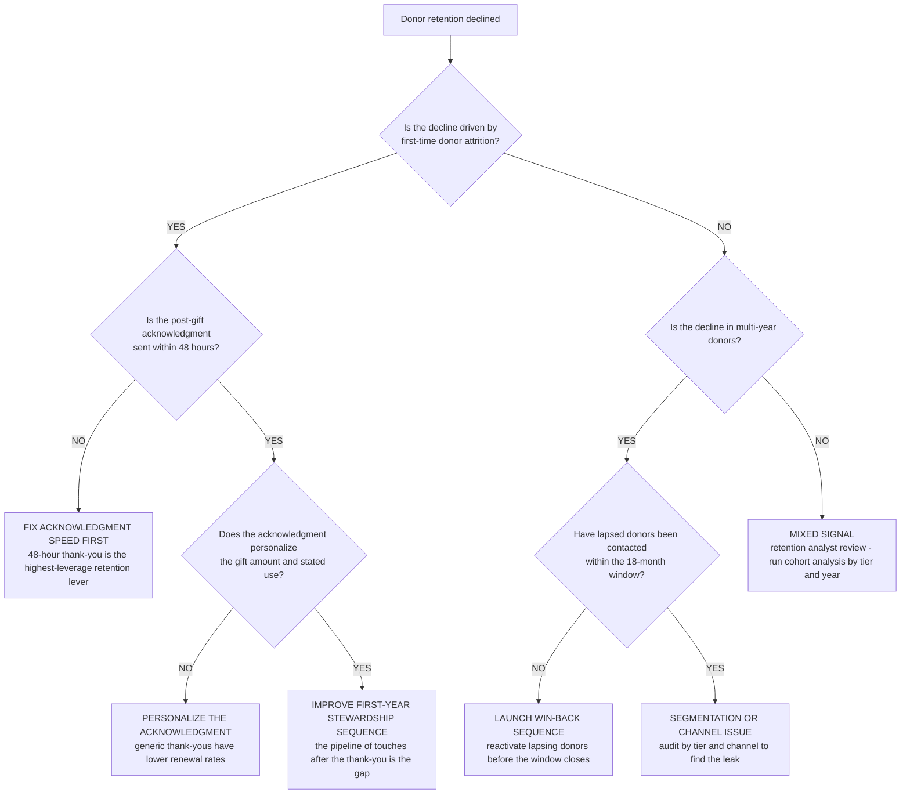
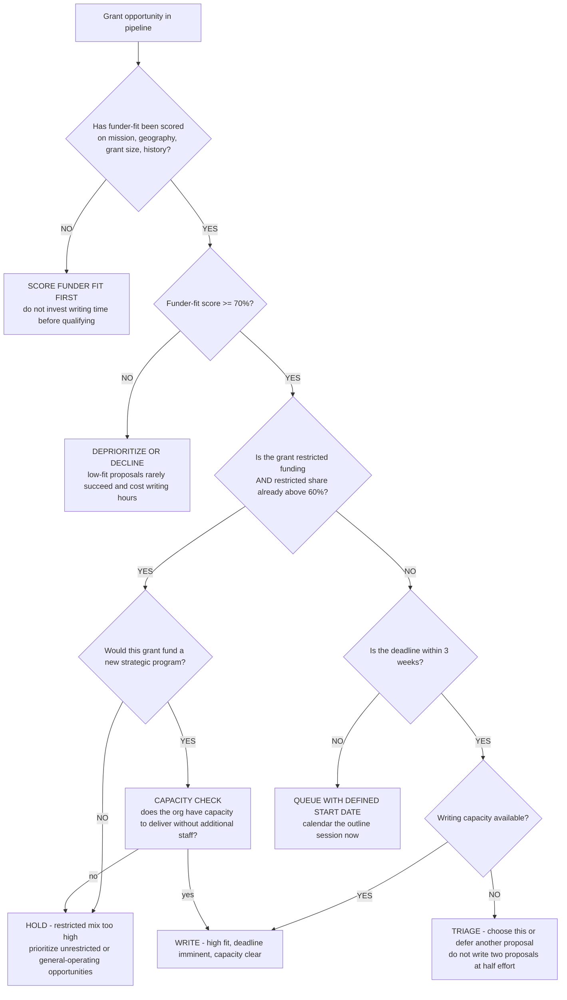

# Fundraising decision trees

Which analysis for which symptom — traverse top-to-bottom before picking a method.

## Decision Tree: Revenue is flat

1) Read retention by cohort first (§3 #1). 2) Read cost-per-dollar by channel (§3 #4). 3) Check the grant pipeline (§3 #2) and major-gift cycle (§3 #5).

## Decision Tree: Should we pursue this grant?

1) Score funder fit (§3 #2). 2) Weigh effort vs odds. 3) Go/no-go and pipeline.

## Decision Tree: Cultivation is spread thin

1) Segment by RFM (§3 #3). 2) Tier the base. 3) Concentrate hours on movable high-value donors.

## How to read these trees

Traverse top-to-bottom and stop at the first matching branch — the order encodes the cheap-checks-before-expensive-checks discipline (§3). Each leaf names a skill, a specialist, or a house-opinion to apply. Never skip a higher branch because a lower one looks more interesting; a denominator, seasonal, or definitional artifact masquerades as a finding more often than not.

## Decision Tree: Which skill for which task

- **Protect donor retention** → use when: Read donor retention by cohort and fix the leaky bucket before pouring in acquisition, since retention is ~7x cheaper than acquisition. ([`../skills/protect-donor-retention/SKILL.md`](../skills/protect-donor-retention/SKILL.md))
- **Qualify the funder** → use when: Score a grant opportunity on funder fit before writing, so effort goes where alignment is. ([`../skills/qualify-the-funder/SKILL.md`](../skills/qualify-the-funder/SKILL.md))
- **Run the cultivation cycle** → use when: Move a donor through identification, qualification, cultivation, solicitation, and stewardship rather than jumping to the ask. ([`../skills/run-the-cultivation-cycle/SKILL.md`](../skills/run-the-cultivation-cycle/SKILL.md))
- **Segment the donor base** → use when: Segment donors by value, recency, and engagement (RFM-style) to direct cultivation hours where they pay. ([`../skills/segment-the-donor-base/SKILL.md`](../skills/segment-the-donor-base/SKILL.md))
- **Read cost-per-dollar by channel** → use when: Compute cost-to-raise-a-dollar per channel, never blended, so the subsidizing channel is visible. ([`../skills/read-cost-per-dollar/SKILL.md`](../skills/read-cost-per-dollar/SKILL.md))

## Decision Tree: Which specialist owns this

- **The engagement** → [`development-lead`](../agents/development-lead.md)
- **Grants** → [`grant-writer`](../agents/grant-writer.md)
- **Major gifts and donors** → [`major-gifts-strategist`](../agents/major-gifts-strategist.md)
- **The numbers** → [`nonprofit-finance-analyst`](../agents/nonprofit-finance-analyst.md)

When two leaves apply, route to the **lead** first to scope and sequence — overlapping symptoms usually mean two drivers at once, and the lead keeps the analysis from collapsing into a single-cause story.

## Decision Tree: Which house-opinion gates the call

Before picking any method, check whether one of the standing biases (§3) already decides the framing:

1. Retention is the cheapest dollar — protect it first — if this is in question, apply §3 #1 before any method.
2. Qualify grants on funder fit before writing — if this is in question, apply §3 #2 before any method.
3. Segment donors by value, recency, and engagement — if this is in question, apply §3 #3 before any method.
4. Read cost-to-raise-a-dollar by channel, not blended — if this is in question, apply §3 #4 before any method.
5. Major gifts are a cultivation cycle, not an ask — if this is in question, apply §3 #5 before any method.
6. Restricted vs unrestricted is a sustainability question — if this is in question, apply §3 #6 before any method.
7. Stewardship is fundraising — the next gift starts at thank-you — if this is in question, apply §3 #7 before any method.
8. Cite the source and date for every benchmark — if this is in question, apply §3 #8 before any method.

## Escalation & guardrails

- Anything touching client PII / regulated records → stop and route to `ravenclaude-core` `security-reviewer`.
- Any external figure entering a deliverable → carry a source URL + retrieval date, or mark it `[unverified — training knowledge]` / `[ESTIMATE]` (§3, final house opinion).
- A recommendation ships only with an owner, a date, and an expected metric movement.
## Sourcing note

Figures in this file are from the author's domain knowledge and are marked `[unverified — training knowledge]` or `[ESTIMATE]` at point of use. Validate against a primary source before putting any figure in a client deliverable (§3 cite-or-mark rule).

---

## Decision Tree: Should we pursue this major gift — go or cultivate

**When this applies:** a prospect has been identified as a potential major-gift donor and the development team must decide whether to initiate direct cultivation or conduct more research/relationship-building first. Observable inputs: whether a personal relationship exists, the prospect's capacity signals, and the mission-alignment evidence in hand.

**Last verified:** 2026-06-05 against standard major-gifts qualification practice.

**Rationale per leaf:**
- *Research First* — outreach without mission-alignment evidence risks a cold contact that damages the first impression; profile-building is the lower-cost first step.
- *Seek Introduction* — a warm introduction converts at dramatically higher rates than cold outreach; identify the connector before approaching.
- *Qualify First* — capacity research prevents investing major-gift cultivation resources in a prospect who cannot make a gift at the target level.
- *Route to Annual Fund* — a prospect with genuine mission alignment but insufficient capacity is a mid-level or annual-fund donor, not a major-gift prospect; over-investing is a resource error.
- *Enter Cultivation Cycle* — a prospect with capacity, alignment, and a relationship anchor is ready for the full cycle; log the stage and set the next move in the CRM.

**Tradeoffs summary:**

| Decision | Staff cost | Relationship risk | Time to first ask | Use when |
|---|---|---|---|---|
| Research first | low | none | months | No alignment evidence |
| Seek introduction | medium | low | months | Alignment yes, no warm relationship |
| Qualify first | low | low | weeks | Relationship yes, no capacity data |
| Route to annual fund | low | low | immediate | Capacity insufficient |
| Enter cultivation | high | low | 6-24 months | All conditions met |

---

## Decision Tree: Donor retention problem — where to start

**When this applies:** overall donor retention has declined, or the development team is preparing for a retention audit. Observable inputs: overall retention rate vs. prior year, retention by donor tier (first-time vs. multi-year), and channel of first gift.

**Last verified:** 2026-06-05 against standard retention-diagnosis practice.

**Rationale per leaf:**
- *Fix Acknowledgment Speed* — the 48-hour thank-you is the single highest-leverage retention lever for first-time donors; every day of delay reduces the renewal probability.
- *Personalize the Acknowledgment* — a generic "dear friend" thank-you signals the donor they are not known; personalization with gift amount and use is the minimum bar.
- *Improve First-Year Stewardship* — if acknowledgment is timely and personalized and first-year retention is still low, the gap is the stewardship sequence in months 2–11.
- *Launch Win-Back Sequence* — multi-year donors who have lapsed are likely still reachable; the 18-month window is closing and the win-back sequence should fire before it does.
- *Segmentation or Channel Issue* — if win-back is happening and multi-year retention is still declining, the issue is channel- or segment-specific; cohort analysis will locate it.
- *Mixed Signal* — if neither first-time nor multi-year retention explains the decline cleanly, run the full cohort analysis by tier and year to find the concentration.

**Tradeoffs summary:**

| Action | Time to impact | Cost | Evidence needed | Use when |
|---|---|---|---|---|
| Fix acknowledgment speed | weeks | low | measurement | First-time attrition + slow ack |
| Personalize acknowledgment | weeks | low | measurement | First-time attrition + generic ack |
| Improve stewardship sequence | months | medium | cohort data | First-time, ack good, still lapsing |
| Launch win-back | weeks | medium | lapse segment size | Multi-year lapse uncovered |
| Segmentation audit | weeks | low-medium | CRM access | Win-back done, still declining |
| Full cohort analysis | days | low | analyst | Mixed signal |

---

## Decision Tree: Grant pipeline prioritization — which opportunity next

**When this applies:** the development team has multiple open grant opportunities or prospects and must decide which to invest writing time in next. Observable inputs: funder-fit score, grant deadline, staff writing capacity, and current restricted vs. unrestricted revenue mix.

**Last verified:** 2026-06-05 against standard grant-pipeline management practice.

**Rationale per leaf:**
- *Score Funder Fit First* — writing before qualifying is the primary grant-pipeline waste; the scoring step is cheap and the rejection rate for low-fit proposals is high.
- *Deprioritize or Decline* — a low-fit proposal is not a development opportunity; it is a cost center. Declining protects writing capacity for high-fit opportunities.
- *Hold* — an over-restricted revenue mix is a sustainability risk (§3 #6); adding more restricted funding when the mix is already above 60% worsens it.
- *Capacity Check* — a strategically-important restricted grant is worth pursuing if the program can be delivered; without delivery capacity, acceptance creates a compliance risk.
- *Write* — high fit, adequate capacity, and an imminent deadline is the clear go condition.
- *Triage* — split writing capacity is a common error; one well-written proposal beats two rushed ones.
- *Queue* — a high-fit opportunity with a comfortable deadline should be calendared rather than put in a mental queue that causes scrambles at deadline week.
