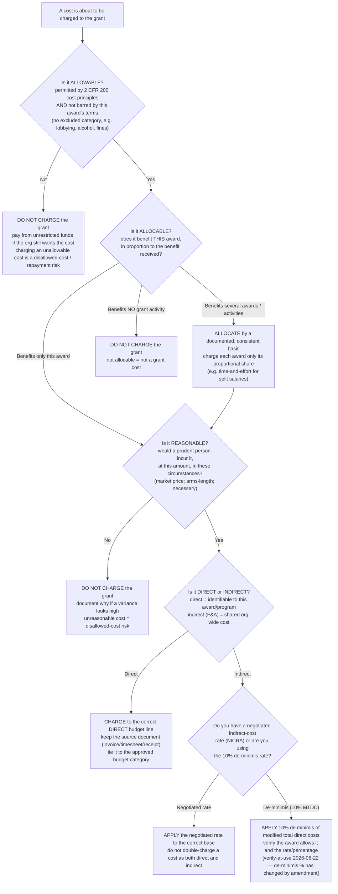
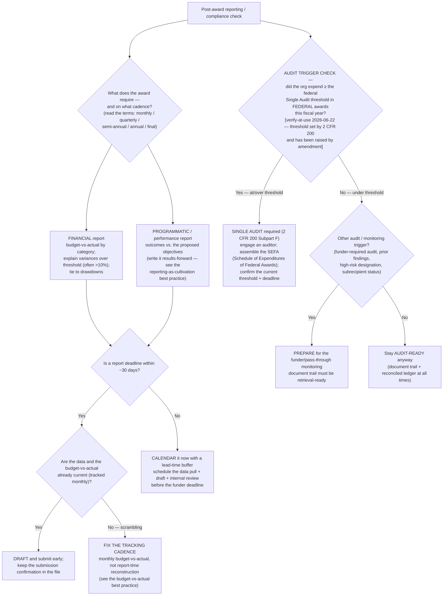

# Grant management — post-award / compliance reference

**Last reviewed:** 2026-06-22 · **Confidence:** medium (federal post-award concepts grounded in the Uniform Guidance, 2 CFR Part 200; the regulation is amended periodically and agency/funder terms override it case-by-case). **Every regulatory specific below carries a retrieval date and a `[verify-at-use]` marker.** This is advisory decision-support for a development office, **not legal, accounting, or audit advice** (CLAUDE.md §2) — confirm any threshold, deadline, or cost determination against the current regulation, the specific award terms, and your auditor before acting.

> Companion to the plugin's **pre-award / development** knowledge bank ([`fundraising-decision-trees.md`](fundraising-decision-trees.md) routes the grant-pipeline qualify→write→submit side). This file governs the **post-award / grant-management** side — what happens *after* the award letter: spending within allowable costs, tracking budget-vs-actual, reporting on cadence, handling modifications, and staying audit-ready. Owned primarily by [`grant-writer`](../agents/grant-writer.md) (the grant lane) with the budget/audit pieces shared with [`nonprofit-finance-analyst`](../agents/nonprofit-finance-analyst.md). The reporting-as-cultivation framing pairs with [`../best-practices/grant-reporting-is-the-next-grant-relationship.md`](../best-practices/grant-reporting-is-the-next-grant-relationship.md).

---

## Scope and the one caveat that governs all of it

The Uniform Guidance — **2 CFR Part 200**, "Uniform Administrative Requirements, Cost Principles, and Audit Requirements for Federal Awards" `[verify-at-use 2026-06-22]` — is the federal baseline for managing federal grants and most federal pass-through (subaward) money. Private-foundation and corporate grants are **not** bound by it; they follow the individual grant agreement. When a funder's award terms and the Uniform Guidance disagree, **the award terms govern for that award** — read the agreement first. Treat every number, threshold, and date in this file as `[verify-at-use]`: the regulation is revised (the audit threshold, for one, has changed over time), and your award may carry stricter terms.

---

## The post-award lifecycle (the shape of the work)

```
Award accepted
   → Set up (read the terms; build the budget ledger; assign owners; calendar every deadline)
   → Spend (only on allowable / allocable / reasonable costs; direct vs indirect tracked separately)
   → Track (budget-vs-actual every month — not at report time)
   → Report (financial + programmatic, on the funder's cadence, before the deadline)
   → Modify if needed (budget revision / no-cost extension — request BEFORE you need it)
   → Close out (final report + final drawdown + retain the document trail for the records-retention window)
   → Audit-ready at all times (Single Audit if the federal-expenditure threshold is crossed)
```

---

## Decision Tree: allowable-cost determination

Use **before charging any cost to a grant**. A cost survives only if it clears every gate: allowable (by regulation *and* by this award's terms), allocable (it benefits this award), and reasonable (a prudent person would incur it). Then classify it direct vs indirect so it lands in the right budget line and the indirect-cost rate is applied correctly.



**Notes (each `[verify-at-use 2026-06-22]`):**
- **Allowable / allocable / reasonable** are the three Uniform Guidance cost-principle tests; a cost must pass all three. Some categories are explicitly unallowable regardless (e.g. lobbying, alcoholic beverages, fines/penalties) — check the award and the cost-principles subpart.
- **Direct vs indirect** must be treated **consistently**: a cost type charged as direct on one award cannot also be recovered in the indirect pool. Split salaries need a documented time-and-effort basis.
- **Indirect-cost recovery** runs on either a federally negotiated rate (NICRA) or the **de-minimis** rate. The de-minimis percentage and the base (modified total direct costs) are set by regulation and **have changed by amendment** — confirm the current figure and that your award permits it before applying.

---

## Decision Tree: reporting cadence & compliance triage

Use to figure out **what report is due, when, and whether a compliance event (especially an audit trigger) is in play**. Most awards require both a **financial** report (how the money was spent vs. the budget) and a **programmatic / performance** report (what the program achieved) — on the funder's stated cadence. The biggest compliance event for a federal grantee is the **Single Audit threshold**.



**Notes (each `[verify-at-use 2026-06-22]`):**
- **Single Audit threshold** — a non-federal entity that expends **at or above** a set dollar amount of federal awards in its fiscal year must obtain a Single (or program-specific) Audit under **2 CFR Part 200, Subpart F**. The threshold is a specific dollar figure that **has been raised by amendment**; confirm the current number and the submission deadline (and the Federal Audit Clearinghouse process) before relying on it.
- **Variance-explanation threshold** — many funders want a narrative for any budget line that varies more than a set percent (commonly ~10%) from the approved budget. Read the award; some require prior approval for variances above a threshold (see modifications below).
- **Financial vs programmatic** reports are usually **separate documents on separate (or the same) deadlines** — missing either is a compliance miss. Track both on one calendar.

---

## Budget-vs-actual tracking

Reconcile **actuals against the approved grant budget every month**, by budget category — not at report time. The point is to catch an over/under-spend while there's still time to correct it (a spend-down problem found in month 11 is often unrecoverable). For each category track: approved budget, period actual, year-to-date actual, remaining balance, percent expended, and burn rate (are you on pace to spend the award by the period of performance end?). A line trending to a >10% variance is an early signal to either correct the spending or request a budget modification *before* the report shows it.

Pair this with the fill-in tracker: [`../templates/grant-budget-vs-actual-tracker.md`](../templates/grant-budget-vs-actual-tracker.md).

## Drawdown / reimbursement

Most grants pay one of two ways: **reimbursement** (you spend, then request the funds back) or **advance** (you receive funds, then account for them). Either way the drawdown request must tie to **actual, allowable, recorded expenditures** — never to the budget plan. Common discipline:
- Draw down only what has been spent on allowable costs and is supported by source documents.
- Reconcile each drawdown to the general ledger; keep the request + backup in the file.
- Watch the cash-on-hand limit (advance funds shouldn't sit idle beyond what the award allows).
- A drawdown that outpaces recorded expenditures is a classic audit finding.

## Modifications & no-cost extensions

When the plan needs to change, request the change **in writing, before** you act on it — many changes require **prior written approval** from the funder, and an unapproved change can create a disallowed cost.
- **Budget modification / revision** — moving money between categories beyond the award's allowed flexibility (some awards permit small reallocations without approval; read the terms `[verify-at-use 2026-06-22]`).
- **No-cost extension (NCE)** — more time to spend the existing award (no new money). Request it **well before** the period-of-performance end date (funders often require a lead time); a lapsed end date can forfeit unspent funds.
- **Scope / programmatic change** — almost always needs prior approval.
- **Key-personnel change** — many federal awards require notification/approval if the named PI/PD changes.
Document the request, the approval, and the revised budget in the grant file.

## Document / audit trail

Maintain a retrieval-ready file for every award so any cost can be traced from the **general ledger → source document → approved budget line → award terms** in minutes. Keep:
- the executed award agreement + all amendments/approvals,
- the approved budget and every revision,
- source documents for every charge (invoices, receipts, timesheets / time-and-effort, contracts),
- drawdown requests + reconciliations,
- all submitted reports + submission confirmations,
- the cost-allocation methodology and indirect-rate basis.

**Records retention:** federal awards specify a retention period after the final report (a multi-year window set by 2 CFR 200 `[verify-at-use 2026-06-22]`); litigation, audit, or claim can extend it. Confirm the period for each award.

## Subrecipient monitoring

If the org passes federal money through to a **subrecipient** (vs. buying goods/services from a **contractor/vendor** — the distinction matters and is defined in 2 CFR 200 `[verify-at-use 2026-06-22]`), the pass-through entity is **responsible for monitoring** that subrecipient. Baseline discipline:
- Make the subrecipient-vs-contractor determination up front and document it.
- Risk-assess each subrecipient; set monitoring intensity to the risk.
- Put required terms in the subaward (the federal award identification, applicable requirements, reporting).
- Monitor: review their financial + performance reports, verify their costs are allowable, and confirm they had a Single Audit if *they* crossed the threshold.
- A subrecipient's disallowed cost can flow back to the pass-through entity — monitoring is not optional.

---

## Escalation & guardrails

- Any cost-allowability, indirect-rate, drawdown, or audit-threshold question that gates a real spend or filing → confirm against the **current 2 CFR 200 text + the specific award terms + your auditor/accountant**; this file is advisory only (§2).
- Every regulatory specific that enters a deliverable carries a retrieval date + `[verify-at-use]`, or an `[unverified — training knowledge]` mark (§3 #8).
- High-blast / irreversible compliance actions (final close-out, a drawdown, a modification request) ship with an owner, a date, and a verify-at-use confirmation step — never auto-decided.

## Sources / grounding

- **2 CFR Part 200** — Uniform Administrative Requirements, Cost Principles, and Audit Requirements for Federal Awards (eCFR). The authoritative source for allowable/allocable/reasonable, direct vs indirect, the de-minimis indirect rate, Subpart F Single Audit, records retention, and subrecipient monitoring. `[verify-at-use 2026-06-22 — confirm the current amended text; thresholds and the de-minimis rate have changed]`
- The reporting-as-cultivation framing: [`../best-practices/grant-reporting-is-the-next-grant-relationship.md`](../best-practices/grant-reporting-is-the-next-grant-relationship.md).
- The pre-award side this complements: [`fundraising-decision-trees.md`](fundraising-decision-trees.md) (grant-pipeline tree) and [`../best-practices/grant-pipeline-is-a-12-month-calendar-not-a-list-of-applications.md`](../best-practices/grant-pipeline-is-a-12-month-calendar-not-a-list-of-applications.md).

_Concepts grounded in the federal Uniform Guidance; all regulatory specifics are `[verify-at-use 2026-06-22]` pending confirmation against the current regulation and the individual award. Not legal, accounting, or audit advice._
