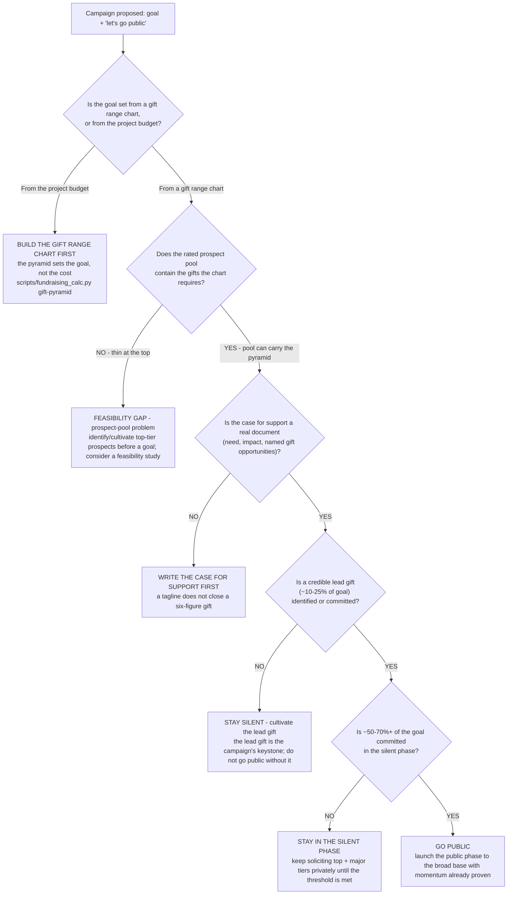

# Campaign-readiness decision tree — go public, stay silent, or not yet

**Last reviewed:** 2026-06-05 · **Confidence:** medium (capital-campaign trade conventions + gift-range-chart practice, web-verified this date). Lead-gift percentage, 80/20 concentration, and silent-phase-share figures are trade conventions, not hard rules — they carry inline `[verify-at-use]` markers and must be calibrated to the org's prior campaign history, prospect pool, and segment before any deliverable (CLAUDE.md §3 #8).

> Canonical decision tree for the `development-lead` (campaign framing) with a finance assist from `nonprofit-finance-analyst` (the gift range chart) and a prospect assist from `major-gifts-strategist` (the lead-gift cultivation). Traverse top-to-bottom against the observable situation **before** endorsing a campaign goal or a public launch. The order encodes the house discipline: **the donor pyramid sets the goal, the project budget does not** — and the single most load-bearing, hardest-to-reverse decision (going public at a number) sits at the bottom on purpose. This tree **complements** the three trees in [`fundraising-decision-trees.md`](fundraising-decision-trees.md) (go/cultivate a major gift, retention diagnosis, grant pipeline) — it does not duplicate them; it governs the *campaign-level* go/no-go those trees feed into.

---

## When this applies

A board or ED has proposed a **capital / comprehensive campaign** and wants to set a goal and/or "go public." Use this before endorsing either. Observable inputs: whether a gift range chart exists, whether the rated prospect pool can fill it, whether a lead gift is identified/committed, the silent-phase share committed so far, and whether the case for support is a real document.

## The tree

## Rationale per leaf (cheap → expensive / reversible → irreversible)

- **Build the gift range chart first** — the cheapest, most clarifying step. A goal anchored on the building's cost instead of the donor pyramid is the classic public-failure setup. The chart turns a headline number into a concrete requirement: a lead gift, the tiers below it, gifts-needed and prospects-needed per tier. Run [`../scripts/fundraising_calc.py`](../scripts/fundraising_calc.py) `gift-pyramid`.
- **Feasibility gap (prospect-pool problem)** — if the chart's top tiers exceed the rated prospect pool, that is a *recruiting/cultivation* finding, not a "sell harder" one. A pyramid the pool can't fill won't close regardless of effort; a formal feasibility study or a longer cultivation runway is the move, not a public launch.
- **Write the case for support** — a campaign asks donors to fund a *why*, documented (need, impact, named gift opportunities), not a tagline. See [`../best-practices/the-case-for-support-is-a-document-not-a-tagline.md`](../best-practices/the-case-for-support-is-a-document-not-a-tagline.md).
- **Stay silent — cultivate the lead gift** — the lead gift (~10-25% of goal `[verify-at-use]`) is the keystone; going public without it removes the anchor the rest of the pyramid is sized against, and a public stall at the top is hard to recover. Route the cultivation to [`major-gifts-strategist`](../agents/major-gifts-strategist.md) and the go/cultivate tree in [`fundraising-decision-trees.md`](fundraising-decision-trees.md).
- **Stay in the silent phase** — convention puts ~50-70%+ of the goal committed before going public `[verify-at-use]`, so the public phase rides proven momentum rather than asking the broad base to carry the top of the pyramid. Going public early is the irreversible mistake this tree exists to prevent.
- **Go public** — only after the chart is built, the pool can carry it, the case is documented, the lead gift is in hand, and the silent-phase threshold is met. This is the highest-blast, slowest-to-reverse move; it sits at the bottom by design.

## The numbers that gate the call (trade conventions — `[verify-at-use]`)

| Signal | Convention | Read |
|---|---|---|
| Lead (top) gift as % of goal | ~10-25% of the total goal | A $1M goal implies a ~$100k-$250k lead gift; no credible prospect at that level → not ready |
| Gift concentration | the top ~10-20% of gifts carry ~50-80%+ of the goal (80/20) | The campaign is won at the top of the pyramid, not the base |
| Silent-phase share before going public | ~50-70%+ of goal committed first | Below this, a public launch asks the broad base to carry the top — the stall pattern |

These are campaign-fundraising conventions, not hard rules — calibrate to the org's prior campaign history and prospect pool. Source: CapitalCampaignPro gift-range-chart guide + DonorSearch gift-range-chart guide (retrieved 2026-06-05, below).

## Escalation & guardrails

- A formal feasibility study (interviews with top prospects) → out of scope for the agent to *run*; recommend it and frame the questions. The team is not a campaign-counsel firm (CLAUDE.md §2).
- Gift-acceptance, pledge-accounting, or tax treatment of a complex gift → out of scope; route to the org's finance/legal counsel (the team gives no tax or gift-acceptance advice, CLAUDE.md §2).
- Every figure entering a deliverable carries a source URL + retrieval date or an `[unverified — training knowledge]` / `[ESTIMATE]` mark (CLAUDE.md §3 #8).

## Sources (retrieved 2026-06-05)

- CapitalCampaignPro — *Capital Campaign Gift Range Chart: How-To Guide & Templates* (lead gift 10-25% of goal; silent-phase share; 80/20 concentration): https://capitalcampaignpro.com/capital-campaign-gift-range-chart/
- DonorSearch — *How to Create a Fundraising Gift Range Chart + Calculator* (pyramid structure, prospects-per-gift, top-gift share): https://www.donorsearch.net/resources/gift-range-chart-guide/
- NonProfit PRO — *Use Your Capital Campaign Gift Range Chart* (top-gift concentration, lead-gift-first momentum): https://www.nonprofitpro.com/post/4-tips-to-make-the-most-of-your-capital-campaign-gift-range-chart/
