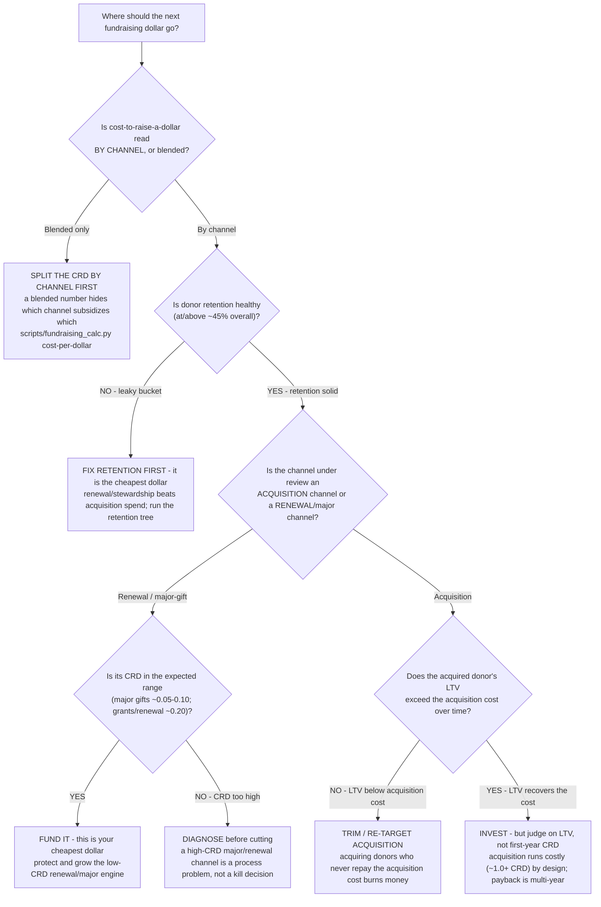

# Channel-investment decision tree — where the next fundraising dollar should go

**Last reviewed:** 2026-06-05 · **Confidence:** medium (cost-per-dollar-by-channel benchmarks + acquisition/renewal economics, web-verified this date). Per-channel cost-to-raise-a-dollar ranges are sector benchmarks that move yearly and vary sharply by org size and maturity — they carry inline `[verify-at-use]` markers and must be calibrated to the org's own channel data before any deliverable (CLAUDE.md §3 #8).

> Canonical decision tree for the `nonprofit-finance-analyst` (channel economics) with framing assists from `development-lead`. Traverse top-to-bottom against the observable situation **before** recommending where to add or cut fundraising spend. The order encodes house opinions §3 #1 (retention is the cheapest dollar — protect it first) and §3 #4 (read cost-to-raise-a-dollar **by channel**, never blended). This tree **complements** [`fundraising-decision-trees.md`](fundraising-decision-trees.md) (which routes *which analysis for which symptom*) and the campaign-readiness tree — it governs the *channel reallocation* decision specifically, and pairs with the [`../scripts/fundraising_calc.py`](../scripts/fundraising_calc.py) `cost-per-dollar` and `donor-ltv` modes.

---

## When this applies

Leadership wants to "invest more in fundraising" or "cut the channel that isn't working," and someone needs to decide **which channel gets the next dollar** (or loses one). Use this before reallocating. Observable inputs: whether cost-per-dollar is read by channel or blended, the renewal/retention health, each channel's role (acquisition vs renewal vs major-gift), and donor LTV by acquisition channel.

## The tree

## Rationale per leaf

- **Split the CRD by channel first** — the load-bearing first step (§3 #4). A blended cost-to-raise-a-dollar number is a management trap: a cheap major-gift channel (~$0.05-0.10 `[verify-at-use]`) silently subsidizes an expensive acquisition channel (~$1.00-1.25 `[verify-at-use]`), so the blend looks "fine" while the acquisition channel is bleeding. Run [`../scripts/fundraising_calc.py`](../scripts/fundraising_calc.py) `cost-per-dollar`.
- **Fix retention first** — if the bucket leaks, no channel spend outruns it (§3 #1). Retaining a donor costs a fraction of acquiring one (~$0.20 vs ~$1.50 sector rule of thumb `[verify-at-use]`), so a retention/stewardship investment is the cheapest growth available. Route to the "Donor retention problem" tree in [`fundraising-decision-trees.md`](fundraising-decision-trees.md).
- **Fund the low-CRD renewal/major engine** — a major-gift or renewal channel inside its expected CRD range is the cheapest dollar the org has; protect and grow it before chasing costlier acquisition.
- **Diagnose before cutting a high-CRD major/renewal channel** — a major-gift channel running *above* its expected range is almost always a process problem (weak moves management, no qualification, untrained officer), not a "kill the channel" verdict. Diagnose with the major-gift go/cultivate tree before cutting.
- **Trim / re-target acquisition with LTV below cost** — acquisition that brings in donors whose lifetime value never repays the acquisition cost is structurally unprofitable; re-target the source or the offer rather than spending more. Use [`../scripts/fundraising_calc.py`](../scripts/fundraising_calc.py) `donor-ltv` for the payback math.
- **Invest in acquisition — but judge on LTV** — acquisition is *supposed* to run costly in year one (~$1.00+ per dollar `[verify-at-use]`); the right test is whether the donor's multi-year LTV recovers the acquisition cost, not the first-year CRD. Cutting acquisition on first-year CRD alone starves the top of the funnel.

## The benchmarks that gate the call (sector ranges — `[verify-at-use]`)

| Channel | Typical cost-to-raise-a-dollar (CRD) | Role |
|---|---|---|
| Major gifts / capital | ~$0.05-0.10 | Cheapest dollar; the renewal/major engine |
| Grants (foundations/corp) | ~$0.20 | Mid-cost; restricted/unrestricted mix matters (§3 #6) |
| Direct mail — renewal | ~$0.20 (can be lower) | Cheap retention dollar |
| Special events | ~$0.30-0.50 | Mid-to-high; judge on donor *conversion*, not just net (§ events best-practice) |
| Direct mail — acquisition | ~$1.00-1.25 | Costly by design; judge on multi-year LTV, not first-year CRD |
| Overall blended (annual) | ~$0.20 commonly quoted | A *blend* — never the basis for a channel decision |

These are sector benchmarks, not hard rules — they swing with org size, maturity, and list quality. Source: RallyUp + Bonterra cost-per-dollar guides (retrieved 2026-06-05, below).

## Escalation & guardrails

- A multi-year channel-investment plan with restricted-funding implications → involve [`nonprofit-finance-analyst`](../agents/nonprofit-finance-analyst.md) on the restricted/unrestricted mix (§3 #6).
- Any figure entering a deliverable carries a source URL + retrieval date, or an `[unverified — training knowledge]` / `[ESTIMATE]` mark (§3 #8).
- A recommendation ships only with an owner, a date, and an expected metric movement.

## Sources (retrieved 2026-06-05)

- RallyUp — *Calculating your cost-per-dollar raised: a guide for nonprofits* (per-channel CRD ranges; acquisition vs renewal): https://rallyup.com/blog/fundraising-metrics-cost-per-dollar-raised/
- Bonterra — *A guide to nonprofit fundraising metrics and benchmarks* (CRD benchmarks, the ~$0.20 overall figure): https://www.bonterratech.com/blog/fundraising-metrics
- Kindsight — *Understanding donor lifetime value* (LTV = avg gift × frequency × lifespan; retention→LTV): https://kindsight.io/resources/blog/donor-lifetime-value/
