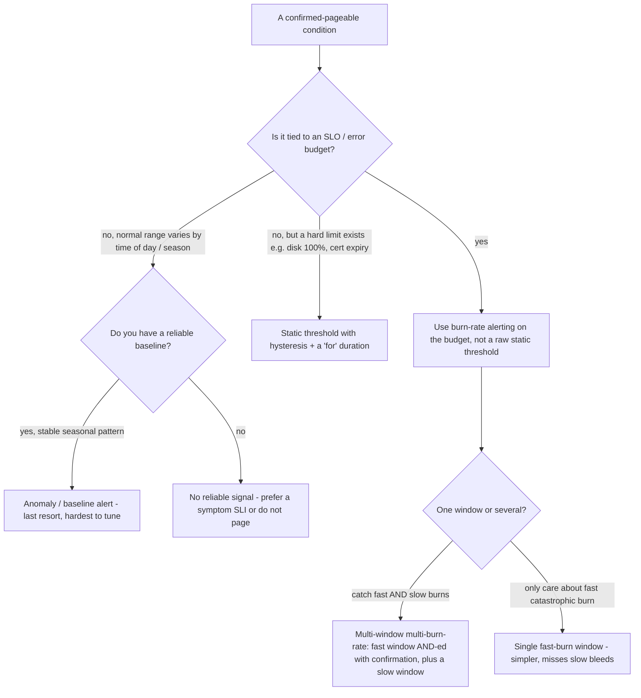
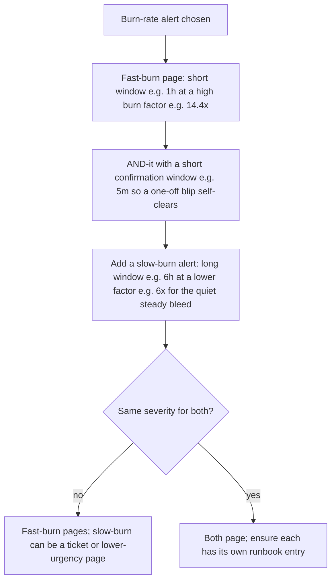

# Alerting Threshold Strategy — Decision Trees

_Topic-specific decision trees for **how** to set an alert's firing condition once you've decided the thing is worth paging on — the complement to the `## Decision Tree: Should this be an alert (and how)?` and `## Decision Tree: On-call — page, ticket, or dashboard?` trees in [`observability-sre-decision-trees.md`](observability-sre-decision-trees.md), which decide *whether* to alert and *what channel*. This file decides the **threshold mechanism**: static vs. burn-rate vs. multi-window vs. anomaly. Grounded in the Google SRE Workbook "Alerting on SLOs". Last reviewed: 2026-06-05 `[verify-at-use]`._

Traverse after you've confirmed (via the trees above) that a condition is genuinely pageable and tied to a runbook.

## Decision Tree: Which threshold mechanism?

**When this applies:** a condition is confirmed pageable (user-visible symptom or SLO burn, runbook exists) and you must choose how its alert fires. Choosing wrong gives you either flapping noise (too sensitive) or slow detection (too dull).

**Rationale per leaf:**
- *Burn-rate* — when the alert protects an SLO, alert on how fast the **error budget** is being consumed, not on a raw error-rate number. Burn rate normalizes across traffic levels (5% errors at 3am ≠ 5% at peak) and ties detection time + reset time to the budget you actually agreed to.
- *Static threshold + hysteresis + `for`* — appropriate for **hard physical/contractual limits** (disk filling, certificate expiry, license caps) where there's a real ceiling. Add a `for:` duration so a momentary spike doesn't page, and hysteresis (separate fire/clear levels) so it doesn't flap at the boundary.
- *Anomaly / baseline* — the **last resort**: powerful for strongly-seasonal signals but the hardest to keep tuned, prone to false positives on legitimate change (a launch, a holiday). Prefer a symptom SLI if one exists.
- *No reliable signal → don't page* — if the normal range is unknowable and there's no symptom SLI, a page will be noise; route to a dashboard/ticket instead and design a better SLI.

**Tradeoffs summary:**

| Mechanism | Detection vs. noise | Tuning burden | Use when |
|---|---|---|---|
| Multi-window multi-burn-rate | Best balance; catches fast + slow, suppresses blips | Medium (set burn factors + windows) | The alert protects an SLO |
| Single burn-rate window | Catches fast burns; misses slow bleeds | Low | Only catastrophic burn matters |
| Static + hysteresis + `for` | Crisp for hard limits; useless for ratios | Low | A real physical/contractual ceiling |
| Anomaly / baseline | Flexible; noisiest | High | Strong seasonality + no symptom SLI |

## Decision Tree: Tuning a multi-window multi-burn-rate alert

**When this applies:** you chose burn-rate alerting and must set the windows and burn-rate factors. The canonical SRE-Workbook setup uses paired windows so you catch both a sudden outage and a slow steady bleed.

**Rationale:**
- A **fast-burn** window (short, high factor) catches a sudden outage quickly; AND-ing it with a **short confirmation window** stops a single blip from paging (both must be burning).
- A **slow-burn** window (long, lower factor) catches the quiet bleed that never trips the fast alert but would still exhaust the budget over days.
- The burn-factor × window choices set your **detection time** and your **budget-spent-before-firing** — the Workbook tabulates these; pick the row that matches how much budget you're willing to spend before someone is woken.
- **Severity tiering:** the fast-burn is the page; the slow-burn often warrants a ticket or a lower-urgency notification, not a 3am wake-up.

**Sources:** Google SRE Workbook — "Alerting on SLOs" (the multi-window multi-burn-rate construction, the 14.4x / 6x examples, the detection-time table) https://sre.google/workbook/alerting-on-slos/ (retrieved 2026-06-05). The specific burn factors and window lengths are the Workbook's worked example for a 99.9% SLO — recompute them for your own target and acceptable detection time; do not copy the numbers blindly `[verify-at-use]`.
